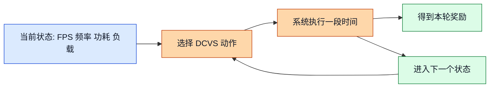
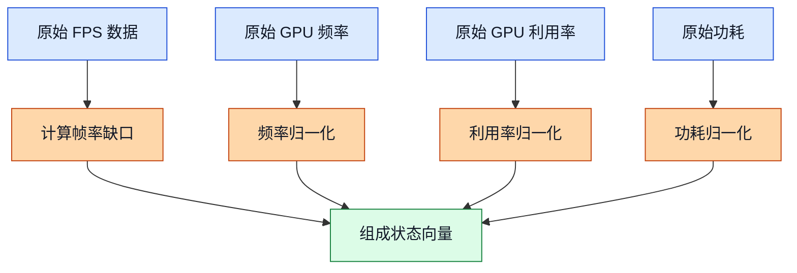
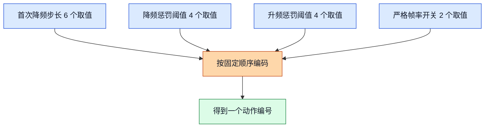
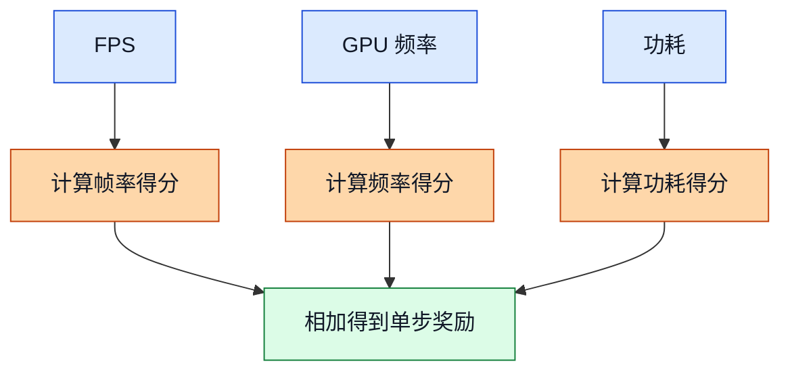
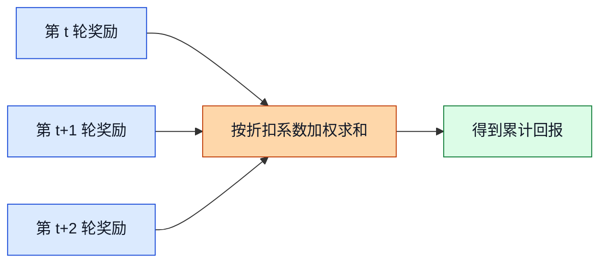
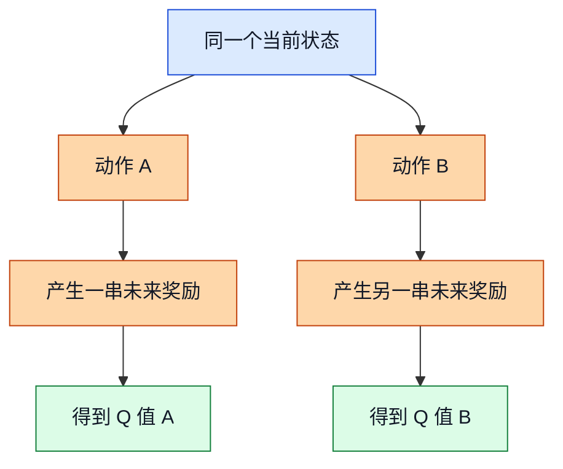
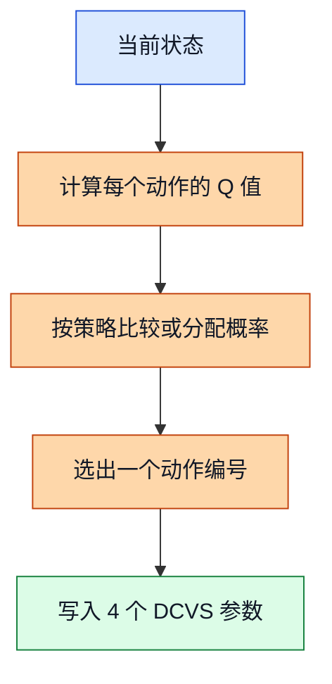
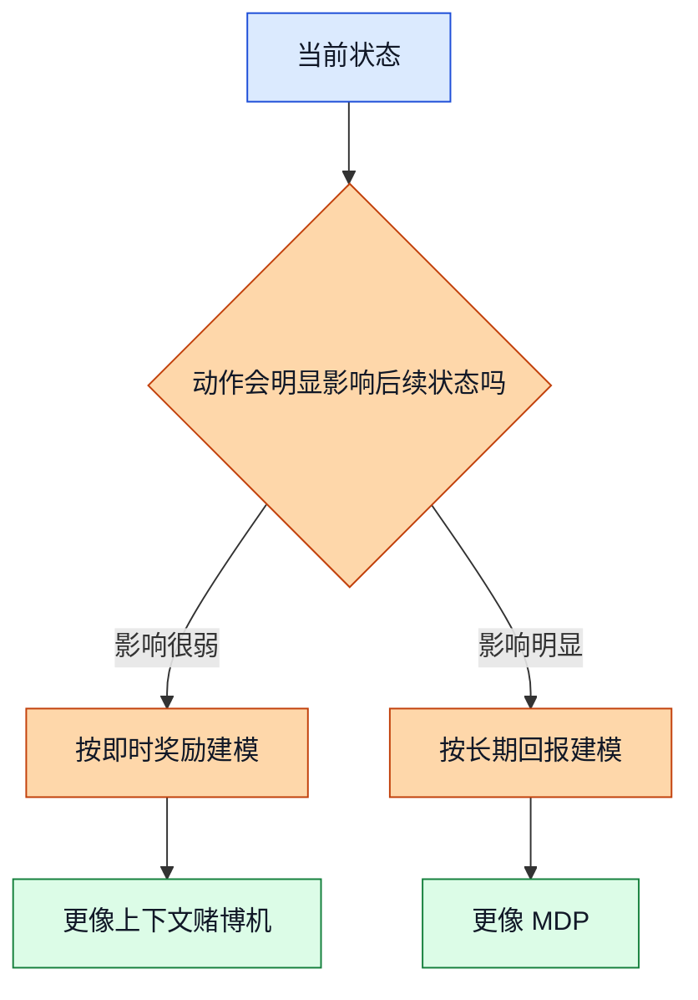
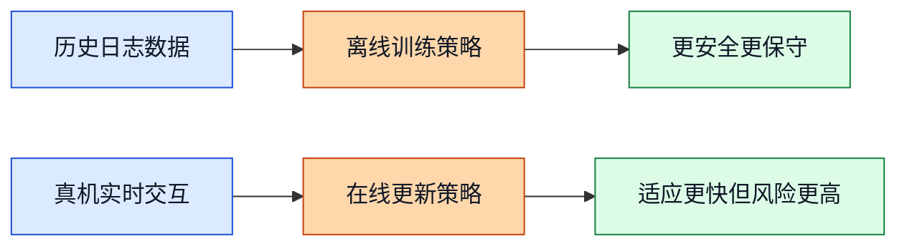

<!-- markdownlint-disable MD041 MD013 -->
# 02. RL 核心概念：把 GPU DCVS 调参看成“持续做决定”

## 前置阅读

- 无硬性前置阅读，本文可以独立阅读。
- 如果后续你已经有 `01_*.md` 这类入门文档，先读它会更轻松；如果没有，直接从本文开始也没问题。

## 为什么这一章很重要

很多人第一次看强化学习（Reinforcement Learning, RL）的时候，最容易卡住的不是公式，而是一个更基础的问题：

“GPU DCVS 调参，为什么会和强化学习扯上关系？”

你可以先把自己想成一个调参工程师。游戏运行时，每隔几秒你都要看一眼仪表盘：现在帧率稳不稳？GPU 频率高不高？功耗是不是冲上去了？然后你必须立刻做一个决定，要不要换一组 DCVS 参数。这个“看状态 -> 选动作 -> 看结果 -> 下次继续选”的闭环，就是强化学习最核心的骨架。

这章只做一件事：把这个骨架讲明白。讲完以后，你再去看后面的 CQL、IQL、上下文赌博机（Contextual Bandit）这些方法，就不会觉得它们像从天上掉下来的黑箱。

更重要的是，这一章会提前把三份源分析文档为什么会给出不同推荐讲透。因为后面你会发现，它们吵的往往不是“谁懂得更多”，而是“这个问题到底该看成单步决策，还是长期决策”。

## 1. 强化学习到底在干什么

### ① 直觉类比

把 GPU DCVS 想成你在开一辆车。

- 仪表盘就是当前状态：FPS、GPU 频率、GPU 利用率、功耗。
- 方向盘和油门就是动作：你选择哪一组 DCVS 参数。
- 到手的驾驶评分就是奖励：帧率稳了加分，功耗太高扣分，频率太高也扣一点分。

重点在于：这不是只做一次决定，而是要连续做很多次决定。前一脚油门踩得太猛，后面可能就会发热，接着影响后面的表现。

### ② 正式定义

在时间步 $t$，智能体（Agent）先观察状态（State）$s_t$，然后选择动作（Action）$a_t$。系统执行这个动作后，会返回一个奖励（Reward）$r_t$，并进入下一个状态 $s_{t+1}$。

最基本的决策闭环可以写成：

$$
s_t \xrightarrow{\ a_t\ } r_t, s_{t+1}
$$

如果把目标说得完整一点，就是：

$$
\text{想办法选动作，让未来一段时间拿到的总分尽量高。}
$$

### ③ 公式推导 + Mermaid 图

这张图展示了强化学习在 GPU DCVS 里的最小闭环：先看仪表盘，再选参数，再观察结果。

图里的关键路径很简单：状态不是拿来“看热闹”的，它是为了帮助你选动作；动作不是选完就结束，它会改变下一轮你看到的状态，所以这是一个连续闭环，而不是一次性打分题。

### ④ DCVS 实际数值计算示例

假设某个 5 秒窗口里，你观测到：

- 当前 FPS 为 $58.4$
- GPU 频率为 $587\ \text{MHz}$
- GPU 利用率为 $82\%$
- GPU 功耗为 $4300\ \text{mW}$

这时控制器选择一个动作，比如 `action_id = 72`。动作执行一个窗口后，你又观测到：

- 下一窗口 FPS 变成 $59.3$
- GPU 频率还是 $587\ \text{MHz}$
- GPU 功耗变成 $4100\ \text{mW}$

那这一轮就完成了一个最基本的强化学习更新循环：

1. 先看到旧状态：$s_t$
2. 选动作：$a_t = 72$
3. 观察结果，得到奖励：$r_t$
4. 系统进入新状态：$s_{t+1}$

这里你先不用急着背公式，只要先抓住一句话：

> 强化学习不是“找一次最优参数”，而是“在不断变化的状态里持续做决定”。

## 2. 状态（State）怎么表示“当前局面”

### ① 直觉类比

状态就像调参工程师眼前的仪表盘。

如果仪表盘上只有一个数字，比如只有 FPS，那你会很容易误判。因为同样是 $58.8$ FPS，有可能是：

- GPU 利用率已经 $95\%$，说明快顶不住了；
- 也可能 GPU 利用率只有 $40\%$，说明瓶颈其实不在 GPU；
- 还可能功耗已经接近上限，继续加频意义不大。

所以，状态的本质不是“把能采到的列全塞进去”，而是“挑出真正能帮助决策的那些信号”。

### ② 正式定义

状态（State）就是在时间步 $t$ 用来描述当前系统情况的一组特征。

对 GPU DCVS 来说，一个简化但够用的状态向量可以写成：

$$
s_t = [e_t,\ \hat{f}_t,\ \hat{u}_t,\ \hat{p}_t]
$$

其中：

$$
e_t = 60 - \text{FPS}_t
$$

$$
\hat{f}_t = \frac{f_t - 282}{710 - 282}
$$

$$
\hat{u}_t = \frac{u_t}{100}
$$

$$
\hat{p}_t = \frac{p_t}{8000}
$$

这里：

- $e_t$ 表示离目标 FPS 还差多少
- $f_t$ 是当前 GPU 频率，范围用项目里的 $282 \sim 710\ \text{MHz}$
- $u_t$ 是 GPU 利用率，范围是 $0\% \sim 100\%$
- $p_t$ 是功耗，范围按项目上下文取 $0 \sim 8000\ \text{mW}$

> 补充知识
>
> 上面这种把原始值缩放到 $0$ 到 $1$ 左右的方法，叫归一化（Normalization）。直觉上，它就是把“单位不同的量”先放到差不多的尺子上。
>
> 比如频率是几百 MHz，功耗是几千 mW，利用率是百分比。如果不先缩放，模型很容易被数值特别大的那一列“带偏”。归一化不是在改变物理含义，而是在让不同特征更容易一起被模型处理。

### ③ 公式推导 + Mermaid 图

这张图展示了状态设计的核心流程：不是直接把原始日志整包喂进去，而是先筛选、再变换、最后得到适合决策的状态向量。

图里的关键点有两个。第一，状态不是日志列名的复制粘贴，而是“为决策服务的压缩表达”。第二，状态设计会直接决定后面算法看问题的角度，所以状态选得差，再高级的算法也救不回来。

### ④ DCVS 实际数值计算示例

继续用一个真实范围内的窗口：

- $\text{FPS}_t = 58.8$
- $f_t = 587\ \text{MHz}$
- $u_t = 82$
- $p_t = 4300\ \text{mW}$

我们一步一步把它变成状态向量。

先算帧率缺口：

$$
e_t = 60 - 58.8 = 1.2
$$

再算频率归一化：

$$
\hat{f}_t = \frac{587 - 282}{710 - 282}
$$

先算分子：

$$
587 - 282 = 305
$$

再算分母：

$$
710 - 282 = 428
$$

所以：

$$
\hat{f}_t = \frac{305}{428} \approx 0.7126
$$

再算利用率归一化：

$$
\hat{u}_t = \frac{82}{100} = 0.82
$$

最后算功耗归一化：

$$
\hat{p}_t = \frac{4300}{8000} = 0.5375
$$

于是这个窗口的状态可以写成：

$$
s_t = [1.2,\ 0.7126,\ 0.82,\ 0.5375]
$$

你可以把它理解成一句人话：

“现在离 60 FPS 还差一点点，GPU 频率不算低，GPU 负载比较高，功耗已经过半。”

## 3. 动作（Action）怎么把 4 个旋钮变成 192 个选择

### ① 直觉类比

动作就是调参菜单。

在这个项目里，你不是只有一个“升频”或者“降频”按钮，而是同时在调 4 个旋钮：

- `first_step_down`
- `penalty_down`
- `penalty_up`
- `strict_frame`

每个旋钮都有自己的可选值。你每次做决定，其实是在这 4 个菜单里各选一个值，然后拼成一整套策略。

### ② 正式定义

动作空间（Action Space）是 4 个离散集合的笛卡尔积（Cartesian Product）：

$$
\mathcal{A} = \mathcal{F} \times \mathcal{D} \times \mathcal{U} \times \mathcal{S}
$$

其中：

$$
\mathcal{F} = \{3,5,10,15,20,25\}
$$

$$
\mathcal{D} = \{85,90,95,98\}
$$

$$
\mathcal{U} = \{85,90,95,98\}
$$

$$
\mathcal{S} = \{0,1\}
$$

所以总动作数就是：

$$
|\mathcal{A}| = 6 \times 4 \times 4 \times 2 = 192
$$

如果要把动作编码成一个整数 `action_id`，常见写法是：

$$
\mathrm{action\_id} = i_f \times 32 + i_d \times 8 + i_u \times 2 + i_s
$$

其中：

- $i_f \in \{0,1,2,3,4,5\}$
- $i_d \in \{0,1,2,3\}$
- $i_u \in \{0,1,2,3\}$
- $i_s \in \{0,1\}$

> 补充知识
>
> 笛卡尔积（Cartesian Product）这个词听起来吓人，其实意思非常朴素：从每个菜单里各拿一个选项，然后拼成一个组合。
>
> 比如奶茶店有“杯型”“甜度”“冰量”三个菜单，你点一杯奶茶，就是从三个菜单里各选一个值。这里的 192 个动作，本质上也是同一件事。

### ③ 公式推导 + Mermaid 图

这张图展示了一个动作是怎么从 4 个离散旋钮组合出来的。

图里的关键路径是“先定顺序，再编码”。一旦编码顺序变了，同一个 `action_id` 就会对应到另一组物理参数，所以动作编码必须从头到尾保持一致。

### ④ DCVS 实际数值计算示例

源材料里出现过一个真实样本：`action_id = 72`。我们把它完整拆开看看。

先用每个大块的容量来分解：

- `first_step_down` 一档会跨过 $4 \times 4 \times 2 = 32$ 个组合
- `penalty_down` 一档会跨过 $4 \times 2 = 8$ 个组合
- `penalty_up` 一档会跨过 $2$ 个组合

现在开始计算。

第一步，求 $i_f$：

$$
72 \div 32 = 2 \text{ 余 } 8
$$

所以：

$$
i_f = 2
$$

`first_step_down` 的第 3 个取值是：

$$
10
$$

第二步，处理余数 $8$，求 $i_d$：

$$
8 \div 8 = 1 \text{ 余 } 0
$$

所以：

$$
i_d = 1
$$

`penalty_down` 的第 2 个取值是：

$$
90
$$

第三步，处理余数 $0$，求 $i_u$：

$$
0 \div 2 = 0 \text{ 余 } 0
$$

所以：

$$
i_u = 0
$$

`penalty_up` 的第 1 个取值是：

$$
85
$$

第四步，最后一个余数就是 $i_s$：

$$
i_s = 0
$$

所以：

$$
\mathrm{strict\_frame} = 0
$$

最终，`action_id = 72` 对应的动作组合是：

$$
(10,\ 90,\ 85,\ 0)
$$

这一步特别重要，因为后面无论做离线训练还是在线推理，模型输出的都常常不是 4 个参数名字，而是一个编号。你得能把这个编号稳定地还原回真实 DCVS 参数。

## 4. 奖励（Reward）、回报（Return）和 Q 值（Q-value）到底在算什么

### 4.1 奖励：这一轮到底算赢还是算亏

#### ① 直觉类比

奖励就像每轮决策后的即时评分。

如果你把 FPS 保住了，而且功耗和频率也不高，这轮就该加分。反过来，如果 FPS 掉到目标线下面，那就应该被明显扣分。因为对玩家来说，先卡顿、再省电，这种“省电”没什么意义。

#### ② 正式定义

源材料里的奖励写法不止一种，但核心思想是一致的：

1. 先保 FPS
2. 在 FPS 达标的前提下，再鼓励低频率、低功耗

为了教学清楚，我们用一个和项目数值范围对齐的示意版本：

$$
r_t = r_t^{\text{fps}} + r_t^{\text{freq}} + r_t^{\text{power}}
$$

其中：

$$
r_t^{\text{fps}}=
\begin{cases}
20, & 59 \le \text{FPS}_t \le 60 \\
-2(59-\text{FPS}_t), & 57 \le \text{FPS}_t < 59 \\
-10(57-\text{FPS}_t)-4, & \text{FPS}_t < 57
\end{cases}
$$

$$
r_t^{\text{freq}} = 5 \times \frac{710-f_t}{710-282}
$$

$$
r_t^{\text{power}} = 5 \times \frac{8000-p_t}{8000}
$$

这个公式表达的是一个很清楚的策略偏好：

- FPS 达标，直接给大额奖励
- FPS 略低，轻罚
- FPS 明显低于底线，重罚
- 同时，频率越低、功耗越低，加分越多

#### ③ 公式推导 + Mermaid 图

这张图展示了单步奖励是怎么从三个指标拼出来的。

图里的关键点是“主次关系”。帧率分支的权重明显更重，因为在 DCVS 里，用户体验通常要先于节能目标。

#### ④ DCVS 实际数值计算示例

假设某个窗口里：

- $\text{FPS}_t = 58.4$
- $f_t = 587\ \text{MHz}$
- $p_t = 4300\ \text{mW}$

我们一步一步计算这轮奖励。

先算帧率项。因为 $57 \le 58.4 < 59$，所以走第二段：

$$
r_t^{\text{fps}} = -2(59-58.4)
$$

先算括号里：

$$
59 - 58.4 = 0.6
$$

所以：

$$
r_t^{\text{fps}} = -2 \times 0.6 = -1.2
$$

再算频率项：

$$
r_t^{\text{freq}} = 5 \times \frac{710-587}{710-282}
$$

先算分子：

$$
710 - 587 = 123
$$

分母前面已经算过：

$$
710 - 282 = 428
$$

所以：

$$
r_t^{\text{freq}} = 5 \times \frac{123}{428}
$$

先算分数：

$$
\frac{123}{428} \approx 0.2874
$$

再乘以 $5$：

$$
r_t^{\text{freq}} \approx 5 \times 0.2874 = 1.4370
$$

再算功耗项：

$$
r_t^{\text{power}} = 5 \times \frac{8000-4300}{8000}
$$

先算分子：

$$
8000 - 4300 = 3700
$$

所以：

$$
r_t^{\text{power}} = 5 \times \frac{3700}{8000}
$$

先算分数：

$$
\frac{3700}{8000} = 0.4625
$$

再乘以 $5$：

$$
r_t^{\text{power}} = 5 \times 0.4625 = 2.3125
$$

最后把三项加起来：

$$
r_t = -1.2 + 1.4370 + 2.3125
$$

先加后两项：

$$
1.4370 + 2.3125 = 3.7495
$$

再减去 $1.2$：

$$
r_t = 3.7495 - 1.2 = 2.5495
$$

也就是说，这一轮虽然 FPS 还没完全达标，但因为频率和功耗不算高，所以总分还没有掉成负数。

### 4.2 回报：别只盯着眼前这一轮

#### ① 直觉类比

奖励像这周的绩效，回报像整个季度的绩效。

如果你为了这 5 秒钟冲一个很漂亮的分数，结果把后面 20 秒都搞崩了，那这个动作其实不划算。回报的作用，就是逼你看长一点。

#### ② 正式定义

从时间步 $t$ 开始，未来奖励按折扣因子（Discount Factor）$\gamma$ 加权求和，得到回报（Return）：

$$
G_t = r_t + \gamma r_{t+1} + \gamma^2 r_{t+2} + \cdots
$$

如果 $\gamma$ 越接近 $1$，说明你越在意未来；如果 $\gamma$ 很小，说明你更在意眼前这一轮。

> 补充知识
>
> 折扣因子（Discount Factor）可以理解成“未来的钱，今天要打折”。比如 $\gamma = 0.9$，表示下一轮奖励只按九折算，下下轮按八一折算。
>
> 这样做不是说未来不重要，而是因为越远的未来越不确定。用折扣，就是把“未来也重要，但没有眼前这么确定”这件事写进公式里。

#### ③ 公式推导 + Mermaid 图

这张图展示了回报不是只看一个奖励，而是把连续多个窗口的结果折算到当前时刻。

图里的关键路径是“先打折，再相加”。这能把“短期看起来吃亏，但长期更稳”的动作保留下来。

#### ④ DCVS 实际数值计算示例

假设某个动作让后面 3 个窗口得到的奖励分别是：

$$
r_t = 2.5495
$$

$$
r_{t+1} = 23.3745
$$

$$
r_{t+2} = 24.8825
$$

设折扣因子：

$$
\gamma = 0.9
$$

那么：

$$
G_t = r_t + \gamma r_{t+1} + \gamma^2 r_{t+2}
$$

先算第二项：

$$
0.9 \times 23.3745 = 21.03705
$$

再算 $\gamma^2$：

$$
0.9^2 = 0.81
$$

再算第三项：

$$
0.81 \times 24.8825 = 20.154825
$$

最后求和：

$$
G_t = 2.5495 + 21.03705 + 20.154825
$$

先加前两项：

$$
2.5495 + 21.03705 = 23.58655
$$

再加第三项：

$$
G_t = 23.58655 + 20.154825 = 43.741375
$$

这个数说明：虽然第一个窗口拿分不算高，但如果它能换来后面两个窗口都很稳，那长期看仍然是个好动作。

### 4.3 Q 值：给每个动作做一张“经验评分表”

#### ① 直觉类比

Q 值（Q-value）可以理解成一张“经验评分表”。

在同一个状态下，你可能有很多动作可选。Q 值就是在回答一个问题：

“如果我现在处在这个局面，还选这个动作，后面大概能拿多少总分？”

所以 Q 值不是只看当前奖励，而是把“这一步会把我带向什么未来”也算进去。

#### ② 正式定义

在策略（Policy）$\pi$ 下，状态动作值函数写成：

$$
Q^{\pi}(s_t, a_t) = \mathbb{E}_{\pi}[G_t \mid s_t, a_t]
$$

这句话翻成人话就是：

“在状态 $s_t$ 先做动作 $a_t$，后面再按策略 $\pi$ 继续行动，最终平均能拿到多少回报。”

> 补充知识
>
> 公式里的期望（Expectation）就是“平均来看会怎样”。你可以把它想成：同样的状态和动作，如果重复做很多次，未来结果不会每次都一模一样，那就把这些可能结果按出现频率做加权平均。
>
> 所以 Q 值不是在说“肯定会拿到这个分”，而是在说“长期平均大概值这个分”。

#### ③ 公式推导 + Mermaid 图

这张图展示了 Q 值为什么是“当前动作 + 后续未来”的打包评分，而不是只看眼前这一轮。

图中的关键点是：两个动作的第一轮结果可能差别很大，但真正决定 Q 值高低的，是整条后续路径。

#### ④ DCVS 实际数值计算示例

假设当前状态一样，都是：

- 当前 FPS 为 $58.6$
- 当前 GPU 频率为 $587\ \text{MHz}$
- 当前 GPU 利用率为 $94\%$
- 当前功耗为 $5000\ \text{mW}$

现在有两个动作：

- 动作 A：更激进，马上冲高性能
- 动作 B：更保守，先稳住后续窗口

我们直接算 3 个窗口的回报。

**动作 A 的未来表现**

第一个窗口：

- FPS 变成 $59.7$
- 频率升到 $710\ \text{MHz}$
- 功耗变成 $6500\ \text{mW}$

于是：

$$
r_t^{(A)} = 20 + 5 \times \frac{710-710}{428} + 5 \times \frac{8000-6500}{8000}
$$

频率项先算：

$$
5 \times \frac{0}{428} = 0
$$

功耗项再算：

$$
5 \times \frac{1500}{8000} = 5 \times 0.1875 = 0.9375
$$

所以：

$$
r_t^{(A)} = 20 + 0 + 0.9375 = 20.9375
$$

第二个窗口，假设因为发热和调度惯性，FPS 跌到 $56.8$，频率仍高，功耗为 $7000\ \text{mW}$：

$$
r_{t+1}^{(A)} = \left[-10(57-56.8)-4\right] + 0 + 5 \times \frac{8000-7000}{8000}
$$

先算帧率项：

$$
57 - 56.8 = 0.2
$$

$$
-10 \times 0.2 - 4 = -2 - 4 = -6
$$

再算功耗项：

$$
5 \times \frac{1000}{8000} = 5 \times 0.125 = 0.625
$$

所以：

$$
r_{t+1}^{(A)} = -6 + 0.625 = -5.375
$$

第三个窗口，假设 FPS 只有 $57.8$，频率还是 $710\ \text{MHz}$，功耗 $6500\ \text{mW}$：

$$
r_{t+2}^{(A)} = -2(59-57.8) + 0 + 0.9375
$$

先算帧率项：

$$
59 - 57.8 = 1.2
$$

$$
-2 \times 1.2 = -2.4
$$

所以：

$$
r_{t+2}^{(A)} = -2.4 + 0.9375 = -1.4625
$$

取 $\gamma = 0.9$，动作 A 的回报近似是：

$$
Q(s_t, A) \approx 20.9375 + 0.9 \times (-5.375) + 0.81 \times (-1.4625)
$$

先算第二项：

$$
0.9 \times (-5.375) = -4.8375
$$

再算第三项：

$$
0.81 \times (-1.4625) = -1.184625
$$

所以：

$$
Q(s_t, A) \approx 20.9375 - 4.8375 - 1.184625 = 14.915375
$$

**动作 B 的未来表现**

第一个窗口，保守一点，FPS 只有 $58.6$，频率维持 $587\ \text{MHz}$，功耗还是 $5000\ \text{mW}$：

$$
r_t^{(B)} = -2(59-58.6) + 5 \times \frac{710-587}{428} + 5 \times \frac{8000-5000}{8000}
$$

先算帧率项：

$$
59 - 58.6 = 0.4
$$

$$
-2 \times 0.4 = -0.8
$$

频率项：

$$
5 \times \frac{123}{428} \approx 1.4370
$$

功耗项：

$$
5 \times \frac{3000}{8000} = 1.875
$$

所以：

$$
r_t^{(B)} = -0.8 + 1.4370 + 1.875 = 2.5120
$$

第二个窗口，系统稳定下来，FPS 到 $59.6$，频率还是 $587\ \text{MHz}$，功耗 $4900\ \text{mW}$：

$$
r_{t+1}^{(B)} = 20 + 1.4370 + 5 \times \frac{8000-4900}{8000}
$$

$$
5 \times \frac{3100}{8000} = 1.9375
$$

所以：

$$
r_{t+1}^{(B)} = 20 + 1.4370 + 1.9375 = 23.3745
$$

第三个窗口，FPS 为 $59.1$，频率降到 $490\ \text{MHz}$，功耗为 $4300\ \text{mW}$：

$$
r_{t+2}^{(B)} = 20 + 5 \times \frac{710-490}{428} + 5 \times \frac{8000-4300}{8000}
$$

先算频率项：

$$
710 - 490 = 220
$$

$$
\frac{220}{428} \approx 0.5140
$$

$$
5 \times 0.5140 \approx 2.5700
$$

功耗项：

$$
5 \times \frac{3700}{8000} = 2.3125
$$

所以：

$$
r_{t+2}^{(B)} \approx 20 + 2.5700 + 2.3125 = 24.8825
$$

于是：

$$
Q(s_t, B) \approx 2.5120 + 0.9 \times 23.3745 + 0.81 \times 24.8825
$$

第二项：

$$
0.9 \times 23.3745 = 21.03705
$$

第三项：

$$
0.81 \times 24.8825 = 20.154825
$$

总和：

$$
Q(s_t, B) \approx 2.5120 + 21.03705 + 20.154825 = 43.703875
$$

结论非常清楚：

$$
Q(s_t, B) > Q(s_t, A)
$$

虽然动作 A 第一轮看上去更猛、更好看，但从长远看，动作 B 明显更划算。这就是 Q 值想帮你捕捉的东西。

### 4.4 策略：模型最后到底怎么把分数变成一个动作

#### ① 直觉类比

如果 Q 值像一张“经验评分表”，那策略（Policy）就像“最后拍板的规则”。

比如你面前有 3 个 DCVS 方案：

- 方案 1 看起来长期得分最高
- 方案 2 也不错，但稍微差一点
- 方案 3 明显不划算

这时候真正要落到手机上的，不是“我知道谁更好”这件事，而是“那我这一次到底选谁”。策略就是把“知道分数”变成“真的下决定”的那一层。

#### ② 正式定义

策略（Policy）描述的是：在状态 $s$ 下，应该怎样选择动作 $a$。

最一般的写法是：

$$
\pi(a \mid s) = P(a_t = a \mid s_t = s)
$$

这句话的意思是：给定当前状态 $s$，动作 $a$ 被选中的概率是多少。

如果系统想走最直接、最稳定的路线，一个很常见的部署策略是贪心策略（Greedy Policy）：

$$
\pi_{\text{greedy}}(s) = \arg\max_{a \in \mathcal{A}} Q(s,a)
$$

也就是说，谁的 Q 值最高，就选谁。

> 补充知识
>
> 这里的“概率”不用想得太玄。你可以把它理解成“把一次决策的可能性分给不同动作，而且所有可能性加起来必须等于 1”。
>
> 比如 3 个动作的概率分别是 $0.7$、$0.2$、$0.1$，意思不是系统会同时做 3 个动作，而是系统每次做决定时，有 $70\%$ 的机会选第 1 个动作，$20\%$ 的机会选第 2 个动作，$10\%$ 的机会选第 3 个动作。很多上线系统为了稳定，最后还是会退回“直接选最高分动作”。

#### ③ 公式推导 + Mermaid 图

这张图展示了策略是怎么把“每个动作的分数”变成“最后一个实际动作”的。

图里的关键路径是：Q 值负责“评估”，策略负责“拍板”。很多初学者会把这两件事混在一起，但工程上它们分工很清楚。

#### ④ DCVS 实际数值计算示例

继续复用前面的同一个状态。假设模型对 3 个候选动作给出了下面的 Q 值：

- `action_id = 72`，也就是 $(10, 90, 85, 0)$，预测 Q 值为 $43.703875$
- `action_id = 104`，也就是 $(15, 90, 85, 0)$，预测 Q 值为 $31.280000$
- `action_id = 168`，也就是 $(25, 90, 85, 0)$，预测 Q 值为 $12.640000$

如果我们用贪心策略，就直接比较这 3 个数。

第一步，先比较前两个：

$$
43.703875 > 31.280000
$$

所以当前领先的是 `action_id = 72`。

第二步，再拿领先者和第三个比较：

$$
43.703875 > 12.640000
$$

所以领先者不变。

第三步，写出最终决策：

$$
\pi_{\text{greedy}}(s_t) = 72
$$

第四步，把编号还原成真实 DCVS 参数：

$$
(first\_step\_down,\ penalty\_down,\ penalty\_up,\ strict\_frame) = (10,\ 90,\ 85,\ 0)
$$

这一步特别像真正部署时会发生的事：模型内部也许算了一堆分数，但真正写进 sysfs 的，最后只有一组具体参数。

## 5. 这个问题到底更像上下文赌博机，还是更像 MDP

### ① 直觉类比

上下文赌博机（Contextual Bandit）更像“看一眼当前路况，立刻选一个最划算的方案”，重点是当前这一跳。

马尔可夫决策过程（Markov Decision Process, MDP）更像“这一步会影响后面几步”，重点是整条路径。

如果你认为 DCVS 动作只是影响“当前这个窗口”的分数，那它更像上下文赌博机。如果你认为动作会通过发热、governor 惯性、场景切换响应，继续影响后面几个窗口，那它更像 MDP。

### ② 正式定义

上下文赌博机的核心关注点是：

$$
\text{在给定上下文 } s_t \text{ 时，挑一个能让即时奖励尽量高的动作 } a_t
$$

它默认一个近似前提：当前动作对未来状态的影响可以忽略，或者已经被当前上下文吸收掉了。

MDP 的核心关注点是：

$$
P(s_{t+1} \mid s_t, a_t)
$$

也就是说，下一个状态和当前动作有关。于是目标就从“最大化即时奖励”变成了“最大化长期回报”。

### ③ 公式推导 + Mermaid 图

这张图展示了两种建模视角的分岔点：到底只盯这一轮，还是把动作对未来状态的影响一起算进去。

图里的关键路径只有一句话：如果你相信“动作会改变未来”，那就不能只盯单步奖励，必须看回报和 Q 值。

### ④ DCVS 实际数值计算示例

继续复用上一节同一个状态和两个动作。

如果你把问题看成上下文赌博机，只比较当前这一轮的奖励，那么：

$$
r_t^{(A)} = 20.9375
$$

$$
r_t^{(B)} = 2.5120
$$

于是你会选：

$$
A
$$

因为：

$$
20.9375 > 2.5120
$$

但如果你把问题看成 MDP，要比较长期回报，那么：

$$
Q(s_t, A) \approx 14.915375
$$

$$
Q(s_t, B) \approx 43.703875
$$

于是你会选：

$$
B
$$

因为：

$$
43.703875 > 14.915375
$$

这正是三份源文档会出现分歧的根本原因：

- 如果你觉得“当前动作主要影响当前窗口”，你会更偏向上下文赌博机
- 如果你觉得“热积累、governor 记忆、场景切换会拖到后面几轮”，你会更偏向 MDP

所以它们不是谁绝对对、谁绝对错，而是站在不同的建模假设上讲话。

## 6. 在线强化学习（Online RL）和离线强化学习（Offline RL）怎么选

### ① 直觉类比

在线强化学习（Online Reinforcement Learning）像一边开车一边学。你每次真的上路、真的试动作、真的看结果，然后现场更新策略。

离线强化学习（Offline Reinforcement Learning）像先看很多历史行车记录仪，再从旧数据里学。它的好处是更安全，不用一上来就在真机上乱试。

### ② 正式定义

离线强化学习通常从一个固定数据集 $D$ 开始训练：

$$
D = \{(s_t, a_t, r_t, s_{t+1}, \text{done}_t)\}_{t=1}^{N}
$$

这里每一条样本都记录了：

- 当时看到什么状态
- 选了什么动作
- 拿到了什么奖励
- 系统跳到了哪个下一个状态

在线强化学习则不依赖固定数据集，而是边运行边收新样本。

对这个项目来说，关键问题不是“哪种更高级”，而是：

1. 真机在线探索是否安全
2. 现有离线数据覆盖了多少动作
3. 当前更需要即时适应，还是更需要稳妥利用已有日志

### ③ 公式推导 + Mermaid 图

这张图展示了在线和离线两条路线在工程上的核心区别。

图里的关键点是：在线方法和离线方法的主要差别，不在“会不会写公式”，而在“新样本是从真机现场拿，还是从历史日志里拿”。

### ④ DCVS 实际数值计算示例

`RL_Algorithm_Selection_for_GPU_DCVS_Tuning_20260401.md` 给出的一个关键事实是：当前大约只覆盖了 $30$ 个动作，而总动作数是 $192$ 个。

先把覆盖率算出来：

$$
\text{覆盖率} = \frac{30}{192}
$$

先约分不太方便，就直接算小数：

$$
\frac{30}{192} = 0.15625
$$

换成百分比：

$$
0.15625 \times 100\% = 15.625\%
$$

这说明什么？

- 已经见过的动作占 $15.625\%$
- 没见过的动作占：

$$
100\% - 15.625\% = 84.375\%
$$

也就是说，当前数据里还有大量动作几乎没见过。

`RL_DCVS_AI_Integrated_Decision_2026-04-01.md` 还给了另一个更扎眼的例子：它抽查的一份 CSV 里有 $8095$ 行数据，但 `action_id` 从头到尾只有一个值，也就是 `72`。如果只看这一个文件，那它在单文件内部的动作覆盖率其实是：

$$
\frac{1}{192}
$$

先算小数：

$$
\frac{1}{192} \approx 0.0052083
$$

再换成百分比：

$$
0.0052083 \times 100\% \approx 0.52083\%
$$

这说明一个现实问题：哪怕行数很多，如果动作几乎没变，模型学到的也更像“这个固定动作在不同状态下表现怎样”，而不是“192 个动作谁更好”。

这时如果你直接用一个“很敢猜”的算法，它可能会高估那些没见过的动作。于是两类保守方法就变得特别重要：

- 保守 Q 学习（Conservative Q-Learning, CQL）：核心想法是把“数据里没怎么见过的动作”Q 值往下压，不让模型太自信
- 隐式 Q 学习（Implicit Q-Learning, IQL）：核心想法是主要从数据里真实出现过的动作学，不积极幻想那些没看过的动作

反过来，如果你认为当前更像“每个窗口做一次局部选择”，并且上线时会加很强的安全约束，那上下文赌博机也会变得有吸引力。

可以把三份源文档的分歧直接按文档逐一对应起来：

| 源文档 | 更偏向的方法 | 默认假设 | 你该怎么理解 |
|---|---|---|---|
| `RL_Algorithm_Selection_for_GPU_DCVS_Tuning_20260401.md` | Discrete CQL 第一，IQL 第二 | 这是离散动作、低覆盖率、带时间依赖和安全约束的问题 | 所以它更相信“先把问题当 MDP，再用保守离线 RL 起步” |
| `RL_DCVS_AI_Integrated_Decision_2026-04-01.md` | CQL + 安全过滤器，必要时再叠 bandit | 离线日志能先学出一个保守主策略，运行时再靠 guardrail 收口风险 | 所以它不是反对在线适应，而是把在线适应放在安全壳里面做 |
| `RL_DCVS_Runtime_Adaptive_Independent_Decision_GPT-5.4_2026-04-01_135421.md` | Safe Short-History Contextual Bandit 首发 | 当前动作更像影响当前或短历史窗口，完整长时序 RL 不是第一优先级 | 所以它更看重“运行时快速适应”和“先把上线复杂度压低” |

把这 3 行放在一起看，你就会明白：它们分歧最大的地方，不是算法名字，而是“未来影响到底有多强”和“当前数据够不够支撑大胆泛化”。

把这个表看懂，后面算法选择就不再像“拍脑袋选模型”，而更像“先定问题建模，再决定算法”。

## 关键收获

- 强化学习在 GPU DCVS 里，本质上就是“看当前状态，选一组参数，再根据结果继续做下一次决定”。
- 状态设计不是堆字段，而是把真正影响决策的信号整理成一个好用的状态向量。
- 动作设计在这个项目里非常具体，就是把 4 个 DCVS 旋钮组合成 $192$ 个离散动作。
- 奖励看的是当前这一轮，回报看的是未来很多轮，Q 值就是“当前状态下某个动作到底值不值”的长期评分表；策略则负责把这张评分表真正变成一个要执行的动作。
- 同样一个 DCVS 问题，之所以有人推荐上下文赌博机，有人推荐 CQL / IQL，根本原因不是谁更聪明，而是他们对“动作会不会影响未来”和“离线数据覆盖够不够”这两个前提判断不同。
