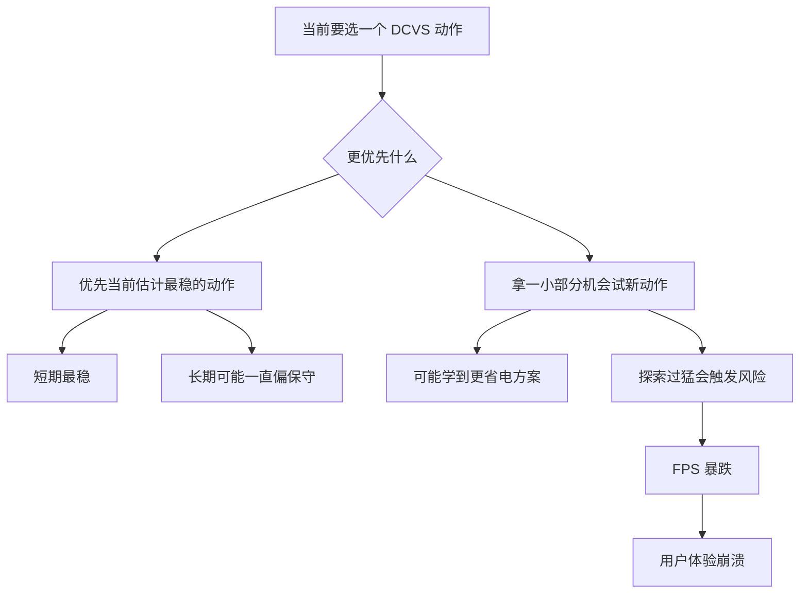
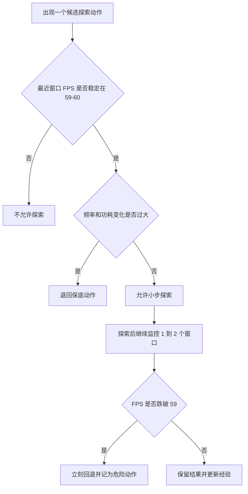
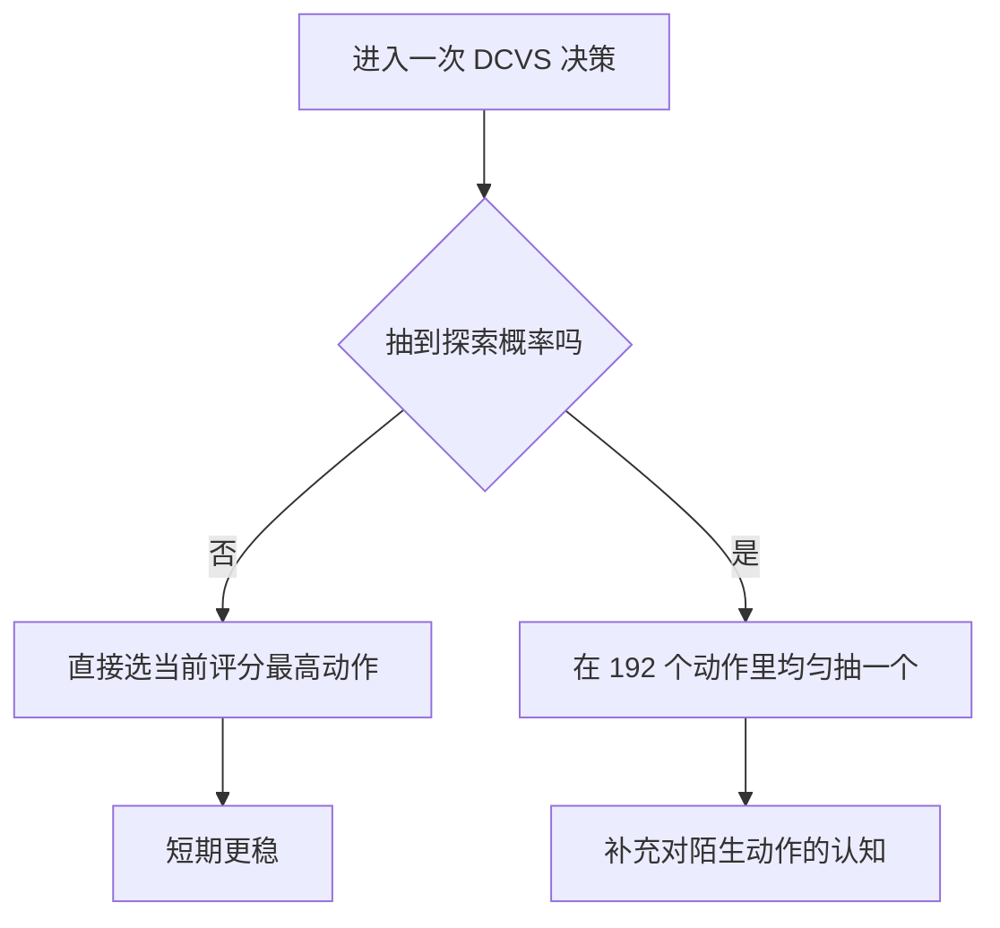

# 03 探索与利用：为什么你不能永远吃老店，也不能拿真机乱试

## 前置阅读

- 无。本文可以直接开始读。
- 如果你已经读完本文，下一篇建议接着看 `learn/04_Multi_Armed_Bandits.md`。

## 先把场景放到脑子里

你现在不是在做一个“随便试错”的小游戏，而是在做 GPU 动态时钟电压调整
（Dynamic Clock and Voltage Scaling, DCVS）。每隔一个决策窗口，系统都要在
192 个离散动作里选一个参数组合，目标很明确：

- 帧率尽量稳在 `59-60`；
- GPU 频率通常落在 `282-710 MHz` 这一段；
- 功耗范围可以直接记成：功耗 0-8000 mW；
- 既想省电，又不能把玩家眼前的画面搞崩。

这就逼出了一个核心矛盾：你到底是继续用已经证明“八九不离十”的动作，还是冒一点
风险去试试更省电、但暂时没那么有把握的新动作？这就是探索与利用。

还有一个很重要的现实背景：几份源材料之所以对“最佳方法”有不同推荐，不是因为谁对
谁错，而是因为它们默认的前提不同。

- 如果你把每个决策窗口看成“近似独立”的一次选动作问题，那上下文老虎机
  （Contextual Bandit）会显得很自然，因为它简单、样本效率高、在线部署也轻。
- 如果你更看重热积累、Governor 惯性、场景切换这些时间依赖，那问题就更像
  马尔可夫决策过程（Markov Decision Process, MDP），这时会更偏向离线强化学习
  （Offline Reinforcement Learning）里的保守方法，比如 CQL、IQL。
- 如果你把真机安全放在第一位，那么“能不能大胆探索”这件事本身就会成为分水岭。
  推荐系统里探索错一次，可能只是少点了一条广告；手机真机上探索错一次，可能就是
  FPS 暴跌，用户体验崩溃。

下面我们就把这个矛盾一点点拆开。

## 1. 探索（Exploration）和利用（Exploitation）到底在干什么

### ① 直觉类比

想象你下班后去一条美食街选餐厅。

- 你昨天吃过一家面馆，又快、又稳、基本不踩雷。今天继续去它家，这就像利用。
- 但你又看到旁边新开了一家小店，排队不长、看起来可能更便宜也更好吃。你决定试一次，
  这就像探索。

把这个类比搬到 DCVS 上就很好懂了：

- 利用：继续选那个已经验证过、能把 FPS 稳在 `59-60` 的动作；
- 探索：试一个你还没有完全摸透、但可能更省频率、更省功耗的动作。

问题在于，美食街踩雷最多只是这顿饭不太满意；真机 DCVS 踩雷，玩家会直接看到卡顿。

### ② 正式定义

在强化学习里，我们通常会给每个动作一个当前估计价值，记作 $\hat{Q}_t(a)$。

- 探索：优先去拿“信息增益”，也就是多了解那些还没被充分验证的动作；
- 利用：优先去拿“当前收益”，也就是直接选择眼下估计最好的动作。

如果把一次决策写得抽象一点，可以理解成：

$$
a_t = \arg\max_a \Bigl[\hat{Q}_t(a) + \text{探索奖励}_t(a)\Bigr]
$$

这里的意思很朴素：

- $\hat{Q}_t(a)$ 代表“这个动作现在看起来有多好”；
- 探索奖励代表“虽然它还没证明自己，但我愿不愿意给它一次机会”。

如果探索奖励很小，系统就偏利用；如果探索奖励很大，系统就偏探索。

### ③ 公式推导 + 决策图

一个很实用的思路是：把一次选择拆成“短期收益”和“长期信息价值”两笔账。

$$
\text{总决策价值}
= \text{本次立刻拿到的收益}
+ \lambda \times \text{未来学到的信息价值}
$$

其中 $\lambda$ 是一个权重：

- 当 $\lambda$ 很小，你更看重眼前稳定；
- 当 $\lambda$ 很大，你更愿意为了未来多学一点。

这张图展示了什么：下面这张决策树，把“先稳住”和“先多学一点”两条路径摆在一起。



图里的关键路径/要点：左边那条路代表“今天先别出事”；右边那条路代表“愿意花一点代价
换长期认知”。在 GPU DCVS 里，右边这条路必须很克制，因为你不是在离线表格里试，而是在
玩家手上的真机上试。

### ④ DCVS 实际数值计算示例

我们直接用项目里的奖励形式来算一笔账。源材料里有一个很实用的奖励设计：

$$
\text{reward} = \text{fps 分} + \text{频率分} + \text{功耗分}
$$

$$
\text{fps 分} =
\begin{cases}
-10 \times (57 - fps), & fps < 57 \\
-2 \times (59 - fps), & 57 \le fps < 59 \\
20, & fps \ge 59
\end{cases}
$$

$$
\text{频率分} = \frac{900 - gpu\_freq\_{MHz}}{80},
\qquad
\text{功耗分} = \frac{6000 - power\_{mW}}{400}
$$

现在看两个候选动作：

- 动作 A：把 GPU 维持在 `545 MHz` 左右，实测能跑到 `60 FPS`，功耗 `4200 mW`；
- 动作 B：把 GPU 压到 `430 MHz` 左右，你怀疑它还能顶住，但这次只跑到 `57.8 FPS`，
  功耗 `3300 mW`。

先算动作 A：

1. `60 FPS` 达标，所以 fps 分是：

   $$
   20
   $$

2. 频率分：

   $$
   \frac{900 - 545}{80} = \frac{355}{80} = 4.4375
   $$

3. 功耗分：

   $$
   \frac{6000 - 4200}{400} = \frac{1800}{400} = 4.5
   $$

4. 总奖励：

   $$
   20 + 4.4375 + 4.5 = 28.9375
   $$

再算动作 B：

1. `57.8 FPS` 没到 59，但还没低于 57，所以 fps 分是：

   $$
   -2 \times (59 - 57.8) = -2 \times 1.2 = -2.4
   $$

2. 频率分：

   $$
   \frac{900 - 430}{80} = \frac{470}{80} = 5.875
   $$

3. 功耗分：

   $$
   \frac{6000 - 3300}{400} = \frac{2700}{400} = 6.75
   $$

4. 总奖励：

   $$
   -2.4 + 5.875 + 6.75 = 10.225
   $$

所以这一轮如果只看眼前，肯定选 A，因为：

$$
28.9375 > 10.225
$$

但如果你后面继续观察，发现动作 B 在另一些场景下其实能跑到 `59.4 FPS`，那它的分数会变成：

$$
20 + 5.875 + 6.75 = 32.625
$$

这就是探索存在的理由：它可能让你发现“原来同样接近 60 帧，其实还能更省电”。

## 2. 为什么 DCVS 里的探索必须讲安全

### ① 直觉类比

还是用美食街类比。平常试一家新店，最多是这顿饭一般；但如果你在接待重要客户时选餐厅，
你就不会随便赌。

DCVS 也是一样。你不是在实验室里空跑，而是在用户正在玩的游戏里动参数。探索一旦太猛，
损失不是“模型多学了一点”，而是玩家直接感到顿挫。

### ② 正式定义

安全探索（Safe Exploration）的核心，不是“完全不探索”，而是：

$$
\text{只在风险可控时探索，只探索可回退的小步动作}
$$

也就是说，探索前要先问三个问题：

1. 当前帧率是不是已经稳定在 `59-60`？
2. 这次尝试会不会一下子把频率、功耗、时延推到危险区？
3. 一旦结果不对，我能不能立刻回退到保底动作？

### ③ 安全流程图

这张图展示了什么：下面这张图把“真机上允许探索”前需要过的几道门槛画出来。



图里的关键路径/要点：真正危险的不是“探索”两个字，而是“没有护栏的探索”。
只要出现帧率下探、功耗异常、或者波动超预期，就要立刻回退，而不是硬扛着继续学。

### ④ DCVS 实际数值示例

我们看一条非常现实的判断链。

- 当前保底动作把 GPU 稳在 `545 MHz`，最近两个窗口的帧率分别是 `59.8` 和 `60.0`，
  功耗大约 `4100-4300 mW`；
- 你想探索一个更省的动作，预计会把频率附近压到 `430 MHz`；
- 如果这个动作成功，功耗可能降到 `3300 mW` 左右；
- 但如果它失败，帧率可能掉到 `57-58`，玩家马上就能感觉到。

这时一个保守的工程规则可以写成：

$$
\text{只有当最近窗口都满足 } fps \ge 59.5 \text{ 时，才允许一次小步探索}
$$

为什么不是 `59.0`？因为你得给波动留缓冲。假设最近窗口只有 `59.1 FPS`，你再做一次激进降频，
哪怕只掉 `1.2 FPS`，也会立刻变成：

$$
59.1 - 1.2 = 57.9
$$

这已经掉出目标带了。

更直观一点，离线样本里也能看到危险信号。在 `offline_test_iter5` 里，`282 MHz` 附近就出现过
多帧 `reward = -7` 到 `-8` 的记录。它不能直接证明“所有低频都坏”，但它提醒你：低频动作在
某些负载下是真的会翻车，所以在线探索必须加护栏。

## 3. ε-greedy：最容易落地的探索法

### ① 直觉类比

你可以把 ε-greedy 想成：九成时间吃老店，一成时间故意试新店。

它的优点是简单、好实现、工程上非常容易解释；缺点也同样明显：它不管新店值不值得试，
只要轮到探索，就“平均撒网”。

### ② 正式定义

ε-greedy 的规则是：

- 以概率 $1-\epsilon$ 选择当前估计最好的动作；
- 以概率 $\epsilon$ 在全部动作里均匀随机探索。

如果动作总数是 $K$，而当前最优动作记作 $a^*$，那么一种常见写法是：

$$
P(a = a^*) = 1 - \epsilon + \frac{\epsilon}{K}
$$

$$
P(a = a_i, a_i \ne a^*) = \frac{\epsilon}{K}
$$

这表示：探索那一部分会平均分给所有动作，所以最优动作在探索阶段也会分到一点概率。

### ③ 公式推导 + 算法图

这张图展示了什么：下面这张图把一次 ε-greedy 决策拆成“走贪心主路”还是“走随机支路”。



图里的关键路径/要点：ε 越小，系统越像“几乎永远吃老店”；ε 越大，系统越像“经常试新店”。
在真机上，ε 一般不能开得太大，因为随机试错的代价是真实可见的。

### ④ DCVS 实际数值计算示例

现在用项目里的真实规模直接算。

- 动作总数 $K = 192$；
- 当前最优动作是一个能把 FPS 稳在 `59-60` 的动作；
- 设 $\epsilon = 0.1$。

先算探索部分平均分到每个动作的概率：

$$
\frac{\epsilon}{K} = 0.1 \div 192 = 0.0005208333
$$

这表示每个非贪心动作拿到的都是同样的小概率。

最优动作的总概率是：

$$
1 - 0.1 + 0.0005208333 = 0.9005208333
$$

再检查一下 191 个非贪心动作加起来是多少：

$$
191 \times 0.0005208333 = 0.0994791663
$$

最后把最优动作和其他动作加总：

$$
0.9005208333 + 0.0994791663 = 0.9999999996 \approx 1
$$

所以这组参数的含义是：

- 大约 `90.05208333%` 的时候，你会继续选当前最优动作；
- 单个非贪心动作只拿到 `0.0005208333` 的概率；
- 191 个非贪心动作合起来，才吃掉剩下的 `9.94791663%` 左右。

这也是 ε-greedy 的局限：它很朴素，但它不知道“哪几个动作更值得试”。

## 4. 乐观初始化（Optimistic Initialization）：先把没试过的动作想得更香一点

### ① 直觉类比

你第一次走进美食街，如果给所有没吃过的店都先打一个高分，那你就不会一直赖在第一家店里。
因为在账面上看，别家都“值得一试”。

### ② 正式定义

乐观初始化的做法是：把所有动作一开始的估计价值 $Q_0(a)$ 设得偏高。这样，那些还没被试过的动作
不会因为“没有历史”而永远出不了头。

常见的更新公式是：

$$
Q_{t+1}(a) = Q_t(a) + \alpha \bigl(R_t - Q_t(a)\bigr)
$$

其中：

- $Q_t(a)$ 是动作当前的估计分数；
- $R_t$ 是这次真正拿到的奖励；
- $\alpha$ 是学习率（Learning Rate），控制新结果对旧估计要改多大。

> **补充知识：学习率到底在控制什么？**
>
> 你可以把学习率理解成“我愿意被新证据说服到什么程度”。如果学习率很大，说明你很相信
> 这次新观察，分数会改很多；如果学习率很小，说明你更相信过去积累下来的经验，分数只会
> 稍微动一点。
>
> 比如当前估计是 30 分，这次真实只拿到 10 分。学习率是 0.2，就只往下修一点；学习率是
> 0.8，就会大幅往下修。

### ③ 公式推导

这个公式本质上是在做一件很简单的事：

$$
\text{新估计} = \text{旧估计} + \text{一小步修正}
$$

其中“修正量”就是：

$$
\alpha \times (\text{真实结果} - \text{旧估计})
$$

如果真实结果比旧估计低，修正就是负的；如果真实结果更高，修正就是正的。

### ④ DCVS 实际数值计算示例

假设我们只看 3 个动作：

- 动作 A：`430 MHz`；
- 动作 B：`545 MHz`；
- 动作 C：`710 MHz`。

一开始先乐观一点，全部设成：

$$
Q_0(A) = Q_0(B) = Q_0(C) = 35
$$

设学习率 $\alpha = 0.2$。

第一轮先试动作 A，结果只拿到奖励 `9`。更新后：

$$
Q_1(A) = 35 + 0.2 \times (9 - 35)
$$

先算括号：

$$
9 - 35 = -26
$$

再乘学习率：

$$
0.2 \times (-26) = -5.2
$$

最后得到：

$$
Q_1(A) = 35 - 5.2 = 29.8
$$

这时其余两个没试过的动作还是：

$$
Q_0(B) = 35, \qquad Q_0(C) = 35
$$

所以系统接下来更可能继续去试 B 或 C，而不是死守 A。

这就是乐观初始化的作用：不是靠随机乱抽，而是靠“没试过就先别太早判死刑”。

不过在真机上要多一句提醒：如果你把初始分设得太夸张，又没有安全壳，系统就可能过于积极
地去试危险动作。所以它更适合配合离线评估、仿真、或者严格的回退机制一起用。

## 5. Softmax 探索（Softmax Exploration）：不是平均撒网，而是按分数分配概率

### ① 直觉类比

还是美食街。你不会让每家店的被选概率都一样，而是：评分越高的店，被你选中的概率越大；
但评分一般的店，也不是完全没机会。

这就是 Softmax 探索的味道：它不是“要么最优，要么纯随机”，而是“分数高的更常选，分数低的
偶尔也会被试一下”。

### ② 正式定义

如果一组动作的当前分数分别是 $Q(a_1), Q(a_2), \dots, Q(a_K)$，那么 Softmax 会把它们转换成一个
概率分布：

$$
P(a_i) = \frac{\exp\bigl(Q(a_i) / \tau\bigr)}{\sum_j \exp\bigl(Q(a_j) / \tau\bigr)}
$$

这里的 $\tau$ 叫温度（Temperature）：

- $\tau$ 很小，系统更偏向高分动作；
- $\tau$ 很大，概率会变得更平均。

> **补充知识：为什么这里会冒出指数和概率分布？**
>
> 先只抓住一个结论就够了：指数函数会把“分数差距”放大。比如两个动作只差 4 分，做完
> 指数之后，高分动作的权重可能会明显更大，所以它更容易被选中。
>
> 最后再除以所有权重的总和，就把这些权重变成“加起来等于 1”的概率分布了。你不用先会
> 概率论里的复杂分布族，也能把它理解成“把分数翻译成抽签概率”。

### ③ 公式推导

Softmax 的推导重点不是“怎么求导”，而是“怎么把分数变成概率”。步骤可以压成三步：

1. 先把每个分数做指数变换，得到正数权重；
2. 再把所有权重加起来；
3. 每个动作用自己的权重除以总和，得到概率。

### ④ DCVS 实际数值计算示例

假设现在你从 192 个动作里先筛出 3 个相对安全的候选动作：

- 动作 A：`545 MHz`，当前估计分数 `28`；
- 动作 B：`430 MHz`，当前估计分数 `24`；
- 动作 C：`710 MHz`，当前估计分数 `20`。

设温度 $\tau = 4$。

先算三个指数权重：

$$
\exp(28 / 4) = \exp(7) \approx 1096.6332
$$

$$
\exp(24 / 4) = \exp(6) \approx 403.4288
$$

$$
\exp(20 / 4) = \exp(5) \approx 148.4132
$$

把它们加起来：

$$
1096.6332 + 403.4288 + 148.4132 = 1648.4752
$$

再算概率：

$$
P(A) = \frac{1096.6332}{1648.4752} \approx 0.6652
$$

$$
P(B) = \frac{403.4288}{1648.4752} \approx 0.2447
$$

$$
P(C) = \frac{148.4132}{1648.4752} \approx 0.0900
$$

所以它的效果不是“只选 A”，也不是“平均选三家”，而是：

- 动作 A 被选中的概率约 `66.52%`；
- 动作 B 约 `24.47%`；
- 动作 C 约 `9.00%`。

这比 ε-greedy 更细腻，因为它会按分数差距来分配探索概率。

## 6. 上置信界（Upper Confidence Bound, UCB）：谁看起来还可能被低估，就给谁一点机会

### ① 直觉类比

你在美食街看点评时，不会只看平均分，还会看“有多少人评价过”。

- 一家店平均 4.7 分，但已经有 400 条评价，说明这个分比较稳；
- 另一家店平均 4.5 分，但只有 5 条评价，说明它还很不确定，可能被低估，也可能被高估。

UCB 的直觉就是：平均成绩不错、而且样本少的动作，值得再给点机会。

### ② 正式定义

UCB 会给每个动作算一个“平均奖励 + 不确定性奖励”：

$$
UCB(a) = \bar{r}(a) + \sqrt{\frac{2 \ln t}{N(a)}}
$$

其中：

- $\bar{r}(a)$ 是动作 $a$ 的平均奖励；
- $N(a)$ 是它已经被试过多少次；
- $t$ 是到当前为止，总共做了多少次决策。

第二项就是常说的置信上界奖励：

- 试得越少，分母越小，奖励越大；
- 总轮数越多，$\ln t$ 会慢慢增大，但增长速度不算快。

> **补充知识：为什么尝试次数会出现在分母里？**
>
> 因为试得越多，不确定性通常越小。你只看过 3 次，就很难说“这个动作一定好”还是“一时运气”。
> 但如果看过 300 次，心里就更有底了。
>
> 所以 UCB 的思路很像“给样本少的人一点发言权”。它不是盲目偏爱冷门，而是在提醒你：
> 冷门动作也许只是还没被看清。

### ③ 公式推导

UCB 的逻辑链很直接：

$$
\text{选择分数} = \text{已知平均表现} + \text{未知带来的探索补贴}
$$

如果两个动作平均奖励差不多，那样本更少的那个就更可能被选中；
如果一个动作平均奖励已经差很多，那再大的探索补贴也救不回来。

### ④ DCVS 实际数值计算示例

假设当前有两个候选动作：

- 动作 A：接近 `545 MHz` 的稳妥动作，平均奖励是 `12.4`，已经试了 `40` 次；
- 动作 B：接近 `430 MHz` 的省电动作，平均奖励是 `11.7`，只试了 `5` 次；
- 当前总决策轮数是 $t = 120$。

先算公共部分：

$$
2 \ln 120 \approx 2 \times 4.787492 = 9.574984
$$

再算动作 A 的探索补贴：

$$
\sqrt{\frac{9.574984}{40}} = \sqrt{0.2393746} \approx 0.4893
$$

所以动作 A 的 UCB 是：

$$
12.4 + 0.4893 = 12.8893
$$

再算动作 B 的探索补贴：

$$
\sqrt{\frac{9.574984}{5}} = \sqrt{1.9149968} \approx 1.3831
$$

所以动作 B 的 UCB 是：

$$
11.7 + 1.3831 = 13.0831
$$

最后比较：

$$
13.0831 > 12.8893
$$

所以按 UCB，会选动作 B。

但注意，这只是“统计上更值得再看一眼”，不是说你就该无脑把它直接打到真机上。
在 DCVS 里，更合理的做法是：先让它通过安全探索护栏，再决定是不是真的执行。

## 7. 什么时候该偏探索，什么时候该偏利用

可以把这件事记成一个很接地气的工程判断表：

| 场景 | 更偏向什么 | 原因 |
|---|---|---|
| 新游戏、新场景，历史数据很少 | 稍微多一点探索 | 不然你永远不知道更省的动作行不行 |
| 已经接近 `59-60 FPS` 下限 | 明显偏利用 | 这时再乱试，最容易把体验打崩 |
| 离线回放、仿真、实验台 | 可以多探索 | 出错成本低，适合补认知 |
| 真机在线、玩家可感知 | 强调安全探索 | 每次错误都会被用户直接感知 |
| 192 个动作里很多还没覆盖 | 先用保守方法缩范围 | 否则随机试错的代价太大 |

如果你把几份源材料合在一起看，会得到一个很实用的结论：

- 在线阶段别太贪“学得快”，先保住体验；
- 离线阶段尽量把数据覆盖做厚，把危险动作提前筛掉；
- 真要在线探索，也应该是小步、可回退、带护栏的探索。

## 附录：TikZ源码（可选）

这部分不是正文理解所必需的，只是把两张核心图的 TikZ 源码额外留档，方便以后导出到 LaTeX 报告。

```latex
\begin{tikzpicture}[>=Stealth, node distance=9mm and 10mm]
  \tikzstyle{inputnode}=[draw, rounded corners, fill=blue!15, minimum width=34mm, minimum height=8mm, align=center]
  \tikzstyle{processnode}=[draw, rounded corners, fill=orange!18, minimum width=34mm, minimum height=8mm, align=center]
  \tikzstyle{outputnode}=[draw, rounded corners, fill=green!18, minimum width=34mm, minimum height=8mm, align=center]

  \node[inputnode] (start) {当前要选一个 DCVS 动作};
  \node[processnode, below left=of start] (stable) {优先当前估计最稳的动作};
  \node[processnode, below right=of start] (explore) {拿一小部分机会试新动作};
  \node[outputnode, below=of stable] (short) {短期最稳};
  \node[outputnode, below=of explore] (learn) {可能学到更省电方案};
  \node[outputnode, below=of learn] (risk) {探索过猛会导致 FPS 暴跌};

  \draw[->, thick] (start) -- (stable);
  \draw[->, thick] (start) -- (explore);
  \draw[->, thick] (stable) -- (short);
  \draw[->, thick] (explore) -- (learn);
  \draw[->, thick] (learn) -- (risk);
\end{tikzpicture}
```

```latex
\begin{tikzpicture}[>=Stealth, node distance=9mm and 10mm]
  \tikzstyle{inputnode}=[draw, rounded corners, fill=blue!15, minimum width=34mm, minimum height=8mm, align=center]
  \tikzstyle{processnode}=[draw, rounded corners, fill=orange!18, minimum width=34mm, minimum height=8mm, align=center]
  \tikzstyle{outputnode}=[draw, rounded corners, fill=green!18, minimum width=36mm, minimum height=8mm, align=center]

  \node[inputnode] (start) {出现一个候选探索动作};
  \node[processnode, below=of start] (fps) {最近窗口 FPS 是否稳定};
  \node[processnode, below left=of fps] (reject) {不允许探索};
  \node[processnode, below right=of fps] (small) {允许小步探索};
  \node[outputnode, below=of small] (watch) {继续监控 1 到 2 个窗口};
  \node[outputnode, below left=of watch] (rollback) {跌破 59 立刻回退};
  \node[outputnode, below right=of watch] (keep) {结果可保留并更新经验};

  \draw[->, thick] (start) -- (fps);
  \draw[->, thick] (fps) -- (reject);
  \draw[->, thick] (fps) -- (small);
  \draw[->, thick] (small) -- (watch);
  \draw[->, thick] (watch) -- (rollback);
  \draw[->, thick] (watch) -- (keep);
\end{tikzpicture}
```

## 关键收获

- 探索是在补认知，利用是在保结果；DCVS 真正难的不是二选一，而是怎么在不伤用户体验的前提下做一点点探索。
- ε-greedy 简单好落地，但在 `192` 个动作里属于“平均撒网”，不知道哪个动作更值得试。
- 乐观初始化和 Softmax 都比纯随机更细腻，但它们仍然要配合真机安全护栏，不能裸奔。
- UCB 的价值在于把“平均奖励”和“不确定性”一起考虑进去，能优先看到那些可能被低估的动作。
- 源材料之所以对算法推荐不同，根子在于它们对问题建模和风险容忍度的假设不同：越强调真机安全和时间依赖，越会偏保守、偏离线、偏带护栏的方案。
