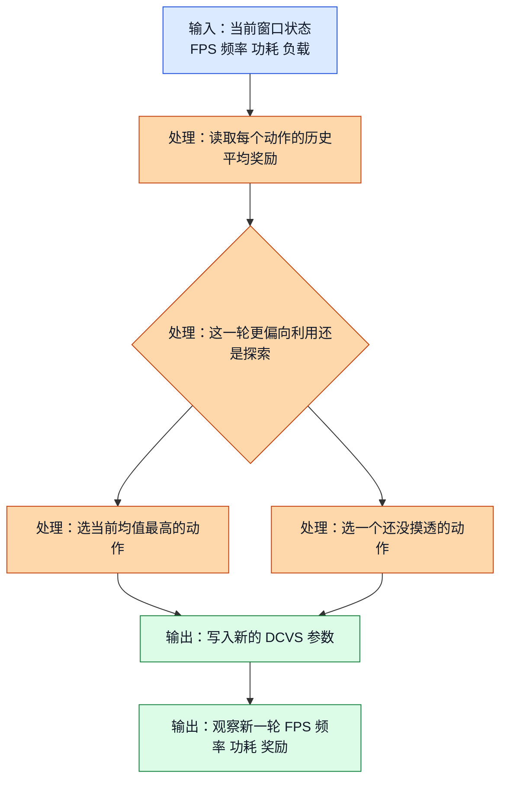
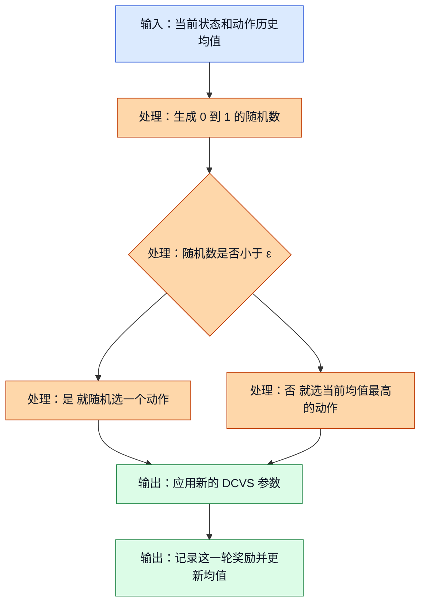
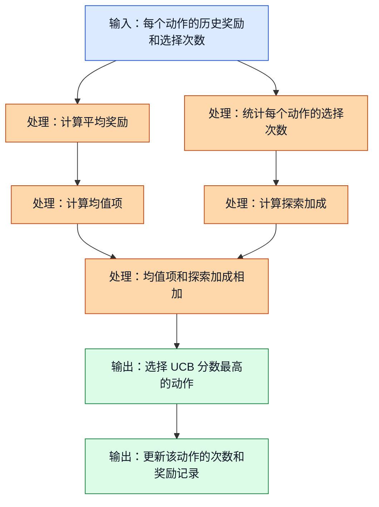
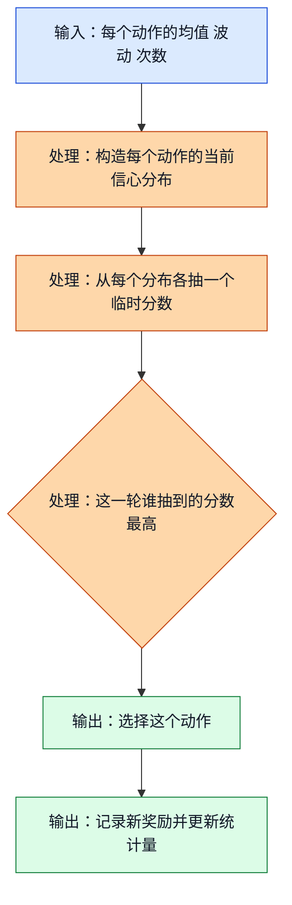
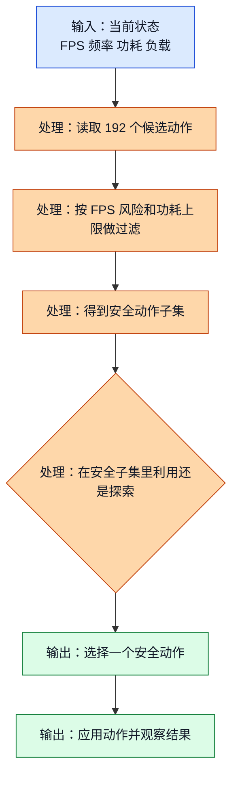
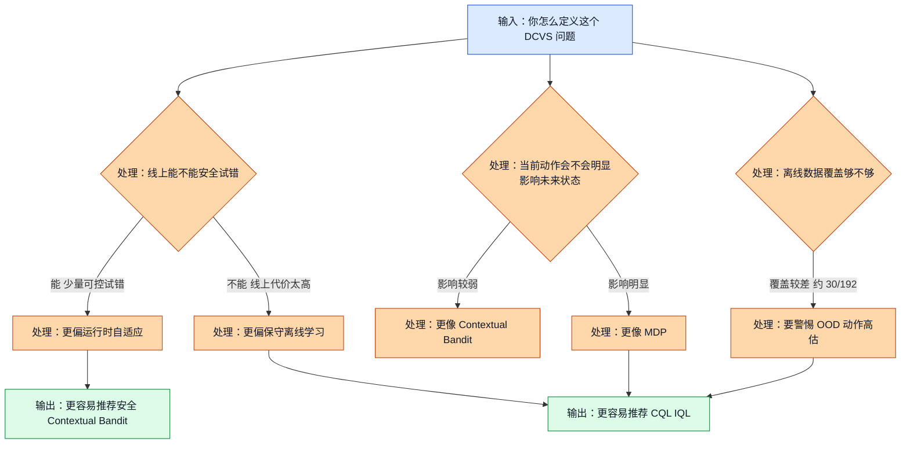

# 03 探索与利用：为什么 GPU DCVS 不能永远只选“眼前最稳”的动作

## 前置阅读

- 建议先读 `02_RL_Core_Concepts.md`，先把状态、动作、奖励、回报这些最基础的词放稳。
- 本篇可以独立阅读，但默认你已经知道这个项目的大致背景：GPU 频率常见范围是 `282-710 MHz`，目标帧率是 `59-60 FPS`，功耗观测范围通常按 `0-8000 mW` 理解，动作空间是 `6 × 4 × 4 × 2 = 192` 个离散动作。

## 这篇要解决什么问题

到了这里，你已经知道强化学习（Reinforcement Learning, RL）是在“持续做决定”。但真正一上手，马上会撞上一堵墙：

- 如果系统每次都选“目前平均分最高”的动作，它看起来很稳，可你可能永远不知道还有没有更好的动作；
- 如果系统老去试没把握的新动作，GPU DCVS 又是个很敏感的控制问题，掉帧、发热、功耗抖动都会直接打到用户体验。

这就是探索（Exploration）和利用（Exploitation）的矛盾。

你可以先把它理解成一句人话：

> 利用是在吃已经确认好吃的饭店，探索是在冒一点险，去确认街角那家没吃过的新店是不是其实更好。

放到 GPU 动态时钟电压调整（Dynamic Clock and Voltage Scaling, DCVS）里，就是：

- 利用：优先选择当前看起来回报最高的动作；
- 探索：拿出少量决策窗口，去试一试还没摸透的动作。

这篇文档会做三件事：

1. 把“探索与利用”这个核心矛盾讲清楚；
2. 用最常见的 3 种探索策略讲明白工程上到底在算什么；
3. 解释为什么三份源材料会对“最佳方法”给出不一样的建议。

## 1. 探索与利用到底在争什么

### ① 直觉类比

想象你是一个值班调参工程师，每 `5 秒` 看一次系统面板。你眼前有 192 个动作可以选，每个动作都对应一套 DCVS 参数组合。

这时候你会碰到两个完全相反的冲动：

- “别乱动，选当前最稳的那个。” 这就是利用。
- “万一还有更好的呢？总得偶尔试一下。” 这就是探索。

这件事麻烦在于，DCVS 不是点一次按钮就结束，而是整局游戏里反复做很多次决定。你现在为了多拿一点信息去试错，可能会换来更好的长期策略；但你也可能当场把 FPS 从 `59.4` 掉到 `58.2`，玩家立刻就能感知到。

### ② 正式定义

假设动作 $a$ 已经被试了 $N(a)$ 次，每次拿到的奖励（Reward）分别是 $r_1(a), r_2(a), \dots, r_{N(a)}(a)$，那么它当前的平均奖励估计可以写成：

$$
\hat{\mu}(a) = \frac{1}{N(a)} \sum_{i=1}^{N(a)} r_i(a)
$$

纯利用的做法，就是每次都选当前平均奖励最高的动作：

$$
a_t = \arg\max_a \hat{\mu}(a)
$$

为了衡量“因为没选到真正最好动作而吃亏了多少”，常用遗憾（Regret）这个量：

$$
\text{Regret}_t = r(a^*) - r(a_t)
$$

这里：

- $a^*$ 表示真正最优的动作；
- $a_t$ 表示第 $t$ 轮实际选到的动作。

> **补充知识：平均值和遗憾到底在说什么？**
>
> 平均值就是“把这个动作历史上拿到的分全加起来，再除以试过的次数”。它不是绝对真相，只是你到现在为止最朴素、最直接的判断。
>
> 遗憾可以理解成“这一轮本来还能多拿多少分”。如果真正最好的动作这一轮能拿 `27.66` 分，而你实际选的动作只拿了 `21.88` 分，那这一轮遗憾就是 `5.78` 分。把很多轮遗憾加起来，你就能知道自己为“没摸清动作价值”付出了多大代价。

### ③ 公式推导 + Mermaid 图

这张图展示了什么：下面这张图把探索与利用在 DCVS 决策里的最小闭环画了出来。它只讲一件事：每一轮你都得在“继续吃老本”和“花一点代价换信息”之间做取舍。

图里的关键路径/要点：探索和利用不是“一次选边站”，而是每个控制窗口都要重新权衡。DCVS 越是长期运行，这种拉扯就越明显。

### ④ DCVS 实际数值计算示例

为了把数字算清楚，我们先固定一条和源材料一致的教学版奖励函数：

$$
\text{reward} = \text{fps\_component} + \text{freq\_component} + \text{power\_component}
$$

其中：

$$
\text{fps\_component} =
\begin{cases}
-10 \times (57 - \text{fps}), & \text{fps} < 57 \\
-2 \times (59 - \text{fps}), & 57 \le \text{fps} < 59 \\
20, & \text{fps} \ge 59
\end{cases}
$$

$$
\text{freq\_component} = \frac{900 - \text{gpu\_freq\_mhz}}{80}
$$

$$
\text{power\_component} = \frac{6000 - \text{power\_mw}}{400}
$$

现在从 192 个动作里拿 3 个代表性动作出来，假设它们在当前场景下的平均观测结果如下：

| 动作 | 平均 GPU 频率 | 平均 FPS | 平均功耗 | 直觉解释 |
| --- | ---: | ---: | ---: | --- |
| 动作 A | `710 MHz` | `60.0` | `6200 mW` | 很激进，性能稳，但功耗偏高 |
| 动作 B | `587 MHz` | `59.4` | `4500 mW` | 帧率达标，而且更平衡 |
| 动作 C | `430 MHz` | `58.2` | `3200 mW` | 很省电，但已经轻微掉帧 |

先算动作 A。

因为 `60.0 >= 59`，所以：

$$
\text{fps\_component}_A = 20
$$

频率项：

$$
\text{freq\_component}_A = \frac{900 - 710}{80} = \frac{190}{80} = 2.375
$$

功耗项：

$$
\text{power\_component}_A = \frac{6000 - 6200}{400} = \frac{-200}{400} = -0.5
$$

总奖励：

$$
\text{reward}_A = 20 + 2.375 - 0.5 = 21.875
$$

再算动作 B。

因为 `59.4 >= 59`，所以：

$$
\text{fps\_component}_B = 20
$$

频率项：

$$
\text{freq\_component}_B = \frac{900 - 587}{80} = \frac{313}{80} = 3.9125
$$

功耗项：

$$
\text{power\_component}_B = \frac{6000 - 4500}{400} = \frac{1500}{400} = 3.75
$$

总奖励：

$$
\text{reward}_B = 20 + 3.9125 + 3.75 = 27.6625
$$

最后算动作 C。

因为 `58.2` 落在 `57-59` 之间，所以：

$$
\text{fps\_component}_C = -2 \times (59 - 58.2) = -2 \times 0.8 = -1.6
$$

频率项：

$$
\text{freq\_component}_C = \frac{900 - 430}{80} = \frac{470}{80} = 5.875
$$

功耗项：

$$
\text{power\_component}_C = \frac{6000 - 3200}{400} = \frac{2800}{400} = 7
$$

总奖励：

$$
\text{reward}_C = -1.6 + 5.875 + 7 = 11.275
$$

所以当前排序是：

$$
\text{reward}_B = 27.6625 > \text{reward}_A = 21.875 > \text{reward}_C = 11.275
$$

如果真正最优的是动作 B，但你因为“怕试错”连续 3 轮都选了动作 A，再有 1 轮误选了动作 C，那么累计遗憾就是：

动作 A 的单轮遗憾：

$$
27.6625 - 21.875 = 5.7875
$$

连续 3 轮都选 A：

$$
3 \times 5.7875 = 17.3625
$$

动作 C 的单轮遗憾：

$$
27.6625 - 11.275 = 16.3875
$$

4 轮总遗憾：

$$
17.3625 + 16.3875 = 33.75
$$

这个 `33.75` 的意思很直接：因为没有及时摸清哪个动作更好，这 4 个窗口你一共少拿了 `33.75` 分。

## 2. 最简单的探索策略：ε-贪心（epsilon-greedy）

### ① 直觉类比

你平时点外卖，如果 `90%` 的时候都点自己最熟的那家，只有 `10%` 的时候试试别的店，这就是一个很典型的 ε-贪心思路。

搬到 DCVS 上，就是：

- 大部分窗口继续选当前平均奖励最高的动作；
- 少部分窗口随机试一试别的动作。

它的优点是简单，几乎一眼就能实现。缺点也同样明显：它不分青红皂白地随机，试到好动作和试到烂动作的概率是一样的。

### ② 正式定义

设探索概率是 $\varepsilon$，那么第 $t$ 轮动作选择规则写成：

$$
a_t =
\begin{cases}
\arg\max_a \hat{\mu}(a), & \text{以 } 1-\varepsilon \text{ 的概率} \\
\text{从动作集合里均匀随机选一个动作}, & \text{以 } \varepsilon \text{ 的概率}
\end{cases}
$$

如果动作总数是：

$$
|\mathcal{A}| = 192
$$

那么在随机探索分支里，每个动作被抽中的概率都是：

$$
\frac{1}{192}
$$

所以任意一个指定动作在单轮里被探索到的总概率是：

$$
P(\text{命中特定动作}) = \varepsilon \times \frac{1}{192}
$$

### ③ 公式推导 + Mermaid 图

这张图展示了什么：下面这张图把 ε-贪心每次决策时的分叉过程画了出来。你会看到，它真正做的不是“聪明探索”，而是“带概率地随机一下”。

图里的关键路径/要点：ε-贪心的利用部分没问题，但探索部分很“粗”。动作一多，随机探索会变得非常稀薄。

### ④ DCVS 实际数值计算示例

现在假设：

- 动作空间大小是 `192`；
- 每个控制窗口长度是 `5 秒`；
- 探索概率 $\varepsilon = 0.1$。

先算某个指定动作在单轮里被随机探索到的概率：

$$
P = 0.1 \times \frac{1}{192} = \frac{0.1}{192} = 0.0005208333
$$

也就是说，单轮命中某个特定动作的概率只有大约 `0.052%`。

期望要多少轮，才能碰到这个动作 1 次？可以用“平均等待轮数约等于概率的倒数”这个直觉近似：

$$
\text{期望轮数} \approx \frac{1}{0.0005208333} = 1920
$$

换成时间：

$$
1920 \times 5 = 9600 \text{ 秒}
$$

继续换算：

$$
9600 \div 60 = 160 \text{ 分钟}
$$

也就是：

$$
160 \div 60 \approx 2.67 \text{ 小时}
$$

这就是 ε-贪心在大动作空间里的第一层现实问题：`192` 个动作一旦全空间均匀随机，探索会慢得非常离谱。

再算一下当前最优动作被选中的概率。假设当前最好的是动作 B，那么：

$$
P(\text{选中 B}) = 0.9 + 0.1 \times \frac{1}{192}
$$

$$
= 0.9 + 0.0005208333 = 0.9005208333
$$

也就是说，动作 B 仍有大约 `90.05%` 的概率继续被选中。

这说明在 192 个动作上，ε-贪心很容易出现两个现象：

- 已知好动作会被反复利用；
- 没试过的动作会长期轮不到。

## 3. 更会算账的探索：上置信界（Upper Confidence Bound, UCB）

### ① 直觉类比

想象你在看两家外卖店：

- 店 A 平均 `4.8` 分，已经有 `2000` 个评价；
- 店 B 平均 `4.7` 分，但只有 `8` 个评价。

你脑子里通常会自然冒出一句话：

“A 很稳，但 B 还没被看透，说不定其实更强。”

UCB 的思路，就是把这种“样本少，所以还不能轻易下结论”的直觉，硬生生写进公式里。

### ② 正式定义

UCB 最常见的形式是：

$$
\text{UCB}_t(a) = \hat{\mu}_t(a) + c \sqrt{\frac{\ln t}{N_t(a)}}
$$

然后每一轮选择：

$$
a_t = \arg\max_a \text{UCB}_t(a)
$$

这里：

- $\hat{\mu}_t(a)$ 是动作 $a$ 到第 $t$ 轮时的平均奖励；
- $N_t(a)$ 是动作 $a$ 被试过多少次；
- $t$ 是总决策轮数；
- $c$ 是探索强度系数。

后面那个根号项，可以直接把它看成“样本少奖励”。

> **补充知识：为什么公式里会有对数和平方根？**
>
> 这里不用先背推导，先抓方向就够了。一个动作试得越多，我们对它越熟，所以探索奖励应该变小；一个动作试得越少，我们越不确定，所以探索奖励应该更大。
>
> 分母放 $N_t(a)$ 很好理解，因为次数越多，不确定性越低。再套上平方根，是为了让这个奖励下降得别太猛，不然很多动作刚试几次就再也拿不到机会。至于 $\ln t$，你可以把它理解成“总轮数越来越多时，系统还保留一点点探索冲动，但增长非常慢”。

### ③ 公式推导 + Mermaid 图

这张图展示了什么：下面这张图把 UCB 的 3 个核心步骤串起来了。它不是只看平均分，而是把“平均分”和“不确定性补偿”合并以后再决策。

图里的关键路径/要点：UCB 不是瞎试，而是优先去试那些“均值不差、但样本还不够多”的动作。

### ④ DCVS 实际数值计算示例

假设现在已经做了 `20` 个控制窗口，即：

$$
t = 20
$$

我们挑 3 个代表性动作来看：

| 动作 | 已观测奖励 | 选择次数 |
| --- | --- | ---: |
| 动作 A | `21.875` 连续出现 10 次 | `10` |
| 动作 B | `20.8, 22.4` | `2` |
| 动作 C | `10.9, 12.1, 11.0, 11.7, 11.3, 11.0, 10.9` | `7` |

设探索系数：

$$
c = 2
$$

先算动作 B 的平均奖励：

$$
\hat{\mu}(B) = \frac{20.8 + 22.4}{2} = \frac{43.2}{2} = 21.6
$$

再算动作 C 的平均奖励。先累加分子：

$$
10.9 + 12.1 = 23.0
$$

$$
23.0 + 11.0 = 34.0
$$

$$
34.0 + 11.7 = 45.7
$$

$$
45.7 + 11.3 = 57.0
$$

$$
57.0 + 11.0 = 68.0
$$

$$
68.0 + 10.9 = 78.9
$$

所以：

$$
\hat{\mu}(C) = \frac{78.9}{7} \approx 11.2714
$$

动作 A 的均值直接用：

$$
\hat{\mu}(A) = 21.875
$$

现在统一算探索加成。先算公共项：

$$
\ln 20 \approx 2.9957
$$

动作 A：

$$
2 \sqrt{\frac{2.9957}{10}} = 2 \sqrt{0.29957}
$$

$$
\sqrt{0.29957} \approx 0.5473
$$

$$
2 \times 0.5473 = 1.0946
$$

所以：

$$
\text{UCB}(A) = 21.875 + 1.0946 = 22.9696
$$

动作 B：

$$
2 \sqrt{\frac{2.9957}{2}} = 2 \sqrt{1.49785}
$$

$$
\sqrt{1.49785} \approx 1.2239
$$

$$
2 \times 1.2239 = 2.4478
$$

所以：

$$
\text{UCB}(B) = 21.6 + 2.4478 = 24.0478
$$

动作 C：

$$
2 \sqrt{\frac{2.9957}{7}} = 2 \sqrt{0.42796}
$$

$$
\sqrt{0.42796} \approx 0.6542
$$

$$
2 \times 0.6542 = 1.3084
$$

所以：

$$
\text{UCB}(C) = 11.2714 + 1.3084 = 12.5798
$$

最后比较：

$$
\text{UCB}(B) = 24.0478 > \text{UCB}(A) = 22.9696 > \text{UCB}(C) = 12.5798
$$

最值得注意的一点是：

- 动作 B 的当前平均奖励 `21.6` 其实比动作 A 的 `21.875` 还略低；
- 但因为动作 B 只试过 `2` 次，不确定性更大，所以 UCB 还愿意再给它机会。

这就是 UCB 的味道：不是“均值第一就永远霸榜”，而是“样本少但有潜力的动作还能继续争取面试机会”。

## 4. 把不确定性直接塞进采样：汤普森采样（Thompson Sampling）

### ① 直觉类比

如果说 UCB 像是在给每个动作发一笔“探索补贴”，那汤普森采样更像是：

- 先为每个动作保留一个“我现在对它多有把握”的信心分布；
- 每轮从每个动作的分布里各抽一个临时分数；
- 这一轮谁抽得最高，就先试谁。

它的好处是，探索不是硬加进去的，而是从“不确定性本来就更大”这件事里自然长出来。

### ② 正式定义

为了和 DCVS 的连续奖励更贴近，我们用一个简化的连续版本来写。假设动作 $a$ 的真实平均奖励还不确定，但当前估计可以近似成一个正态分布（Normal Distribution）：

$$
\tilde{q}(a) \sim \mathcal{N}\left(\hat{\mu}(a), \frac{s_a^2}{N(a)+1}\right)
$$

然后在第 $t$ 轮，选择抽样值最大的动作：

$$
a_t = \arg\max_a \tilde{q}(a)
$$

这里：

- $\hat{\mu}(a)$ 是动作的当前均值估计；
- $s_a$ 是这个动作历史奖励的波动幅度；
- $N(a)$ 是这个动作已经被试过多少次；
- $\tilde{q}(a)$ 是这一轮临时抽出来的分数。

> **补充知识：什么叫“从分布里抽一个样本”？**
>
> 你可以把一个分布理解成“这个动作未来可能拿到哪些分，这些分大概多常出现”。如果一个动作均值高、而且样本还少，它的分布往往会更宽，这表示我们对它还不够确定。
>
> 抽样不是随手乱写数字，而是按这团不确定性的形状去取一个可能值。样本多的动作，分布会更窄；样本少的动作，分布会更宽，所以它更容易在某一轮抽到一个特别亮眼的分数，从而自动获得探索机会。

### ③ 公式推导 + Mermaid 图

这张图展示了什么：下面这张图把汤普森采样的一轮逻辑拆开了。它和 UCB 最大的区别是，不是先算固定 bonus，而是直接把不确定性放进随机采样里。

图里的关键路径/要点：样本少的动作不需要你手动发“探索补贴”，它自己就会因为分布更宽，偶尔抽到高分，于是自然被试到。

### ④ DCVS 实际数值计算示例

还是看 3 个代表性动作，假设当前统计如下：

| 动作 | 均值估计 $\hat{\mu}$ | 历史波动 $s$ | 已选择次数 $N$ |
| --- | ---: | ---: | ---: |
| 动作 A | `21.9` | `1.2` | `9` |
| 动作 B | `24.2` | `4.5` | `2` |
| 动作 C | `11.3` | `2.0` | `6` |

先把每个动作这一轮的抽样标准差算出来：

$$
\sigma_{\text{sample}}(a) = \frac{s_a}{\sqrt{N(a)+1}}
$$

动作 A：

$$
\sigma_{\text{sample}}(A) = \frac{1.2}{\sqrt{9+1}} = \frac{1.2}{\sqrt{10}}
$$

$$
\sqrt{10} \approx 3.1623
$$

$$
\sigma_{\text{sample}}(A) \approx \frac{1.2}{3.1623} \approx 0.3795
$$

动作 B：

$$
\sigma_{\text{sample}}(B) = \frac{4.5}{\sqrt{2+1}} = \frac{4.5}{\sqrt{3}}
$$

$$
\sqrt{3} \approx 1.7321
$$

$$
\sigma_{\text{sample}}(B) \approx \frac{4.5}{1.7321} \approx 2.5981
$$

动作 C：

$$
\sigma_{\text{sample}}(C) = \frac{2.0}{\sqrt{6+1}} = \frac{2.0}{\sqrt{7}}
$$

$$
\sqrt{7} \approx 2.6458
$$

$$
\sigma_{\text{sample}}(C) \approx \frac{2.0}{2.6458} \approx 0.7559
$$

假设这一轮抽到的标准正态系数分别是：

- 动作 A：$z_A = -0.4$
- 动作 B：$z_B = 0.6$
- 动作 C：$z_C = 0.3$

那么每个动作这一轮的临时分数就是：

$$
\tilde{q}(a) = \hat{\mu}(a) + z_a \cdot \sigma_{\text{sample}}(a)
$$

动作 A：

$$
\tilde{q}(A) = 21.9 + (-0.4) \times 0.3795
$$

$$
= 21.9 - 0.1518 = 21.7482
$$

动作 B：

$$
\tilde{q}(B) = 24.2 + 0.6 \times 2.5981
$$

$$
= 24.2 + 1.5589 = 25.7589
$$

动作 C：

$$
\tilde{q}(C) = 11.3 + 0.3 \times 0.7559
$$

$$
= 11.3 + 0.2268 = 11.5268
$$

所以这一轮：

$$
\tilde{q}(B) = 25.7589 > \tilde{q}(A) = 21.7482 > \tilde{q}(C) = 11.5268
$$

因此这一轮会选动作 B。

这个例子里最关键的感觉是：动作 B 不只是均值高，它还因为样本少、波动大，更容易在某些轮次里抽到特别高的分。探索就这么自然发生了。

## 5. 为什么 GPU DCVS 里的探索不能“全空间乱试”

### ① 直觉类比

如果你在 192 个动作上完全放飞探索，就像让一个新来的调参同学，在用户正在打游戏的时候，拿 192 组系统参数轮着试。

这件事的问题不是“会不会慢一点”，而是：

- 有些动作一旦激进降频，马上就可能把 FPS 从 `59.3` 拉到 `58` 甚至更低；
- 有些动作虽然短期看起来很猛，但会把功耗推到 `7000-7600 mW`，再通过热积累影响后面的窗口；
- 你现有离线数据覆盖也不够，源材料里明确提到总动作 `192` 个，但当前只有大约 `30` 个动作被采到，覆盖率只有 `15.625%`。

所以 DCVS 里的探索，不能理解成“想试哪个就试哪个”，而更像“在护栏里做有限试探”。

### ② 正式定义

工程上更实际的做法，是先定义一个安全动作集合（Safe Action Set）：

$$
\mathcal{A}_{\text{safe}}(s_t) \subseteq \mathcal{A}
$$

它的意思是：在当前状态 $s_t$ 下，不是所有 192 个动作都允许探索，只有满足安全条件的动作才保留下来。

一个很直白的教学版写法可以是：

$$
\mathcal{A}_{\text{safe}}(s_t) = \{a \in \mathcal{A} \mid \widehat{\text{FPS}}(s_t, a) \ge 59,\ \widehat{\text{Power}}(s_t, a) \le 6000\}
$$

这里的帽子 $\widehat{\cdot}$ 可以理解成“模型或统计量给出的预测值”。

> **补充知识：集合符号和子集到底在说什么？**
>
> $\mathcal{A}$ 表示“全部动作的大名单”，也就是这里的 192 个动作。$\mathcal{A}_{\text{safe}}(s_t)$ 表示“在当前状态下，被护栏筛完以后剩下的小名单”。
>
> 符号 $\subseteq$ 的意思是“小名单一定属于大名单的一部分”。换成人话就是：安全动作集合不是新造出来的动作，只是把原来 192 个动作里明显危险的那部分先剔掉了。

### ③ 公式推导 + Mermaid 图

这张图展示了什么：下面这张图把“先做安全过滤，再在剩下的动作里探索”这件事画出来了。它说明 DCVS 的探索不是裸奔，而是带护栏跑。

图里的关键路径/要点：真正安全的探索，不是“在 192 个动作里随机”，而是“先剔除明显危险的动作，再在剩下的小集合里试探”。

### ④ DCVS 实际数值计算示例

先用离线统计解释一下，为什么不能直接在全空间乱试。

源材料给出的动作覆盖率是：

$$
\frac{30}{192} = 0.15625 = 15.625\%
$$

也就是说，当前还有：

$$
100\% - 15.625\% = 84.375\%
$$

的动作几乎没有离线证据支撑。

再看另一份源材料里的单文件快照：某个离线 CSV 虽然有 `8095` 行逐帧数据，但 `action_id` 只有一个，也就是整段轨迹都在同一套动作上跑。这说明“帧很多”不等于“探索很多”，因为它本质上还是单动作日志。

现在假设我们通过离线统计和安全规则，把 192 个动作缩成一个 `8` 个动作的安全集合，再在这个集合里做 $\varepsilon = 0.1$ 的探索。

某个指定安全动作在单轮里被探索到的概率就是：

$$
0.1 \times \frac{1}{8} = 0.0125
$$

对应的期望等待轮数：

$$
\frac{1}{0.0125} = 80
$$

如果每轮还是 `5 秒`，对应时间就是：

$$
80 \times 5 = 400 \text{ 秒}
$$

换成分钟：

$$
400 \div 60 \approx 6.67 \text{ 分钟}
$$

也就是大约 `6 分 40 秒`。

和前面在 192 个动作上乱试的 `160 分钟` 对比，你会立刻看到差别：

- 全空间随机探索：平均要等 `160 分钟` 才能命中特定动作；
- 安全集合内探索：平均只要 `6 分 40 秒`。

再看风险差异。假设一个不安全的激进动作 H 在热起来以后表现如下：

- FPS = `56.6`
- GPU 频率 = `710 MHz`
- 功耗 = `7600 mW`

那它的奖励就是：

FPS 项：

$$
-10 \times (57 - 56.6) = -10 \times 0.4 = -4
$$

频率项：

$$
\frac{900 - 710}{80} = \frac{190}{80} = 2.375
$$

功耗项：

$$
\frac{6000 - 7600}{400} = \frac{-1600}{400} = -4
$$

总奖励：

$$
-4 + 2.375 - 4 = -5.625
$$

这个数已经不是“差一点”，而是直接掉到负分了。它说明在 DCVS 里，探索不是完全不能做，而是一定要带安全护栏做。

## 6. 为什么三份源材料会给出不一样的建议

### ① 直觉类比

三份源材料看起来像在吵架，其实更像 3 个工程师站在不同角度看同一台机器：

- 一个工程师盯着“现有离线数据覆盖不够，而且线上不能乱试”；
- 一个工程师盯着“现在更需要运行时快速响应当前窗口”；
- 另一个工程师盯着“动作会不会把后面几个窗口也拖下水”。

你盯的角度不一样，最后推荐的算法当然就会不一样。

### ② 正式定义

分歧的根子，主要来自 4 个问题：

1. 这个问题更像上下文赌博机（Contextual Bandit），还是更像马尔可夫决策过程（Markov Decision Process, MDP）？
2. 探索应该主要在线发生，还是尽量前移到离线数据阶段？
3. 当前动作空间是 `192` 个离散动作，还是未来要扩到更连续的控制？
4. 当前最缺的是“快速自适应”，还是“保守安全”？

如果你把问题看成“当前窗口选一个最优动作，主要追求即时奖励”，那更像：

$$
r_t = f(x_t, a_t)
$$

这里重点是当前上下文 $x_t$ 和当前动作 $a_t$。

如果你觉得当前动作会通过热积累、governor 惯性、场景切换继续影响后面状态，那重点就变成：

$$
p(s_{t+1} \mid s_t, a_t)
$$

也就是“当前动作会不会改变下一步状态分布”。这就更像 MDP。

### ③ 公式推导 + Mermaid 图

这张图展示了什么：下面这张图把三份源材料的分歧压缩成一张“问题建模分叉图”。它不是在说谁对谁错，而是在说“你先怎么建模，后面就更容易走向哪类算法”。

图里的关键路径/要点：

- 偏运行时自适应的那份文档，更容易把问题看成“带短历史的安全上下文决策”，所以会推 Safe Contextual Bandit 一类方案；
- 偏离线安全和数据覆盖的那两份文档，更容易担心“没见过的动作被高估”，所以会推保守 Q 学习（Conservative Q-Learning, CQL）和隐式 Q 学习（Implicit Q-Learning, IQL）；
- 一旦你承认热积累和惯性会影响后续窗口，问题就不再只是“看眼前一跳”。

### ④ DCVS 实际数值计算示例

下面专门算一个“为什么只看眼前一两窗，会把你带偏”的例子。

假设每个控制窗口是 `5 秒`，连续看 `6` 个窗口，也就是总共 `30 秒`。我们比较两个动作：

- 动作 H：偏激进，经常把 GPU 顶到 `710 MHz`；
- 动作 B：更平衡，平均落在 `587 MHz` 附近。

先看动作 H。假设前 `2` 个窗口它表现还不错：

- FPS = `60.0`
- GPU 频率 = `710 MHz`
- 功耗 = `7000 mW`

那前两窗的单窗奖励是：

FPS 项：

$$
20
$$

频率项：

$$
\frac{900 - 710}{80} = 2.375
$$

功耗项：

$$
\frac{6000 - 7000}{400} = \frac{-1000}{400} = -2.5
$$

总奖励：

$$
\text{reward}_{H,\text{early}} = 20 + 2.375 - 2.5 = 19.875
$$

但假设从第 `3-6` 个窗口开始，热积累和功耗压力反噬了：

- FPS = `56.6`
- GPU 频率 = `710 MHz`
- 功耗 = `7600 mW`

那后四窗单窗奖励就变成：

FPS 项：

$$
-10 \times (57 - 56.6) = -4
$$

频率项：

$$
2.375
$$

功耗项：

$$
\frac{6000 - 7600}{400} = -4
$$

总奖励：

$$
\text{reward}_{H,\text{late}} = -4 + 2.375 - 4 = -5.625
$$

所以动作 H 在 6 个窗口上的累计奖励是：

$$
2 \times 19.875 + 4 \times (-5.625)
$$

$$
= 39.75 - 22.5 = 17.25
$$

平均到每窗：

$$
17.25 \div 6 = 2.875
$$

再看平衡动作 B。假设它在 6 个窗口里都能维持：

- FPS = `59.4`
- GPU 频率 = `587 MHz`
- 功耗 = `4500 mW`

它的单窗奖励前面已经算过：

$$
\text{reward}_B = 27.6625
$$

所以 6 个窗口的累计奖励：

$$
6 \times 27.6625 = 165.975
$$

平均到每窗仍然是：

$$
165.975 \div 6 = 27.6625
$$

现在差别就很明显了：

- 如果你只看前 `1-2` 个窗口，动作 H 甚至看起来还行；
- 但只要把后面 `4` 个窗口的热反噬也算进去，动作 H 就远差于动作 B。

这正是三份源材料分歧的核心：

- 盯“当前窗口”的人，更容易想到 Bandit；
- 盯“后续状态被改变”的人，更容易想到 MDP、CQL、IQL 这类长期方法；
- 盯“线上试错代价太高、离线又只覆盖约 `30/192` 动作”的人，会更强调保守离线学习；
- 盯“运行时需要快速响应、而且可以加护栏”的人，会更强调安全上下文赌博机。

## 7. 在这个项目里，探索与利用应该怎么落地

如果你是第一次做这个 GPU DCVS 学习系统，一个更务实的工程顺序通常是这样：

1. 先用离线日志把 192 个动作缩成一个更小的候选集合，不要上来就在全空间乱试。
2. 在线阶段先在安全动作集合里做少量探索，而不是直接让 ε-贪心在 192 个动作上裸奔。
3. 如果你观察到热积累、场景切换、governor 惯性对未来窗口影响很强，再把问题进一步往 MDP 和离线强化学习那边升级。
4. 如果离线覆盖率一直只有 `30/192` 这种水平，就要非常警惕模型高估没见过的动作，这时候 CQL、IQL 这类保守方法会更重要。

你可以把这件事浓缩成一句判断：

> 如果探索要在线发生，就必须把“安全护栏”放在最前面；如果探索根本不该在线发生，那就要把“探索”尽量前移到离线数据采集和保守建模阶段。

## 关键收获

- 探索与利用的矛盾，本质上是“要不要为未来的信息增益，支付当前的试错代价”。
- 在 GPU DCVS 里，纯利用很容易卡在局部最优；纯探索又会直接带来掉帧、功耗和热风险。
- ε-贪心最简单，但在 `192` 个离散动作上做全空间随机探索会非常慢。用 `5 秒` 窗口、$\varepsilon=0.1$ 计算，命中特定动作平均要等大约 `160 分钟`。
- UCB 会给“样本少但可能有潜力”的动作一个明确的探索加成，比纯随机更会算账。
- 汤普森采样把不确定性直接放进抽样里，探索会更自然，也更容易根据数据波动自动调节强度。
- 在这个项目里，探索不能理解成“192 个动作随便乱试”，而应该理解成“先缩安全集合，再在护栏里小步试探”。
- 三份源材料之所以给出不同建议，不是互相打脸，而是默认建模不同：是更像 Bandit 还是更像 MDP，是更强调运行时自适应，还是更强调离线数据覆盖和安全保守。
- 一个更稳的落地思路通常是：先靠离线数据缩小安全动作集合，再在小集合里做安全探索；如果长期依赖明显、离线覆盖又差，再引入更保守的离线强化学习方法。 
