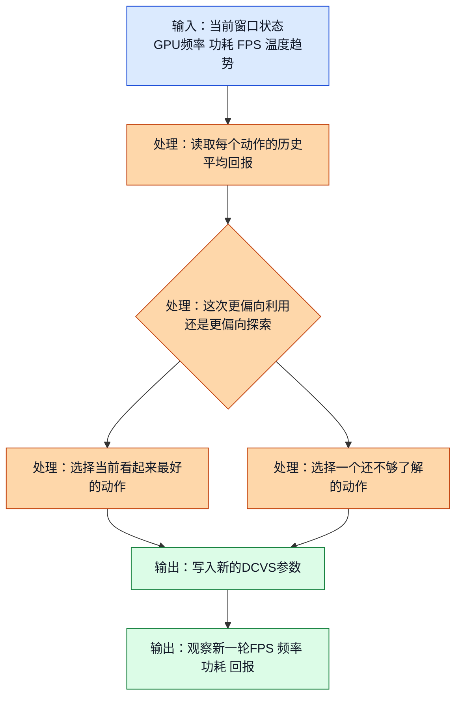
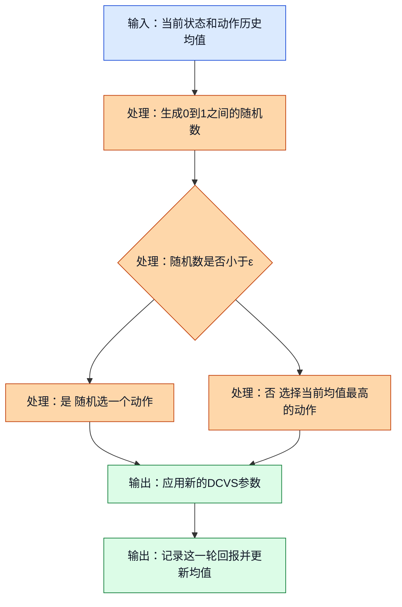
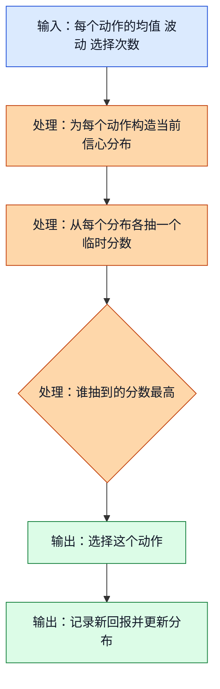
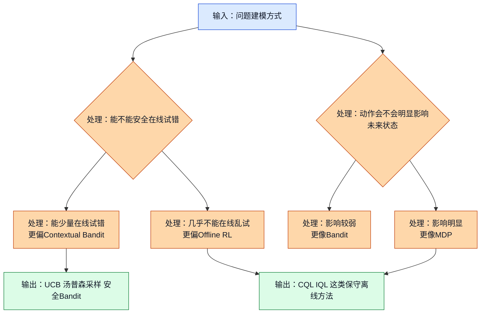

# 03. 探索与利用：为什么 GPU DCVS 不能只盯着眼前最好的动作

## 前置阅读

- 无。本篇可以独立阅读。
- 如果你已经按课程顺序学习到这里，先读前两篇会更顺，但不是硬性要求。

## 这篇要解决什么问题

想象你现在是一个做 GPU 动态电压频率调节（Dynamic Clock and Voltage Scaling, DCVS）的调参工程师。系统每隔几秒就要看一次当前状态，比如：

- 当前 GPU 频率是不是已经逼近 `282-710 MHz` 区间的高位
- 当前帧率是不是还稳在 `59-60 FPS`
- 当前功耗是不是已经接近 `8000 mW`
- 当前 `192` 个离散动作，也就是 `6 × 4 × 4 × 2` 个组合里，哪一个更值得选

这时候你会立刻碰到一个很现实的问题：

- 如果你永远只选“目前看起来最好的动作”，你可能会卡在一个还不错但并不是最优的参数组合上。
- 如果你老是去试新动作，用户就可能看到掉帧、发热、功耗波动。

这就是探索与利用（Exploration vs Exploitation）的核心矛盾。

---

## 1. 探索与利用到底在争什么

### 1.1 直觉类比

把 192 个 DCVS 动作想成 192 家饭店。

- 利用：你每次都去你最熟的那家，因为它大概率不会踩雷。
- 探索：你偶尔试试新店，因为也许有一家更便宜、出餐更快、味道更稳。

放到 GPU DCVS 里也是一样：

- 利用就是优先选“现在平均回报最高”的参数组合。
- 探索就是愿意拿出少量决策窗口，去试试还不够了解的动作。

### 1.2 正式定义

如果动作 $a$ 已经被试过 $N(a)$ 次，它的平均回报可以写成：

$$
\hat{\mu}(a) = \frac{1}{N(a)} \sum_{i=1}^{N(a)} r_i(a)
$$

其中：

- $\hat{\mu}(a)$：动作 $a$ 目前的平均回报估计
- $r_i(a)$：第 $i$ 次选择这个动作时拿到的回报

纯利用的做法是：

$$
a_t = \arg\max_a \hat{\mu}(a)
$$

也就是第 $t$ 次决策时，总是选当前平均回报最高的动作。

为了衡量“选错动作”到底有多亏，我们常用遗憾（Regret）这个量：

$$
\text{Regret}_t = r(a^\*) - r(a_t)
$$

这里的 $a^\*$ 表示真正最优的动作，$a_t$ 表示你这一轮实际选的动作。

> **补充知识：平均值和遗憾到底是什么？**
>
> 平均值就是“把你已经拿到的所有分数加起来，再除以试过的次数”。它不是绝对真相，只是你当前最朴素的判断。
>
> 遗憾可以理解成“这一把本来能多拿多少分”。如果最优动作能拿 28 分，而你这一轮只拿了 22 分，那这一轮的遗憾就是 6 分。长期把每一轮的遗憾加起来，你就能知道自己为错误决策付出了多大代价。

这张图展示了探索与利用在 DCVS 决策里的最基本逻辑。



图里的关键点是：DCVS 不是“一次性选完参数就结束”，而是每个决策窗口都要重新做判断，所以探索和利用不是二选一，而是长期反复拉扯。

### 1.3 DCVS 实际数值计算示例

下面我们先用项目里常见的 reward 结构做一个完整例子。为了让数字能跟着手算，我先固定一条简单的回报公式：

$$
\text{reward} = \text{fps\_component} + \text{freq\_component} + \text{power\_component}
$$

其中：

$$
\text{fps\_component} =
\begin{cases}
-10 \times (57 - \text{fps}), & \text{fps} < 57 \\
-2 \times (59 - \text{fps}), & 57 \le \text{fps} < 59 \\
20, & \text{fps} \ge 59
\end{cases}
$$

$$
\text{freq\_component} = \frac{900 - \text{gpu\_freq\_mhz}}{80}
$$

$$
\text{power\_component} = \frac{6000 - \text{power\_mw}}{400}
$$

现在假设我们在 192 个动作里挑了 3 个代表性动作来观察，它们对应的结果如下：

| 动作 | 观测到的平均 GPU 频率 | 平均 FPS | 平均功耗 | 说明 |
| --- | --- | --- | --- | --- |
| 动作 A | `710 MHz` | `60.0` | `6200 mW` | 很激进，性能稳，但功耗偏高 |
| 动作 B | `587 MHz` | `59.4` | `4500 mW` | 帧率达标，频率和功耗都更平衡 |
| 动作 C | `430 MHz` | `58.2` | `3200 mW` | 非常省电，但已经有轻微掉帧 |

先算动作 A：

1. 因为 `60.0 >= 59`，所以

$$
\text{fps\_component}_A = 20
$$

2. 频率项：

$$
\text{freq\_component}_A = \frac{900 - 710}{80} = \frac{190}{80} = 2.375
$$

3. 功耗项：

$$
\text{power\_component}_A = \frac{6000 - 6200}{400} = \frac{-200}{400} = -0.5
$$

4. 总回报：

$$
\text{reward}_A = 20 + 2.375 - 0.5 = 21.875
$$

再算动作 B：

1. 因为 `59.4 >= 59`，所以

$$
\text{fps\_component}_B = 20
$$

2. 频率项：

$$
\text{freq\_component}_B = \frac{900 - 587}{80} = \frac{313}{80} = 3.9125
$$

3. 功耗项：

$$
\text{power\_component}_B = \frac{6000 - 4500}{400} = \frac{1500}{400} = 3.75
$$

4. 总回报：

$$
\text{reward}_B = 20 + 3.9125 + 3.75 = 27.6625
$$

最后算动作 C：

1. 因为 `58.2` 落在 `57-59` 之间，所以

$$
\text{fps\_component}_C = -2 \times (59 - 58.2) = -2 \times 0.8 = -1.6
$$

2. 频率项：

$$
\text{freq\_component}_C = \frac{900 - 430}{80} = \frac{470}{80} = 5.875
$$

3. 功耗项：

$$
\text{power\_component}_C = \frac{6000 - 3200}{400} = \frac{2800}{400} = 7
$$

4. 总回报：

$$
\text{reward}_C = -1.6 + 5.875 + 7 = 11.275
$$

所以现在 3 个动作的回报排序是：

$$
\text{reward}_B = 27.6625 > \text{reward}_A = 21.875 > \text{reward}_C = 11.275
$$

如果真正最优的是动作 B，但你因为不愿意探索，连续 3 个窗口都选了动作 A，外加 1 个窗口误选了动作 C，那么累计遗憾就是：

1. 动作 A 的单轮遗憾：

$$
27.6625 - 21.875 = 5.7875
$$

2. 连续 3 轮都选 A：

$$
3 \times 5.7875 = 17.3625
$$

3. 动作 C 的单轮遗憾：

$$
27.6625 - 11.275 = 16.3875
$$

4. 4 轮总遗憾：

$$
17.3625 + 16.3875 = 33.75
$$

这个 `33.75` 就是“你因为没有及时摸清哪个动作更好，总共少拿了多少分”。

---

## 2. 最简单的探索策略：ε-贪心（epsilon-greedy）

### 2.1 直觉类比

你平时点外卖，如果 90% 的时候都点最熟悉的那家，10% 的时候试试新店，这就是一个很典型的 ε-贪心思路。

放到 DCVS 里就是：

- 大部分时间选当前平均回报最高的动作
- 小部分时间随机试一试别的动作

### 2.2 正式定义

设探索概率是 $\varepsilon$，那么：

$$
a_t =
\begin{cases}
\arg\max_a \hat{\mu}(a), & \text{以 } 1-\varepsilon \text{ 的概率} \\
\text{从动作集合里均匀随机抽一个动作}, & \text{以 } \varepsilon \text{ 的概率}
\end{cases}
$$

如果动作总数是 $|\mathcal{A}| = 192$，那么在“随机探索”分支里，每个动作被抽中的概率都是：

$$
\frac{1}{192}
$$

所以任意一个指定动作在单轮里被选中的总概率是：

$$
P(\text{某动作被探索到}) = \varepsilon \times \frac{1}{192}
$$

这张图展示了 ε-贪心在每次 DCVS 决策窗口里的执行流程。



图里的关键点是：ε-贪心非常容易实现，但它的探索质量不高，因为它并不知道“哪些动作值得优先试”，只是简单随机。

### 2.3 DCVS 实际数值计算示例

现在假设：

- 动作空间大小是 `192`
- 每个决策窗口长度是 `5 秒`
- 探索概率 $\varepsilon = 0.1$

我们来算一个“随机探索到底有多慢”的例子。

先算某一个指定动作在单轮中被随机探索到的概率：

$$
P = 0.1 \times \frac{1}{192} = \frac{0.1}{192} = 0.0005208333
$$

也就是说，单轮里命中某个特定动作的概率只有大约 `0.052%`。

期望要多少轮，才能碰到这个动作 1 次？用“平均等待轮数 = 概率的倒数”来近似：

$$
\text{期望轮数} \approx \frac{1}{0.0005208333} = 1920
$$

如果每轮 `5 秒`，那么期望等待时间是：

$$
1920 \times 5 = 9600 \text{ 秒}
$$

继续换算：

$$
9600 \div 60 = 160 \text{ 分钟}
$$

也就是大约：

$$
160 \div 60 \approx 2.67 \text{ 小时}
$$

这意味着：在 192 个动作上做“全空间均匀随机探索”，效率非常差。

再算一下“当前最优动作”被选中的概率。如果当前最好的是动作 B，那么它在单轮里被选中的概率是：

$$
P(\text{选中B}) = 0.9 + 0.1 \times \frac{1}{192}
$$

$$
= 0.9 + 0.0005208333 = 0.9005208333
$$

也就是说，动作 B 在每轮里仍然有大约 `90.05%` 的概率被继续选中。

这说明在动作数很大时，ε-贪心会出现两个问题：

- 好动作会被反复利用
- 没试过的动作很久都轮不到

如果我们不是在全部 192 个动作里随机，而是先用离线数据把安全动作集合缩成 `8` 个，再做 $\varepsilon = 0.1$ 的探索，那么某个指定安全动作被试到的概率就是：

$$
0.1 \times \frac{1}{8} = 0.0125
$$

对应的期望等待轮数：

$$
\frac{1}{0.0125} = 80
$$

对应时间：

$$
80 \times 5 = 400 \text{ 秒} = 6 \text{ 分 } 40 \text{ 秒}
$$

这个数字一下就现实多了。所以在 GPU DCVS 里，ε-贪心通常要配合“安全动作子集”一起用，否则 192 个动作会把探索摊得太薄。

---

## 3. 更会算账的探索：上置信界（Upper Confidence Bound, UCB）

### 3.1 直觉类比

假设你在看外卖评分：

- 店 A 平均 4.8 分，但已经有 2000 个评价
- 店 B 平均 4.7 分，只有 8 个评价

你心里会觉得：店 A 很稳，但店 B 还没被充分了解，可能是真强，也可能只是样本少。

UCB 的思路就是：除了看平均分，还给“样本少的动作”一个探索加成。

### 3.2 正式定义

UCB 最经典的形式是：

$$
\text{UCB}_t(a) = \hat{\mu}_t(a) + c \sqrt{\frac{\ln t}{N_t(a)}}
$$

然后每一轮选择：

$$
a_t = \arg\max_a \text{UCB}_t(a)
$$

这里：

- $\hat{\mu}_t(a)$：动作 $a$ 目前的平均回报
- $N_t(a)$：到第 $t$ 轮为止，这个动作被选过多少次
- $t$：总共做了多少轮决策
- $c$：探索强度，越大就越愿意给“没试够的动作”机会

> **补充知识：为什么公式里会出现对数和平方根？**
>
> 你不需要把这个公式背成数学定理，可以先抓住直觉：当总轮数 $t$ 变大时，我们整体会越来越有信心，所以探索奖励不会一直线性增长，只会缓慢增长，这就是对数 $\ln t$ 在干的事。
>
> 再看分母里的 $N_t(a)$。一个动作被试得越多，我们对它越熟，所以探索奖励应该变小。用平方根可以让“奖励缩小得没那么猛”，这样早期还能多给一些不确定动作机会，后期又能自然收敛回利用。

这张图展示了 UCB 是怎么把“平均回报”和“不确定性奖励”合在一起的。

```mermaid
flowchart TD
    A[输入：每个动作的历史回报和选择次数] --> B[处理：计算每个动作的平均回报]
    B --> C[处理：计算探索加成<br/>c乘根号下ln(t)除以N(a)]
    C --> D[处理：平均回报加探索加成]
    D --> E{处理：谁的总分最高}
    E --> F[输出：选择这个动作]
    F --> G[输出：更新该动作的次数和均值]

    classDef input fill:#dbeafe,stroke:#1d4ed8,color:#111827;
    classDef process fill:#fed7aa,stroke:#c2410c,color:#111827;
    classDef output fill:#dcfce7,stroke:#15803d,color:#111827;
    class A input;
    class B,C,D,E process;
    class F,G output;
```

图里的关键点是：UCB 不是“瞎试”，而是优先去试那些“看起来可能有潜力，但还没被试够”的动作。

### 3.3 DCVS 实际数值计算示例

现在假设已经做了 `20` 个决策窗口，也就是：

$$
t = 20
$$

我们只看 3 个代表性动作：

| 动作 | 已观测回报 | 选择次数 |
| --- | --- | --- |
| 动作 A | `21.875` 连续出现 10 次 | `N(A)=10` |
| 动作 B | `20.8, 22.4` | `N(B)=2` |
| 动作 C | `10.9, 12.1, 11.0, 11.7, 11.3, 11.0, 10.9` | `N(C)=7` |

取探索系数：

$$
c = 2
$$

先算动作 B 的平均回报：

$$
\hat{\mu}(B) = \frac{20.8 + 22.4}{2} = \frac{43.2}{2} = 21.6
$$

再算动作 C 的平均回报：

$$
\hat{\mu}(C) = \frac{10.9 + 12.1 + 11.0 + 11.7 + 11.3 + 11.0 + 10.9}{7}
$$

先把分子加起来：

$$
10.9 + 12.1 = 23.0
$$

$$
23.0 + 11.0 = 34.0
$$

$$
34.0 + 11.7 = 45.7
$$

$$
45.7 + 11.3 = 57.0
$$

$$
57.0 + 11.0 = 68.0
$$

$$
68.0 + 10.9 = 78.9
$$

所以：

$$
\hat{\mu}(C) = \frac{78.9}{7} \approx 11.2714
$$

动作 A 的均值我们直接用前面算好的：

$$
\hat{\mu}(A) = 21.875
$$

现在统一算探索加成。先算：

$$
\ln 20 \approx 2.9957
$$

动作 A 的探索加成：

$$
2 \sqrt{\frac{2.9957}{10}} = 2 \sqrt{0.29957}
$$

$$
\sqrt{0.29957} \approx 0.5473
$$

$$
2 \times 0.5473 = 1.0946
$$

所以：

$$
\text{UCB}(A) = 21.875 + 1.0946 = 22.9696
$$

动作 B 的探索加成：

$$
2 \sqrt{\frac{2.9957}{2}} = 2 \sqrt{1.49785}
$$

$$
\sqrt{1.49785} \approx 1.2239
$$

$$
2 \times 1.2239 = 2.4478
$$

所以：

$$
\text{UCB}(B) = 21.6 + 2.4478 = 24.0478
$$

动作 C 的探索加成：

$$
2 \sqrt{\frac{2.9957}{7}} = 2 \sqrt{0.42796}
$$

$$
\sqrt{0.42796} \approx 0.6542
$$

$$
2 \times 0.6542 = 1.3084
$$

所以：

$$
\text{UCB}(C) = 11.2714 + 1.3084 = 12.5798
$$

最后 3 个动作的 UCB 分数是：

$$
\text{UCB}(B) = 24.0478 > \text{UCB}(A) = 22.9696 > \text{UCB}(C) = 12.5798
$$

注意这里最关键的一点：

- 动作 B 的当前平均回报 `21.6` 其实还低于动作 A 的 `21.875`
- 但因为动作 B 只试过 `2` 次，不确定性更大，所以 UCB 还是愿意再给它一次机会

这正是 UCB 的价值：它不是平均分最低就放弃，也不是平均分最高就死抱着不放。

---

## 4. 概率化探索：汤普森采样（Thompson Sampling）

### 4.1 直觉类比

如果说 UCB 是给每个动作加一个“保底探索奖励”，那汤普森采样更像是：

- 先给每个动作画一个“我目前对它的信心分布”
- 每轮从这个分布里各抽一个分数
- 谁这轮抽得最高，就选谁

它的味道有点像“带概率的试镜”。样本少但潜力大的动作，会因为不确定性更大，偶尔抽到特别高的分，于是获得探索机会。

### 4.2 正式定义

为了让公式尽量直观，我们用一个简化版写法。假设每个动作的“真实平均回报”还不确定，但我们当前相信它大概服从一个正态分布（Normal Distribution）：

$$
\tilde{q}(a) \sim \mathcal{N}\left(\hat{\mu}(a), \frac{s_a^2}{N(a)+1}\right)
$$

然后在第 $t$ 轮：

$$
a_t = \arg\max_a \tilde{q}(a)
$$

这里：

- $\hat{\mu}(a)$：动作 $a$ 当前的均值估计
- $s_a$：这个动作历史回报的波动大小
- $N(a)$：这个动作已经被试过多少次
- $\tilde{q}(a)$：这轮“随机抽出来的一个临时分数”

> **补充知识：什么叫“从分布里抽一个样本”？**
>
> 你可以把一个分布理解成“这个动作未来可能拿到哪些分，哪些更常见”。比如均值是 24 分、波动也比较大，意思就是它大多数时候会落在 24 分附近，但也可能偶尔更高、偶尔更低。
>
> “抽样”不是乱写一个数字，而是按这团不确定性的形状去拿一个可能值。样本多的动作，分布会收得更窄；样本少的动作，分布会更宽，所以更容易在某一轮抽到一个很高的值，从而得到探索机会。

这张图展示了汤普森采样在一轮 DCVS 决策里具体做了什么。



图里的关键点是：汤普森采样不是硬塞一个固定探索奖励，而是把“不确定性”直接放进随机抽样里。样本少的动作，不需要你手动加 bonus，也会自然获得更多试错机会。

### 4.3 DCVS 实际数值计算示例

还是看 3 个动作，假设当前统计如下：

| 动作 | 均值估计 $\hat{\mu}$ | 历史波动 $s$ | 已选择次数 $N$ |
| --- | --- | --- | --- |
| 动作 A | `21.9` | `1.2` | `9` |
| 动作 B | `24.2` | `4.5` | `2` |
| 动作 C | `11.3` | `2.0` | `6` |

我们先把每个动作这一轮的“抽样标准差”算出来。公式是：

$$
\sigma_{\text{sample}}(a) = \frac{s_a}{\sqrt{N(a)+1}}
$$

先算动作 A：

$$
\sigma_{\text{sample}}(A) = \frac{1.2}{\sqrt{9+1}} = \frac{1.2}{\sqrt{10}}
$$

$$
\sqrt{10} \approx 3.1623
$$

$$
\sigma_{\text{sample}}(A) \approx \frac{1.2}{3.1623} \approx 0.3795
$$

再算动作 B：

$$
\sigma_{\text{sample}}(B) = \frac{4.5}{\sqrt{2+1}} = \frac{4.5}{\sqrt{3}}
$$

$$
\sqrt{3} \approx 1.7321
$$

$$
\sigma_{\text{sample}}(B) \approx \frac{4.5}{1.7321} \approx 2.5981
$$

再算动作 C：

$$
\sigma_{\text{sample}}(C) = \frac{2.0}{\sqrt{6+1}} = \frac{2.0}{\sqrt{7}}
$$

$$
\sqrt{7} \approx 2.6458
$$

$$
\sigma_{\text{sample}}(C) \approx \frac{2.0}{2.6458} \approx 0.7559
$$

现在假设这一轮随机抽到的标准正态系数分别是：

- 动作 A：$z_A = -0.4$
- 动作 B：$z_B = 0.6$
- 动作 C：$z_C = 0.3$

那么每个动作这轮的临时分数就是：

$$
\tilde{q}(a) = \hat{\mu}(a) + z_a \cdot \sigma_{\text{sample}}(a)
$$

动作 A：

$$
\tilde{q}(A) = 21.9 + (-0.4) \times 0.3795
$$

$$
= 21.9 - 0.1518 = 21.7482
$$

动作 B：

$$
\tilde{q}(B) = 24.2 + 0.6 \times 2.5981
$$

$$
= 24.2 + 1.5589 = 25.7589
$$

动作 C：

$$
\tilde{q}(C) = 11.3 + 0.3 \times 0.7559
$$

$$
= 11.3 + 0.2268 = 11.5268
$$

所以这一轮的抽样结果是：

$$
\tilde{q}(B) = 25.7589 > \tilde{q}(A) = 21.7482 > \tilde{q}(C) = 11.5268
$$

因此这一轮会选择动作 B。

这个例子里最值得注意的是：动作 B 的均值已经不低，而且它的样本还少、波动更大，所以它更容易在某些轮次里抽到一个特别亮眼的分数，这样探索就会自然发生。

---

## 5. 为什么三份源材料会给出不一样的建议

很多初学者看到这里会困惑：

- 一份分析更看好保守 Q 学习（Conservative Q-Learning, CQL）和隐式 Q 学习（Implicit Q-Learning, IQL）
- 另一份分析更倾向上下文赌博机（Contextual Bandit）或安全上下文赌博机（Safe Contextual Bandit）

它们到底谁对？

答案是：它们大多都没错，只是各自默认的问题建模不同。

### 5.1 直觉类比

同样是“调 DCVS”，可以有两种看法：

1. 你把它看成“当前这一窗该怎么选”
   这更像上下文赌博机。重点是当前状态、当前动作、当前回报。

2. 你把它看成“这次动作会不会影响后面几窗，甚至 1 分钟后的热状态和频率天花板”
   这更像马尔可夫决策过程（Markov Decision Process, MDP）。重点是状态转移和长期后果。

### 5.2 正式定义

如果你把问题看成 bandit，更接近下面这种思路：

$$
r_t = f(x_t, a_t)
$$

也就是：给定当前上下文 $x_t$ 和动作 $a_t$，主要关心当前回报。

如果你把问题看成 MDP，就要关心：

$$
p(s_{t+1} \mid s_t, a_t)
$$

也就是：当前动作会不会改变下一步状态分布。

在 GPU DCVS 里，这个区别很关键。因为下面这些因素都可能让“当前动作影响未来”：

- 热积累
- governor 惯性
- 游戏场景切换
- 电源和温控约束

这张图展示了三份源材料为什么会从不同假设出发，最后得出不同推荐。



图里的关键路径是两条：

- 如果你强调“运行时自适应，而且允许在安全护栏下试少量动作”，那就更容易走向 Contextual Bandit、UCB、汤普森采样。
- 如果你强调“当前离线数据只有大约 `30/192 = 15.6%` 的动作覆盖率，而且线上不能随便乱试”，那就更容易走向 CQL、IQL 这种保守的离线强化学习（Offline Reinforcement Learning, Offline RL）。

### 5.3 把分歧翻译成人话

三份源材料的差别，核心不是“谁懂、谁不懂”，而是下面几个默认前提不一样：

| 关键问题 | 如果你的答案更偏左边 | 更可能推荐 | 如果你的答案更偏右边 | 更可能推荐 |
| --- | --- | --- | --- | --- |
| 现在能不能在线试动作？ | 能，但必须很安全 | Contextual Bandit / UCB / Thompson Sampling | 不能，线上试错代价太高 | CQL / IQL |
| 当前动作会不会明显影响后面几窗？ | 影响中等或较弱 | Bandit 更容易先落地 | 影响很强 | MDP / Offline RL 更有说服力 |
| 离线数据覆盖够不够？ | 覆盖还行，能筛出安全子集 | 先做安全探索 | 覆盖很差，只采到少数动作 | 先做保守离线学习 |
| 当前动作空间是什么样？ | 192 个离散动作，适合选一档 | Bandit 很自然 | 未来想做更连续的控制 | Offline RL 或连续控制方法更自然 |

你可以把这件事简单记成一句话：

> **如果探索要在线发生，就要非常重视安全探索；如果探索根本不能在线发生，就必须把“探索”尽量前移到离线数据分析和保守建模阶段。**

### 5.4 DCVS 实际数值计算示例：为什么“眼前两窗很爽”不等于长期更优

现在我们专门算一个“Bandit 视角”和“MDP 视角”为什么会给出不同判断的例子。

假设每个决策窗口是 `5 秒`，我们连续看 `6` 个窗口，也就是总共 `30 秒`。

有两个候选动作：

- 动作 H：偏激进，容易把 GPU 顶到 `710 MHz`
- 动作 B：更平衡，平均落在 `587 MHz`

先看动作 H。在前 `2` 个窗口里，它的表现还不错：

- FPS = `60.0`
- GPU 频率 = `710 MHz`
- 功耗 = `7000 mW`

先算前两窗的单窗回报。

1. FPS 项：

$$
\text{fps\_component}_{H,\text{early}} = 20
$$

2. 频率项：

$$
\text{freq\_component}_{H,\text{early}} = \frac{900 - 710}{80} = 2.375
$$

3. 功耗项：

$$
\text{power\_component}_{H,\text{early}} = \frac{6000 - 7000}{400} = \frac{-1000}{400} = -2.5
$$

4. 单窗总回报：

$$
\text{reward}_{H,\text{early}} = 20 + 2.375 - 2.5 = 19.875
$$

但是因为这个动作更激进，假设到第 `3-6` 个窗口时，热积累和功耗压力开始反噬，观测变成：

- FPS = `56.6`
- GPU 频率仍然常在 `710 MHz`
- 功耗升到 `7600 mW`

现在算后四窗的单窗回报。

1. FPS 项：

$$
\text{fps\_component}_{H,\text{late}} = -10 \times (57 - 56.6)
$$

$$
= -10 \times 0.4 = -4
$$

2. 频率项不变：

$$
\text{freq\_component}_{H,\text{late}} = \frac{900 - 710}{80} = 2.375
$$

3. 功耗项：

$$
\text{power\_component}_{H,\text{late}} = \frac{6000 - 7600}{400} = \frac{-1600}{400} = -4
$$

4. 单窗总回报：

$$
\text{reward}_{H,\text{late}} = -4 + 2.375 - 4 = -5.625
$$

所以动作 H 在 `6` 个窗口上的累计回报是：

$$
2 \times 19.875 + 4 \times (-5.625)
$$

$$
= 39.75 - 22.5 = 17.25
$$

平均到每窗：

$$
17.25 \div 6 = 2.875
$$

再看平衡动作 B。假设它在 6 个窗口里都维持住了前面算过的状态：

- FPS = `59.4`
- GPU 频率 = `587 MHz`
- 功耗 = `4500 mW`

它的单窗回报前面已经算过：

$$
\text{reward}_B = 27.6625
$$

所以 `6` 个窗口的累计回报是：

$$
6 \times 27.6625 = 165.975
$$

平均到每窗还是：

$$
165.975 \div 6 = 27.6625
$$

现在你就能看出分歧来自哪里了：

- 如果你只看前 `1-2` 个窗口，动作 H 好像并不差，甚至会让人误以为“高频更稳”
- 但如果你把热积累也算进去，动作 H 的长期表现远差于动作 B

这就是为什么：

- 更偏“当前一窗回报”的人，会更自然想到 Bandit
- 更偏“动作会改变后续状态”的人，会更自然想到 MDP、CQL、IQL 这种长期方法

不是谁错了，而是他们盯着的问题时间尺度不一样。

---

## 6. 在 GPU DCVS 里，探索与利用应该怎么落地

如果你是工程上第一次做这个系统，一个很务实的落地顺序通常是：

1. 先用离线日志把 192 个动作缩成一个更小的安全动作集合。
2. 在线阶段不要在全空间随机乱试，而是在安全集合里做少量探索。
3. 如果你发现热积累和场景切换对未来影响非常强，再把问题往 MDP 和 Offline RL 那边升级。

这其实也解释了为什么源材料里会同时出现：

- ε-贪心、UCB、汤普森采样
- Contextual Bandit
- CQL、IQL

它们不是互相否定，而是在回答不同阶段的同一个问题：

- 在线怎么探索？
- 离线怎么减少乱试？
- 什么情况下“当前最优”不等于“长期最优”？

---

## 关键收获

- 探索与利用的矛盾，本质上是“要不要为未来信息付出当前代价”。
- 在 GPU DCVS 里，纯利用很容易卡在局部最优，纯探索又会带来掉帧、功耗和热风险。
- ε-贪心最简单，但在 `192` 个离散动作上做全空间随机探索会非常慢；在 `5 秒` 决策窗、$\varepsilon=0.1$ 的情况下，试到一个指定动作平均要等大约 `160 分钟`。
- UCB 会给“样本少但可能有潜力”的动作一个明确的探索奖励，比纯随机更会算账。
- 汤普森采样把不确定性直接放进抽样过程里，探索会更自然，也更容易根据数据分布自己调整强度。
- 三份源材料之所以给出不同建议，不是互相矛盾，而是对问题建模的默认前提不同：是更像 Bandit，还是更像 MDP；探索应该在线发生，还是尽量离线完成。
- 对当前这个 GPU DCVS 场景，一个常见的务实路线是：先靠离线数据缩小安全动作集合，再在小集合里做安全探索，而不是直接在 192 个动作上全空间乱试。
