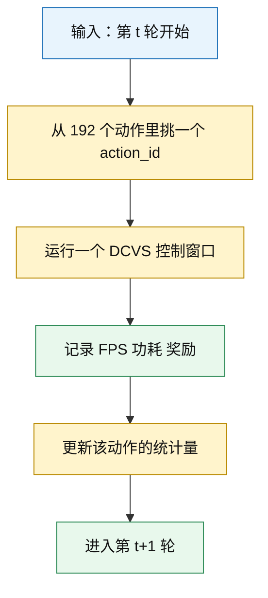
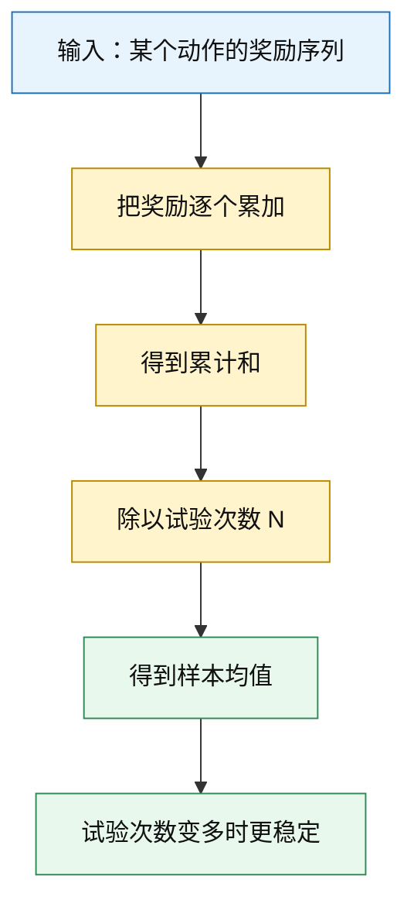
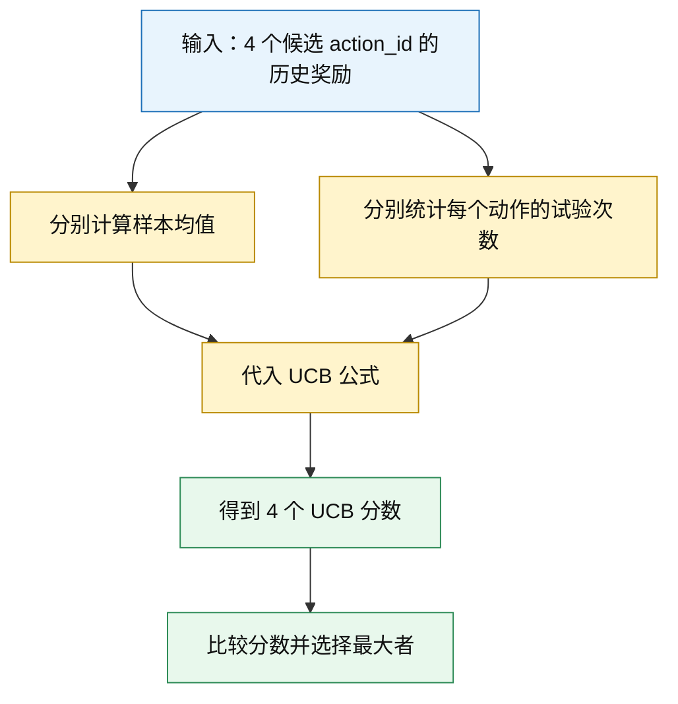
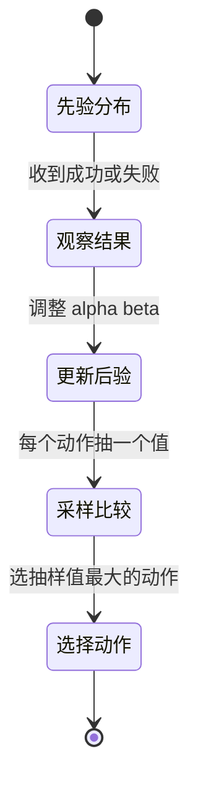
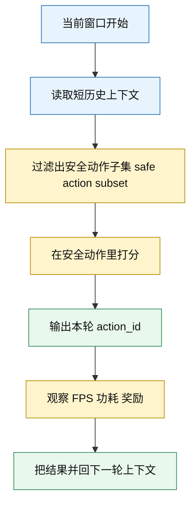

# 04｜多臂老虎机：先学最简单的在线决策框架

## 前置阅读

- 建议先读 `03_Exploration_vs_Exploitation.md`，先把“探索”和“利用”为什么会打架这件事想明白。
- 这篇会从赌场老虎机一路讲到 GPU DCVS，所以就算你是第一次接触强化学习，也能直接跟上。
- 读的时候请一直记住这个工程背景：这里不是 2 个动作、4 个动作，而是 `6×4×4×2 = 192` 个离散动作，
  GPU 频率大致落在 `282-710 MHz`，目标 FPS 常常卡在 `59-60`，功耗观测范围常见为 `0-8000 mW`。

## 1. 先把画面感立住：赌场老虎机为什么像 DCVS 的 192 个动作

想象你走进赌场，面前摆着一整排老虎机。每一台都可能赢钱，但你不知道哪台最值。
你能做的只有一件事：拉一下，记住结果，再决定下一次拉谁。

把这个画面搬到 GPU DCVS 上，几乎是一模一样的：

- 拉一次摇杆，等价于给下一个控制窗口选一个 `action_id`；
- 这一轮拿到的输赢，等价于这一小段时间的奖励；
- 奖励高，说明这个动作在“稳帧 + 省电”这件事上更划算；
- 奖励低，说明它可能掉帧，也可能费电，或者两头都不占。

所以，**多臂老虎机（Multi-Armed Bandit）**可以先粗暴地理解成：
“面对很多动作，但每次只能试一个；试完以后立刻看回报；边试边学。”

### ① 直觉类比

把自己想成一个值班调参工程师。系统每隔一个控制窗口就来问你一次：

- 继续用刚才那个稳妥动作？
- 还是试试另一个可能更省电的动作？

如果你从头到尾只敢选当前最稳的动作，你会很保守，但可能永远学不到更好的配置。
如果你每次都大胆乱试，你学得快，但玩家可能先被你试到卡顿。

Bandit 研究的，就是这种“边挣钱边试错”的平衡术。

### ② 正式定义

在最基础的 Bandit 设定里，我们先不管复杂状态，只关心“选哪个动作”和“立刻拿到多少奖励”。

- 第 $t$ 轮选择的动作记成 $a_t$；
- 这一轮立刻拿到的分数，叫**即时奖励（Immediate Reward）**，记成 $r_t$；
- 前 $T$ 轮加起来的分数，叫**总奖励（Total Reward）**；
- 如果你没选到当时最值的动作，就会产生**累积遗憾（Cumulative Regret）**。

$$
a_t \in \{1,2,\dots,K\}
$$

$$
\mu_a = \mathbb{E}[r \mid a]
$$

$$
r_t = r(a_t)
$$

$$
G_T = \sum_{t=1}^{T} r_t
$$

$$
R_T = \sum_{t=1}^{T} (\mu^* - \mu_{a_t}), \quad \mu^* = \max_a \mu_a
$$

上面这几行别被符号吓到。它们其实只是在说：

- 每个动作背后都有一个你看不见的长期平均水平 $\mu_a$；
- 你每次拿到的 $r_t$ 会有波动；
- 你希望总奖励越大越好，同时遗憾越小越好。

### ③ 公式推导 + Mermaid 图

这张图展示了什么：下面这张图把 plain bandit 的最小闭环画出来了。
你会看到它只做 5 件事：选动作、跑窗口、记结果、更新统计、继续下一轮。

图里的关键路径/要点：plain bandit 只盯“这次选什么，立刻拿到什么”。
它没有显式建模长时序状态转移，所以实现简单、部署轻，但也会丢掉一部分历史信息。

### ④ DCVS 实际数值计算示例

先用一个很朴素、但足够好懂的**奖励函数（Reward Function）**算一遍。
假设一个控制窗口结束后，我们用下面这套规则打分：

$$
r_{\text{base}} = \frac{\min(\text{FPS}, 60)}{60} - 0.25 \cdot \frac{\text{功耗}}{8000}
$$

$$
r =
\begin{cases}
r_{\text{base}}, & \text{如果 FPS} \ge 59 \\
r_{\text{base}} - 0.15, & \text{如果 FPS} < 59
\end{cases}
$$

这套规则的意思很直接：

- FPS 越接近 `60` 越好；
- 功耗越低越好；
- 但只要掉到 `59` 以下，就额外扣一笔分，因为玩家已经会明显感觉到卡。

下面先看 4 个候选动作：

| action_id | GPU 频率 | 观测 FPS | 功耗 | 直觉解释 |
|---|---:|---:|---:|---|
| action_id 12 | `500 MHz` | `60` | `5000 mW` | 很稳，但偏费电 |
| action_id 72 | `545 MHz` | `60` | `4200 mW` | 稳定，而且更省 |
| action_id 109 | `430 MHz` | `59` | `3600 mW` | 勉强达标，省电更明显 |
| action_id 155 | `355 MHz` | `58` | `3100 mW` | 最省电，但已经掉帧 |

**action_id 12：**

$$
\frac{\min(60,60)}{60} = \frac{60}{60} = 1
$$

$$
0.25 \cdot \frac{5000}{8000} = 0.25 \cdot 0.625 = 0.15625
$$

$$
r_{12} = 1 - 0.15625 = 0.84375
$$

**action_id 72：**

$$
\frac{\min(60,60)}{60} = 1
$$

$$
0.25 \cdot \frac{4200}{8000} = 0.25 \cdot 0.525 = 0.13125
$$

$$
r_{72} = 1 - 0.13125 = 0.86875
$$

**action_id 109：**

$$
\frac{\min(59,60)}{60} = \frac{59}{60} = 0.9833333
$$

$$
0.25 \cdot \frac{3600}{8000} = 0.25 \cdot 0.45 = 0.1125
$$

$$
r_{109} = 0.9833333 - 0.1125 = 0.8708333
$$

因为它刚好还在 `59-60` 目标带里，所以这里不触发额外扣分。

**action_id 155：**

$$
\frac{\min(58,60)}{60} = \frac{58}{60} = 0.9666667
$$

$$
0.25 \cdot \frac{3100}{8000} = 0.25 \cdot 0.3875 = 0.096875
$$

$$
r_{\text{base},155} = 0.9666667 - 0.096875 = 0.8697917
$$

$$
r_{155} = 0.8697917 - 0.15 = 0.7197917
$$

这一轮按奖励从高到低排，就是：

1. action_id 109：$0.8708333$
2. action_id 72：$0.86875$
3. action_id 12：$0.84375$
4. action_id 155：$0.7197917$

这个例子特别重要，因为它说明了一件事：Bandit 学的不是“绝对最强动作”，
而是“在当前奖励定义下最划算的动作”。

## 2. 样本均值为什么有用：少看一轮会被骗，多看几轮会更稳

### ① 直觉类比

想象你在食堂试 4 个窗口的番茄鸡蛋面。第一口可能咸了，第二口可能刚好，第三口又有点淡。
单独看某一口，你很容易误判；多吃几口以后，你才会慢慢知道哪个窗口平均最靠谱。

Bandit 里也是一样。某个动作这一次拿高分，不代表它真的长期最好。
所以我们通常会先记它的平均表现，而不是只看某一次的好运气。

### ② 正式定义

一个动作被试了 $N_a$ 次之后，它的**样本均值（Sample Mean）**记成：

$$
\hat{\mu}_a = \frac{1}{N_a} \sum_{i=1}^{N_a} r_{a,i}
$$

这里的意思非常朴素：

- 先把这个动作历史上拿到的奖励全部加起来；
- 再除以它被试过的次数；
- 得到一个“目前看来它平均大概能拿多少分”的估计值。

如果一个动作被试得越来越多，样本均值通常会越来越接近真实平均奖励。
这背后最常见的支撑直觉，就是**大数定律（Law of Large Numbers）**。

> **补充知识：什么是期望和大数定律？**
>
> 期望你可以先理解成“长期平均值”。比如掷骰子时，某一把掷出 6 点不奇怪，掷出 1 点也不奇怪，
> 但掷很多很多次以后，平均点数会稳定在一个固定水平附近。
>
> 大数定律说的就是这个意思：单次结果会抖，但样本数量够多时，平均值会越来越稳。
> 所以 Bandit 喜欢记样本均值，因为它比“只看最近一轮”靠谱得多。

### ③ 公式推导 + Mermaid 图

这张图展示了什么：下面这张图把“奖励序列怎么一步步变成样本均值”画出来了。
它不是在做神秘数学，只是在做“累加再平均”。

图里的关键路径/要点：关键不是“平均”这两个字本身，
而是“平均值会随着样本数增大逐渐稳定下来”。这就是后面 UCB、Thompson Sampling 的起点。

### ④ DCVS 实际数值计算示例

假设 action_id 72 在 4 个窗口里先后拿到了下面这串奖励：

$$
[0.82,\ 0.88,\ 0.87,\ 0.91]
$$

下面按最笨、但最不容易出错的办法一步一步算：

- 第 1 次后，累计和是 $0.82$，样本均值也是 $0.82$；
- 第 2 次后，累计和变成 $0.82 + 0.88 = 1.70$；
- 第 2 次后的均值是 $1.70 \div 2 = 0.85$；
- 第 3 次后，累计和变成 $1.70 + 0.87 = 2.57$；
- 第 3 次后的均值是 $2.57 \div 3 = 0.8567$；
- 第 4 次后，累计和变成 $2.57 + 0.91 = 3.48$；
- 第 4 次后的均值是 $3.48 \div 4 = 0.87$。

所以现在我们对 action_id 72 的估计就是：

$$
\hat{\mu}_{72} = 0.87
$$

这还不代表它“永远最好”，但至少说明：
在已经观测到的数据里，它看起来确实挺能打。

## 3. UCB 在干什么：给“还没试够”的动作一个探索奖金

### ① 直觉类比

假设你常去 4 家面馆。

- A 店你去过很多次，平均 8.4 分；
- B 店你去过很多次，平均 8.7 分；
- C 店只去过两次，但两次都挺惊艳；
- D 店去过几次，基本都一般。

如果只看平均分，你可能直接继续去 B 店。
但如果 C 店只试过两次，你心里会想：
“它会不会其实比 B 店更强，只是我还没试够？”

**上置信界（Upper Confidence Bound, UCB）**干的就是这件事：
除了看平均分，还给“样本少、不确定性大”的动作一笔探索奖金。

### ② 正式定义

一个常见的 UCB 形式写成：

$$
UCB_t(a) = \hat{\mu}_a + c\sqrt{\frac{\ln t}{N_a(t)}}
$$

然后在第 $t$ 轮选择分数最高的动作：

$$
a_t = \arg\max_a UCB_t(a)
$$

这条公式里，每一项都很好解释：

- $\hat{\mu}_a$：这个动作目前的平均表现；
- $N_a(t)$：到第 $t$ 轮为止，这个动作已经被试过多少次；
- $\ln t$：总轮数越大，探索压力会慢慢变小，但不会一下子消失；
- $c$：探索强度系数，越大越爱试新动作；
- 第二项整个根号：就是“探索奖金”。

当 $N_a(t)$ 很小时，分母小，探索奖金就大；
当一个动作已经被试过很多次，这笔奖金就会慢慢缩小。

> **补充知识：为什么这里会有平方根和对数？**
>
> 你不用先把它理解成高深推导。先记住两个方向感就够了：
> 分母里的次数越大，不确定性越小，所以奖金要下降；总轮数越大，系统还是要留一点探索空间，
> 但这个空间应该慢慢收敛，不能一直疯跑。
>
> 平方根让下降速度别太猛，对数让探索增长别太快。它们本质上是在给“谨慎探索”找一个折中节奏。

### ③ 公式推导 + Mermaid 图

这张图展示了什么：下面这张图把 UCB 的三步拆开了——先算样本均值，再算探索奖金，最后比总分。
这正好替代旧版里那种不容易在 Markdown 预览里直接看懂的柱状图。

图里的关键路径/要点：UCB 不是“均值最大就选谁”，而是“均值 + 不确定性奖金”一起看。
所以它会偶尔主动去试那些样本还不够多、但看起来可能有潜力的动作。

### ④ DCVS 实际数值计算示例

下面用 4 个候选动作做一个完整 worked example。为了让你能跟着手算，
我把历史奖励直接列出来，然后做“观测到的奖励序列 → 更新估计 → 选择下一个动作”。

先设当前总轮数是第 $13$ 轮，也就是前面已经观察了 12 次动作结果，现在要决定下一轮选谁。

4 个动作的**观测到的奖励序列**如下：

- action_id 12：$[0.84,\ 0.85,\ 0.83]$
- action_id 72：$[0.87,\ 0.86,\ 0.88,\ 0.87]$
- action_id 109：$[0.89,\ 0.85]$
- action_id 155：$[0.72,\ 0.74,\ 0.70]$

先做**更新估计**，也就是算样本均值。

**action_id 12：**

- 累计和：$0.84 + 0.85 + 0.83 = 2.52$
- 次数：$N_{12}(13) = 3$
- 均值：$\hat{\mu}_{12} = 2.52 \div 3 = 0.84$

**action_id 72：**

- 累计和：$0.87 + 0.86 + 0.88 + 0.87 = 3.48$
- 次数：$N_{72}(13) = 4$
- 均值：$\hat{\mu}_{72} = 3.48 \div 4 = 0.87$

**action_id 109：**

- 累计和：$0.89 + 0.85 = 1.74$
- 次数：$N_{109}(13) = 2$
- 均值：$\hat{\mu}_{109} = 1.74 \div 2 = 0.87$

**action_id 155：**

- 累计和：$0.72 + 0.74 + 0.70 = 2.16$
- 次数：$N_{155}(13) = 3$
- 均值：$\hat{\mu}_{155} = 2.16 \div 3 = 0.72$

接着用 $c = 0.20$，并且先把公共项算出来：

$$
\ln 13 \approx 2.5649
$$

**action_id 12 的探索奖金：**

$$
0.20 \cdot \sqrt{\frac{2.5649}{3}} = 0.20 \cdot \sqrt{0.8550} = 0.20 \cdot 0.9246 = 0.1849
$$

$$
UCB_{13}(12) = 0.84 + 0.1849 = 1.0249
$$

**action_id 72 的探索奖金：**

$$
0.20 \cdot \sqrt{\frac{2.5649}{4}} = 0.20 \cdot \sqrt{0.6412} = 0.20 \cdot 0.8008 = 0.1602
$$

$$
UCB_{13}(72) = 0.87 + 0.1602 = 1.0302
$$

**action_id 109 的探索奖金：**

$$
0.20 \cdot \sqrt{\frac{2.5649}{2}} = 0.20 \cdot \sqrt{1.2825} = 0.20 \cdot 1.1325 = 0.2265
$$

$$
UCB_{13}(109) = 0.87 + 0.2265 = 1.0965
$$

**action_id 155 的探索奖金：**

$$
0.20 \cdot \sqrt{\frac{2.5649}{3}} = 0.1849
$$

$$
UCB_{13}(155) = 0.72 + 0.1849 = 0.9049
$$

最后做**选择下一个动作**：

- action_id 12：$1.0249$
- action_id 72：$1.0302$
- action_id 109：$1.0965$
- action_id 155：$0.9049$

所以下一轮 UCB 会选 **action_id 109**。

这里最值得你体会的一点是：
action_id 72 和 action_id 109 的均值都差不多是 $0.87$，
但 109 只被试了 2 次，所以它拿到了更大的探索奖金。

## 4. Thompson Sampling 为什么很讨喜：它把“不确定”直接当成随机性来抽样

### ① 直觉类比

UCB 的思路像是在给每个动作发“探索补贴”。
而 **Thompson Sampling** 更像这样：

“我给每个动作都保留一个当前信心分布，然后每轮从各自分布里各抽一次，谁抽出来最亮眼，我就先试谁。”

这种做法很自然，因为它不是硬编码“每隔几轮必须探索一次”，
而是让不确定性自己通过随机抽样体现出来。

### ② 正式定义

为了先把直觉立住，我们先讲最容易懂的二值版本：
把每一轮结果简化成“成功 / 失败”。

这里我们定义：

- 成功：FPS 至少 `59`，而且功耗不超过 `4500 mW`；
- 失败：不满足上面任一条件。

对某个动作的成功概率 $\theta_a$，先验可以写成：

$$
\theta_a \sim \text{Beta}(\alpha_a, \beta_a)
$$

如果这个动作已经观察到 $s_a$ 次成功、$f_a$ 次失败，后验会变成：

$$
\theta_a \mid \mathcal{D}_a \sim \text{Beta}(\alpha_a + s_a, \beta_a + f_a)
$$

做决策时，从每个动作的后验里各采样一次：

$$
\tilde{\theta}_a \sim \text{Beta}(\alpha_a, \beta_a), \quad
a_t = \arg\max_a \tilde{\theta}_a
$$

> **补充知识：Beta 分布到底是什么？**
>
> **Beta 分布（Beta Distribution）**最常见的用法，就是拿来表示“某个成功概率我们现在有多确定”。
> 它的横轴是 0 到 1，正好很适合装“成功概率”这种东西。
>
> 你可以先把参数 $\alpha$ 想成“成功票数”，把 $\beta$ 想成“失败票数”。
> 比如 `Beta(1,1)` 很均匀，表示“我还没什么偏见”；如果更新成 `Beta(5,2)`，
> 直觉上就是“成功证据更多，所以我相信它大概率偏向高成功率那边”。

### ③ 公式推导 + Mermaid 图

这张图展示了什么：下面这个状态图把 Thompson Sampling 的一轮流程串起来了。
它强调的不是“平均值”，而是“先更新分布，再从分布里抽样”。

图里的关键路径/要点：Thompson Sampling 的探索不是另外加出来的，
而是通过“从不确定分布里采样”自然冒出来的。越不确定的动作，抽到高值的机会就越大。

### ④ DCVS 实际数值计算示例

下面继续用 4 个动作做一个完整例子。
为了方便直观理解，我先把连续奖励压成成功 / 失败标签。

4 个动作的**观测到的奖励序列**先二值化如下：

- action_id 12：成功、成功、失败、成功
- action_id 72：成功、成功、成功、失败、成功
- action_id 109：成功、失败、成功、失败、成功
- action_id 155：失败、失败、成功、失败

我们给所有动作都放同样的先验：

$$
\text{Prior} = \text{Beta}(1,1)
$$

现在做**更新估计**。

**action_id 72：**

- 初始：`Beta(1,1)`
- 第 1 次成功后：`Beta(2,1)`
- 第 2 次成功后：`Beta(3,1)`
- 第 3 次成功后：`Beta(4,1)`
- 第 4 次失败后：`Beta(4,2)`
- 第 5 次成功后：`Beta(5,2)`

所以 action_id 72 的后验就是：

$$
\theta_{72} \mid \mathcal{D}_{72} \sim \text{Beta}(5,2)
$$

同理，其他 3 个动作：

- action_id 12：3 成功 1 失败，所以是 `Beta(4,2)`；
- action_id 109：3 成功 2 失败，所以是 `Beta(4,3)`；
- action_id 155：1 成功 3 失败，所以是 `Beta(2,4)`。

假设这一轮采样时，4 个动作各自抽到了下面这些值：

- action_id 12：抽到 $0.68$
- action_id 72：抽到 $0.77$
- action_id 109：抽到 $0.63$
- action_id 155：抽到 $0.29$

于是这一轮的**选择下一个动作**就是 **action_id 72**。

要注意，这里的采样值每轮都可能不同。
也正因为不同，Thompson Sampling 才能一边保留探索，一边把更多机会给看起来更靠谱的动作。

## 5. plain bandit 的局限：为什么它最后会自然长成 contextual bandit

### ① 直觉类比

你不会在不知道天气的情况下决定今天带不带伞。
同样地，DCVS 也不该在不知道当前负载、温度、上一窗口表现的情况下盲选动作。

plain bandit 的问题就在这里：
它默认“一个动作的价值大体固定”，仿佛 action_id 72 永远都和昨天、今天、低温、高温时一样好。
但真实手机系统不是这样的。

### ② 正式定义

如果把当前环境信息也放进决策里，我们就得到了**上下文（Context）**，
进一步就会得到**上下文老虎机（Contextual Bandit）**。

它的核心想法是：动作好不好，不只取决于动作本身，还取决于当前上下文 $x_t$。

$$
a_t = \arg\max_a \hat{r}(x_t, a)
$$

在 GPU DCVS 场景里，一个很实用的短历史上下文向量可以写成：

$$
x_t = [\text{gpu\_usage},\ \text{gpu\_power},\ \text{FPS},\ \text{当前频率},\ \text{过去 1\sim3 个窗口统计}]
$$

这里的“过去 1 到 3 个窗口统计”特别关键，
因为热积累、governor hysteresis、场景切换都不是完全无记忆的。

### ③ 公式推导 + Mermaid 图

这张图展示了什么：下面这张图把 plain bandit 和 contextual bandit 的差别并排摆出来了。
左边只看动作，右边会先看上下文，再在安全范围里选动作。

图里的关键路径/要点：一旦把上下文和安全过滤接进来，Bandit 就不再是“盲试动作”，
而是“在当前环境下，从安全候选里挑最值的那个”。这就更像真实 DCVS 系统了。

### ④ DCVS 实际数值计算示例

假设当前窗口的上下文是：

- 当前 FPS：`59.4`
- 当前 GPU 使用率：`91%`
- 当前功耗：`4300 mW`
- 当前频率：`500 MHz`
- 最近两个窗口都出现了轻微热升高

这时如果还按 plain bandit 的平均分硬选，可能会继续大胆试低频动作。
但 contextual bandit 会先做一层很工程化的保护：

- 把明显危险的动作先踢出 `safe action subset`；
- 比如把会把频率直接压到 `355 MHz` 且最近常掉到 `58 FPS` 的动作先排除；
- 剩下再在 `500 MHz`、`545 MHz`、`430 MHz` 这些候选中比较。

这样做的好处不是“绝对更聪明”，而是“更不容易把线上体验试崩”。

## 6. 为什么三个来源文档会给出不同建议

这一点很关键，因为你在项目资料里确实会看到不止一种答案。

| 来源 | 主要关注点 | 为什么建议不同 |
|---|---|---|
| `RL_Algorithm_Selection_for_GPU_DCVS_Tuning_20260401.md` | 离线数据覆盖率、动作空间、时间依赖 | 它强调当前只覆盖了约 `30/192` 个动作，而且时间依赖并不完全可忽略，所以更偏向离线安全方法，比如 CQL、IQL |
| `RL_DCVS_AI_Integrated_Decision_2026-04-01.md` | 现有数据几乎是单策略偏置、需要安全壳 | 它建议主策略用离线值函数方法，再叠一层 runtime safety shield，必要时再加 contextual bandit 做在线微调 |
| `RL_DCVS_Runtime_Adaptive_Independent_Decision_GPT-5.4_2026-04-01_135421.md` | 运行时自适应、短历史、在线小步快跑 | 它认为问题更像短历史上下文决策，所以更推荐 Safe Contextual Bandit，尤其是 Thompson Sampling 或 LinUCB |

所以这三份资料并不是互相打脸，而是**站位不同**：

- 如果你关心的是“我已经有一批离线轨迹，怎么安全地学一个策略”，那 CQL、IQL 更像主角；
- 如果你关心的是“我在线上每个窗口怎么快速做一个小决定”，Bandit 尤其是 contextual bandit 会更自然；
- 如果你同时关心线上安全，那就经常会看到“安全过滤 + 上层 bandit + 下层离线策略”的混合方案。

换句话说，分歧不是来自“谁对谁错”，而是来自下面这些假设不同：

- 你到底是在做 **Bandit 还是 MDP**；
- 你到底是在做 **在线学习还是离线学习**；
- 你面对的是 **192 个离散动作**，还是以后要扩成连续动作；
- 你更在乎 **即时适应**，还是更在乎 **长期保守安全**。

## 关键收获

- 多臂老虎机先帮我们抓住最核心的在线决策直觉：每次从很多动作里选一个，立刻看奖励，边试边学。
- 在 GPU DCVS 里，192 个离散动作完全可以先被看成 192 台老虎机，每轮比较的是“稳帧和省电谁更划算”。
- 样本均值是最基础的估计器，大数定律告诉我们：样本够多时，平均值会越来越稳。
- UCB 的关键不是只看均值，而是“均值 + 探索奖金”；样本少的动作会先拿到更多关注。
- Thompson Sampling 的关键不是额外写探索规则，而是让不确定性通过后验采样自然冒出来。
- plain bandit 最大的短板，是它太容易把动作价值看成固定不变；而真实 DCVS 明显受上下文和短历史影响。
- 这也是为什么项目资料里会同时出现 CQL、IQL、contextual bandit：它们分别对应不同问题建模和不同工程阶段。
