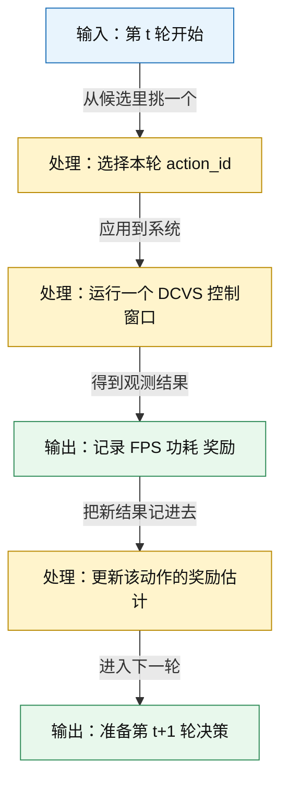
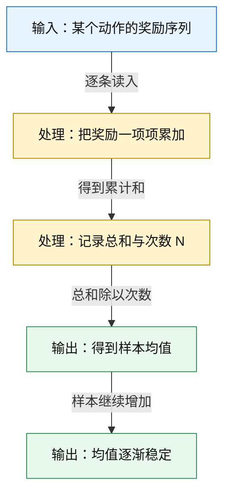
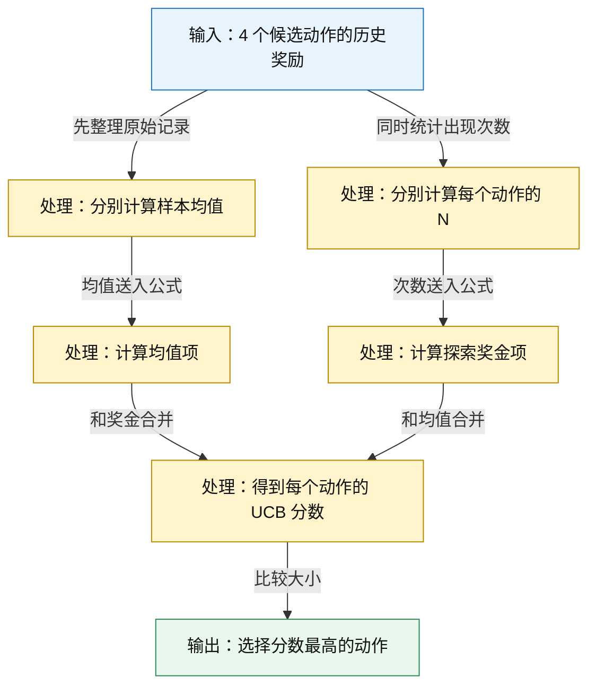
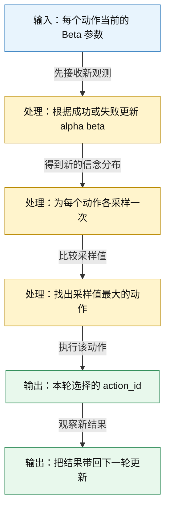
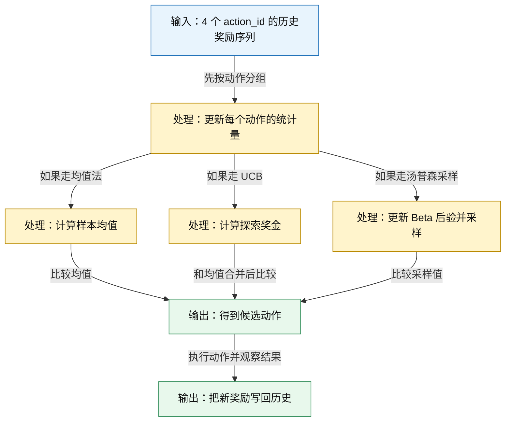
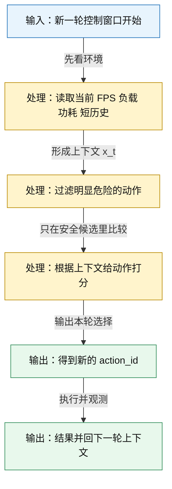

# 04｜多臂老虎机：先学最简单的在线决策框架

## 前置阅读

- 建议先读 `learn/01_DCVS_Background.md`，先把 GPU 动态时钟电压调整（Dynamic Clock and Voltage Scaling, DCVS）调参场景和 192 个动作空间放进脑子里。
- 建议再读 `learn/02_RL_Core_Concepts.md`，先熟悉奖励、策略、在线决策这些最基础词汇。
- 建议接着读 `learn/03_Exploration_vs_Exploitation.md`，先把“探索”和“利用”为什么会打架想明白。
- 如果你前面还没读全，也没关系。本篇会尽量自包含，但默认你已经知道：GPU 频率常见范围是 `282-710 MHz`，目标 FPS 是 `59-60`，功耗观测范围常按 `0-8000 mW` 理解，动作空间是 `6×4×4×2 = 192` 个离散动作。

## 1. 先把画面感立住：赌场老虎机为什么像 DCVS 的 192 个动作

### ① 直觉类比

想象你走进赌场，面前有一整排老虎机。每一台都可能赚钱，但你不知道哪一台最值。你能做的只有三件事：

- 选一台；
- 拉一下；
- 记住这次到底赚了还是亏了。

把这个画面搬到 GPU DCVS 上，其实差不多：

- 拉一次老虎机，等价于给下一个控制窗口选一个 `action_id`；
- 这一小段时间的帧率、频率、功耗综合起来，就会形成一次奖励；
- 你得在有限次数内，尽量多拿总奖励，同时少踩坑。

所以，多臂老虎机（Multi-Armed Bandit）可以先粗暴理解成一句话：

> 面对很多动作，但每次只能试一个；试完立刻看回报；边试边学。

这也是它为什么经常被当成“最简单的在线决策框架”。

### ② 正式定义

在最基础的多臂老虎机设定里，我们先假装环境不变，只关心两件事：

- 这一轮选了哪个动作；
- 这一轮立刻拿到了多少奖励。

设一共有 $K$ 个动作，第 $t$ 轮选到的动作是 $a_t$，即时奖励（Immediate Reward）是 $r_t$。每个动作背后都藏着一个我们看不见的长期平均奖励 $\mu_a$：

$$
a_t \in \{1,2,\dots,K\}
$$

$$
\mu_a = \mathbb{E}[r \mid a]
$$

如果连续做 $T$ 轮，总奖励（Total Reward）就是：

$$
G_T = \sum_{t=1}^{T} r_t
$$

而累积遗憾（Cumulative Regret）描述的是：如果我每一轮都没选到长期最优动作，那我一共“少赚”了多少：

$$
R_T = \sum_{t=1}^{T} \left(\mu^* - \mu_{a_t}\right), \quad \mu^* = \max_a \mu_a
$$

这几个式子其实都不玄乎。它们只是在说：

- 每个动作都有一个长期平均水平；
- 你单次看到的奖励会波动；
- 真正关心的，不只是某一轮运气好不好，而是长期总收益和长期少走了多少弯路。

### ③ 公式推导 + Mermaid 图

这张图展示了什么：下面这张图把最基础的朴素老虎机（plain bandit）闭环画出来了。你会看到它只做 5 件事：选动作、跑窗口、记奖励、更新估计、继续下一轮。



图里的关键路径/要点：朴素老虎机只盯“这次选什么”和“这次立刻拿到什么”。它不显式建模长时序状态转移，所以很轻、很好上手，但也因此会忽略“上一轮做了什么，对下一轮有没有后效应”。

### ④ DCVS 实际数值计算示例

先用一个很容易手算的奖励函数（Reward Function）来算一遍。假设每个控制窗口结束后，我们用下面这套规则打分：

$$
r_{\text{base}} = \frac{\min(\text{FPS}, 60)}{60} - 0.25 \cdot \frac{\text{功耗}}{8000}
$$

$$
r =
\begin{cases}
r_{\text{base}}, & \text{如果 FPS} \ge 59 \\
r_{\text{base}} - 0.15, & \text{如果 FPS} < 59
\end{cases}
$$

这套规则的意思很直观：

- FPS 越接近 `60` 越好；
- 功耗越低越好；
- 但只要掉到 `59` 以下，就额外扣一笔分，因为玩家已经能感觉到卡顿。

下面看 4 个候选动作：

| action_id | GPU 频率 | 观测 FPS | 功耗 | 直觉解释 |
|---|---:|---:|---:|---|
| `12` | `500 MHz` | `60.0` | `5000 mW` | 很稳，但偏费电 |
| `72` | `545 MHz` | `60.0` | `4200 mW` | 稳定，而且更省 |
| `109` | `430 MHz` | `59.0` | `3600 mW` | 刚好达标，更省电 |
| `155` | `355 MHz` | `58.0` | `3100 mW` | 最省电，但已经掉帧 |

先算 `action_id 12`：

$$
\frac{\min(60,60)}{60} = \frac{60}{60} = 1
$$

$$
0.25 \cdot \frac{5000}{8000} = 0.25 \cdot 0.625 = 0.15625
$$

$$
r_{12} = 1 - 0.15625 = 0.84375
$$

再算 `action_id 72`：

$$
\frac{\min(60,60)}{60} = 1
$$

$$
0.25 \cdot \frac{4200}{8000} = 0.25 \cdot 0.525 = 0.13125
$$

$$
r_{72} = 1 - 0.13125 = 0.86875
$$

再算 `action_id 109`：

$$
\frac{\min(59,60)}{60} = \frac{59}{60} = 0.9833333
$$

$$
0.25 \cdot \frac{3600}{8000} = 0.25 \cdot 0.45 = 0.1125
$$

$$
r_{109} = 0.9833333 - 0.1125 = 0.8708333
$$

因为它还在 `59-60` 目标带里，所以这里不扣额外的 `0.15`。

最后算 `action_id 155`：

$$
\frac{\min(58,60)}{60} = \frac{58}{60} = 0.9666667
$$

$$
0.25 \cdot \frac{3100}{8000} = 0.25 \cdot 0.3875 = 0.096875
$$

$$
r_{\text{base},155} = 0.9666667 - 0.096875 = 0.8697917
$$

$$
r_{155} = 0.8697917 - 0.15 = 0.7197917
$$

这轮按奖励从高到低排，是：

1. `action_id 109`：$0.8708333$
2. `action_id 72`：$0.86875$
3. `action_id 12`：$0.84375$
4. `action_id 155`：$0.7197917$

如果这轮你没有选到最优的 `action_id 109`，而是选了 `action_id 12`，那这一轮的遗憾就是：

$$
\mu^* - \mu_{12} \approx 0.8708333 - 0.84375 = 0.0270833
$$

如果连续三轮你依次选了 `12`、`72`、`155`，那这三轮的累积遗憾近似是：

$$
R_3 \approx (0.8708333 - 0.84375) + (0.8708333 - 0.86875) + (0.8708333 - 0.7197917)
$$

$$
R_3 \approx 0.0270833 + 0.0020833 + 0.1510416 = 0.1802082
$$

这个数字的意思就是：和“每轮都选到当前最值动作”相比，你这三轮一共少赚了大约 `0.1802` 分。

## 2. 样本均值为什么有用：少看几轮会被骗，多看几轮会更稳

### ① 直觉类比

想象你在美食街试 4 家店。第一口可能特别惊艳，第二口可能一般，第三口又还行。单看某一次，你很容易误判；多吃几次以后，你才会知道哪家平均最稳。

Bandit 里也是一样。某个动作这次拿高分，不代表它长期真的最好。所以我们先记它的平均表现，而不是只盯某一次好运气。

### ② 正式定义

如果动作 $a$ 已经被试了 $N_a$ 次，拿到的奖励依次是 $r_{a,1}, r_{a,2}, \dots, r_{a,N_a}$，那么它的样本均值（Sample Mean）写成：

$$
\hat{\mu}_a = \frac{1}{N_a} \sum_{i=1}^{N_a} r_{a,i}
$$

这个公式其实就在做两步：

- 把历史奖励全加起来；
- 再除以尝试次数。

随着尝试次数变多，样本均值会越来越接近真实平均奖励。这个直觉常常由大数定律（Law of Large Numbers）支撑。

> **补充知识：样本均值和大数定律到底在说什么？**
>
> 样本均值可以先理解成“到目前为止，这个动作平均能拿多少分”。它不是保证永远正确，但比“只看最近一轮结果”靠谱得多。
>
> 大数定律说的事情也很朴素：单次结果会抖，但当你重复很多次以后，平均值会慢慢稳定下来。就像掷硬币，前 3 次可能是 `正 正 反`，看起来很偏；但掷 300 次以后，正反比例通常会更接近真实概率。

### ③ 公式推导 + Mermaid 图

这张图展示了什么：下面这张图把“奖励序列怎么一步步变成样本均值”拆开了。它不是在做高深数学，本质上就是“先累加，再平均”。



图里的关键路径/要点：关键不是“平均”这两个字，而是“试得越多，平均值越稳”。后面的 UCB 和 Thompson Sampling，本质上都是在样本均值和不确定性之上继续做文章。

### ④ DCVS 实际数值计算示例

假设 `action_id 72` 在 4 个控制窗口里先后拿到的奖励是：

$$
[0.82,\ 0.88,\ 0.87,\ 0.91]
$$

下面按最笨但最清楚的办法算：

- 第 1 次后，累计和是 $0.82$，样本均值也是 $0.82$；
- 第 2 次后，累计和是 $0.82 + 0.88 = 1.70$；
- 第 2 次后的均值是 $1.70 \div 2 = 0.85$；
- 第 3 次后，累计和是 $1.70 + 0.87 = 2.57$；
- 第 3 次后的均值是 $2.57 \div 3 = 0.8567$；
- 第 4 次后，累计和是 $2.57 + 0.91 = 3.48$；
- 第 4 次后的均值是 $3.48 \div 4 = 0.87$。

所以现在我们对 `action_id 72` 的估计就是：

$$
\hat{\mu}_{72} = 0.87
$$

这还不代表它“永远最好”，但至少说明：在已经看到的样本里，它确实很强。

## 3. UCB 在干什么：给“还没试够”的动作一笔探索奖金

### ① 直觉类比

假设你常去 4 家面馆：

- A 店你去过很多次，平均 8.4 分；
- B 店你去过很多次，平均 8.7 分；
- C 店只去过两次，但两次都挺惊艳；
- D 店试过几次，基本一般。

如果只看平均分，你可能直接继续去 B 店。但你心里会冒出一个问题：C 店会不会其实更强，只是我还没试够？

上置信界（Upper Confidence Bound, UCB）干的就是这件事：除了看平均分，还给“样本少、不确定性大”的动作一笔探索奖金。

### ② 正式定义

一个常见的 UCB 选择公式写成：

$$
a_t = \arg\max_a \left[\hat{\mu}_a + c\sqrt{\frac{\ln t}{N_a(t)}}\right]
$$

把中括号里的东西记成 UCB 分数，会更好读：

$$
UCB_t(a) = \hat{\mu}_a + c\sqrt{\frac{\ln t}{N_a(t)}}
$$

这里每一项都能直接翻译成中文：

- $\hat{\mu}_a$：这个动作目前的平均表现；
- $N_a(t)$：到第 $t$ 轮为止，这个动作已经被试过多少次；
- $\ln t$：总轮数越多，探索空间会慢慢收缩，但不会一下子消失；
- $c$：探索强度系数，越大越爱试新动作；
- 后面整个根号项：探索奖金。

> **补充知识：这里为什么会出现对数和平方根？**
>
> 你不用先把它背成高深推导，只要先抓住方向感。分母里的次数越大，不确定性越小，所以探索奖金应该往下降。
>
> 但下降也不能太猛，否则很多动作刚试几次就再也没机会了。平方根让这个下降更温和；对数让总轮数增大时，系统仍保留一点探索冲动，但不会无限膨胀。

### ③ 公式推导 + Mermaid 图

这张图展示了什么：下面这张图把 UCB 的决策过程拆成三步。它不是去画难渲染的柱状图，而是把“先算均值，再算探索奖金，最后比总分”的逻辑链直接画出来。



图里的关键路径/要点：UCB 不是“均值最高就选谁”，而是“均值 + 不确定性奖金”一起看。正因为这样，它会主动给那些样本还不够多、但可能被低估的动作一点机会。

### ④ DCVS 实际数值计算示例

下面用 4 个 `action_id` 做一个完整 worked example：从观测到的奖励序列出发，先更新估计，再选择下一个动作。

假设现在准备做第 $13$ 轮决策，也就是前面已经观察了 12 次结果。4 个动作的奖励序列如下：

- `action_id 12`：$[0.84,\ 0.85,\ 0.83]$
- `action_id 72`：$[0.87,\ 0.86,\ 0.88,\ 0.87]$
- `action_id 109`：$[0.89,\ 0.85]$
- `action_id 155`：$[0.72,\ 0.74,\ 0.70]$

先算样本均值。

`action_id 12`：

$$
0.84 + 0.85 + 0.83 = 2.52
$$

$$
\hat{\mu}_{12} = 2.52 \div 3 = 0.84
$$

`action_id 72`：

$$
0.87 + 0.86 + 0.88 + 0.87 = 3.48
$$

$$
\hat{\mu}_{72} = 3.48 \div 4 = 0.87
$$

`action_id 109`：

$$
0.89 + 0.85 = 1.74
$$

$$
\hat{\mu}_{109} = 1.74 \div 2 = 0.87
$$

`action_id 155`：

$$
0.72 + 0.74 + 0.70 = 2.16
$$

$$
\hat{\mu}_{155} = 2.16 \div 3 = 0.72
$$

接着取探索系数 $c = 0.20$，先把公共项算出来：

$$
\ln 13 \approx 2.5649
$$

`action_id 12` 的探索奖金：

$$
0.20 \cdot \sqrt{\frac{2.5649}{3}} = 0.20 \cdot \sqrt{0.8550} = 0.20 \cdot 0.9246 = 0.1849
$$

$$
UCB_{13}(12) = 0.84 + 0.1849 = 1.0249
$$

`action_id 72` 的探索奖金：

$$
0.20 \cdot \sqrt{\frac{2.5649}{4}} = 0.20 \cdot \sqrt{0.6412} = 0.20 \cdot 0.8008 = 0.1602
$$

$$
UCB_{13}(72) = 0.87 + 0.1602 = 1.0302
$$

`action_id 109` 的探索奖金：

$$
0.20 \cdot \sqrt{\frac{2.5649}{2}} = 0.20 \cdot \sqrt{1.2825} = 0.20 \cdot 1.1325 = 0.2265
$$

$$
UCB_{13}(109) = 0.87 + 0.2265 = 1.0965
$$

`action_id 155` 的探索奖金：

$$
0.20 \cdot \sqrt{\frac{2.5649}{3}} = 0.1849
$$

$$
UCB_{13}(155) = 0.72 + 0.1849 = 0.9049
$$

最后比较：

- `action_id 12`：$1.0249$
- `action_id 72`：$1.0302$
- `action_id 109`：$1.0965$
- `action_id 155`：$0.9049$

所以下一轮 UCB 会选：

$$
a_{13} = 109
$$

这里最值得体会的一点是：`72` 和 `109` 的均值都差不多是 `0.87`，但 `109` 只被试过 2 次，所以它拿到了更大的探索奖金。

## 4. 汤普森采样（Thompson Sampling）为什么讨喜：它把“不确定”直接变成随机抽样

### ① 直觉类比

UCB 的思路像是在给每个动作发“探索补贴”。而汤普森采样更像这样：

> 我给每个动作都保留一个“当前成功概率长什么样”的信念分布；每轮从各自动作的分布里各抽一次，谁抽出来最亮眼，我就先试谁。

这样做的好处是：探索不是额外硬塞进去的，而是从“不确定性本来就更大”这件事里自然长出来的。

### ② 正式定义

为了先把直觉讲明白，我们先用最容易懂的二值版本。假设每轮结果不是连续奖励，而是“成功 / 失败”：

- 成功：FPS 至少 `59`，并且功耗不超过 `4500 mW`；
- 失败：不满足上面任一条件。

对某个动作的成功概率 $\theta_a$，先验分布（Prior Distribution）常写成 Beta 分布（Beta Distribution）：

$$
\theta_a \sim \text{Beta}(\alpha_a, \beta_a)
$$

如果这个动作已经看到 $s_a$ 次成功、$f_a$ 次失败，那么后验分布（Posterior Distribution）会变成：

$$
\theta_a \mid \mathcal{D}_a \sim \text{Beta}(\alpha_a + s_a,\ \beta_a + f_a)
$$

做决策时，从每个动作的后验里各抽一次样本：

$$
\tilde{\theta}_a \sim \text{Beta}(\alpha_a,\beta_a)
$$

然后选抽到最大值的动作：

$$
a_t = \arg\max_a \tilde{\theta}_a
$$

> **补充知识：Beta 分布到底是什么？**
>
> Beta 分布最常见的用途，就是表示“某个成功概率，我们现在到底有多确定”。它的横轴天然落在 `0` 到 `1` 之间，特别适合表示“成功概率”。
>
> 你可以先把 $\alpha$ 理解成“成功票数”，把 $\beta$ 理解成“失败票数”。比如 `Beta(1,1)` 是比较平的，意思是“我还没什么偏见”；`Beta(5,2)` 会更偏向高成功率一侧，意思是“我看到的成功证据更多”；`Beta(2,5)` 则更偏向低成功率一侧。

### ③ 公式推导 + Mermaid 图

这张图展示了什么：下面先放一张 Beta 分布“形状感”的小图，再放汤普森采样的一轮流程图。前者不是严格函数图，而是帮你记住“证据偏向哪里，分布就往哪里鼓起来”。

```mermaid
flowchart LR
    A[输入：Beta(1,1)\n形状比较平] -->|看到更多成功| B[输出：Beta(5,2)\n更偏向高成功率一侧]
    A -->|看到更多失败| C[输出：Beta(2,5)\n更偏向低成功率一侧]

    classDef input fill:#E8F4FD,stroke:#1D70B8,color:#111;
    classDef process fill:#FFF4CC,stroke:#B98900,color:#111;
    classDef output fill:#E8F8EC,stroke:#2E8B57,color:#111;

    class A input;
    class B,C output;
```

图里的关键路径/要点：`Beta(1,1)` 可以先理解成“我没什么先入为主的偏见”；成功证据越来越多，分布就会更往右边挤；失败证据越来越多，分布就会更往左边挤。

这张图展示了什么：下面这张图把汤普森采样的一轮流程串起来了。重点不是“先求平均”，而是“先更新分布，再从分布里采样”。



图里的关键路径/要点：汤普森采样的探索不是“每隔几轮强行随机一次”，而是“哪个动作越不确定，越可能偶尔抽到一个很亮眼的值”。这样一来，探索和利用会自己混在一起。

### ④ DCVS 实际数值计算示例

下面继续用 4 个动作做一个完整例子。为了便于理解，我们先把连续奖励压成“成功 / 失败”：

- `action_id 12`：成功、成功、失败、成功
- `action_id 72`：成功、成功、成功、失败、成功
- `action_id 109`：成功、失败、成功、失败、成功
- `action_id 155`：失败、失败、成功、失败

给所有动作同一个最朴素的先验：

$$
\text{Prior} = \text{Beta}(1,1)
$$

现在做更新。

`action_id 72` 的更新过程：

- 初始：`Beta(1,1)`
- 第 1 次成功后：`Beta(2,1)`
- 第 2 次成功后：`Beta(3,1)`
- 第 3 次成功后：`Beta(4,1)`
- 第 4 次失败后：`Beta(4,2)`
- 第 5 次成功后：`Beta(5,2)`

所以：

$$
\theta_{72} \mid \mathcal{D}_{72} \sim \text{Beta}(5,2)
$$

其他 3 个动作同理：

- `action_id 12`：3 成功 1 失败，所以是 `Beta(4,2)`；
- `action_id 109`：3 成功 2 失败，所以是 `Beta(4,3)`；
- `action_id 155`：1 成功 3 失败，所以是 `Beta(2,4)`。

假设这一轮采样时，4 个动作分别抽到了下面这些值：

- `action_id 12`：$0.68$
- `action_id 72`：$0.77$
- `action_id 109`：$0.63$
- `action_id 155`：$0.29$

那这一轮汤普森采样会选：

$$
a_t = 72
$$

这里要注意两点：

- 这些采样值每轮都可能不同；
- 正因为每轮都不同，不确定的动作才会偶尔“翻红”，获得探索机会。

## 5. 把 3 到 4 个动作串起来看：一次完整的 bandit 决策到底怎么走

### ① 直觉类比

前面每一节都在讲一个局部零件。现在把它们拼起来看，你就会发现 bandit 的决策其实很像一个值班工程师的日常：

- 先翻历史记录；
- 看哪些动作试过很多次，哪些还没试够；
- 再按某种规则挑一个；
- 跑完一个窗口后，把结果继续写回去。

### ② 正式定义

不管你用的是样本均值、UCB，还是汤普森采样，它们都在做同一件事：

$$
\text{历史观测} \rightarrow \text{当前估计} \rightarrow \text{下一轮动作}
$$

差别只在于“当前估计”怎么定义：

- 朴素均值法：只看平均奖励；
- UCB：看平均奖励，再加探索奖金；
- 汤普森采样：看后验分布，再随机抽样比较。

### ③ 公式推导 + Mermaid 图

这张图展示了什么：下面这张图把“观测奖励序列 → 更新估计 → 选择下一个动作”的整条链路串了起来，刚好对应这篇文档最核心的 worked example。



图里的关键路径/要点：无论算法名字怎么变，bandit 的核心循环都没变。它永远是在“把历史变成估计，再把估计变成下一次选择”。

### ④ DCVS 实际数值计算示例

下面把 4 个动作的情况放到同一张小表里，再看一眼：

| action_id | 奖励序列 | 样本数 | 样本均值 | UCB 探索奖金 | UCB 总分 |
|---|---|---:|---:|---:|---:|
| `12` | `0.84, 0.85, 0.83` | `3` | `0.84` | `0.1849` | `1.0249` |
| `72` | `0.87, 0.86, 0.88, 0.87` | `4` | `0.87` | `0.1602` | `1.0302` |
| `109` | `0.89, 0.85` | `2` | `0.87` | `0.2265` | `1.0965` |
| `155` | `0.72, 0.74, 0.70` | `3` | `0.72` | `0.1849` | `0.9049` |

这张表的阅读顺序是：

1. 先看奖励序列；
2. 再看样本数够不够多；
3. 再看均值高不高；
4. 最后才看算法到底会选谁。

按均值法，`72` 和 `109` 差不多打平；按 UCB，`109` 会胜出；按汤普森采样，则可能因为抽样波动，在 `72` 和 `109` 之间来回切换几轮。

这也是 bandit 很适合入门的原因：它的每一步都能算清楚、看清楚。

## 6. 朴素老虎机（plain bandit）的局限：为什么它最终会自然长成上下文老虎机（Contextual Bandit）

### ① 直觉类比

你不会在不知道天气的情况下决定今天带不带伞。DCVS 也一样，不该在不知道当前 GPU 负载、上一窗口 FPS、功耗趋势的情况下，假设“同一个动作永远一样好”。

朴素老虎机最大的问题就在这里：它默认一个动作的好坏大体固定。但真实手机系统不是这样的。

### ② 正式定义

如果动作的好坏还会被当前环境影响，那就需要把上下文（Context）也放进来。一个更贴近真实 DCVS 的想法是：

$$
a_t = \arg\max_a \hat{r}(x_t, a)
$$

这里的 $x_t$ 表示第 $t$ 轮看到的上下文。比如在 GPU DCVS 里，可以把下面这些量放进去：

$$
x_t = [\text{gpu\_usage},\ \text{gpu\_power},\ \text{FPS},\ \text{当前频率},\ \text{最近 1 到 3 个窗口统计}]
$$

一旦动作价值变成“跟上下文一起决定”，你就已经站在上下文老虎机（Contextual Bandit）的门口了。

### ③ 公式推导 + Mermaid 图

这张图展示了什么：下面这张图把朴素老虎机和“引入上下文后的决策”差别画了出来。你会看到，真正新增的不是复杂数学，而是“先看当前环境，再决定动作”。



图里的关键路径/要点：一旦你需要先看当前负载、功耗、短历史，再决定动作，朴素老虎机就开始不够用了。这也是为什么工程上常常会从 bandit 继续走到上下文老虎机。

### ④ DCVS 实际数值计算示例

假设当前窗口的上下文是：

- 当前 FPS：`59.4`
- 当前 GPU 使用率：`91%`
- 当前功耗：`4300 mW`
- 当前频率：`500 MHz`
- 最近两个窗口都出现了轻微热升高

这时候如果你还用朴素老虎机的平均分硬选，很可能会继续尝试一个历史均值不错、但在高负载下容易掉到 `58 FPS` 的低频动作。

更贴近真实系统的判断会是：

1. 先看当前 FPS 离 `59` 的下边界只剩多少余量：

   $$
   59.4 - 59.0 = 0.4
   $$

2. 再看某个激进降频动作过去在高负载场景里，平均会掉多少帧。假设平均下探是 `1.1 FPS`：

   $$
   59.4 - 1.1 = 58.3
   $$

3. 这说明它一上来就很可能掉出目标带，所以哪怕它的历史均值还行，也应该先被安全规则踢出候选集合。

这就是朴素老虎机的硬伤：它把“动作本身”看得太重，把“动作发生在什么场景里”看得太轻。

## 7. 为什么三份源文档会给出不一样的推荐

这个问题很重要，因为你在项目资料里确实会看到不止一种答案。

| 来源文档 | 主要关注点 | 为什么给出的建议不同 |
|---|---|---|
| `RL_Algorithm_Selection_for_GPU_DCVS_Tuning_20260401.md` | 离线数据覆盖率、动作空间、时间依赖 | 它强调当前动作覆盖率只到约 `30/192`，而且热积累、governor 惯性、场景切换都说明问题不完全是无记忆的，所以更偏向离线强化学习里的保守方法，比如保守 Q 学习（Conservative Q-Learning, CQL）和隐式 Q 学习（Implicit Q-Learning, IQL） |
| `RL_DCVS_AI_Integrated_Decision_2026-04-01.md` | 数据偏置、安全壳、线上部署风险 | 它强调现有样本几乎像单策略日志，所以建议主策略更保守，再叠一层运行时安全护栏（runtime safety shield），必要时再加上下文老虎机做在线微调 |
| `RL_DCVS_Runtime_Adaptive_Independent_Decision_GPT-5.4_2026-04-01_135421.md` | 运行时自适应、短历史、小步决策 | 它更看重“每个窗口怎么快速做当前最优决定”，所以认为问题更像安全上下文老虎机（Safe Contextual Bandit） |

把三份文档放在一起看，你会发现它们不是互相打脸，而是默认前提不同：

- 如果你把问题建模成“在线小步决策”，bandit 很自然；
- 如果你更强调“动作会影响未来几个窗口”，那就更像马尔可夫决策过程（Markov Decision Process, MDP），不该只用朴素老虎机；
- 如果你更在乎“当前离线数据覆盖不够、线上又不能乱试”，那 CQL、IQL 这种保守方法就会显得更稳。

换句话说，分歧来自问题建模不同，而不是谁算错了：

- 是 **Bandit 还是 MDP**；
- 是 **在线决策还是离线训练**；
- 是 **离散动作 192 个组合**，还是以后想扩到连续动作；
- 是 **先追求实时适应**，还是 **先追求保守安全**。

## 关键收获

- 多臂老虎机先帮我们抓住最核心的在线决策直觉：每轮从多个动作里选一个，立刻看奖励，边试边学。
- 在 GPU DCVS 里，192 个离散动作完全可以先被看成 192 台老虎机，每一轮都在比较“稳帧和省电谁更划算”。
- 样本均值和大数定律告诉我们：单次结果会抖，但样本够多时，平均表现会越来越稳。
- UCB 的关键不是只看均值，而是看“均值 + 探索奖金”；样本少但有潜力的动作会因此获得机会。
- 汤普森采样的关键不是手工规定什么时候随机，而是让不确定性通过后验采样自然长出来。
- 朴素老虎机最大的短板，是默认动作价值基本固定；但真实 DCVS 会受 GPU 负载、功耗、短历史、热变化影响。
- 这也是为什么三份源材料会给出不同建议：它们对问题究竟更像 bandit、contextual bandit，还是更像离线 RL / MDP，假设并不一样。
