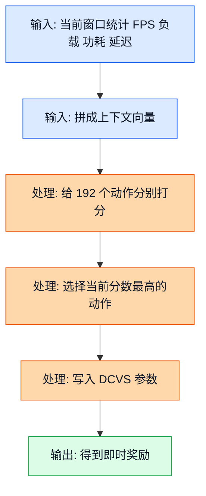
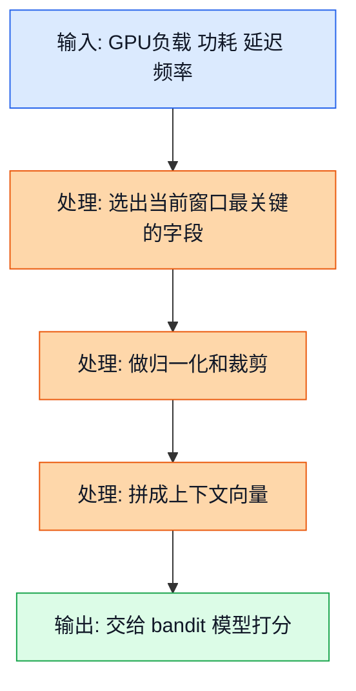
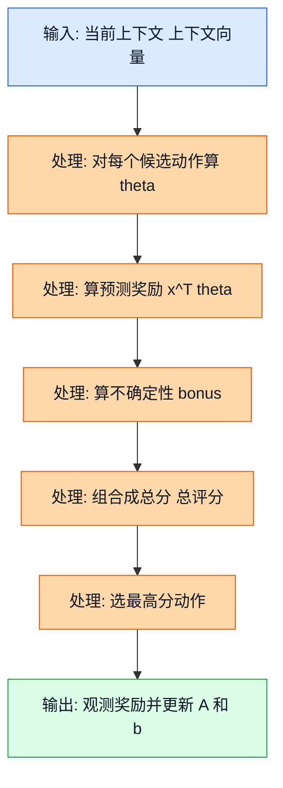
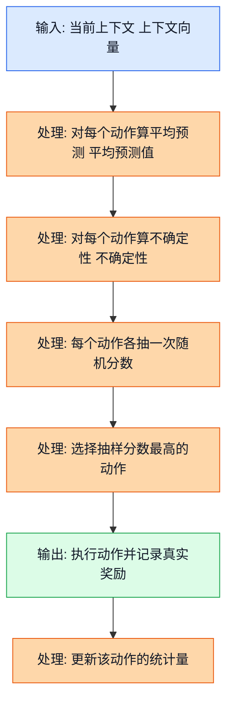
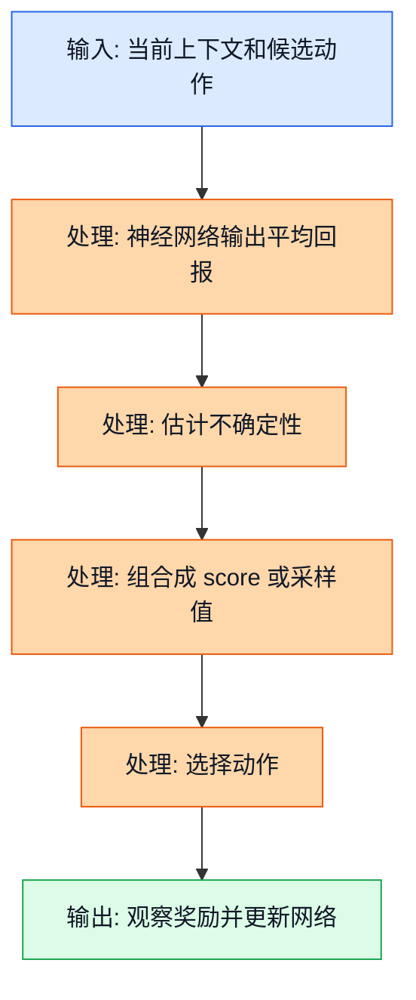
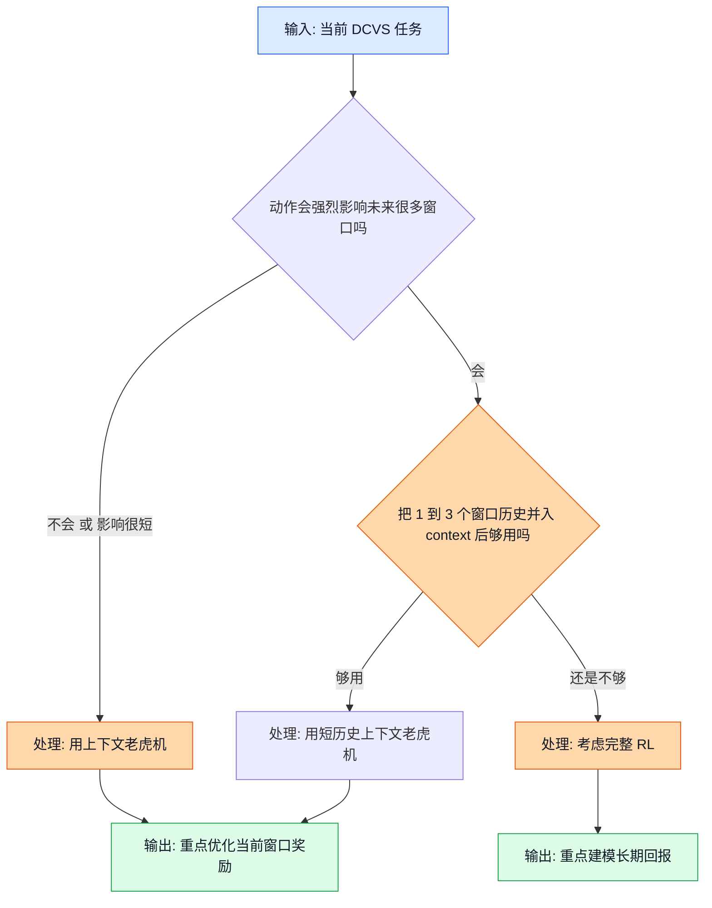

## 前置阅读

- 建议先读 `02_RL_Core_Concepts.md`，先把奖励、策略、在线决策这些基础词汇放进脑子里。
- 建议再读 `03_Exploration_vs_Exploitation.md`，先理解“为什么不能永远只选最稳的那个动作”。
- 建议接着读 `04_Multi_Armed_Bandits.md`，先把普通老虎机和上下文老虎机的差别立住。
- 如果你前面还没读全，也可以直接继续。本文会把普通老虎机快速复习一遍，并反复用 GPU 频率 `282-710 MHz`、目标 FPS `59-60`、功耗 `0-8000 mW`、动作空间 `192` 这些项目内数字来讲。

# 05 上下文老虎机（Contextual Bandit）

## 这篇要解决什么问题

上一讲的普通老虎机，默认每个动作都有一个“固定平均分”。这对很多问题够用了，但对 GPU DCVS 调参不够。原因很简单：同一个动作在不同场景下，表现可能完全相反。

比如同一个 `action_id=72`，在低负载场景里也许又省电又稳帧；可一旦游戏进入团战、高特效、温度上升，它可能马上把 FPS 压垮。也就是说，动作的好坏不是“动作自己决定”的，而是“动作 + 当前环境”一起决定的。这就是上下文老虎机要处理的核心问题。

---

## 1. 什么是上下文老虎机

### 1.1 直觉类比

想象你在卖伞。你手里只有一个动作: “把伞摆到店门口”。如果今天下雨，这个动作很值钱；如果今天晴天，这个动作几乎没意义。

这里“摆伞”这个动作没有变，变的是天气。天气就是上下文（Context）。在 DCVS 里也一样，同一个降频动作，在 `gpu_usage_pct=25%` 和 `gpu_usage_pct=92%` 时，结果很可能完全不同。

### 1.2 正式定义

上下文老虎机每一轮都会先看到当前上下文向量（Context Vector）$x_t$，然后再从动作集合 $\mathcal{A}$ 里选一个动作 $a_t$，最后得到即时奖励（Reward）$r_t$。

$$
x_t \in \mathbb{R}^d,\quad a_t \in \mathcal{A},\quad r_t = r(x_t, a_t) + \varepsilon_t
$$

它的目标不是学“哪个动作平均最好”，而是学：

$$
a_t = \arg\max_{a \in \mathcal{A}} \mathbb{E}[r_t \mid x_t, a]
$$

普通老虎机学的是：

$$
a_t = \arg\max_{a \in \mathcal{A}} \mathbb{E}[r_t \mid a]
$$

两者只差了一个条件 $x_t$，但意义完全不同。前者是在问“当前这台机器、当前这个窗口、当前这组负载下，哪个动作最好”；后者是在问“长期平均下来，哪个动作最好”。

### 1.3 公式逻辑图

这张图展示了上下文老虎机在 DCVS 里的最小工作流程。

图里的关键路径是: 先看当前窗口，再决定动作，而不是反过来。对 DCVS 来说，这一步尤其重要，因为当前的 GPU 负载、延迟、功耗和上一轮动作，都会改变你此刻该不该继续降频。

### 1.4 DCVS 实际数值计算示例

下面用项目里统一 reward 公式，看看“同一个动作在不同上下文里为什么会差很多”。

根据源文档，reward 可以统一写成：

$$
reward = fps\_component + freq\_component + power\_component
$$

其中：

$$
fps\_component =
\begin{cases}
-10 \times (57 - fps), & fps < 57 \\
-2 \times (59 - fps), & 57 \le fps < 59 \\
20, & fps \ge 59
\end{cases}
$$

$$
freq\_component = \frac{900 - gpu\_freq\_mhz}{80}
$$

$$
power\_component = \frac{6000 - power\_mw}{400}
$$

假设我们都执行同一个动作 `action_id=72`，只是上下文不同。

| 场景 | `gpu_usage_pct` | `lateness_ms` | `gpu_freq_mhz` | `power_mw` | `FPS` |
|------|-----------------|---------------|----------------|------------|-------|
| 低负载窗口 | 28 | 0.0 | 430 | 2500 | 60.2 |
| 高负载窗口 | 92 | 2.8 | 430 | 4200 | 57.6 |

先算低负载窗口：

1. 因为 $FPS = 60.2 \ge 59$，所以

$$
fps\_component = 20
$$

2. 频率项是

$$
freq\_component = \frac{900 - 430}{80} = \frac{470}{80} = 5.875
$$

3. 功耗项是

$$
power\_component = \frac{6000 - 2500}{400} = \frac{3500}{400} = 8.75
$$

4. 总奖励是

$$
reward = 20 + 5.875 + 8.75 = 34.625
$$

再算高负载窗口：

1. 因为 $57 \le FPS = 57.6 < 59$，所以

$$
fps\_component = -2 \times (59 - 57.6) = -2 \times 1.4 = -2.8
$$

2. 频率项没变，还是

$$
freq\_component = 5.875
$$

3. 功耗项变成

$$
power\_component = \frac{6000 - 4200}{400} = \frac{1800}{400} = 4.5
$$

4. 总奖励变成

$$
reward = -2.8 + 5.875 + 4.5 = 7.575
$$

同一个动作，一个窗口拿到 $34.625$，另一个窗口只拿到 $7.575$。这就是上下文老虎机存在的理由: 你不能只问“哪个动作好”，必须问“在当前上下文里哪个动作好”。

---

## 2. 上下文向量到底装什么

### 2.1 直觉类比

把上下文向量想成医生看诊前那张“生命体征表”。医生不会只看一个数，而是会同时看体温、血压、心率、血氧，再综合判断该怎么处理。

DCVS 也一样。只看一个 `gpu_usage_pct` 不够，因为高负载不一定意味着要升频。还得一起看延迟有没有恶化、当前频率已经多高、功耗是否靠近上限、上一轮动作是不是刚刚切过。

### 2.2 正式定义

上下文向量（Context Vector）就是把当前决策窗口里最能反映系统状态的特征拼成一个列向量：

$$
x_t =
\begin{bmatrix}
gpu\_usage\_norm \\
lateness\_norm \\
gpu\_freq\_norm \\
\vdots
\end{bmatrix}
$$

结合三份源文档，这个项目里适合放进上下文的字段包括：

| 类别 | 代表字段 | 为什么重要 |
|------|----------|------------|
| 帧体验 | `fps`, `fps_error`, `1% low` | 直接反映游戏体验是否守住 59-60 FPS 目标 |
| GPU 状态 | `gpu_usage_pct`, `gpu_freq_hz`, `gpu_headroom_ms` | 告诉我们当前是忙、闲，还是已经接近极限 |
| 延迟信号 | `actual_dur_ms`, `lateness_ms`, `fence_avg_latency_ms` | 能更早看到掉帧风险 |
| 功耗/能量 | `gpu_power_mw`, `delta_total_uj` | 反映节能收益和发热压力 |
| 历史信息 | `prev_action`, `prev_reward`, 最近 2-3 个窗口趋势 | 用来吸收短期热惯性和 governor 记忆 |

> 补充知识：向量（Vector）和归一化（Normalization）
>
> 向量你可以先把它当成“把几个数字按顺序装进一个列表里”。比如 $[82, 1.2, 460]^T$，就是“GPU 负载 82%、延迟 1.2 ms、频率 460 MHz”这三件事一起打包。
>
> 归一化的作用，是把单位不同的量拉到差不多的尺度。因为 460 MHz 这个数本身远大于 1.2 ms，如果不归一化，模型会误以为“频率这个特征天然更重要”，其实只是它的单位更大。

这里先用三个最容易手算的特征举例：

$$
gpu\_usage\_norm = \frac{gpu\_usage\_pct}{100}
$$

$$
lateness\_norm = \frac{\min(\max(lateness\_ms, 0), 5)}{5}
$$

$$
gpu\_freq\_norm = \frac{gpu\_freq\_mhz - 282}{710 - 282}
$$

### 2.3 上下文构造流程图

这张图展示了“原始监控指标怎样被整理成上下文向量”。

图里的关键点有两个。第一，不是所有原始字段都直接喂进去，通常会先挑最有解释力的一小组。第二，短历史特征也可以进上下文，这正是第三份源文档里“短历史上下文老虎机”比“纯无记忆老虎机”更重要的地方。

### 2.4 DCVS 实际数值计算示例

假设当前 5 秒窗口统计如下：

- `gpu_usage_pct = 82`
- `lateness_ms = 1.2`
- `gpu_freq_mhz = 460`

我们一步一步把它转成上下文向量。

1. GPU 负载归一化：

$$
gpu\_usage\_norm = \frac{82}{100} = 0.82
$$

2. 延迟归一化。这里 $1.2$ 已经在 $[0, 5]$ 范围里，所以不用裁剪：

$$
lateness\_norm = \frac{1.2}{5} = 0.24
$$

3. GPU 频率归一化。项目里的有效范围按 $282$ 到 $710$ MHz 算：

$$
gpu\_freq\_norm = \frac{460 - 282}{710 - 282} = \frac{178}{428} \approx 0.416
$$

为了后面的手算更顺一点，我们把 $0.416$ 四舍五入成 $0.42$。

4. 最后得到上下文向量：

$$
x_t =
\begin{bmatrix}
0.82 \\
0.24 \\
0.42
\end{bmatrix}
$$

这三个数已经比原始字段更适合拿来做线性打分了。后面讲 LinUCB 时，我们就直接用这个 $x_t$。

---

## 3. LinUCB: 最适合入门的上下文老虎机算法

### 3.1 直觉类比

LinUCB（Linear Upper Confidence Bound）可以理解成“每个动作都有一本自己的小账本”。

这本账本里记两件事：

- 这个动作在什么上下文里通常表现不错；
- 我对这个判断到底有多确定。

所以 LinUCB 的打分不是“预测奖励”这么简单，而是：

- 预测奖励高的动作会加分；
- 还没见过太多、因此不确定性大的动作，也会加一点“探索分”。

这正适合 DCVS 这种高风险在线决策：你不想完全瞎试，但也不能永远只盯着一个动作。

### 3.2 正式定义

LinUCB 假设“某个动作的奖励，和上下文之间大致是线性关系”。对每个动作 $a$，它都维护一套参数：

$$
A_a = \lambda I + \sum_{s: a_s = a} x_s x_s^T
$$

$$
b_a = \sum_{s: a_s = a} r_s x_s
$$

$$
\hat{\theta}_a = A_a^{-1} b_a
$$

其中 $\hat{\theta}_a$ 就是这个动作当前学出来的“线性权重”。

给定当前上下文 $x_t$ 以后，先算预测奖励：

$$
\hat{r}_a = x_t^T \hat{\theta}_a
$$

再算置信宽度：

$$
u_a = \alpha \sqrt{x_t^T A_a^{-1} x_t}
$$

最后把两部分加起来：

$$
p_a = \hat{r}_a + u_a
$$

选择规则就是：

$$
a_t = \arg\max_{a \in \mathcal{A}} p_a
$$

> 补充知识：矩阵求逆（Matrix Inverse）
>
> 你可以把矩阵想成一个“把输入拧一下、拉一下、混一下”的机器。矩阵的逆 $A^{-1}$，就是把这个过程倒回来。它存在时，就能帮我们从“观测结果”反推“原来的权重”。
>
> 最常见的手算例子是 $2 \times 2$ 矩阵。假设
>
> $$
> A =
> \begin{bmatrix}
> 2 & 1 \\
> 1 & 3
> \end{bmatrix}
> $$
>
> 先算行列式：
>
> $$
> \det(A) = 2 \times 3 - 1 \times 1 = 5
> $$
>
> 所以它的逆矩阵是：
>
> $$
> A^{-1} = \frac{1}{5}
> \begin{bmatrix}
> 3 & -1 \\
> -1 & 2
> \end{bmatrix}
> $$
>
> 在 LinUCB 里，$A_a^{-1}$ 的作用可以先粗暴理解成一句话：哪种上下文你见得越少，不确定性就越大；见得越多，不确定性就越小。
>
> 再看 $x^T A^{-1} x$ 这项。它不是在做什么神秘魔法，而是在问：“当前这个上下文方向，在历史数据里到底熟不熟？”如果这个值大，说明这类样本见得少，就该多给一点探索奖励。

### 3.3 LinUCB 决策流程图

这张图展示了 LinUCB 每一个决策周期实际在做什么。

图里的关键路径是“先估计，再加探索分，再更新”。LinUCB 不会像完整 RL 那样把未来很多步都算进去，它只关心当前窗口这一步怎么选更划算。

### 3.4 DCVS 实际数值计算示例

现在来做一个完整的手算例子。为了能用纸笔跟下来，我们只看 192 个动作里的两个候选动作：

- `action_id=72`：偏保守的一组 DCVS 参数
- `action_id=110`：更积极省电的一组 DCVS 参数

当前上下文就用上一节算出来的：

$$
x_t =
\begin{bmatrix}
0.82 \\
0.24 \\
0.42
\end{bmatrix}
$$

这里三维特征分别是：

- 第 1 维：`gpu_usage_norm`
- 第 2 维：`lateness_norm`
- 第 3 维：`gpu_freq_norm`

为了便于手算，假设两个动作当前维护的矩阵如下。

对 `action_id=72`：

$$
A_{72} =
\begin{bmatrix}
5 & 0 & 0 \\
0 & 4 & 0 \\
0 & 0 & 6
\end{bmatrix},
\quad
b_{72} =
\begin{bmatrix}
3.8 \\
0.9 \\
1.8
\end{bmatrix}
$$

对 `action_id=110`：

$$
A_{110} =
\begin{bmatrix}
3 & 0 & 0 \\
0 & 2 & 0 \\
0 & 0 & 4
\end{bmatrix},
\quad
b_{110} =
\begin{bmatrix}
2.1 \\
0.4 \\
2.4
\end{bmatrix}
$$

我们再设探索系数 $\alpha = 0.6$。

#### 第一步：先算两个动作的参数向量

因为这里的 $A_a$ 都是对角矩阵，所以逆矩阵很好算。

$$
A_{72}^{-1} =
\begin{bmatrix}
\frac{1}{5} & 0 & 0 \\
0 & \frac{1}{4} & 0 \\
0 & 0 & \frac{1}{6}
\end{bmatrix}
=
\begin{bmatrix}
0.2 & 0 & 0 \\
0 & 0.25 & 0 \\
0 & 0 & 0.1667
\end{bmatrix}
$$

所以：

$$
\hat{\theta}_{72} = A_{72}^{-1} b_{72}
=
\begin{bmatrix}
0.2 & 0 & 0 \\
0 & 0.25 & 0 \\
0 & 0 & 0.1667
\end{bmatrix}
\begin{bmatrix}
3.8 \\
0.9 \\
1.8
\end{bmatrix}
=
\begin{bmatrix}
0.76 \\
0.225 \\
0.3
\end{bmatrix}
$$

同理：

$$
A_{110}^{-1} =
\begin{bmatrix}
\frac{1}{3} & 0 & 0 \\
0 & \frac{1}{2} & 0 \\
0 & 0 & \frac{1}{4}
\end{bmatrix}
=
\begin{bmatrix}
0.3333 & 0 & 0 \\
0 & 0.5 & 0 \\
0 & 0 & 0.25
\end{bmatrix}
$$

$$
\hat{\theta}_{110} = A_{110}^{-1} b_{110}
=
\begin{bmatrix}
0.7 \\
0.2 \\
0.6
\end{bmatrix}
$$

#### 第二步：算预测奖励

对 `action_id=72`：

$$
\hat{r}_{72} = x_t^T \hat{\theta}_{72}
$$

把数字代进去：

$$
\hat{r}_{72}
= 0.82 \times 0.76 + 0.24 \times 0.225 + 0.42 \times 0.3
$$

$$
= 0.6232 + 0.054 + 0.126 = 0.8032
$$

对 `action_id=110`：

$$
\hat{r}_{110}
= 0.82 \times 0.7 + 0.24 \times 0.2 + 0.42 \times 0.6
$$

$$
= 0.574 + 0.048 + 0.252 = 0.874
$$

如果只看预测奖励，`action_id=110` 已经略高。

#### 第三步：算不确定性 bonus

对 `action_id=72`：

$$
x_t^T A_{72}^{-1} x_t
= 0.82^2 \times 0.2 + 0.24^2 \times 0.25 + 0.42^2 \times 0.1667
$$

先分别算：

$$
0.82^2 = 0.6724,\quad 0.24^2 = 0.0576,\quad 0.42^2 = 0.1764
$$

$$
0.6724 \times 0.2 = 0.13448
$$

$$
0.0576 \times 0.25 = 0.0144
$$

$$
0.1764 \times 0.1667 \approx 0.0294
$$

加起来：

$$
x_t^T A_{72}^{-1} x_t \approx 0.13448 + 0.0144 + 0.0294 = 0.17828
$$

开根号：

$$
\sqrt{0.17828} \approx 0.4222
$$

乘上 $\alpha = 0.6$：

$$
u_{72} = 0.6 \times 0.4222 \approx 0.2533
$$

对 `action_id=110`：

$$
x_t^T A_{110}^{-1} x_t
= 0.82^2 \times 0.3333 + 0.24^2 \times 0.5 + 0.42^2 \times 0.25
$$

$$
= 0.6724 \times 0.3333 + 0.0576 \times 0.5 + 0.1764 \times 0.25
$$

$$
\approx 0.2241 + 0.0288 + 0.0441 = 0.2970
$$

$$
\sqrt{0.2970} \approx 0.5450
$$

$$
u_{110} = 0.6 \times 0.5450 = 0.3270
$$

#### 第四步：算总分并选动作

对 `action_id=72`：

$$
p_{72} = \hat{r}_{72} + u_{72} = 0.8032 + 0.2533 = 1.0565
$$

对 `action_id=110`：

$$
p_{110} = \hat{r}_{110} + u_{110} = 0.874 + 0.3270 = 1.2010
$$

所以：

$$
a_t = \arg\max(p_{72}, p_{110}) = action\_id=110
$$

LinUCB 会选 `action_id=110`。原因不是一句“它平均分更高”那么简单，而是“它当前预测更好，而且不确定性也更大，值得再试一下”。

#### 第五步：观察真实奖励并更新

假设这个动作执行 5 秒后，系统观测到：

- `FPS = 59.4`
- `gpu_freq_mhz = 430`
- `power_mw = 3600`

先算原始 reward：

1. 因为 $59.4 \ge 59$，所以

$$
fps\_component = 20
$$

2. 频率项：

$$
freq\_component = \frac{900 - 430}{80} = \frac{470}{80} = 5.875
$$

3. 功耗项：

$$
power\_component = \frac{6000 - 3600}{400} = \frac{2400}{400} = 6
$$

4. 总奖励：

$$
reward\_{raw} = 20 + 5.875 + 6 = 31.875
$$

为了让 LinUCB 手算更舒服，这里把奖励临时除以 $40$，压到大致 $0$ 到 $1$ 附近：

$$
reward = \frac{31.875}{40} = 0.796875
$$

现在更新 `action_id=110` 的统计量。

先算：

$$
x_t x_t^T =
\begin{bmatrix}
0.82 \\
0.24 \\
0.42
\end{bmatrix}
\begin{bmatrix}
0.82 & 0.24 & 0.42
\end{bmatrix}
=
\begin{bmatrix}
0.6724 & 0.1968 & 0.3444 \\
0.1968 & 0.0576 & 0.1008 \\
0.3444 & 0.1008 & 0.1764
\end{bmatrix}
$$

所以：

$$
A_{110}^{new} = A_{110} + x_t x_t^T
$$

$$
=
\begin{bmatrix}
3 & 0 & 0 \\
0 & 2 & 0 \\
0 & 0 & 4
\end{bmatrix}
+
\begin{bmatrix}
0.6724 & 0.1968 & 0.3444 \\
0.1968 & 0.0576 & 0.1008 \\
0.3444 & 0.1008 & 0.1764
\end{bmatrix}
$$

$$
=
\begin{bmatrix}
3.6724 & 0.1968 & 0.3444 \\
0.1968 & 2.0576 & 0.1008 \\
0.3444 & 0.1008 & 4.1764
\end{bmatrix}
$$

再更新 $b$：

$$
reward \times x_t = 0.796875
\begin{bmatrix}
0.82 \\
0.24 \\
0.42
\end{bmatrix}
=
\begin{bmatrix}
0.6534375 \\
0.19125 \\
0.3346875
\end{bmatrix}
$$

$$
b_{110}^{new} = b_{110} + reward \times x_t
$$

$$
=
\begin{bmatrix}
2.1 \\
0.4 \\
2.4
\end{bmatrix}
+
\begin{bmatrix}
0.6534375 \\
0.19125 \\
0.3346875
\end{bmatrix}
=
\begin{bmatrix}
2.7534375 \\
0.59125 \\
2.7346875
\end{bmatrix}
$$

更新完成以后，这个动作在“高负载、轻微延迟、当前频率中等”的上下文附近就更有经验了。下一次再碰到类似窗口，`action_id=110` 的 bonus 往往会变小，因为它已经不那么“陌生”了。

---

## 4. Thompson Sampling：为什么第三份源文档把它放在首发建议第一位

### 4.1 直觉类比

如果说 LinUCB 像一个“算完分再加探索补贴”的会计，那汤普森采样（Thompson Sampling）更像一个“先按当前信心做一次带随机性的押注”的交易员。

它不会死板地说“谁分最高就永远选谁”，而是会这样想：

- 平均分高的动作，本来就更容易被选中；
- 但如果某个动作虽然平均分略低，却还有不少不确定性，它也有机会在这次抽样里冒出来；
- 这样探索就不是硬塞一个 bonus，而是顺着“我现在到底有多拿不准”自然发生。

这也是第三份源文档为什么把它放在首发建议第一位。对运行时 DCVS 来说，线上试错成本高，Thompson Sampling 往往比“完全贪心”更稳，也比复杂的完整 RL 更轻。

### 4.2 正式定义

在线性上下文老虎机里，一个很常见的写法是：先用当前上下文 $x_t$ 和动作 $a$ 的历史数据，得到该动作的平均预测奖励：

$$
\mu_a = x_t^T \hat{\theta}_a
$$

再用历史矩阵估一个不确定性尺度：

$$
\sigma_a = \alpha \sqrt{x_t^T A_a^{-1} x_t}
$$

然后不是直接比较 $\mu_a + \sigma_a$，而是给每个动作抽一次样本：

$$
\tilde{r}_a \sim \mathcal{N}(\mu_a, \sigma_a^2)
$$

最后选择抽样值最大的动作：

$$
a_t = \arg\max_{a \in \mathcal{A}} \tilde{r}_a
$$

你可以把它和 LinUCB 并排理解：

- LinUCB 是“平均分 + 固定探索补贴”；
- Thompson Sampling 是“按当前置信分布随机抽一次，再看谁抽得高”。

> 补充知识：正态分布（Normal Distribution）和“抽一次样本”到底是什么
>
> 正态分布你可以先把它当成“一座中间高、两边低的小山”。山峰的位置是平均值 $\mu$，表示这个动作大概会拿到多少分；山有多宽，由标准差 $\sigma$ 决定，表示你对这个动作到底有多没把握。
>
> 从这个分布里“抽一次样本”，意思就是按这座小山的形状随机取一个数。离平均值近的数更容易抽到，但不是只能抽到平均值本身。所以一个“均值不错但还没看熟”的动作，会偶尔抽到更高分，从而获得探索机会。

### 4.3 汤普森采样流程图

这张图展示了 Thompson Sampling 在一个 DCVS 决策窗口里到底怎么做选择。

图里的关键路径是“先形成一个概率上的判断，再抽一次，再决定”。这让探索变成模型内部的一部分，而不是额外手工塞进去的规则。

### 4.4 DCVS 实际数值计算示例

还是沿用上一节 LinUCB 的同一组上下文和两个候选动作。这样你能直接看出这两个算法到底差在哪。

当前上下文还是：

$$
x_t =
\begin{bmatrix}
0.82 \\
0.24 \\
0.42
\end{bmatrix}
$$

假设 guardrail 先把 `192` 个动作过滤到一个较小的安全候选集，这一轮我们只比较里面的两个动作：

- `action_id=72`
- `action_id=110`

上一节其实已经算出它们的平均预测值和“上下文不确定性底数”：

$$
\mu_{72} = 0.8032,\quad \mu_{110} = 0.874
$$

$$
\sqrt{x_t^T A_{72}^{-1} x_t} \approx 0.4222,\quad
\sqrt{x_t^T A_{110}^{-1} x_t} \approx 0.5450
$$

现在设采样尺度 $\alpha = 0.4$。

#### 第一步：先算两个动作的采样标准差

对 `action_id=72`：

$$
\sigma_{72} = 0.4 \times 0.4222 = 0.16888
$$

对 `action_id=110`：

$$
\sigma_{110} = 0.4 \times 0.5450 = 0.218
$$

#### 第二步：写出两个动作的采样分布

所以这两个动作各自对应的分布是：

$$
\tilde{r}_{72} \sim \mathcal{N}(0.8032,\ 0.16888^2)
$$

$$
\tilde{r}_{110} \sim \mathcal{N}(0.874,\ 0.218^2)
$$

这一步的大白话意思是：

- `action_id=110` 的平均分更高；
- 但它的不确定性也更大；
- `action_id=72` 平均分略低，不过也不是完全没机会。

#### 第三步：假设这一轮实际抽到的随机值

为了能手算，我们假设这次从标准正态分布里抽到两个随机系数：

$$
z_{72} = 0.8,\quad z_{110} = 0.2
$$

于是：

$$
\tilde{r}_{72} = \mu_{72} + \sigma_{72} z_{72}
$$

把数字代进去：

$$
\tilde{r}_{72} = 0.8032 + 0.16888 \times 0.8
$$

$$
= 0.8032 + 0.135104 = 0.938304
$$

对 `action_id=110`：

$$
\tilde{r}_{110} = \mu_{110} + \sigma_{110} z_{110}
$$

$$
\tilde{r}_{110} = 0.874 + 0.218 \times 0.2
$$

$$
= 0.874 + 0.0436 = 0.9176
$$

#### 第四步：比较抽样结果并选动作

因为

$$
0.938304 > 0.9176
$$

所以这一轮 Thompson Sampling 会选：

$$
a_t = action\_id=72
$$

这里最值得你体会的一点是：虽然 `action_id=110` 的平均预测值更高，但 Thompson Sampling 并不会永远机械地选它。只要某个动作还有不确定性，它就有机会在某一轮抽到更高值，获得一次“自然探索”的机会。

这也正是它适合运行时 DCVS 的原因：

- 不用每轮都硬塞固定 bonus；
- 探索强度会随着不确定性自动变化；
- 很容易和“先过滤危险动作，再在安全动作里采样”结合起来。

---

## 5. 再往前一步：Neural Contextual Bandit 和 Neural Thompson Sampling

### 5.1 直觉类比

LinUCB 像一把直尺，它只能画直线关系。如果真实世界的关系有点弯，比如“中等频率最好，太高太低都不好”，直尺就不够贴。

神经网络上下文老虎机（Neural Contextual Bandit）像一把能弯的尺子，可以拟合更复杂的非线性关系。神经网络汤普森采样（Neural Thompson Sampling）则是在此基础上，再把“不确定性”也一起估进去。

### 5.2 正式定义

这类方法通常把奖励预测写成：

$$
\hat{r}_a = f_\theta(x_t, a)
$$

如果还要考虑不确定性，可以再加一个置信项：

$$
score_a = \hat{r}_a + \beta \sigma_a
$$

或者做一次采样：

$$
\tilde{r}_a \sim \mathcal{N}(\mu_a, \sigma_a^2),\quad a_t = \arg\max_a \tilde{r}_a
$$

这里 $\mu_a$ 是平均预测值，$\sigma_a$ 是不确定性。$\sigma_a$ 大，说明模型对这个动作还拿不准。

> 补充知识：采样（Sampling）到底是在干什么
>
> “从分布里采样”可以先理解成“按照一套带随机性的规则抽一次数”。比如某个动作的回报大概在 $0.8$ 左右，但上下会波动，那我们就不总拿同一个固定分数，而是每次抽一个可能值。
>
> 汤普森采样的直觉是：如果一个动作平均分不错，而且不确定性又大，那它偶尔会抽到一个更高的值，于是模型就愿意再试它几次。这样探索会比死板的固定规则更自然。

### 5.3 非线性 bandit 流程图

这张图展示了神经网络版上下文老虎机的核心思路。

图里的关键点是“线性打分器”被换成了“非线性函数 $f_\theta$”。这让模型更强，但也更难解释、更难校准，所以第一版上线通常还是 LinUCB 或 Thompson Sampling 更稳。

### 5.4 DCVS 实际数值计算示例

还是用刚才的上下文：

$$
x_t =
\begin{bmatrix}
0.82 \\
0.24 \\
0.42
\end{bmatrix}
$$

假设神经网络给两个动作的输出如下：

| 动作 | 平均预测 $\mu_a$ | 不确定性 $\sigma_a$ |
|------|------------------|---------------------|
| `action_id=72` | 0.83 | 0.05 |
| `action_id=110` | 0.79 | 0.18 |

如果用“均值 + bonus”的版本，设 $\beta = 1.5$。

对 `action_id=72`：

$$
score_{72} = 0.83 + 1.5 \times 0.05 = 0.83 + 0.075 = 0.905
$$

对 `action_id=110`：

$$
score_{110} = 0.79 + 1.5 \times 0.18 = 0.79 + 0.27 = 1.06
$$

所以模型会选 `action_id=110`。虽然它的均值略低，但不确定性大，值得再探索。

如果改成 Neural Thompson Sampling，假设这次随机抽样得到：

$$
\tilde{r}_{72} = 0.81,\quad \tilde{r}_{110} = 0.97
$$

那它同样会选 `action_id=110`。这就是“高不确定动作有机会被抽到更高值”的直观效果。

---

## 6. 为什么三份源文档的推荐不完全一样

乍一看，三份源文档有点像在“打架”：

- 第一份文档把离散 CQL（Conservative Q-Learning）排第一；
- 第二份文档把“离线 value policy + contextual bandit online adapter”当增强层；
- 第三份文档又把“安全短历史上下文老虎机”排第一。

其实它们主要是在回答三个不完全相同的问题。

| 来源 | 它重点在问什么 | 背后的关键假设 | 自然会偏向谁 |
|------|----------------|----------------|--------------|
| `RL_Algorithm_Selection_for_GPU_DCVS_Tuning_20260401.md` | “基于当前离线日志，哪个主算法最安全、最成熟？” | 当前动作覆盖只有 $30/192$，而且安全要求很高 | 离散 CQL |
| `RL_DCVS_AI_Integrated_Decision_2026-04-01.md` | “把离线训练和在线运行揉在一起，怎样更稳？” | 当前样本接近单策略日志，在线层先做轻量适配更靠谱 | 离线 value policy + bandit adapter |
| `RL_DCVS_Runtime_Adaptive_Independent_Decision_GPT-5.4_2026-04-01_135421.md` | “如果我要做运行时动态调参主控制器，什么最贴题？” | 决策是 3-10 秒一轮的短期上下文决策，且已有安全壳思路 | 安全短历史上下文老虎机 |

第三份文档之所以把“安全短历史上下文老虎机”排第一，核心理由有五个：

1. 目标是 runtime adaptive，不是静态找一个固定最优参数。
2. 当前动作空间是 192 个离散动作，bandit 天然适配。
3. 真机在线探索代价高，bandit 比完整 online RL 更省样本。
4. 可以很自然地加 guardrail、dwell time、rollback、安全动作子集。
5. 这个项目已经能拿到 `fps`、`gpu_usage_pct`、`gpu_power_mw`、`lateness_ms`、`prev_action` 等上下文特征。

但第一份文档仍然把 CQL 放第一，也完全说得通。因为一旦你把问题改成“先离线学一个尽量安全的策略，再部署”，那 CQL 对离散动作和低覆盖日志的适配性确实更强。

所以别把它理解成“谁对谁错”，更准确的说法是：

- 如果你优先解决“离线训练安全起步”，CQL 更像主角；
- 如果你优先解决“运行时短周期自适应”，安全短历史上下文老虎机更像主角；
- 如果你要两者都要，一个很实际的组合就是“离线 CQL/IQL 打底 + 在线 bandit 细调”。

---

## 7. 什么时候上下文老虎机够用，什么时候必须上完整 RL

### 7.1 先讲直觉

你可以把这两个问题这样区分：

- 上下文老虎机关心的是“这一轮现在怎么选最好”；
- 完整强化学习（Reinforcement Learning）关心的是“我现在这么选，会不会影响后面很多轮的总收益”。

如果动作的后效应很短，或者你已经把短历史装进上下文里了，那上下文老虎机常常就够用。

如果动作会显著改变未来状态，比如连续高频导致发热，过几轮后强制降频，或者某个动作会改变 governor 的内部累积状态，那就更像完整 RL 的地盘。

### 7.2 正式定义

上下文老虎机优化的是即时奖励：

$$
\max_a \mathbb{E}[r_t \mid x_t, a]
$$

完整 RL 优化的是折扣累计回报（Discounted Return）：

$$
\max_\pi \mathbb{E}\left[\sum_{k=0}^{\infty} \gamma^k r_{t+k}\right]
$$

关键区别就在于后面这一串未来奖励。

### 7.3 选择逻辑图

这张图展示了工程上怎么判断“bandit 够不够”。

图里的关键判断点只有一句话：短历史能不能把主要后效应吸收掉。如果能，bandit 往往更简单、更稳、更容易上线；如果不能，再考虑完整 RL。

### 7.4 DCVS 实际数值判断示例

下面给一个更像工程评估的例子。

假设你每 $5$ 秒决策一次，当前窗口是：

- `gpu_usage_pct = 88`
- `power_mw = 5100`
- `FPS = 59.3`
- 最近 2 个窗口温度持续上升
- 当前动作已经连续执行 3 个窗口

这时你有两个判断路线。

路线 A：把短历史并入上下文后继续用 bandit。

你把这几个量都放进上下文：

$$
x_t = [gpu\_usage,\ power,\ fps,\ prev\_action,\ temp\_trend]^T
$$

如果 bandit 能稳定学出“高温上升时不要继续激进降频”，那它就够用。

路线 B：发现后效应已经明显超过 1 到 3 个窗口。

比如连续 30 秒高频会触发 thermal throttle，后面即使 workload 降下来，频率也回不去。这就说明当前动作明显改变了未来状态转移，此时更像 MDP（Markov Decision Process），完整 RL 会更合适。

所以工程上的判断标准不是“bandit 高级不高级”，而是：

- 主要目标是不是当前窗口即时优化；
- 后效应能不能被短历史特征吸收；
- 你有没有足够多的多动作轨迹数据来学长期回报。

---

## 关键收获

- 上下文老虎机不是在找“平均最好的动作”，而是在找“当前上下文下最好的动作”。
- 对 GPU DCVS 来说，`gpu_usage_pct`、`lateness_ms`、`gpu_freq_hz`、`gpu_power_mw`、`prev_action` 这类字段都很适合组成上下文向量。
- LinUCB 的核心打分公式是“预测奖励 + 不确定性 bonus”，所以它会在利用和探索之间自动找平衡。
- Thompson Sampling 的核心不是“手工加一个探索分”，而是“按当前不确定性抽一次样本再做选择”，这也是第三份源文档把它放在首发建议第一位的原因。
- 在这个项目里，第三份源文档把“安全短历史上下文老虎机”排第一，不是因为它否定了 CQL，而是因为它更贴近“运行时 3-10 秒一轮的动态决策”这个目标。
- 如果短历史已经足够吸收热惯性、governor 记忆和轻微漂移，上下文老虎机通常就够用；如果动作会强烈影响未来很多轮，就该考虑完整 RL。
- 一个很务实的路线是：离线用 CQL/IQL 打底，在线用安全上下文老虎机做细调。
