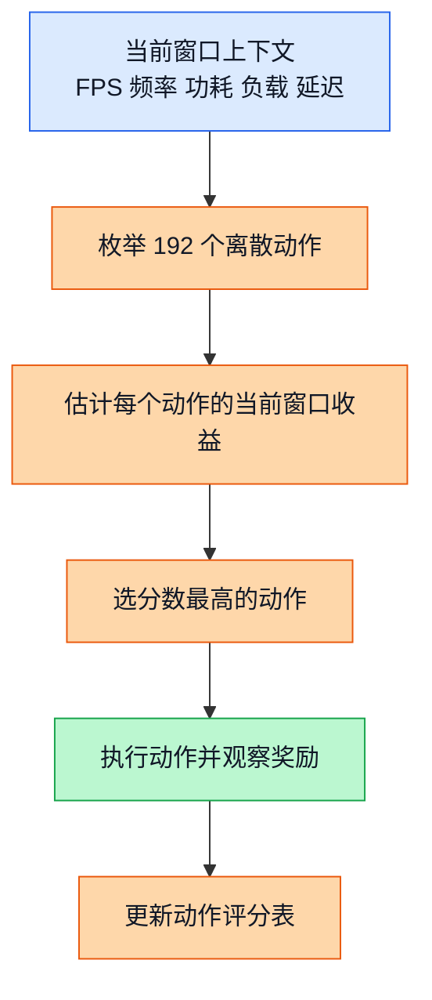
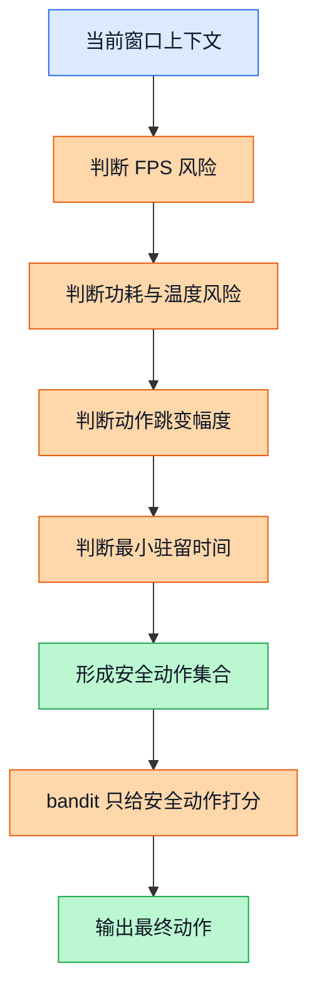
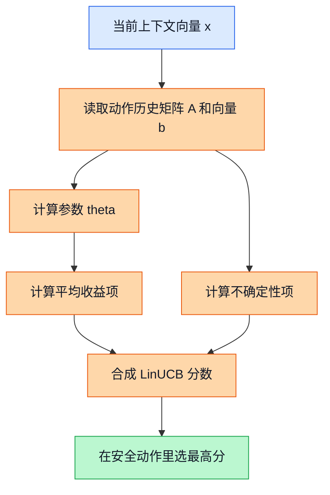

# 06 安全上下文老虎机（Safe Contextual Bandit）

## 前置阅读

- 建议先按顺序阅读本系列 `01` 到 `05` 文档，尤其是状态设计、动作设计、奖励设计、在线与离线强化学习（Reinforcement Learning）区别、以及 CQL / IQL 的基础介绍。
- 如果你手头暂时没有前文，也可以直接读本文。本文会把要用到的概念从零讲起，不默认你已经熟悉 bandit、矩阵运算或在线决策。

## 这篇要解决什么问题

前面的几份源文档给出了三个看起来不一样的结论：

- 一份更偏向 **保守离线强化学习（Offline Reinforcement Learning）**，主推 CQL、次推 IQL。
- 一份主张 **离线主策略 + 在线轻量适配器**，也就是先用 CQL 保底，再让 bandit 在安全范围内微调。
- 还有一份更激进地把 **安全上下文老虎机（Safe Contextual Bandit）** 放到第一位。

这不是谁对谁错，而是大家回答的问题不一样：

- 如果你问的是“**离线日志只有 30/192 动作覆盖时，先上线哪个最保守**”，CQL / IQL 更占优。
- 如果你问的是“**手机运行时每隔几秒就要重新选一次 DCVS 参数，哪个方法最轻、最快、最好加安全壳**”，安全上下文老虎机就很有吸引力。

先把这个大前提记住，后面你就不会把几份文档看成互相打架了。

## 1. 三份源文档到底分歧在哪里

| 来源文档 | 推荐重点 | 背后的关键假设 |
| --- | --- | --- |
| `RL_Algorithm_Selection_for_GPU_DCVS_Tuning_20260401.md` | CQL 第一，IQL 第二 | 热积累、governor 惯性、场景切换会影响后续窗口，所以完整建模成 MDP（马尔可夫决策过程，Markov Decision Process）更稳妥；同时离线数据覆盖率只有 `30/192 = 15.6%`，保守方法更安全 |
| `RL_DCVS_AI_Integrated_Decision_2026-04-01.md` | CQL 主策略 + bandit 适配层 | 离线主策略负责保底，bandit 只在安全候选集里做小步在线适配，解决场景漂移 |
| `RL_DCVS_Runtime_Adaptive_Independent_Decision_GPT-5.4_2026-04-01_135421.md` | Safe Short-History Contextual Bandit 第一 | 运行时目标更像“当前窗口看仪表盘，当前窗口选动作”，长时依赖存在但不至于强到必须一开始就上完整 RL |

把这三份判断翻成一句大白话就是：

> CQL / IQL 更像“先把离线历史学扎实，再谨慎上线”；
> Safe Contextual Bandit 更像“在运行时用更轻的脑子，快一点做当前决策，但一定要配安全护栏”。

对 DCVS 这个问题，两边都不是胡说。关键在于你到底把问题看成：

1. “**当前 3 到 10 秒窗口**里选一个当前最合适的动作”；
2. 还是“动作会明显影响未来几十秒热状态，所以必须优化长回报”。

如果更接近第 1 类，bandit 很合适。
如果更接近第 2 类，CQL / IQL 这种更完整的 RL 会更稳。

---

## 2. 概念一：上下文老虎机（Contextual Bandit）

### 2.1 直觉类比

把它想成一个值班调参工程师。

这个工程师每隔 5 秒抬头看一次监控屏：

- 现在 FPS 是不是还在 `59-60`；
- GPU 频率是在 `282-710 MHz` 的哪一档；
- GPU 使用率是不是已经冲到 `80%` 以上；
- 功耗是不是已经逼近 `8000 mW` 上限；
- `lateness_ms`、`gpu_headroom_ms`、`fence_avg_latency_ms` 这些“快要出事”的信号有没有恶化。

然后他马上做一个决定：从 `192` 个离散动作里选一组 DCVS 参数，先顶住下一小段时间。

这就是上下文老虎机最像人的地方：**先看当前上下文，再选当前动作，主要关心“这一手下去眼前能拿多少分”**。

### 2.2 正式定义

在上下文老虎机里，每个决策时刻 $t$ 会发生四件事：

1. 看到当前上下文 $x_t$；
2. 从动作集合 $\mathcal{A}$ 里选一个动作 $a_t$；
3. 执行动作后拿到一个即时奖励 $r_t$；
4. 用这次结果更新经验。

这里可以把 DCVS 问题写成：

$$
x_t = [\text{gpu\_usage},\ \text{gpu\_freq},\ \text{power},\ \text{fps},\ \text{lateness},\ \text{history}]^\top
$$

$$
|\mathcal{A}| = 6 \times 4 \times 4 \times 2 = 192
$$

$$
a_t^* = \arg\max_{a \in \mathcal{A}} \mathbb{E}[r_t \mid x_t, a]
$$

上面这个式子的意思很简单：
在当前上下文 $x_t$ 下，选那个**当前窗口期望得分最高**的动作。

而完整 RL 更关心的是长回报：

$$
\pi^* = \arg\max_{\pi} \mathbb{E}\left[\sum_{k=0}^{\infty}\gamma^k r_{t+k}\right]
$$

它不只盯着眼前这一手，还会担心“现在这么调，会不会 20 秒后因为热积累翻车”。

> **补充知识：期望（Expectation）到底是什么**
>
> 你可以先把“期望”理解成“如果同样的情况反复出现很多次，平均能拿多少分”。比如某个动作有时得 30 分，有时得 20 分，长期平均是 25 分，那 25 就是它的大概期望回报。
>
> 所以上面那个 $\mathbb{E}[r_t \mid x_t, a]$，不用想得太玄。它就是“在当前上下文下，如果我选动作 $a$，大致会拿到多少平均分”。

### 2.3 公式推导 + Mermaid 图

这张图展示的是“上下文老虎机”最核心的决策链路：看当前状态，估计每个动作的即时收益，选当前最划算的那个。

图里的关键路径只有一条：
**当前窗口上下文 -> 估计当前收益 -> 选动作 -> 观察结果 -> 更新经验**。
这也是为什么 bandit 通常比完整 RL 更轻：它不做很长的回报传播，重点就是把“当前这一手”选对。

### 2.4 DCVS 实际数值计算示例

先用源文档里出现过的奖励形式做一个最直观的算例：

$$
r = r_{\text{fps}} + r_{\text{freq}} + r_{\text{power}}
$$

其中：

$$
r_{\text{fps}} =
\begin{cases}
-10 \times (57 - fps), & fps < 57 \\
-2 \times (59 - fps), & 57 \le fps < 59 \\
20, & fps \ge 59
\end{cases}
$$

$$
r_{\text{freq}} = \frac{900 - gpu\_freq\_{mhz}}{80}
$$

$$
r_{\text{power}} = \frac{6000 - power\_{mw}}{400}
$$

假设当前窗口观测到：

| 指标 | 数值 |
| --- | --- |
| 当前 FPS | `59.4` |
| 当前 GPU 频率 | `430 MHz` |
| 当前 GPU 使用率 | `78%` |
| 当前功耗 | `4100 mW` |
| 当前动作空间 | `192` 个离散动作 |

现在试 3 个动作：

| 动作 | 参数组合 | 下一窗口观测结果 |
| --- | --- | --- |
| 动作甲 | `(first_step_down=10, penalty_down=90, penalty_up=85, strict_frame=1)` | `fps=59.8`，`gpu_freq=430 MHz`，`power=4200 mW` |
| 动作乙 | `(15, 95, 90, 1)` | `fps=59.5`，`gpu_freq=390 MHz`，`power=3700 mW` |
| 动作丙 | `(25, 98, 95, 0)` | `fps=58.3`，`gpu_freq=320 MHz`，`power=3100 mW` |

下面一步一步算。

**动作甲**

1. 因为 $fps = 59.8 \ge 59$，所以

$$
r_{\text{fps}} = 20
$$

2. 频率项：

$$
r_{\text{freq}} = \frac{900 - 430}{80} = \frac{470}{80} = 5.875
$$

3. 功耗项：

$$
r_{\text{power}} = \frac{6000 - 4200}{400} = \frac{1800}{400} = 4.5
$$

4. 总奖励：

$$
r_{\text{甲}} = 20 + 5.875 + 4.5 = 30.375
$$

**动作乙**

1. 因为 $fps = 59.5 \ge 59$，所以

$$
r_{\text{fps}} = 20
$$

2. 频率项：

$$
r_{\text{freq}} = \frac{900 - 390}{80} = \frac{510}{80} = 6.375
$$

3. 功耗项：

$$
r_{\text{power}} = \frac{6000 - 3700}{400} = \frac{2300}{400} = 5.75
$$

4. 总奖励：

$$
r_{\text{乙}} = 20 + 6.375 + 5.75 = 32.125
$$

**动作丙**

1. 因为 $58.3 < 59$，但还没低到 `57` 以下，所以用轻惩罚：

$$
r_{\text{fps}} = -2 \times (59 - 58.3) = -2 \times 0.7 = -1.4
$$

2. 频率项：

$$
r_{\text{freq}} = \frac{900 - 320}{80} = \frac{580}{80} = 7.25
$$

3. 功耗项：

$$
r_{\text{power}} = \frac{6000 - 3100}{400} = \frac{2900}{400} = 7.25
$$

4. 总奖励：

$$
r_{\text{丙}} = -1.4 + 7.25 + 7.25 = 13.1
$$

最后比较三者：

$$
32.125 > 30.375 > 13.1
$$

所以如果只看“当前窗口即时收益”，bandit 会更偏向 **动作乙**。
这就是上下文老虎机的核心味道：**它会优先选当前窗口综合分最高的动作**。

---

## 3. 概念二：安全上下文老虎机（Safe Contextual Bandit）

### 3.1 直觉类比

普通 bandit 像一个很聪明、手很快的实习生。
它会不停试图找到“当前最赚”的动作。

但手机 DCVS 不是刷推荐算法点击率，不能随便试。
你不可能为了探索，把 FPS 从 `59-60` 直接试到 `55`，再跟用户说“这是正常学习成本”。

所以真正能上线的，不是裸 bandit，而是 **安全上下文老虎机（Safe Contextual Bandit）**：

- 先让安全规则把危险动作挡在门外；
- 再让 bandit 只在“可接受”的小圈子里挑最优。

### 3.2 正式定义

先定义一个安全动作集合：

$$
\mathcal{A}_{safe}(x_t) =
\left\{
a \in \mathcal{A}
\ \middle| \
\hat{fps}(x_t, a) \ge 59,
\hat{power}(x_t, a) \le 6500,
\Delta(a, a_{t-1}) \le 3,
dwell_t(a_{t-1}) \ge 2
\right\}
$$

这里每个条件都能翻成工程语言：

- $\hat{fps}(x_t, a) \ge 59$：预测这一手下去，FPS 不能掉出目标线；
- $\hat{power}(x_t, a) \le 6500$：功耗不能冲得太凶；
- $\Delta(a, a_{t-1}) \le 3$：动作跳变别太猛，避免抖动；
- $dwell_t(a_{t-1}) \ge 2$：上一个动作至少待够两个决策窗口，不要刚切就又切。

然后 bandit 真正做的事，是在安全集合里选分数最高的动作：

$$
a_t^* = \arg\max_{a \in \mathcal{A}_{safe}(x_t)} score(x_t, a)
$$

> **补充知识：`argmax` 是什么意思**
>
> `argmax` 不是某种新模型，它只是“把分数最高的那个选出来”的数学写法。
> 比如 3 个动作的分数分别是 `5.2`、`6.1`、`4.7`，那 `argmax` 选的就是第二个动作。

为了定义“动作跳变”，可以把 4 个离散控制量先映射成索引：

- `first_step_down` 的 6 个档位索引为 `0` 到 `5`
- `penalty_down` 的 4 个档位索引为 `0` 到 `3`
- `penalty_up` 的 4 个档位索引为 `0` 到 `3`
- `strict_frame` 的 2 个档位索引为 `0` 到 `1`

于是跳变幅度可以写成：

$$
\Delta(a, a_{t-1}) =
|i_{fsd} - i_{fsd}^{prev}| +
|i_{pd} - i_{pd}^{prev}| +
|i_{pu} - i_{pu}^{prev}| +
|i_{sf} - i_{sf}^{prev}|
$$

### 3.3 公式推导 + Mermaid 图

这张图展示的是“安全壳”是怎么插在 bandit 前面的。

图里的关键点不是“bandit 有多聪明”，而是：
**bandit 压根没机会碰那些明显危险的动作**。
这就是为什么在高风险控制问题里，安全过滤通常比“更会探索”更重要。

### 3.4 DCVS 实际数值计算示例

假设当前窗口数据是：

| 指标 | 数值 |
| --- | --- |
| 当前 FPS | `59.4` |
| 当前 GPU 使用率 | `82%` |
| 当前 GPU 频率 | `430 MHz` |
| 当前功耗 | `4300 mW` |
| 上一个动作 | `(10, 90, 85, 1)` |
| 上一个动作已持续 | `3` 个决策窗口 |

安全规则设成：

$$
\hat{fps}(x_t, a) \ge 59,\quad
\hat{power}(x_t, a) \le 6500,\quad
\Delta(a, a_{t-1}) \le 3,\quad
dwell_t(a_{t-1}) \ge 2
$$

现在有 4 个候选动作：

| 动作 | 参数组合 | 预测 FPS | 预测功耗 mW | 跳变幅度 $\Delta$ | 是否安全 |
| --- | --- | --- | --- | --- | --- |
| 动作甲 | `(10, 90, 85, 1)` | `59.7` | `4400` | `0` | 安全 |
| 动作乙 | `(15, 95, 90, 1)` | `59.1` | `4000` | `3` | 安全 |
| 动作丙 | `(25, 98, 95, 0)` | `58.6` | `3200` | `8` | 不安全 |
| 动作丁 | `(3, 85, 85, 0)` | `60.0` | `6900` | `4` | 不安全 |

把判断过程拆开看：

**动作甲**

- FPS：$59.7 \ge 59$，通过
- 功耗：$4400 \le 6500$，通过
- 跳变：$\Delta = 0 \le 3$，通过
- 驻留：上一个动作已经待了 `3` 个窗口，而阈值是 `2`，通过

所以动作甲进安全集合。

**动作乙**

- FPS：$59.1 \ge 59$，通过
- 功耗：$4000 \le 6500$，通过
- 跳变：$\Delta = 3 \le 3$，刚好卡线通过
- 驻留：通过

所以动作乙也进安全集合。

**动作丙**

- FPS：$58.6 < 59$，直接失败
- 跳变：$\Delta = 8 > 3$，就算 FPS 勉强过线，也会因为跳太猛被挡掉

所以动作丙出局。

**动作丁**

- FPS：$60.0 \ge 59$，通过
- 功耗：$6900 > 6500$，失败
- 跳变：$\Delta = 4 > 3$，也失败

所以动作丁出局。

最后得到：

$$
\mathcal{A}_{safe}(x_t) = \{\text{动作甲}, \text{动作乙}\}
$$

也就是说，**虽然总动作空间有 192 个，但这一刻 bandit 真正能选的，只剩下 2 个安全动作**。
这就是“安全上下文老虎机”和“普通老虎机”的本质差别。

---

## 4. 概念三：LinUCB 是怎么给安全动作打分的

现实工程里，安全上下文老虎机可以用很多实现：

- `LinUCB`
- `Thompson Sampling`
- `Neural Contextual Bandit`
- `Neural Thompson Sampling`

这篇先重点讲 **LinUCB**，因为它最适合教学：公式清楚，手算也还能跟得上。

### 4.1 直觉类比

你可以把 LinUCB 想成一张“带不确定度的成绩单”。

对每个动作，它都会记两件事：

1. 这个动作在类似场景里**平均表现怎么样**；
2. 我对这个判断**到底有多确定**。

如果某个动作平均分高，LinUCB 会喜欢它。
如果某个动作虽然还没见过太多次，但很有潜力，LinUCB 也会因为“不确定性加成”愿意给它一点机会。

所以它不是纯贪心，也不是瞎试，而是：

> **高均值优先，但对还没摸透的安全动作保留一点探索空间。**

### 4.2 正式定义

对每个动作 $a$，LinUCB 维护：

$$
A_a = I + \sum_{i: a_i = a} x_i x_i^\top
$$

$$
b_a = \sum_{i: a_i = a} r_i x_i
$$

$$
\hat{\theta}_a = A_a^{-1} b_a
$$

然后在当前上下文 $x_t$ 下，给动作 $a$ 一个分数：

$$
p_a(x_t) = \hat{\theta}_a^\top x_t + \alpha \sqrt{x_t^\top A_a^{-1} x_t}
$$

其中：

- $\hat{\theta}_a^\top x_t$ 是“我预计它这次能拿多少分”；
- $\alpha \sqrt{x_t^\top A_a^{-1} x_t}$ 是“我还不太确定，所以给一点探索奖励”；
- $\alpha$ 越大，探索越激进。

> **补充知识：向量点乘（dot product）是什么**
>
> 如果有两个向量 $u = [u_1, u_2, u_3]^\top$ 和 $v = [v_1, v_2, v_3]^\top$，那 $u^\top v$ 就是对应位置相乘再相加，也就是：
>
> $$
> u^\top v = u_1 v_1 + u_2 v_2 + u_3 v_3
> $$
>
> 它可以理解成“把一组特征按不同权重加权求和”。所以 $\hat{\theta}_a^\top x_t$，本质上就是“按这个动作学到的权重，给当前上下文打一个总分”。

> **补充知识：矩阵逆（matrix inverse）先怎么理解**
>
> 你暂时不用把它想成很抽象的线性代数对象。这里可以先把 $A_a^{-1}$ 理解成一种“历史证据折算器”。某个方向的数据越少，模型越不确定，$x_t^\top A_a^{-1} x_t$ 往往就越大；反过来，某个方向的数据越多，这个不确定性就会缩小。
>
> 所以 LinUCB 里用到逆矩阵，不是为了炫技，而是为了估计“我对这次判断到底有多没把握”。

### 4.3 公式推导 + Mermaid 图

这张图展示的是 LinUCB 的分数是怎么拆成“利用”和“探索”两部分的。

图里的关键路径是：

$$
\text{平均收益项} + \text{不确定性项} = \text{最终分数}
$$

平均收益项负责“别忘了利用好动作”，不确定性项负责“别把还没摸清的安全动作永远雪藏”。

### 4.4 DCVS 实际数值计算示例

为了让你能手算，我们先把上下文缩成 3 维，而不是一次塞进十几维。

定义：

$$
x_t = [1,\ u_t,\ e_t]^\top
$$

其中：

$$
u_t = \frac{gpu\_usage\_pct}{100}
$$

$$
e_t = 60 - fps_t
$$

假设当前窗口是：

- `gpu_usage_pct = 78`
- `fps_t = 59.4`

那么：

$$
u_t = \frac{78}{100} = 0.78
$$

$$
e_t = 60 - 59.4 = 0.6
$$

所以当前上下文向量是：

$$
x_t = [1,\ 0.78,\ 0.6]^\top
$$

经过前面的安全过滤后，只剩 3 个安全动作：

| 动作 | 参数组合 |
| --- | --- |
| 动作甲 | `(10, 90, 85, 1)` |
| 动作乙 | `(15, 95, 90, 1)` |
| 动作丙 | `(20, 95, 90, 1)` |

现在逐个算 LinUCB 分数，设 $\alpha = 0.8$。

#### 动作甲

先假设历史统计已经积累成：

$$
A_{\text{甲}} =
\begin{bmatrix}
5 & 0 & 0 \\
0 & 3 & 0 \\
0 & 0 & 9
\end{bmatrix},
\quad
b_{\text{甲}} =
\begin{bmatrix}
18 \\
7.2 \\
-6.3
\end{bmatrix}
$$

1. 先求逆矩阵：

$$
A_{\text{甲}}^{-1} =
\begin{bmatrix}
0.2 & 0 & 0 \\
0 & \frac{1}{3} & 0 \\
0 & 0 & \frac{1}{9}
\end{bmatrix}
$$

2. 计算参数向量：

$$
\hat{\theta}_{\text{甲}} = A_{\text{甲}}^{-1} b_{\text{甲}} =
\begin{bmatrix}
18 \times 0.2 \\
7.2 \times \frac{1}{3} \\
-6.3 \times \frac{1}{9}
\end{bmatrix}
=
\begin{bmatrix}
3.6 \\
2.4 \\
-0.7
\end{bmatrix}
$$

3. 计算平均收益项：

$$
\hat{\theta}_{\text{甲}}^\top x_t
= 3.6 + 2.4 \times 0.78 - 0.7 \times 0.6
$$

$$
= 3.6 + 1.872 - 0.42 = 5.052
$$

4. 计算不确定性项内部：

$$
x_t^\top A_{\text{甲}}^{-1} x_t
= 1^2 \times 0.2 + 0.78^2 \times \frac{1}{3} + 0.6^2 \times \frac{1}{9}
$$

$$
= 0.2 + \frac{0.6084}{3} + \frac{0.36}{9}
$$

$$
= 0.2 + 0.2028 + 0.04 = 0.4428
$$

5. 开方并乘上 $\alpha$：

$$
\sqrt{0.4428} \approx 0.6654
$$

$$
0.8 \times 0.6654 \approx 0.5323
$$

6. 最终分数：

$$
p_{\text{甲}}(x_t) = 5.052 + 0.5323 = 5.5843
$$

#### 动作乙

假设：

$$
A_{\text{乙}} =
\begin{bmatrix}
8 & 0 & 0 \\
0 & 5 & 0 \\
0 & 0 & 5
\end{bmatrix},
\quad
b_{\text{乙}} =
\begin{bmatrix}
25.6 \\
13 \\
-3.5
\end{bmatrix}
$$

1. 参数向量：

$$
\hat{\theta}_{\text{乙}} =
\begin{bmatrix}
25.6/8 \\
13/5 \\
-3.5/5
\end{bmatrix}
=
\begin{bmatrix}
3.2 \\
2.6 \\
-0.7
\end{bmatrix}
$$

2. 平均收益项：

$$
\hat{\theta}_{\text{乙}}^\top x_t
= 3.2 + 2.6 \times 0.78 - 0.7 \times 0.6
$$

$$
= 3.2 + 2.028 - 0.42 = 4.808
$$

3. 不确定性项内部：

$$
x_t^\top A_{\text{乙}}^{-1} x_t
= \frac{1}{8} + \frac{0.6084}{5} + \frac{0.36}{5}
$$

$$
= 0.125 + 0.12168 + 0.072 = 0.31868
$$

4. 开方并乘上 $\alpha$：

$$
\sqrt{0.31868} \approx 0.5645
$$

$$
0.8 \times 0.5645 \approx 0.4516
$$

5. 最终分数：

$$
p_{\text{乙}}(x_t) = 4.808 + 0.4516 = 5.2596
$$

#### 动作丙

假设：

$$
A_{\text{丙}} =
\begin{bmatrix}
3 & 0 & 0 \\
0 & 2 & 0 \\
0 & 0 & 4
\end{bmatrix},
\quad
b_{\text{丙}} =
\begin{bmatrix}
10.5 \\
6.6 \\
-1.6
\end{bmatrix}
$$

1. 参数向量：

$$
\hat{\theta}_{\text{丙}} =
\begin{bmatrix}
10.5/3 \\
6.6/2 \\
-1.6/4
\end{bmatrix}
=
\begin{bmatrix}
3.5 \\
3.3 \\
-0.4
\end{bmatrix}
$$

2. 平均收益项：

$$
\hat{\theta}_{\text{丙}}^\top x_t
= 3.5 + 3.3 \times 0.78 - 0.4 \times 0.6
$$

$$
= 3.5 + 2.574 - 0.24 = 5.834
$$

3. 不确定性项内部：

$$
x_t^\top A_{\text{丙}}^{-1} x_t
= \frac{1}{3} + \frac{0.6084}{2} + \frac{0.36}{4}
$$

$$
= 0.3333 + 0.3042 + 0.09 = 0.7275
$$

4. 开方并乘上 $\alpha$：

$$
\sqrt{0.7275} \approx 0.8529
$$

$$
0.8 \times 0.8529 \approx 0.6823
$$

5. 最终分数：

$$
p_{\text{丙}}(x_t) = 5.834 + 0.6823 = 6.5163
$$

最后比较：

$$
6.5163 > 5.5843 > 5.2596
$$

所以 LinUCB 会选 **动作丙**。

如果动作丙在下一窗口的真实结果是：

- `fps = 59.0`
- `gpu_freq = 360 MHz`
- `power = 3500 mW`

那即时奖励就是：

$$
r_{\text{丙,真实}} = 20 + \frac{900 - 360}{80} + \frac{6000 - 3500}{400}
$$

$$
= 20 + \frac{540}{80} + \frac{2500}{400}
$$

$$
= 20 + 6.75 + 6.25 = 33.0
$$

于是动作丙的历史就会更新。

先算外积：

$$
x_t x_t^\top =
\begin{bmatrix}
1 \\
0.78 \\
0.6
\end{bmatrix}
\begin{bmatrix}
1 & 0.78 & 0.6
\end{bmatrix}
=
\begin{bmatrix}
1 & 0.78 & 0.6 \\
0.78 & 0.6084 & 0.468 \\
0.6 & 0.468 & 0.36
\end{bmatrix}
$$

然后更新矩阵：

$$
A_{\text{丙}}' = A_{\text{丙}} + x_t x_t^\top
=
\begin{bmatrix}
4 & 0.78 & 0.6 \\
0.78 & 2.6084 & 0.468 \\
0.6 & 0.468 & 4.36
\end{bmatrix}
$$

再更新向量：

$$
b_{\text{丙}}' = b_{\text{丙}} + r_{\text{丙,真实}} x_t
$$

$$
=
\begin{bmatrix}
10.5 \\
6.6 \\
-1.6
\end{bmatrix}
+
33
\begin{bmatrix}
1 \\
0.78 \\
0.6
\end{bmatrix}
$$

$$
=
\begin{bmatrix}
10.5 \\
6.6 \\
-1.6
\end{bmatrix}
+
\begin{bmatrix}
33 \\
25.74 \\
19.8
\end{bmatrix}
=
\begin{bmatrix}
43.5 \\
32.34 \\
18.2
\end{bmatrix}
$$

> **补充知识：$x_t x_t^\top$ 在干什么**
>
> 你可以把它理解成“把这次上下文留下来，记进历史账本”。
> 以后只要类似的上下文反复出现，对应方向的证据就会越来越多，不确定性也会慢慢下降。

这就是 LinUCB 的完整闭环：
**安全过滤后选动作 -> 得到真实奖励 -> 把这次经验写回去**。

---

## 5. 为什么三份源文档会得出不同推荐

现在可以回过头解释那三个看似不同的结论了。

### 5.1 它们其实在回答不同层次的问题

| 问题层次 | 更自然的答案 |
| --- | --- |
| “离线日志覆盖率只有 `30/192`，想先找一个最保守的初始策略，哪个好？” | CQL / IQL 更自然 |
| “运行时每隔几秒要根据场景变化做一次轻量决策，哪个更直接？” | Safe Contextual Bandit 更自然 |
| “能不能既保守，又有一点在线适应能力？” | CQL 主策略 + 安全过滤 + bandit 适配层 |

也就是说，大家不是在争一个“宇宙唯一正确算法”，而是在争：

- 谁来做**离线保底**；
- 谁来做**运行时微调**；
- 谁来承担**安全责任**。

### 5.2 这些分歧背后其实是 5 个核心假设

| 维度 | 倾向 Safe Contextual Bandit 的假设 | 倾向 CQL / IQL 的假设 |
| --- | --- | --- |
| 问题建模 | 当前窗口决策最重要 | 长时回报更重要 |
| 时间依赖 | 热惯性和 governor 记忆是“中等影响” | 热惯性和状态转移影响更强 |
| 数据使用方式 | 可以在线小步学习 | 先离线学稳更重要 |
| 动作空间 | `192` 个离散动作很适合 bandit | `192` 个离散动作也很适合离线 Q 学习 |
| 安全策略 | 先用安全过滤缩小动作集 | 先用保守价值函数限制 OOD 风险 |

### 5.3 对这个项目，最务实的理解是什么

对 GPU DCVS 而言，最务实的理解不是“bandit 完全替代 RL”，而是：

$$
\text{Safe Contextual Bandit} \approx
\text{当前窗口优化器}
$$

$$
\text{CQL / IQL} \approx
\text{离线保守先验或更长时序的主策略}
$$

所以一个很合理的工程落地顺序其实是：

1. 先用离线数据找出一批安全动作；
2. 把原始 `192` 个动作缩成更小的安全候选集；
3. 运行时只在这个安全子集里做 bandit 决策；
4. 如果后面确认热积累对未来几十秒影响很强，再上 CQL / IQL 主导。

这也是为什么第二份源文档会给出“**CQL 主策略 + bandit 在线适配器**”这种折中方案。

---

## 6. 什么时候该选 Safe Contextual Bandit，什么时候别硬上

### 6.1 适合用 Safe Contextual Bandit 的信号

如果你看到下面这些条件同时成立，bandit 往往是很好的首发方案：

- 决策周期是 `3-10` 秒，而不是每帧都调；
- 当前动作主要影响当前窗口和下一两个窗口；
- 动作空间是离散的，像现在这样正好有 `192` 个动作；
- 可以写出清晰的安全规则，比如 FPS、功耗、最小驻留时间、跳变幅度；
- 你更在意“快、稳、可回退”，而不是一开始就追求最完整的长时序建模。

### 6.2 不适合只靠 Safe Contextual Bandit 的信号

如果下面这些现象越来越明显，就别把 bandit 当万能药：

- 当前动作会显著影响未来 `30-120` 秒的热状态；
- 不同游戏场景切换后，延迟回报特别明显；
- 你发现“当前窗口看起来不错”的动作，常常在后面连续几个窗口补刀；
- 离线日志覆盖太差，连安全动作集合都很难可靠估计；
- 动作以后要从离散组合扩展成连续残差控制。

一旦这些信号变强，CQL / IQL，甚至更完整的 MDP 建模，就会越来越有必要。

### 6.3 一个很重要的底线

**不要让 bandit 直接在原始 192 个动作上裸探索。**

这是本文最想强调的一句话。
在 DCVS 这种高风险控制场景里，bandit 能成立的前提，不是“它足够聪明”，而是：

$$
\text{安全过滤} \rightarrow \text{安全候选集} \rightarrow \text{bandit 选择}
$$

只要这条顺序反过来，风险就会立刻放大。

---

## 7. 一个适合这个项目的务实落地顺序

如果你现在就要把 Safe Contextual Bandit 往工程里落，比较稳的顺序是：

1. 用已有离线日志先筛一遍，把明显危险的动作去掉；
2. 上下文里不要只放当前值，至少拼上最近 `1-3` 个窗口的短历史；
3. 先做 `LinUCB` 这种可解释基线，别一上来就神经网络；
4. 设清楚安全阈值，比如 `FPS >= 59`、功耗上限、最小驻留时间、动作跳变上限；
5. 一旦连续两个窗口 `FPS < 57`，立即回退到保守动作；
6. 如果后面确认“短历史 bandit 还是压不住长时热效应”，再把主策略升级到 CQL / IQL。

这个顺序的核心不是追求最炫，而是先把系统做成：

- 能解释；
- 能验证；
- 能回退；
- 真机上敢开。

## 关键收获

- **上下文老虎机**最适合回答的问题是：“在当前上下文下，哪个动作能让当前窗口拿最高分？”
- **安全上下文老虎机**不是让 bandit 更大胆，而是先用安全规则把危险动作挡掉，再让 bandit 在安全集合里做选择。
- 对 DCVS 这类高风险控制问题，真正关键的顺序是：**安全过滤 -> 安全候选集 -> bandit 选择**。
- 三份源文档之所以给出不同推荐，不是互相矛盾，而是因为它们分别强调了离线保守性、运行时轻量适配、以及两者结合。
- 在当前项目里，Safe Contextual Bandit 更像“运行时短窗口优化器”；CQL / IQL 更像“离线保守先验或长时序主策略”。
- 如果热积累和延迟效应越来越强，单靠 bandit 就不够了，这时应该把问题重新抬回 MDP 视角，考虑 CQL / IQL 或更完整的 RL 方法。
