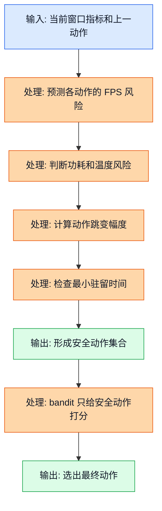
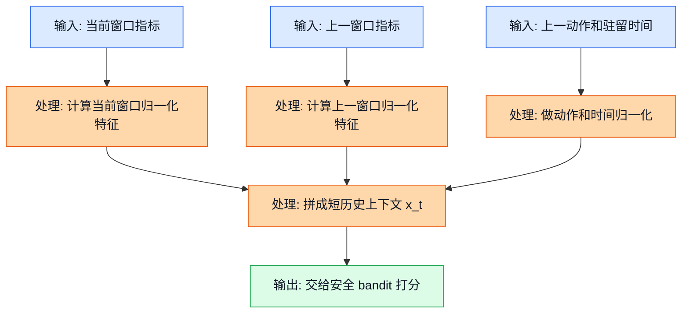
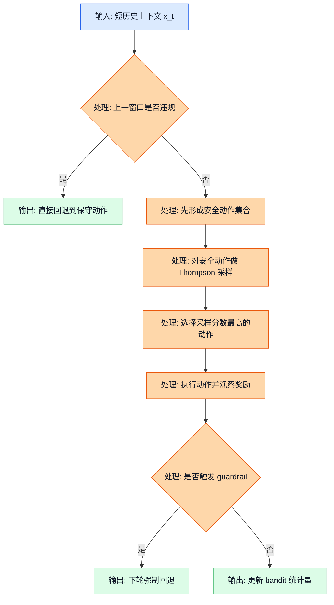
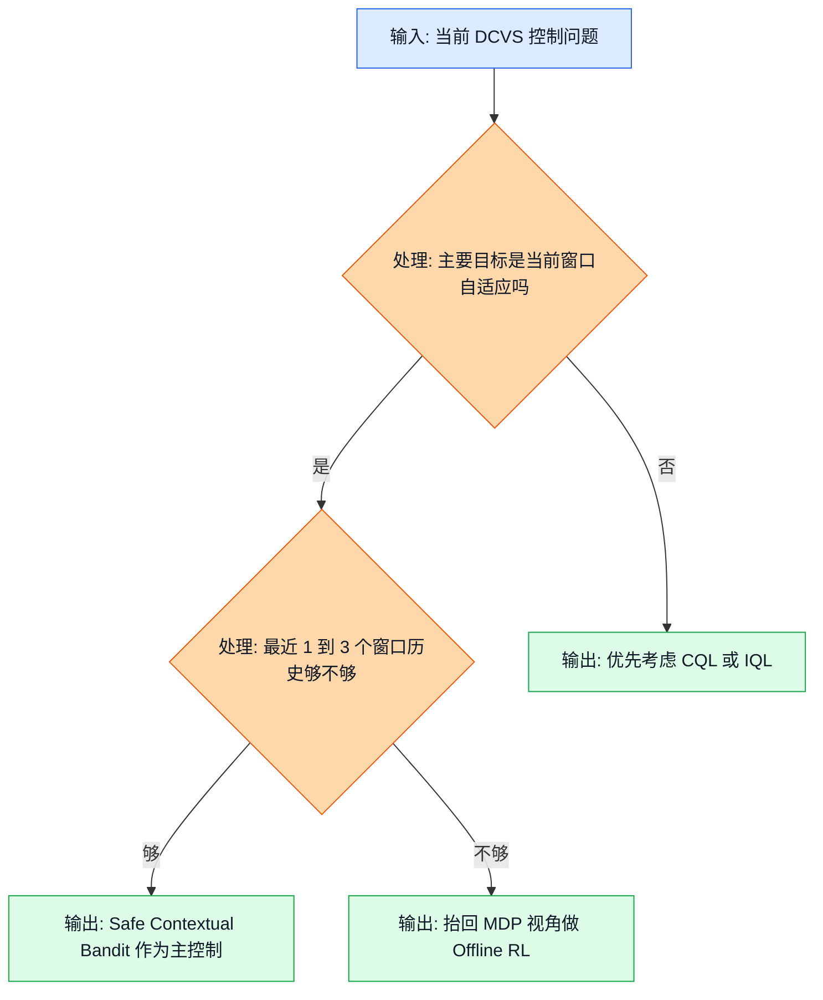

## 前置阅读

- 建议先读 `05_Contextual_Bandits.md`，因为本文默认你已经接受一个前提：同一个动作在不同上下文里，表现会完全不一样。
- 如果你对 `192` 个离散 `action_id` 是怎么编码出来的还不熟，先补 `02_RL_Core_Concepts.md`。
- 如果你想先复习普通老虎机和探索/利用，再回看 `04_Multi_Armed_Bandits.md`。

# 06 安全上下文老虎机（Safe Contextual Bandit）

## 这篇要解决什么问题

`05_Contextual_Bandits.md` 讲清楚了“看当前上下文选当前动作”这条主线，但真到 GPU DCVS 上线时，还差最后一层现实约束：**不能让模型在 192 个动作上裸探索**。

三份源文档看起来像在给出不同答案，其实它们在回答不同问题：

| 来源 | 它主要在问什么 | 所以自然会偏向谁 |
| --- | --- | --- |
| `RL_Algorithm_Selection_for_GPU_DCVS_Tuning_20260401.md` | 在当前离线日志覆盖只有 `30/192` 时，先上哪个主算法最保守 | 离散保守 Q 学习（Discrete CQL, Conservative Q-Learning） |
| `RL_DCVS_AI_Integrated_Decision_2026-04-01.md` | 离线主策略和运行时控制怎么搭起来更稳 | CQL 主策略 + 安全过滤 + 可选 bandit 适配层 |
| `RL_DCVS_Runtime_Adaptive_Independent_Decision_GPT-5.4_2026-04-01_135421.md` | 如果重点是运行时每 `3` 到 `10` 秒自适应一次，谁最贴题 | 安全短历史上下文老虎机（Safe Short-History Contextual Bandit） |

所以本文不是重复讲一遍上下文老虎机，而是把它补成一个能上线的版本。核心只加三层：

1. 先把危险动作筛掉，只保留安全动作集合（Safe Action Set）。
2. 上下文里别只看这一刻，要把最近 `1` 到 `3` 个窗口的短历史塞进去。
3. 真的出事时，要允许系统立刻回退（Rollback）到保守动作。

---

## 1. 概念一：安全动作集合（Safe Action Set）

### 1.1 直觉类比

把 bandit 想成一个很会试参数的实习生。

如果你把全部 `192` 个动作都扔给他，他当然可能试出很省电的组合，但也可能在高负载团战时一脚把频率踩太低，直接把 `FPS` 从 `59-60` 打到 `56`。

真正能上线的做法不是“让他更聪明”，而是先给他一张禁用清单：

- 可能掉出 `59 FPS` 的动作，不许碰；
- 可能把功耗顶到太高的动作，不许碰；
- 和上一个动作跳太远、容易抖动的动作，不许碰；
- 上一个动作刚切完就又想切，也不许碰。

这张禁用清单过滤完以后，模型才在剩下的动作里挑最优。这个“剩下的动作集合”，就是安全动作集合。

### 1.2 正式定义

当前项目的动作空间来自 4 个 DCVS 参数：

- `first_step_down`：`[3, 5, 10, 15, 20, 25]`
- `penalty_down`：`[85, 90, 95, 98]`
- `penalty_up`：`[85, 90, 95, 98]`
- `strict_frame`：`[0, 1]`

所以总动作数是：

$$
|\mathcal{A}| = 6 \times 4 \times 4 \times 2 = 192
$$

安全动作集合可以写成：

$$
\mathcal{A}_{safe}(x_t) =
\left\{
a \in \mathcal{A}
\ \middle| \
\hat{fps}(x_t, a) \ge 59,\;
\hat{power}(x_t, a) \le 6500,\;
\Delta(a, a_{t-1}) \le 3,\;
dwell_t \ge 2
\right\}
$$

这 4 个条件分别对应 4 个工程意思：

- $\hat{fps}(x_t, a) \ge 59$：预测下一窗口还守得住目标帧率；
- $\hat{power}(x_t, a) \le 6500$：别为了稳帧把功耗冲太高；
- $\Delta(a, a_{t-1}) \le 3$：动作跳变别太猛；
- $dwell_t \ge 2$：上一个动作至少先待够两个窗口。

动作跳变幅度可以写成：

$$
\Delta(a, a_{t-1}) =
|i_{\text{fsd}} - i_{\text{fsd}}^{prev}| +
|i_{\text{pd}} - i_{\text{pd}}^{prev}| +
|i_{\text{pu}} - i_{\text{pu}}^{prev}| +
|i_{\text{sf}} - i_{\text{sf}}^{prev}|
$$

这里的 $i_{\text{fsd}}$、$i_{\text{pd}}$、$i_{\text{pu}}$、$i_{\text{sf}}$，就是 4 个参数在各自离散列表里的档位索引。

> 补充知识：集合筛选写法到底在说什么
>
> 像 $\{a \in \mathcal{A} \mid \text{条件}\}$ 这种写法，你可以直接读成：“从全集 $\mathcal{A}$ 里，把满足这些条件的动作挑出来。”
>
> 所以上面的式子一点也不神秘，它只是把“先筛，再选”这件工程动作，翻成了数学符号。

### 1.3 公式推导 + Mermaid 图

这张图展示的是安全壳到底插在什么位置。关键不是模型有多会打分，而是模型根本看不到那些明显危险的动作。

图里的关键路径是：**先过滤，再打分**。如果这条顺序反过来，bandit 就会先被高分动作诱惑，再事后想办法补救，风险会大很多。

### 1.4 DCVS 实际数值计算示例

假设上一窗口执行的就是源文档里出现过的单一动作：

$$
action\_id = 72 \Rightarrow (10,\ 90,\ 85,\ 0)
$$

它在 4 个参数列表里的索引分别是：

$$
(i_{\text{fsd}}^{prev}, i_{\text{pd}}^{prev}, i_{\text{pu}}^{prev}, i_{\text{sf}}^{prev}) = (2, 1, 0, 0)
$$

当前窗口观测到：

| 指标 | 数值 |
| --- | --- |
| 当前 FPS | `59.3` |
| 当前 GPU 频率 | `430 MHz` |
| 当前 GPU 使用率 | `82%` |
| 当前功耗 | `4300 mW` |
| 上一个动作已持续 | `3` 个窗口 |

现在从 `192` 个动作里拿 4 个候选动作来筛。

| 候选动作 | 参数组合 | 档位索引 | 预测 FPS | 预测功耗 mW |
| --- | --- | --- | --- | --- |
| 动作甲 | `(10, 90, 85, 0)` | `(2, 1, 0, 0)` | `59.6` | `4300` |
| 动作乙 | `(15, 95, 90, 0)` | `(3, 2, 1, 0)` | `59.1` | `3900` |
| 动作丙 | `(25, 98, 95, 1)` | `(5, 3, 2, 1)` | `58.4` | `3200` |
| 动作丁 | `(5, 85, 85, 0)` | `(1, 0, 0, 0)` | `60.0` | `6900` |

下面一步一步算跳变幅度。

**动作甲**

$$
\Delta_{\text{甲}} =
|2-2| + |1-1| + |0-0| + |0-0|
= 0 + 0 + 0 + 0 = 0
$$

所以动作甲满足：

- $59.6 \ge 59$
- $4300 \le 6500$
- $\Delta_{\text{甲}} = 0 \le 3$
- `dwell = 3 \ge 2`

动作甲安全。

**动作乙**

$$
\Delta_{\text{乙}} =
|3-2| + |2-1| + |1-0| + |0-0|
= 1 + 1 + 1 + 0 = 3
$$

所以动作乙满足：

- $59.1 \ge 59$
- $3900 \le 6500$
- $\Delta_{\text{乙}} = 3 \le 3$
- `dwell = 3 \ge 2`

动作乙也安全。

**动作丙**

$$
\Delta_{\text{丙}} =
|5-2| + |3-1| + |2-0| + |1-0|
= 3 + 2 + 2 + 1 = 8
$$

这里它有两条不过线：

- $58.4 < 59$
- $\Delta_{\text{丙}} = 8 > 3$

动作丙不安全。

**动作丁**

$$
\Delta_{\text{丁}} =
|1-2| + |0-1| + |0-0| + |0-0|
= 1 + 1 + 0 + 0 = 2
$$

跳变虽然合格，但功耗不过线：

$$
6900 > 6500
$$

动作丁不安全。

最后得到：

$$
\mathcal{A}_{safe}(x_t) = \{\text{动作甲},\ \text{动作乙}\}
$$

也就是说，这一刻虽然全动作空间有 `192` 个动作，但 bandit 真正能考虑的只剩 `2` 个。这就是“安全上下文老虎机”和“普通上下文老虎机”最大的区别。

---

## 2. 概念二：短历史上下文（Short-History Context）

### 2.1 直觉类比

如果你只看一个瞬间的监控截图，很容易误判。

比如现在 `FPS = 59.3`，看上去还在目标线里。但如果你知道前一个窗口是 `59.8`，再前一个是 `60.1`，而且 `lateness_ms` 正在升高，那你就会意识到：这不是“稳”，而是“正在往坏的方向滑”。

这就是为什么运行时文档最后强调的不是“纯无记忆 bandit”，而是**安全短历史上下文老虎机**。它的意思很朴素：别只看这一秒，要把最近 `1` 到 `3` 个窗口一起看。

### 2.2 正式定义

先把单个窗口的简化状态向量记成：

$$
z_t =
\begin{bmatrix}
u_t \\
l_t \\
f_t
\end{bmatrix}
$$

其中：

$$
u_t = \frac{\mathrm{gpu\_usage\_pct}_t}{100}
$$

$$
l_t = \frac{\min(\max(\mathrm{lateness\_ms}_t, 0), 5)}{5}
$$

$$
f_t = \frac{\mathrm{gpu\_freq\_mhz}_t - 282}{710 - 282}
$$

然后把最近两个窗口、上一动作和驻留时间一起拼起来：

$$
x_t =
\begin{bmatrix}
z_t \\
z_{t-1} \\
a_{t-1}^{norm} \\
d_t^{norm}
\end{bmatrix}

=
\begin{bmatrix}
u_t \\
l_t \\
f_t \\
u_{t-1} \\
l_{t-1} \\
f_{t-1} \\
a_{t-1}^{norm} \\
d_t^{norm}
\end{bmatrix}
$$

这里再定义两个归一化量：

$$
a_{t-1}^{norm} = \frac{a_{t-1}}{191}
$$

$$
d_t^{norm} = \frac{\min(dwell_t, 4)}{4}
$$

这个写法的意思其实很简单：当前窗口还是最重要，但前一个窗口和上一动作也要一起进来，因为 DCVS 确实存在 governor 记忆、热惯性、动作切换抖动这些“弱时序”因素。

> 补充知识：向量拼接和归一化怎么理解
>
> 向量拼接，你可以先把它理解成“把几组数字首尾相连，装进同一个列表”。比如 $[0.82, 0.22, 0.42]^T$ 和 $[0.71, 0.06, 0.35]^T$ 拼起来，就是一个更长的列表。
>
> 归一化的作用，是把不同单位的量拉到差不多的尺度。比如 GPU 频率是几百 MHz，`lateness_ms` 可能只有 `0.3` 或 `1.1`。如果不先缩放，模型容易把“数值大”误当成“更重要”。

### 2.3 公式推导 + Mermaid 图

这张图展示的是“短历史”到底怎么进入 bandit 的输入，而不是只在口头上说一句“考虑历史”。

图里的关键路径是：**当前窗口特征 + 上一窗口特征 + 上一动作信息** 一起形成输入。这样模型才看得到“风险是在变好还是变坏”。

### 2.4 DCVS 实际数值计算示例

假设当前窗口和上一窗口的数据如下：

| 窗口 | GPU 使用率 | `lateness_ms` | GPU 频率 |
| --- | --- | --- | --- |
| 当前窗口 $t$ | `82%` | `1.1` | `460 MHz` |
| 上一窗口 $t-1$ | `71%` | `0.3` | `430 MHz` |

再加上：

- 上一动作还是 `action_id = 72`
- 这个动作已经连续执行 `3` 个窗口

下面一步一步归一化。

**当前窗口**

1. GPU 使用率：

$$
u_t = \frac{82}{100} = 0.82
$$

2. 延迟：

$$
l_t = \frac{1.1}{5} = 0.22
$$

3. GPU 频率：

$$
f_t = \frac{460 - 282}{710 - 282} = \frac{178}{428} \approx 0.416
$$

**上一窗口**

1. GPU 使用率：

$$
u_{t-1} = \frac{71}{100} = 0.71
$$

2. 延迟：

$$
l_{t-1} = \frac{0.3}{5} = 0.06
$$

3. GPU 频率：

$$
f_{t-1} = \frac{430 - 282}{428} = \frac{148}{428} \approx 0.346
$$

**上一动作和驻留时间**

1. 动作归一化：

$$
a_{t-1}^{norm} = \frac{72}{191} \approx 0.377
$$

2. 驻留时间归一化：

$$
d_t^{norm} = \frac{3}{4} = 0.75
$$

所以最终短历史上下文向量是：

$$
x_t =
\begin{bmatrix}
0.82 \\
0.22 \\
0.416 \\
0.71 \\
0.06 \\
0.346 \\
0.377 \\
0.75
\end{bmatrix}
$$

现在再补两个趋势量，你会更容易看出“为什么短历史有意义”。

延迟变化量：

$$
\Delta l_t = l_t - l_{t-1} = 0.22 - 0.06 = 0.16
$$

频率变化量：

$$
\Delta f_t = f_t - f_{t-1} = 0.416 - 0.346 = 0.07
$$

这说明两件事正在同时发生：

- 延迟在变坏；
- GPU 频率已经在往上顶。

如果模型只看当前 `FPS = 59.3` 这一帧，它可能还会觉得“可以再激进一点”；但短历史一加进来，它就更容易意识到：当前其实是在靠升频硬撑，不应该再瞎降。

---

## 3. 概念三：带回退的安全在线选择

### 3.1 直觉类比

真正的运行时控制更像这样：

1. 先看上一窗口有没有报警；
2. 没报警，就在安全动作里挑一个；
3. 真的踩红线，下一窗口立刻退回保守动作。

这和“普通 bandit 每轮都自由探索”很不一样。手机运行时最怕的不是模型少试了一次，而是模型为了探索让用户看见明显卡顿。

运行时文档给出的首发建议是：**在安全离散动作集合上做汤普森采样（Thompson Sampling）**；如果更看重可解释性，就用 **线性上置信界（LinUCB）** 做基线。

### 3.2 正式定义

先写 bandit 的抽样分数：

$$
\tilde{r}_a = \mu_a(x_t) + \sigma_a(x_t)\epsilon_a,\quad \epsilon_a \sim \mathcal{N}(0,1)
$$

这里：

- $\mu_a(x_t)$ 是动作 $a$ 在当前上下文下的平均预测奖励；
- $\sigma_a(x_t)$ 是不确定性；
- $\epsilon_a$ 是一次随机采样。

然后只在安全动作集合里选分数最高的动作：

$$
a_t^{bandit} = \arg\max_{a \in \mathcal{A}_{safe}(x_t)} \tilde{r}_a
$$

但执行层还要再包一层紧急回退规则。定义一个违规指示量：

$$
v_t = \mathbb{1}[\text{fps}_t < 57 \ \text{或}\ \text{power}_t > 7000 \ \text{或}\ \text{fence}_t > 12]
$$

于是下一轮真正执行的动作可以写成：

$$
a_{t+1}^{exec} =
\begin{cases}
a_{rollback}, & v_t = 1 \\
a_{t+1}^{bandit}, & v_t = 0
\end{cases}
$$

这就是“bandit 负责在安全区里挑动作，安全壳负责兜底”的完整关系。

> 补充知识：高斯采样和指示函数怎么理解
>
> $\epsilon \sim \mathcal{N}(0,1)$ 你可以先把它理解成“从一个以 0 为中心、时大时小的随机扰动里抽一个数”。所以 $\mu + \sigma \epsilon$ 的意思就是：在平均值附近随机晃一下，不确定性越大，晃动幅度越大。
>
> $\mathbb{1}[\text{条件}]$ 叫指示函数。条件成立就记成 `1`，条件不成立就记成 `0`。它只是把“有没有违规”这种布尔判断写成数学符号。

### 3.3 公式推导 + Mermaid 图

这张图展示了安全在线闭环的关键顺序：先检查报警，再从安全集合中抽样决策，最后根据真实结果决定是否回退。

图里的关键路径只有一句话：**允许探索，但探索永远在安全集合里，而且一旦越线，下一轮就别再硬试。**

### 3.4 DCVS 实际数值计算示例

继续沿用上一节的短历史上下文，并沿用第 1 节筛出来的安全动作集合：

$$
\mathcal{A}_{safe}(x_t) = \{\text{动作甲},\ \text{动作乙}\}
$$

假设 bandit 在当前上下文下给出的均值和不确定性如下：

| 动作 | 平均预测 $\mu_a(x_t)$ | 不确定性 $\sigma_a(x_t)$ |
| --- | --- | --- |
| 动作甲 | `0.81` | `0.04` |
| 动作乙 | `0.78` | `0.14` |

这一轮随机采样到的扰动值设成：

$$
\epsilon_{\text{甲}} = -0.5,\quad \epsilon_{\text{乙}} = 0.9
$$

先算动作甲的采样分数：

$$
\tilde{r}_{\text{甲}} = 0.81 + 0.04 \times (-0.5)
$$

$$
= 0.81 - 0.02 = 0.79
$$

再算动作乙的采样分数：

$$
\tilde{r}_{\text{乙}} = 0.78 + 0.14 \times 0.9
$$

$$
= 0.78 + 0.126 = 0.906
$$

因为：

$$
0.906 > 0.79
$$

所以这轮 bandit 选择动作乙。

假设动作乙执行一个 `5` 秒窗口后，真实观测到：

- `fps = 59.1`
- `gpu_freq = 390 MHz`
- `power = 3700 mW`

先算即时奖励。这里继续沿用本系列前文的奖励形式：

$$
r = r_{\text{fps}} + r_{\text{freq}} + r_{\text{power}}
$$

因为 $59.1 \ge 59$，所以：

$$
r_{\text{fps}} = 20
$$

频率项：

$$
r_{\text{freq}} = \frac{900 - 390}{80} = \frac{510}{80} = 6.375
$$

功耗项：

$$
r_{\text{power}} = \frac{6000 - 3700}{400} = \frac{2300}{400} = 5.75
$$

总奖励：

$$
r = 20 + 6.375 + 5.75 = 32.125
$$

为了让 bandit 的数值尺度更舒服，我们把它除以 `40` 做一个简单归一化：

$$
r^{norm} = \frac{32.125}{40} = 0.803125
$$

假设动作乙此前已经被试过 `4` 次，历史平均回报是 `0.78`。那这次观测进来以后，新平均值就是：

$$
\mu_{\text{乙}}^{new} = \frac{4 \times 0.78 + 0.803125}{5}
$$

$$
= \frac{3.12 + 0.803125}{5}
$$

$$
= \frac{3.923125}{5} = 0.784625
$$

这说明动作乙虽然这次被选中了，但它的历史均值只会温和上调，不会一下子被吹成“神动作”。

再看一下紧急回退的数值判断。假设不是上面这个结果，而是下一窗口测到：

$$
\text{fps}_t = 56.8
$$

那违规指示量就是：

$$
v_t = \mathbb{1}[56.8 < 57] = 1
$$

于是下一轮不再让 bandit 自由选，而是直接执行：

$$
a_{t+1}^{exec} = a_{rollback}
$$

如果团队把保守回退动作设成 `action_id = 72`，那就等价于：

$$
a_{t+1}^{exec} = 72
$$

这就是“允许探索，但探索失败时要能马上刹车”。

---

## 4. 为什么三份源文档会得出不同推荐

现在可以把三份源文档的分歧讲透了。

### 4.1 它们不是互相打架，而是在回答不同层次的问题

| 文档 | 它强调的现实条件 | 所以推荐什么 |
| --- | --- | --- |
| `RL_Algorithm_Selection_for_GPU_DCVS_Tuning_20260401.md` | 当前离线数据总覆盖只有 `30/192`，而且明确指出时间依赖不是零，而是“中等” | 先用更保守的离散 CQL，bandit 不是首发主角 |
| `RL_DCVS_AI_Integrated_Decision_2026-04-01.md` | 被抽出来分析的那个 CSV 有 `8095` 行，但整份文件只有一个动作 `72` | 先用 CQL 做主策略，再加安全过滤和可选 bandit adapter |
| `RL_DCVS_Runtime_Adaptive_Independent_Decision_GPT-5.4_2026-04-01_135421.md` | 目标更偏运行时每 `3-10` 秒做一次动态调参，且已有丰富逐帧上下文特征 | 把 Safe Short-History Contextual Bandit 放到第一位 |

### 4.2 用数字看，分歧其实非常合理

全局已采集动作覆盖率是：

$$
\frac{30}{192} = 0.15625 = 15.625\%
$$

而那份只包含 `action_id = 72` 的单文件覆盖率是：

$$
\frac{1}{192} = 0.005208\ldots \approx 0.52\%
$$

这两个数字一放在一起，你就能明白为什么第二份文档会特别谨慎。

- 如果你拿的是 `15.625\%` 的总覆盖率视角，会担心“离线学出来的主策略够不够安全”，所以 CQL 很自然。
- 如果你拿的是 `0.52\%` 的单文件视角，会更担心“这文件几乎没动作多样性，别拿它直接做激进策略改进”。
- 如果你看的是运行时控制逻辑，而不是单纯离线训练，就会觉得“先在安全子集里做短周期自适应”更贴题。

### 4.3 最务实的理解

对当前项目，最务实的理解不是“bandit 打败了 CQL”，而是下面这句：

$$
\text{Safe Contextual Bandit} \approx \text{运行时短窗口优化器}
$$

$$
\text{CQL / IQL} \approx \text{离线保守主策略或更长时序的底座}
$$

所以一个很合理的工程路线是：

1. 离线先用 CQL 或 IQL 找安全先验；
2. 在线只在安全子集里让 bandit 做小步自适应；
3. 如果后面确认热积累和 governor 记忆比想象中更强，再把主控制器往完整离线 RL 倾斜。

---

## 5. 什么时候它是主角，什么时候该退回 CQL / IQL

先把问题形式写清楚。

安全上下文老虎机在优化的是：

$$
\max_{a \in \mathcal{A}_{safe}(x_t)} \mathbb{E}[r_t \mid x_t, a]
$$

它关心的是当前窗口这一步怎么选。

而离线强化学习（Offline Reinforcement Learning）更像在优化：

$$
\max_{\pi} \mathbb{E}\left[\sum_{k=0}^{\infty}\gamma^k r_{t+k}\right]
$$

它关心的是现在这一步会不会把未来很多步一起带坏。

### 5.1 更适合 Safe Contextual Bandit 的情况

- 决策周期本来就是 `3` 到 `10` 秒，而不是每帧都调；
- 动作空间本来就是 `192` 个离散组合，bandit 天然适配；
- 主要风险能被安全规则写出来，比如 `FPS guardrail`、功耗上限、最小驻留时间、动作跳变上限；
- 最近 `1` 到 `3` 个窗口已经足够吸收大部分热惯性和 governor 记忆；
- 你更想解决“当前场景漂移怎么快速适配”，而不是一开始就求最完整的长期最优。

### 5.2 更适合退回 CQL / IQL 的情况

- 你发现连续 `30` 到 `120` 秒的热积累，会明显改变后面很多窗口的可行动作；
- 很多动作当前窗口看起来不错，但后面连续几个窗口经常补刀；
- 安全集合本身都估不准，因为离线覆盖太差；
- 后面准备把动作从离散 `192` 档升级成连续残差控制；
- 你需要的是“先离线学稳，再慢慢上线”，而不是一开始就运行时自适应。

### 5.3 一个简单的判断图

这张图展示了工程上怎么快速判断“现在该让谁当主角”。

图里的关键判断只有一句话：**短历史能不能把主要后效应吸收掉。** 如果能，安全上下文老虎机往往更轻、更快、更好控；如果不能，就别硬装成 bandit 问题。

## 关键收获

- 安全上下文老虎机不是“更大胆的 bandit”，而是“先过滤危险动作，再在安全集合里做选择”。
- 在这个项目里，安全动作集合至少要考虑 `FPS` 护栏、功耗上限、动作跳变幅度和最小驻留时间。
- 运行时文档强调的重点不是纯无记忆 bandit，而是**安全短历史上下文老虎机**，因为 DCVS 里确实存在轻到中等的时序效应。
- `action_id = 72` 那份单文件日志只覆盖 `1/192 \approx 0.52\%` 的动作空间，这也是第二份源文档不愿意直接做激进在线策略改进的原因。
- 如果你的目标是运行时 `3-10` 秒一轮的短窗口自适应，而且安全规则能写清楚，Safe Contextual Bandit 很适合做主控制器。
- 如果热积累、governor 记忆和长期回报效应越来越强，就该把问题重新抬回马尔可夫决策过程（Markov Decision Process）视角，优先考虑 CQL / IQL 这类更完整的离线 RL 方法。
