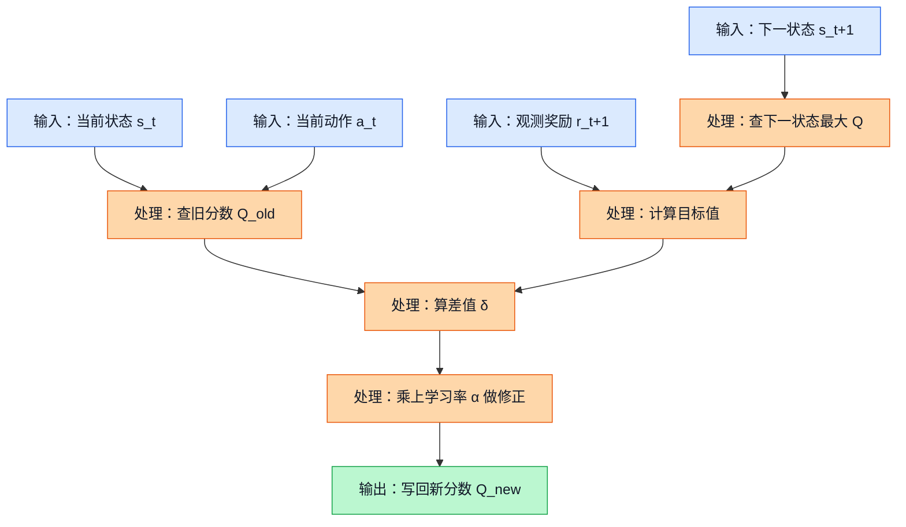
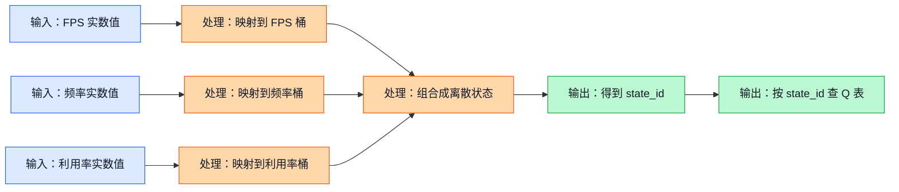
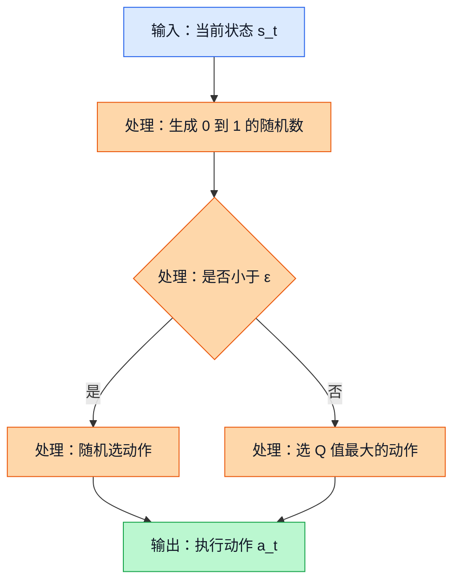

# 07 表格 Q 学习（Tabular Q-Learning）：先做一张会更新的经验评分表

## 前置阅读

- 无硬性前置，本文可以独立阅读。
- 如果你已经了解 GPU DCVS 的 192 个离散动作、FPS 目标是 59-60、GPU 频率范围是 282-710 MHz，读起来会更顺。

## 为什么这一章先讲它

表格 Q 学习可以先把它想成一张“经验评分表”。你每试过一次参数组合，就把这次体验记在表里。下次再遇到差不多的场景，就直接翻表，看以前哪个动作更靠谱。

它为什么值得先学？因为它是最容易讲清楚、最容易手算、也最容易和工程直觉对上的强化学习（Reinforcement Learning）方法之一。项目源文档里也明确提到，当前运行时控制器里已经有在线表格 Q 学习基线。

但你也要一开始就知道它的边界：

| 维度 | 表格 Q 学习在 GPU DCVS 里的表现 |
| --- | --- |
| 动作空间 | 很合适。192 个离散动作正好能放进表格列里。 |
| 在线推理 | 很轻。查表或做一次简单更新就行。 |
| 可解释性 | 很强。你能直接看到“哪个状态下哪个动作分数高”。 |
| 状态表达能力 | 偏弱。真实系统有 15-20 维连续特征，硬分桶会丢信息。 |
| 安全性 | 一般。它常靠 $\varepsilon$-贪心（$\varepsilon$-greedy）探索，手机上乱试参数有风险。 |
| 离线数据利用 | 不强。三份源文档都在提醒，当前数据覆盖率只有 $30/192$，而且有样本文件只包含一个动作，这对更高级的离线方法是警告，对表格法也说明“别太乐观”。 |

所以，这一章的定位很明确：

- 它是最好的入门模型。
- 它是一个能跑起来的在线基线。
- 它不是当前项目的最终推荐生产方案。

后面三份源文档之所以没有把它排到第一，不是因为它“错了”，而是因为它们更重视安全、离线数据利用、还有 richer state 的表达能力。这个分歧我会在后面专门讲透。

## 先把 GPU DCVS 问题翻成 Q 学习语言

在表格 Q 学习里，我们至少要把 4 件事说清楚：状态、动作、奖励、下一状态。

| 元素 | 在 GPU DCVS 里的意思 | 本章采用的简化版本 |
| --- | --- | --- |
| 状态（State） | 当前这一小段时间窗口里的系统观测 | 先只看 FPS、GPU 频率、GPU 利用率 3 个量，并把它们分桶 |
| 动作（Action） | 写入一组 DCVS 参数 | 192 个离散动作，来自 $6 \times 4 \times 4 \times 2$ |
| 奖励（Reward） | 这次调参到底好不好 | 参考源文档里的 FPS + 频率 + 功耗组合奖励 |
| 下一状态（Next State） | 动作生效后，下一个窗口的观测 | 下一窗口的 FPS、频率、利用率分桶结果 |

动作空间来自源文档中这 4 个参数：

| 参数 | 可选值个数 | 示例值 |
| --- | --- | --- |
| `first_step_down` | 6 | 3、5、10、15、20、25 |
| `penalty_down` | 4 | 85、90、95、98 |
| `penalty_up` | 4 | 85、90、95、98 |
| `strict_frame` | 2 | 0、1 |

所以总动作数是：

$$
|\mathcal{A}| = 6 \times 4 \times 4 \times 2 = 192
$$

这一章里的奖励函数沿用源文档给出的思路：

$$
\text{reward} = \text{fps\_component} + \text{freq\_component} + \text{power\_component}
$$

其中：

$$
\text{fps\_component} =
\begin{cases}
-10 \times (57 - fps), & fps < 57 \\
-2 \times (59 - fps), & 57 \le fps < 59 \\
20, & fps \ge 59
\end{cases}
$$

$$
\text{freq\_component} = \frac{900 - gpu\_freq\_{mhz}}{80}
$$

$$
\text{power\_component} = \frac{6000 - power\_{mw}}{400}
$$

这个奖励设计很符合 DCVS 直觉：先保住帧率，再奖励低频和低功耗。

## 概念一：Q 值（Q-Value）到底是什么

### 1. 直觉类比

把 Q 值想成一本“调参经验本”里的评分。

比如你写过一条经验：

- “如果现在 FPS 已经掉到 58.x，GPU 频率还很高，利用率也高，那我用 `first_step_down=10, penalty_down=90, penalty_up=85, strict_frame=0` 这组参数，接下来通常还能把 FPS 拉回 59+，而且功耗会降一点。”

这句话翻成强化学习语言，就是：

- 在状态 $s$ 下做动作 $a$，未来一段时间大概率能拿到不错的总回报。

这个“总回报的经验分”，就是 Q 值。

### 2. 正式定义

策略（Policy）$\pi$ 下，Q 值定义为：

$$
Q^\pi(s, a) = \mathbb{E}_\pi \left[\sum_{k=0}^{\infty} \gamma^k r_{t+k+1} \mid s_t=s,\ a_t=a \right]
$$

你不用被这个式子吓到，它只是在说：

- 先固定当前状态 $s_t=s$
- 先固定当前动作 $a_t=a$
- 然后把后面每一步奖励加起来
- 离得越远的奖励，乘上越小的折扣
- 最后取“平均意义上的结果”

> 补充知识：期望（Expectation）
>
> 式子里的 $\mathbb{E}$ 可以直接理解成“按概率加权后的平均分”。不是所有未来都会一样，有时 FPS 稳住得很好，有时会遇到负载突增，所以我们不是只看一种结果，而是把各种可能结果按出现概率揉成一个平均值。
>
> 折扣因子（Discount Factor）$\gamma$ 用来表达“越远的未来，分量越轻”。比如 $\gamma=0.9$ 时，下一步的 10 分按 9 分算，下下步的 10 分按 8.1 分算。这样做很符合 DCVS 控制的节奏，因为我们更关心接下来几个窗口，而不是无穷远的未来。

### 3. 公式推导 + Mermaid 图

这张图展示了“一个 Q 值为什么会同时看当前动作、即时奖励和后续奖励”。

```mermaid
flowchart TD
    S[输入：当前状态 s] --> A[处理：先执行动作 a]
    A --> R1[处理：得到当前窗口奖励 r1]
    R1 --> S2[处理：进入下一状态 s']
    S2 --> R2[处理：继续获得后续奖励 r2、r3]
    R2 --> G[处理：按 γ 做折扣累加]
    G --> Q[输出：形成 Q(s,a) 的估计]

    classDef input fill:#dbeafe,stroke:#2563eb,color:#111827;
    classDef process fill:#fed7aa,stroke:#ea580c,color:#111827;
    classDef output fill:#bbf7d0,stroke:#16a34a,color:#111827;

    class S input;
    class A,R1,S2,R2,G process;
    class Q output;
```

图里的关键路径是：不是“当前这一步得分高”就一定说明动作好，而是要看它会不会把后面几个窗口也带到更好的状态。所以 Q 值本质上是在估计“这一步动作的长期含金量”。

### 4. DCVS 实际数值计算示例

假设当前状态下，你选中了一个具体动作：

$$
a = (\text{first\_step\_down}=10,\ \text{penalty\_down}=90,\ \text{penalty\_up}=85,\ \text{strict\_frame}=0)
$$

接下来 3 个决策窗口观测到的数据分别是：

| 窗口 | FPS | GPU 频率 | 功耗 |
| --- | --- | --- | --- |
| 第 1 个窗口 | 58.8 | 587 MHz | 4200 mW |
| 第 2 个窗口 | 59.4 | 490 MHz | 3600 mW |
| 第 3 个窗口 | 60.1 | 430 MHz | 3200 mW |

我们一步一步算每个窗口的奖励。

第 1 个窗口：

$$
\text{fps\_component} = -2 \times (59 - 58.8) = -2 \times 0.2 = -0.4
$$

$$
\text{freq\_component} = \frac{900 - 587}{80} = \frac{313}{80} = 3.9125
$$

$$
\text{power\_component} = \frac{6000 - 4200}{400} = \frac{1800}{400} = 4.5
$$

$$
r_1 = -0.4 + 3.9125 + 4.5 = 8.0125
$$

第 2 个窗口：

$$
\text{fps\_component} = 20
$$

$$
\text{freq\_component} = \frac{900 - 490}{80} = \frac{410}{80} = 5.125
$$

$$
\text{power\_component} = \frac{6000 - 3600}{400} = \frac{2400}{400} = 6
$$

$$
r_2 = 20 + 5.125 + 6 = 31.125
$$

第 3 个窗口：

$$
\text{fps\_component} = 20
$$

$$
\text{freq\_component} = \frac{900 - 430}{80} = \frac{470}{80} = 5.875
$$

$$
\text{power\_component} = \frac{6000 - 3200}{400} = \frac{2800}{400} = 7
$$

$$
r_3 = 20 + 5.875 + 7 = 32.875
$$

如果折扣因子取 $\gamma=0.9$，那这次动作的 3 步折扣回报近似为：

$$
G_t \approx r_1 + \gamma r_2 + \gamma^2 r_3
$$

$$
G_t \approx 8.0125 + 0.9 \times 31.125 + 0.9^2 \times 32.875
$$

先算第二项：

$$
0.9 \times 31.125 = 28.0125
$$

再算第三项：

$$
0.9^2 = 0.81
$$

$$
0.81 \times 32.875 = 26.62875
$$

最后相加：

$$
G_t \approx 8.0125 + 28.0125 + 26.62875 = 62.65375
$$

这就说明：虽然第 1 个窗口还没有完全稳住，但从连续 3 个窗口看，这个动作整体是有价值的。

## 概念二：表格 Q 学习（Tabular Q-Learning）怎么更新分数

### 1. 直觉类比

你可以把 Q 学习想成“每次试完之后，稍微改一下经验本里的评分”。

如果你本来觉得某个动作在某种场景下只值 4 分，但这次试完发现它居然把 FPS 稳住了，还顺便省了电，那你就会把这个动作的分数往上调一点。反过来，如果它把 FPS 打崩了，就往下调。

### 2. 正式定义

表格 Q 学习最核心的更新公式是：

$$
Q_{\text{new}}(s_t, a_t) = Q_{\text{old}}(s_t, a_t) + \alpha \left[r_{t+1} + \gamma \max_{a'} Q(s_{t+1}, a') - Q_{\text{old}}(s_t, a_t)\right]
$$

中括号里的这部分叫时序差分误差（Temporal Difference Error），也就是：

$$
\delta_t = r_{t+1} + \gamma \max_{a'} Q(s_{t+1}, a') - Q_{\text{old}}(s_t, a_t)
$$

它表示：

- 这次实际看到的“新证据”
- 和原来表里旧分数
- 差了多少

> 补充知识：学习率（Learning Rate）$\alpha$
>
> $\alpha$ 决定你有多相信这次新观察。$\alpha=1$ 表示“完全听这次的”，$\alpha=0.1$ 表示“只把旧分数往新证据方向推 10%”。在真实系统里，奖励会有噪声，所以通常不会一步改太猛。

### 3. 公式推导 + Mermaid 图

这张图展示了“一次 Q 表更新到底做了哪几步计算”。



图中的关键路径只有一句话：先看这次拿了多少即时奖励，再看“下一状态里最好的动作大概值多少”，最后用这两个量一起去修正旧分数。这就是 Q 学习能“边试边学”的原因。

### 4. DCVS 实际数值计算示例

假设你当前处在一个高压状态：

- 当前 FPS：58.4
- 当前 GPU 频率：587 MHz
- 当前 GPU 利用率：82%

本轮采取动作：

$$
a_t = (\text{first\_step\_down}=10,\ \text{penalty\_down}=90,\ \text{penalty\_up}=85,\ \text{strict\_frame}=0)
$$

并且已经知道：

- 旧 Q 值：$Q_{\text{old}}(s_t, a_t)=4.2$
- 学习率：$\alpha=0.1$
- 折扣因子：$\gamma=0.9$

动作执行后的下一个窗口观测到：

- 下一窗口 FPS：59.3
- 下一窗口 GPU 频率：490 MHz
- 下一窗口功耗：3600 mW

先算即时奖励 $r_{t+1}$。

因为 $59.3 \ge 59$，所以：

$$
\text{fps\_component}=20
$$

$$
\text{freq\_component} = \frac{900 - 490}{80} = \frac{410}{80} = 5.125
$$

$$
\text{power\_component} = \frac{6000 - 3600}{400} = \frac{2400}{400} = 6
$$

$$
r_{t+1} = 20 + 5.125 + 6 = 31.125
$$

再假设在下一状态 $s_{t+1}$ 里，查完整张表后发现最好的动作分数是：

$$
\max_{a'} Q(s_{t+1}, a') = 8.6
$$

先算目标值：

$$
\text{target} = r_{t+1} + \gamma \max_{a'} Q(s_{t+1}, a')
$$

$$
\text{target} = 31.125 + 0.9 \times 8.6
$$

$$
0.9 \times 8.6 = 7.74
$$

$$
\text{target} = 31.125 + 7.74 = 38.865
$$

再算时序差分误差：

$$
\delta_t = 38.865 - 4.2 = 34.665
$$

最后更新 Q 值：

$$
Q_{\text{new}} = 4.2 + 0.1 \times 34.665
$$

$$
0.1 \times 34.665 = 3.4665
$$

$$
Q_{\text{new}} = 4.2 + 3.4665 = 7.6665
$$

这次更新以后，这个动作在当前状态下的分数就从 4.2 上升到了 7.6665。它还没高到离谱，因为学习率只让它“往新证据方向走一小步”。

## 概念三：为什么表格法必须先做状态离散化

### 1. 直觉类比

现实里的监控信号是连续的，比如 FPS 可以是 58.37，GPU 频率可以是 587 MHz，功耗可以是 4186 mW。可表格法没法给每个小数都准备一行，所以你得先把连续读数压缩成“档位标签”。

这就像你不能在纸质表格里记录“今天温度是 26.381 度”对应什么穿衣建议，你更可能写成“冷、适中、热”三个档。

### 2. 正式定义

设连续观测向量是：

$$
x = (fps,\ gpu\_freq,\ gpu\_usage)
$$

我们用一个离散化函数 $\phi$ 把它映射成离散状态：

$$
s = \phi(x) = \left(b_{fps}(fps),\ b_{freq}(gpu\_freq),\ b_{usage}(gpu\_usage)\right)
$$

比如本章先用最简单的 3 桶划分：

| 特征 | 桶 0 | 桶 1 | 桶 2 |
| --- | --- | --- | --- |
| FPS | $fps < 59$ | $59 \le fps \le 60$ | $fps > 60$ |
| GPU 频率 | 282-430 MHz | 431-570 MHz | 571-710 MHz |
| GPU 利用率 | 0-40% | 41-70% | 71-100% |

> 补充知识：笛卡尔积（Cartesian Product）
>
> 这里不用把“笛卡尔积”想得很玄，它就是“把每个维度的所有可能组合起来”。如果 FPS 有 3 桶，频率有 3 桶，利用率也有 3 桶，那总状态数就是 $3 \times 3 \times 3 = 27$。
>
> 这个乘法原理特别重要，因为表格法最怕的就是状态组合爆炸。维度一多、每维分桶一多，表就会迅速大到不可用。

### 3. 公式推导 + Mermaid 图

这张图展示了“连续监控信号是怎么一步步被压成可查表的状态编号”的。



图里的关键点是：表格法从来不直接吃连续特征，它先把数字压成几个小标签，再用这些标签去定位表里的某一行。也正因为这一步很“粗”，它既简单，也会丢信息。

### 4. DCVS 实际数值计算示例

假设当前窗口测到：

- $fps = 58.4$
- $gpu\_freq = 587$
- $gpu\_usage = 82\%$

按照上面的 3 桶规则：

第 1 步，算 FPS 属于哪个桶：

$$
58.4 < 59
$$

所以：

$$
b_{fps}(58.4) = 0
$$

第 2 步，算 GPU 频率属于哪个桶：

$$
571 \le 587 \le 710
$$

所以：

$$
b_{freq}(587) = 2
$$

第 3 步，算 GPU 利用率属于哪个桶：

$$
71 \le 82 \le 100
$$

所以：

$$
b_{usage}(82) = 2
$$

于是离散状态就是：

$$
s = (0, 2, 2)
$$

如果我们用下面这个编码方式：

$$
state\_id = b_{fps} \times 9 + b_{freq} \times 3 + b_{usage}
$$

那它的编号就是：

$$
state\_id = 0 \times 9 + 2 \times 3 + 2
$$

$$
state\_id = 0 + 6 + 2 = 8
$$

现在表格大小就很好算了：

$$
\text{表项总数} = 27 \times 192 = 5184
$$

这个规模非常小，作为教学和 baseline 都很友好。

但你马上就能看到问题。如果我们不只看 3 个特征，而是看源文档提到的 15 个连续特征，并且每个特征只分 4 桶，那么状态数会变成：

$$
4^{15} = 1{,}073{,}741{,}824
$$

再乘上 192 个动作：

$$
1{,}073{,}741{,}824 \times 192 = 206{,}158{,}430{,}208
$$

这已经不是“表大一点”了，而是根本没法靠人工分桶 + 表格法优雅地处理。这也是为什么三份源文档都更偏向 CQL、IQL、或者 contextual bandit 这类能吃 richer state 的方法。

## 概念四：$\varepsilon$-贪心（$\varepsilon$-Greedy）为什么既必要又危险

### 1. 直觉类比

如果你永远只用当前分数最高的动作，那你可能会一直卡在“自以为最优”的局部经验里，因为你从来没试过别的动作。

但如果你试得太猛，又会把手机体验搞崩。

所以最朴素的做法是：

- 大多数时候，选当前看起来最好的动作
- 少数时候，随机试一下别的动作

这就是 $\varepsilon$-贪心。

### 2. 正式定义

它的动作选择规则是：

$$
a_t =
\begin{cases}
\text{随机选一个动作}, & \text{以概率 } \varepsilon \\
\arg\max_a Q(s_t, a), & \text{以概率 } 1-\varepsilon
\end{cases}
$$

> 补充知识：这里的“以概率 $\varepsilon$”到底是什么意思
>
> 比如 $\varepsilon=0.1$，意思不是“每 10 步一定有 1 步随机”，而是“每一步都有 10% 的机会随机”。如果你连续做很多次决策，随机探索的比例会慢慢接近 10%，但短时间内不一定刚好卡得那么整齐。

### 3. 公式推导 + Mermaid 图

这张图展示了 $\varepsilon$-贪心在每次决策时的分支逻辑。



图里的关键点很简单：$\varepsilon$-贪心不是“聪明探索”，它是最朴素的随机探索。优点是实现简单，缺点是它不知道哪些动作危险，所以在手机实时调参里要特别小心。

### 4. DCVS 实际数值计算示例

假设：

- 总动作数是 192
- 当前只有 20 个动作被你离线验证过，相对安全
- 你把探索率设成 $\varepsilon = 0.1$

那每次决策时，进入“随机探索分支”的概率是：

$$
0.1
$$

一旦进入随机探索，如果你是从全部 192 个动作里乱抽，那么抽到“未验证动作”的概率是：

$$
\frac{192 - 20}{192} = \frac{172}{192} \approx 0.8958
$$

于是“一次决策里随机抽到未验证动作”的总体概率是：

$$
0.1 \times 0.8958 = 0.08958
$$

也就是大约：

$$
8.958\%
$$

如果 1 分钟里做 50 次决策，那么期望会遇到的高风险随机动作次数大约是：

$$
50 \times 0.08958 = 4.479
$$

也就是差不多 4 到 5 次。

这个数字在手机游戏运行时其实已经很吓人了。这就是为什么源文档更偏爱：

- 用离线保守训练的 CQL
- 或者用 safety shield 包起来的 contextual bandit

因为它们会比“全动作空间上的朴素随机试探”稳得多。

## 为什么三份源文档没有把它当最终答案

这个问题一定要讲透，不然你会误以为“前面在学表格 Q 学习，后面又推荐 CQL / IQL / contextual bandit，是不是前后矛盾”。其实不是，分歧来自假设不同。

| 关键假设 | 如果这样看问题 | 更自然的方法 |
| --- | --- | --- |
| 问题是一个小型离散 MDP（Markov Decision Process） | 状态可以粗分桶，动作是 192 个离散组合，允许在线边试边学 | 表格 Q 学习可以当 baseline |
| 问题是 richer state 的离线控制问题 | 当前有 15-20 维连续特征，而且离线数据覆盖率只有 $30/192$ | CQL、IQL 更合适 |
| 问题更像“当前上下文下选当前最优动作” | 短历史足够解释大部分变化，目标是低风险在线自适应 | contextual bandit 更合适 |

三份源文档里的关键判断可以总结成下面这 3 句：

1. `RL_Algorithm_Selection...` 认为 DCVS 里存在不弱的时间依赖，所以完整 MDP 建模比 bandit 更充分；但它更推荐的是离线安全的 Discrete CQL，不是在线表格法，因为当前数据覆盖不足，安全优先。
2. `RL_DCVS_AI_Integrated_Decision...` 观察到选定 CSV 样本里只有单一动作 `72`，所以它更担心离线数据偏差和运行时安全，最后仍把 CQL 放在第一。
3. `RL_DCVS_Runtime_Adaptive_Independent_Decision...` 更强调“运行时上下文决策”这个视角，所以把 short-history contextual bandit 排在第一，把表格 Q 学习只当 baseline。

换句话说，它们不是在争“Q 学习有没有用”，而是在争：

- 你到底要不要在线探索？
- 你能不能接受粗状态离散化？
- 你更想解决的是长期 MDP，还是短时上下文决策？
- 你更看重教学可解释性，还是生产安全性？

在这个项目里，表格 Q 学习最合适的位置是：

- 入门教材
- 在线 baseline
- 帮你建立“状态-动作-奖励-更新”这条主线

但如果你要往真实部署走，三份源文档的共同倾向其实很清楚：

- 最终系统需要比表格法更安全
- 也需要比表格法更能吃连续高维状态

## 关键收获

- 表格 Q 学习的核心就是维护一张 $Q(s,a)$ 评分表，分数代表“在状态 $s$ 下做动作 $a$，未来总体大概有多值”。
- 在 GPU DCVS 里，它最适合做教学和 baseline，因为 192 个离散动作天然适配表格列。
- Q 值不是只看当前奖励，而是看折扣后的未来回报，这就是它比“只看眼前”更聪明的地方。
- 真正的更新公式是 $$Q_{\text{new}} = Q_{\text{old}} + \alpha [r + \gamma \max Q(s',a') - Q_{\text{old}}]$$，你可以把它理解成“用新证据温和地修正旧经验”。
- 表格法最大的瓶颈不是动作，而是状态。真实 DCVS 有很多连续特征，一旦分桶过细，状态数会爆炸。
- $\varepsilon$-贪心虽然简单，但在手机运行时有明确安全风险，这也是后续文档为什么会更推荐 CQL、IQL、或者带安全壳的 contextual bandit。
- 如果你把这章真的吃透，后面再看 CQL、IQL 时就不会只剩下公式，因为你已经知道它们本质上都在回答同一个问题：怎样更可靠地估计“哪个动作在当前状态下更值得做”。
