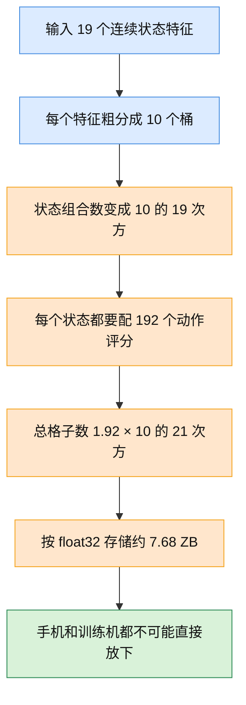
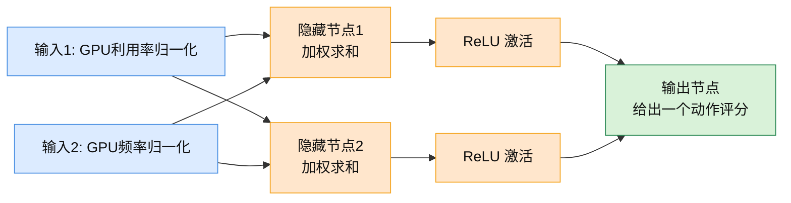
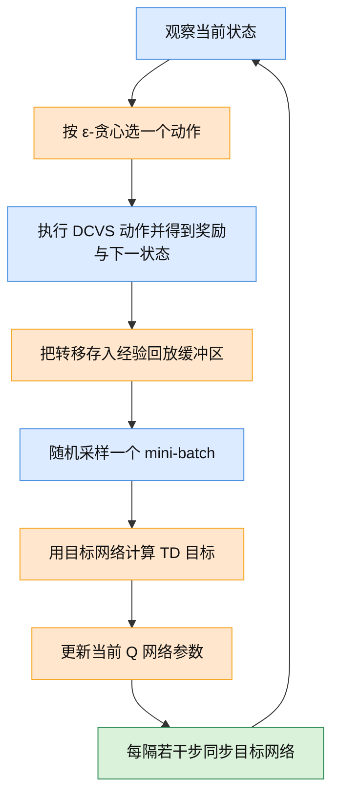
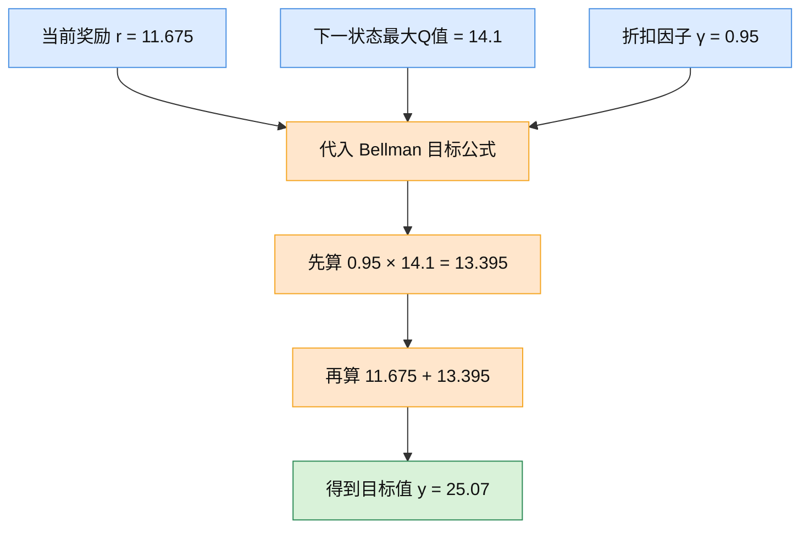

## 前置阅读

- `learn/01_DCVS_Background.md`
- `learn/02_RL_Core_Concepts.md`
- `learn/03_Exploration_vs_Exploitation.md`
- `learn/07_Tabular_Q_Learning.md`

# 08 深度 Q 网络（Deep Q-Networks）

这一篇要解决一个很实际的问题：表格 Q-Learning 一旦碰到真实 DCVS 状态，就会立刻变得“表太大、格子太多、根本记不完”。深度 Q 网络的核心想法很朴素，就是别再硬记每一个格子，而是训练一个神经网络，看到一个新状态时，直接把 192 个动作的大致评分都算出来。

但你也要先记住一句话：**DQN 很重要，因为它是从 Q 表走向深度强化学习的桥；可在当前这个 GPU DCVS 项目里，它更像“教学上的关键中间站”和“工程上的 baseline”，还不是离线部署的首选答案。**

## 1. 为什么 Q 表在真实 DCVS 里会撑不住

### 1.1 直觉类比

你可以把 Q 表想成一本“经验评分电话簿”。
每一页是一种状态，每一行是一个动作，格子里写着：“在这个状态下，用这个动作，大概能拿多少分。”

这个办法在玩具问题里很好用，因为状态很少，比如“低负载 / 中负载 / 高负载”这 3 种状态就够了。
可一到真实 DCVS，状态一下子变成很多连续指标：FPS、GPU 频率、GPU 利用率、功耗、帧延迟、CPU 频率、前一个动作、温度……这本“电话簿”会厚到离谱，根本翻不动。

### 1.2 正式定义

表格 Q-Learning（Tabular Q-Learning）直接存储每个状态-动作对的价值：

$$
Q(s, a)
$$

如果状态空间大小是 $|S|$，动作空间大小是 $|A|$，那么 Q 表里需要存的格子总数就是：

$$
|S| \times |A|
$$

在这个项目里，动作空间已经很明确了，是 192 个离散动作：

$$
|A| = 6 \times 4 \times 4 \times 2 = 192
$$

问题出在状态空间。源文档里提到，真实 DCVS 可用的连续状态特征大约有 15 到 20 维。哪怕我们只拿 19 维，而且每一维都粗暴地切成 10 个桶，状态数也会爆炸。

### 1.3 公式推导 + Mermaid 图

如果 19 个特征每个都分 10 桶，那么状态数是：

$$
|S| = 10^{19}
$$

于是 Q 表总格子数变成：

$$
|S| \times |A| = 10^{19} \times 192 = 1.92 \times 10^{21}
$$

如果每个 Q 值只用一个 4 字节的 `float32` 存：

$$
1.92 \times 10^{21} \times 4 = 7.68 \times 10^{21} \text{ bytes}
$$

也就是大约：

$$
7.68 \text{ ZB}
$$

这张图展示了“离散化之后，Q 表为什么会瞬间大到无法落地”。

图里的关键路径很简单：**连续特征一离散化，状态组合数就会乘法爆炸；动作再一乘，Q 表立刻失控。**
这也是为什么前一篇的表格 Q-Learning 值得学，但它更多是 baseline，不是这个项目的终局方案。

### 1.4 DCVS 实际数值计算示例

我们用项目里真实会出现的量级来算一次。

假设状态里只放下面这些信息：

- GPU 频率：282 到 710 MHz
- GPU 利用率：0% 到 100%
- 功耗：0 到 8000 mW
- FPS：目标 59 到 60
- lateness：按 10 桶粗分
- 其余 14 个辅助特征：也都按 10 桶粗分

现在一步一步算：

1. 一共取 19 个状态特征。
2. 每个特征分 10 桶，所以状态数是：

$$
10 \times 10 \times \cdots \times 10 = 10^{19}
$$

3. 动作数是 192，所以总格子数是：

$$
10^{19} \times 192 = 1.92 \times 10^{21}
$$

4. 每个格子 4 字节，所以存储量是：

$$
1.92 \times 10^{21} \times 4 = 7.68 \times 10^{21} \text{ bytes}
$$

5. 把单位换成 ZB：

$$
7.68 \times 10^{21} \text{ bytes} \approx 7.68 \text{ ZB}
$$

结论很直接：**不是 Q-Learning 的想法错了，而是“用表来装 Q 值”这个容器不行了。**

## 2. 神经网络（Neural Network）到底是什么

### 2.1 直觉类比

你可以把神经网络想成一个“会做平滑插值的经验评委”。

Q 表的做法是：
“这个状态我见过，就翻到那一格。”

神经网络的做法是：
“这个状态我没一模一样见过，但它和我见过的一堆状态很像，所以我可以推一个差不多的评分出来。”

这就是它最重要的价值：**泛化（Generalization）**。它不需要每个格子都存在，也能对新状态给出估计。

### 2.2 正式定义

最简单的多层感知机（Multi-Layer Perceptron, MLP）可以写成：

$$
z^{(1)} = W^{(1)}x + b^{(1)}
$$

$$
h = \operatorname{ReLU}(z^{(1)})
$$

$$
y = W^{(2)}h + b^{(2)}
$$

这里：

- $x$ 是输入向量，比如当前状态里的归一化特征；
- $W$ 是权重，决定每个输入有多重要；
- $b$ 是偏置，可以理解成“基础分”；
- $\operatorname{ReLU}(z) = \max(0, z)$，表示负数直接压成 0，正数保留。

> **补充知识：别被矩阵公式吓到**
>
> 式子 $W^{(1)}x + b^{(1)}$ 本质上就是“拿一组权重，对输入做加权求和，再加一个常数”。如果一行权重是 $[0.6, -0.2]$，输入是 $[0.8, 0.3]$，那这一行算出来的值就是 $0.6 \times 0.8 + (-0.2) \times 0.3$。
>
> ReLU 也不神秘，它就是一个特别简单的开关：负数当成 0，正数原样通过。你可以把它理解成“这个神经元只有在证据足够强时才发声”。

### 2.3 公式推导 + Mermaid 图

这张图展示了一个最小神经网络的一次前向传播：两个输入，经过隐藏层，再得到一个输出分数。

图里的关键路径是：**输入先做加权求和，再过 ReLU，把“没用的负信号”切掉，最后汇总成一个输出分数。**
在 DQN 里，这个输出分数不止一个，而是 192 个，每个动作一个。

### 2.4 DCVS 实际数值计算示例

我们手算一个“2 输入、1 输出”的最小网络。
输入先用两个最直观的 DCVS 特征：

- $x_1 = 0.80$：GPU 利用率归一化，表示当前负载比较高
- $x_2 = 0.30$：GPU 频率归一化，表示当前频率不算高

隐藏层设两个神经元。

第 1 个隐藏神经元的参数：

$$
w_{11} = 0.6,\quad w_{12} = -0.2,\quad b_1 = 0.1
$$

先算加权求和：

$$
z_1 = 0.6 \times 0.80 + (-0.2) \times 0.30 + 0.1
$$

$$
z_1 = 0.48 - 0.06 + 0.1 = 0.52
$$

过 ReLU：

$$
h_1 = \max(0, 0.52) = 0.52
$$

第 2 个隐藏神经元的参数：

$$
w_{21} = -0.4,\quad w_{22} = 0.9,\quad b_2 = -0.05
$$

先算加权求和：

$$
z_2 = (-0.4) \times 0.80 + 0.9 \times 0.30 - 0.05
$$

$$
z_2 = -0.32 + 0.27 - 0.05 = -0.10
$$

过 ReLU：

$$
h_2 = \max(0, -0.10) = 0
$$

输出层参数设为：

$$
v_1 = 1.2,\quad v_2 = 0.5,\quad b_o = 0.2
$$

最后输出：

$$
y = 1.2 \times 0.52 + 0.5 \times 0 + 0.2
$$

$$
y = 0.624 + 0 + 0.2 = 0.824
$$

这个 $0.824$ 可以理解成“某个动作的大致评分”。
如果把输出层从 1 个节点改成 192 个节点，网络就能一次把 192 个动作的评分都算出来，这就离 DQN 很近了。

## 3. 深度 Q 网络（Deep Q-Network, DQN）是怎么把 Q 表变成神经网络的

### 3.1 直觉类比

Q 表像一本死记硬背的评分册。
DQN 则像一个训练过的评委，看到当前状态后，不需要翻表，直接把“192 个动作各值多少分”一起报出来。

所以 DQN 干的事，其实就是：

- 保留 Q-Learning 的长期回报思想；
- 把“查表”换成“神经网络预测”。

### 3.2 正式定义

DQN 用参数为 $\theta$ 的神经网络来逼近动作价值函数：

$$
Q(s, a; \theta) \approx Q^*(s, a)
$$

它的 Bellman 目标（Bellman Target）通常写成：

$$
y = r + \gamma \max_{a'} Q_{\text{target}}(s', a'; \theta^-)
$$

其中：

- $r$ 是当前动作拿到的即时奖励；
- $\gamma$ 是折扣因子（Discount Factor）；
- $Q_{\text{target}}$ 是目标网络；
- $\theta^-$ 是目标网络的参数。

训练时，让当前网络去逼近这个目标：

$$
L(\theta) = \frac{1}{2}\left(y - Q(s, a; \theta)\right)^2
$$

动作选择常用 $\varepsilon$-贪心策略（epsilon-greedy policy）：

$$
a_t =
\begin{cases}
\text{随机动作}, & \text{概率 } \varepsilon \\
\arg\max_a Q(s_t, a; \theta), & \text{概率 } 1-\varepsilon
\end{cases}
$$

### 3.3 公式推导 + Mermaid 图

这张图展示了 DQN 的完整训练循环：环境交互、存经验、抽样训练、更新网络、同步目标网络。

图里的关键路径是：**先用当前策略去收集经验，再从经验池里随机抽样训练，并且不要直接用同一个网络既出题又判卷，所以额外保留一份目标网络。**

### 3.4 DCVS 状态输入到网络的映射

在这个项目里，我们可以把 DQN 的输入做成一个大约 19 维的归一化状态向量。下面给一个贴近源文档的示例版本：

| 维度 | 特征名 | 取值直觉 |
|---|---|---|
| 1 | `fps_norm` | 当前 FPS 相对 60 的归一化值 |
| 2 | `fps_error_norm` | 当前 FPS 与目标 59-60 的偏差 |
| 3 | `low_fps_norm` | 低分位 FPS 或最差帧率指标 |
| 4 | `gpu_usage_norm` | GPU 利用率，范围 0 到 1 |
| 5 | `gpu_freq_norm` | GPU 频率归一化，原始范围 282 到 710 MHz |
| 6 | `gpu_power_norm` | GPU 功耗归一化，原始范围 0 到 8000 mW |
| 7 | `actual_dur_norm` | 当前帧时长归一化 |
| 8 | `lateness_norm` | 帧超时程度归一化 |
| 9 | `gpu_headroom_norm` | GPU 余量指标 |
| 10 | `fence_latency_norm` | fence 平均延迟归一化 |
| 11 | `l_cluster_freq_norm` | 小核频率归一化 |
| 12 | `m_cluster_freq_norm` | 中核频率归一化 |
| 13 | `cpu_power_norm` | CPU 功耗归一化 |
| 14 | `delta_total_energy_norm` | 总能耗变化归一化 |
| 15 | `temperature_norm` | 温度归一化 |
| 16 | `thermal_headroom_norm` | 热余量归一化 |
| 17 | `prev_action_norm` | 上一个动作编号归一化 |
| 18 | `prev_reward_norm` | 上一个奖励归一化 |
| 19 | `strict_frame_flag` | 严格帧率模式开关 |

对应的网络结构可以写成：

$$
19 \rightarrow 256 \rightarrow 256 \rightarrow 192
$$

意思是：

- 输入层读入 19 个状态特征；
- 两层隐藏层各 256 个神经元；
- 输出层直接给出 192 个动作的 Q 值。

这张图展示了这个网络结构在 DCVS 里的对应关系。

关键点只有一个：**DQN 不再给“某一个状态-动作格子”打分，而是给“当前状态下的全部 192 个动作”一起打分。**

## 4. DQN 的三个关键技术

### 4.1 经验回放（Experience Replay）

#### 直觉类比

如果你每次只记住“刚刚那一局”的体验，就很容易被当前这一小段场景带偏。
经验回放像一个训练笔记本，把过去的高负载、低负载、稳帧、掉帧、降频、升频经历都存起来，训练时随机翻几页，不至于只盯着眼前。

#### 正式定义

经验回放缓冲区（Replay Buffer）保存大量历史转移：

$$
\mathcal{D} = \{(s_i, a_i, r_i, s'_i)\}_{i=1}^{N}
$$

训练时不是只用最近一步，而是从里面随机采样一个 mini-batch。

#### 公式推导 + 关键点

随机采样的目的不是“变花哨”，而是为了打散时间相关性。连续几帧常常高度相似，如果直接拿来连着学，网络会来回追着最近一小段波动跑。

#### DCVS 实际数值计算示例

假设经验池里有下面 4 条历史：

| 样本 | GPU 利用率 | GPU 频率 | action_id | reward |
|---|---:|---:|---:|---:|
| A | 0.82 | 430 MHz | 72 | 11.68 |
| B | 0.91 | 587 MHz | 88 | 18.10 |
| C | 0.34 | 355 MHz | 15 | 7.25 |
| D | 0.95 | 282 MHz | 103 | -9.40 |

如果按时间顺序只盯着最近 3 帧，而这 3 帧刚好都在同一个高负载团战场景里，网络就会误以为“世界永远这么紧张”。
但如果从经验池里随机抽到 B、D、A，不同负载和不同动作就会混在一起，更新会更稳。

### 4.2 目标网络（Target Network）

#### 直觉类比

如果一个人一边出题一边改答案，分数标准会一直变，学习就会很乱。
目标网络就是“先固定一份参考答案”，让当前网络去追它；隔一段时间，再把参考答案整体更新一次。

#### 正式定义

当前网络参数是 $\theta$，目标网络参数是 $\theta^-$。
训练若干步内，$\theta^-$ 固定不动，只定期从 $\theta$ 复制一次：

$$
\theta^- \leftarrow \theta
$$

Bellman 目标因此写成：

$$
y = r + \gamma \max_{a'} Q_{\text{target}}(s', a'; \theta^-)
$$

#### 公式推导 + 关键点

如果没有目标网络，那么你今天要追的目标值，会随着你刚刚这一步的更新立刻改变。
这样网络很容易陷入“我一边瞄准，一边移动靶子”的不稳定状态。

#### DCVS 实际数值计算示例

继续用后面第 5 节会用到的例子。
假设某一步里：

- 即时奖励 $r = 11.675$
- 折扣因子 $\gamma = 0.95$
- 当前目标网络在下一状态上给出的最大 Q 值是 $14.1$

那么目标值是：

$$
y = 11.675 + 0.95 \times 14.1 = 25.07
$$

如果你不用目标网络，而是让当前网络自己同时提供目标值，假设它刚更新完，下一秒把最大 Q 值从 $14.1$ 改成 $17.6$，那目标值会突然跳到：

$$
y' = 11.675 + 0.95 \times 17.6 = 28.395
$$

两次目标值之差是：

$$
28.395 - 25.07 = 3.325
$$

也就是说，你这一批样本还没学完，靶子自己先挪了 3.325 分。
目标网络的作用，就是先把这个靶子固定住。

### 4.3 ε-贪心策略（epsilon-greedy policy）

#### 直觉类比

如果你每次都选当前最高分动作，你可能永远不知道第二名其实更好；
但如果你乱试太多次，手机上的 FPS 可能直接崩掉。

所以 $\varepsilon$-贪心的想法是：**大部分时间用当前最优动作，小部分时间故意试一试别的动作。**

#### 正式定义

$$
a_t =
\begin{cases}
\text{随机动作}, & \text{概率 } \varepsilon \\
\arg\max_a Q(s_t, a; \theta), & \text{概率 } 1-\varepsilon
\end{cases}
$$

#### 公式推导 + 关键点

如果动作总数是 192，设 $\varepsilon = 0.1$，那么：

- 90% 的时间，选当前最高分动作；
- 10% 的时间，从 192 个动作里均匀随机选。

#### DCVS 实际数值计算示例

现在一步一步算每个动作被选中的概率。

1. 随机探索部分的单个动作概率：

$$
\frac{0.1}{192} = 0.0005208333
$$

2. 当前最高分动作除了拿到 90% 的“利用”概率，还会额外拿到探索分到的那一点点概率，所以它的总概率是：

$$
0.9 + \frac{0.1}{192} = 0.9005208333
$$

3. 其余 191 个动作，每个动作的概率都只有：

$$
0.0005208333
$$

这看上去很安全，但在真机 DCVS 上依然有问题：
因为“那 10% 的随机动作”里，可能正好就抽到一个会让 FPS 掉到 56、功耗飙升、甚至引起抖动的坏动作。
这也是为什么源文档一直强调：**运行时控制必须带安全护栏，不能裸跑探索。**

## 5. 用真实 DCVS 量级手算一次 DQN 更新

这一节把最关键的一步手算出来：
给定一个具体的 $(s, a, r, s')$，怎么算出 DQN 的训练目标，以及当前网络要往哪个方向改。

### 5.1 当前转移

假设当前状态 $s$ 对应一帧窗口统计如下：

| 指标 | 数值 |
|---|---:|
| FPS | 58.4 |
| GPU 频率 | 430 MHz |
| GPU 利用率 | 86% |
| GPU 功耗 | 3200 mW |
| lateness | 0.8 ms |
| 采取的动作 | `action_id = 72` |

下一状态 $s'$ 对应的网络预测里，目标网络给出了几个候选动作的 Q 值：

| 动作 | $Q_{\text{target}}(s', a')$ |
|---|---:|
| 72 | 13.4 |
| 88 | 14.1 |
| 103 | 12.6 |
| 141 | 10.8 |

所以：

$$
\max_{a'} Q_{\text{target}}(s', a') = 14.1
$$

### 5.2 先算奖励 $r$

源文档给出的推荐奖励形式是：

$$
\text{reward} = \text{fps\_component} + \text{freq\_component} + \text{power\_component}
$$

其中：

$$
\text{fps\_component} =
\begin{cases}
-10 \times (57 - fps), & fps < 57 \\
-2 \times (59 - fps), & 57 \le fps < 59 \\
20, & fps \ge 59
\end{cases}
$$

$$
\text{freq\_component} = \frac{900 - \text{gpu\_freq\_mhz}}{80}
$$

$$
\text{power\_component} = \frac{6000 - \text{power\_mw}}{400}
$$

现在代入当前数值。

因为 $fps = 58.4$，落在 $57 \le fps < 59$ 这段，所以：

$$
\text{fps\_component} = -2 \times (59 - 58.4)
$$

$$
\text{fps\_component} = -2 \times 0.6 = -1.2
$$

GPU 频率是 430 MHz，所以：

$$
\text{freq\_component} = \frac{900 - 430}{80}
$$

$$
\text{freq\_component} = \frac{470}{80} = 5.875
$$

GPU 功耗是 3200 mW，所以：

$$
\text{power\_component} = \frac{6000 - 3200}{400}
$$

$$
\text{power\_component} = \frac{2800}{400} = 7
$$

最终奖励：

$$
r = -1.2 + 5.875 + 7 = 11.675
$$

### 5.3 再算 Bellman 目标

折扣因子取：

$$
\gamma = 0.95
$$

Bellman 目标是：

$$
y = r + \gamma \max_{a'} Q_{\text{target}}(s', a')
$$

代入刚才算出的数：

$$
y = 11.675 + 0.95 \times 14.1
$$

先算乘法：

$$
0.95 \times 14.1 = 13.395
$$

再相加：

$$
y = 11.675 + 13.395 = 25.07
$$

这张图展示了这次 Bellman 目标是怎么一步一步算出来的。

图里的关键路径就是三步：**拿当前奖励、拿下一状态的最好动作分数、乘上折扣因子再相加。**
这就是 DQN 每次更新时真正追的那个目标。

### 5.4 计算当前误差和损失

假设当前 Q 网络对这个状态和动作的旧预测是：

$$
Q(s, a=72; \theta) = 20.4
$$

那么时间差分误差（Temporal-Difference Error, TD Error）就是：

$$
\delta = y - Q(s, a; \theta)
$$

代入数值：

$$
\delta = 25.07 - 20.4 = 4.67
$$

平方损失写成：

$$
L(\theta) = \frac{1}{2}(4.67)^2
$$

先算平方：

$$
(4.67)^2 = 21.8089
$$

再乘 $\frac{1}{2}$：

$$
L(\theta) = 10.90445
$$

这个损失的意思很简单：当前网络给 72 号动作只打了 20.4 分，但 Bellman 目标告诉它“更合理的分数应当靠近 25.07”，所以它要往上调。

> **补充知识：梯度下降（Gradient Descent）到底在做什么**
>
> 你可以把损失函数想成一座山，当前位置越高，说明模型错得越多；梯度就是“当前位置最陡的上坡方向”。梯度下降做的事，就是沿着反方向走一小步，也就是朝下坡方向走，让损失慢慢变小。
>
> 用最简单的一维函数 $y = x^2$ 来看。假设现在 $x = 4$，那么梯度是 $2x = 8$。如果学习率取 $0.1$，下一步就是：
>
> $$
> x_{\text{new}} = 4 - 0.1 \times 8 = 3.2
> $$
>
> 原来的损失是：
>
> $$
> y_{\text{old}} = 4^2 = 16
> $$
>
> 新的损失变成：
>
> $$
> y_{\text{new}} = 3.2^2 = 10.24
> $$
>
> 你看，往负梯度方向走一小步，损失就从 16 降到了 10.24。DQN 也是这个逻辑，只不过参数不止 1 个，而是成千上万个。

## 6. 为什么朴素 DQN 在当前离线 DCVS 项目里仍然不是最终推荐

### 6.1 先说结论

朴素 DQN 的问题不是“不会学”，而是它在**离线数据覆盖不足、动作有安全风险、部署容错低**的场景下，太容易对没见过的动作过度自信。

这正是三份源文档把它放在 baseline 或较后位置的原因。

### 6.2 三份源文档为什么判断不一样

| 来源 | 主要推荐 | 它背后的关键假设 | 对 DQN 的含义 |
|---|---|---|---|
| `RL_Algorithm_Selection_for_GPU_DCVS_Tuning_20260401.md` | Discrete CQL 第一，IQL 第二 | 把问题看成中等时间依赖的 MDP，而且当前离线动作覆盖只有 30/192 | 朴素 DQN 能做 baseline，但对分布外动作不够稳 |
| `RL_DCVS_AI_Integrated_Decision_2026-04-01.md` | CQL + 安全护栏 第一 | 当前样例日志几乎是单动作数据，行为策略偏差很重 | 标准 DQN 容易学到“看上去很高、其实没见过”的 Q 值 |
| `RL_DCVS_Runtime_Adaptive_Independent_Decision_GPT-5.4_2026-04-01_135421.md` | 安全上下文老虎机第一，IQL/CQL 作为 warm start | 更强调运行时“当前上下文下立即选对动作”，同时非常看重安全和轻量部署 | DQN 是可解释的桥梁和 baseline，但不是首发控制器 |

表面看像是“意见不统一”，其实不是。
它们只是站在不同问题设定上：

- 如果你强调**完整长期回报**，就更接近 MDP，DQN/CQL/IQL 这条线更自然；
- 如果你强调**当前窗口下的安全决策**，就更接近 contextual bandit；
- 如果你是**离线固定日志**，就必须特别小心数据覆盖和分布偏移；
- 如果动作本来就是 **192 个离散动作**，DQN、CQL、IQL 都天然适配，连续控制算法反而没那么直接。

### 6.3 朴素 DQN 的三个核心风险

#### 风险 1：对没见过的动作过度乐观

在离线训练时，DQN 会反复做：

$$
\max_{a'} Q(s', a')
$$

这个 `max` 很危险。
因为只要 192 个动作里有一个“其实没怎么见过，但网络瞎估得很高”的动作，它就会被选中来当训练目标。

举个贴近项目的数据覆盖问题：

- 已采样动作覆盖只有 30/192，甚至某些文件里几乎只有单个动作；
- 已见过动作 72 的平均回报大概在 12 附近；
- 没见过的动作 141，网络却可能因为泛化误差给出 26 的 Q 值。

那么 `max` 一看，立刻就会偏向 141。
这就是离线 RL 里最典型的分布外动作（Out-of-Distribution Action）问题。

#### 风险 2：运行时探索太贵

$\varepsilon$-贪心在 Atari 之类环境里很常见，但 DCVS 不是游戏模拟器，而是真机控制。
你随机试错一次，代价可能就是：

- FPS 从 60 掉到 56；
- 连续几帧 lateness 变大；
- 功耗突然升高；
- 用户当场感觉到卡顿。

所以就算 DQN 能学，**裸探索也不适合直接上线**。

#### 风险 3：数据覆盖不够时，保守方法更稳

这也是为什么源文档把保守 Q 学习（Conservative Q-Learning, CQL）和隐式 Q 学习（Implicit Q-Learning, IQL）排在前面。

- CQL 会主动把“数据里没支持的动作 Q 值”往下压；
- IQL 则尽量避免直接对未见动作做激进外推。

相比之下，朴素 DQN 更像一句话：

> “我会学，但请先给我足够全面、足够安全、覆盖足够广的数据。”

而当前项目的现状显然还没到这一步。

### 6.4 那为什么还要学 DQN

因为它是后面很多方法的共同地基。

- Double DQN 是在修 DQN 的过度乐观；
- Dueling DQN 是在改 DQN 的网络结构；
- CQL、IQL 也都离不开你对 Q 函数、Bellman 目标、目标网络、经验回放这些基础件的理解。

所以你可以把 DQN 看成：

- **学习路径上的必经站**；
- **工程上的可运行 baseline**；
- **理解离线保守方法之前的最后一块大拼图**。

## 关键收获

- 表格 Q-Learning 的核心思想没有过时，过时的是“用表来装连续高维状态”的方式。
- DQN 的本质就是：保留 Q-Learning 的 Bellman 更新，把查表换成神经网络预测。
- 神经网络最重要的价值是泛化，它能对没一模一样见过的新状态给出合理估计。
- DQN 训练时最重要的三样东西是经验回放、目标网络和 $\varepsilon$-贪心策略。
- 在这个 DCVS 项目里，一个典型 DQN 网络可以做成 $19 \rightarrow 256 \rightarrow 256 \rightarrow 192$，一次输出 192 个动作的 Q 值。
- 朴素 DQN 在离线 DCVS 上的最大风险，是对数据里没覆盖到的动作过度乐观；这也是 CQL、IQL 和安全上下文方法更受推荐的根本原因。
- 你如果把这一篇真正吃透，后面学 Double DQN、Dueling DQN、CQL、IQL 时会轻松很多，因为底层语言已经统一了。
