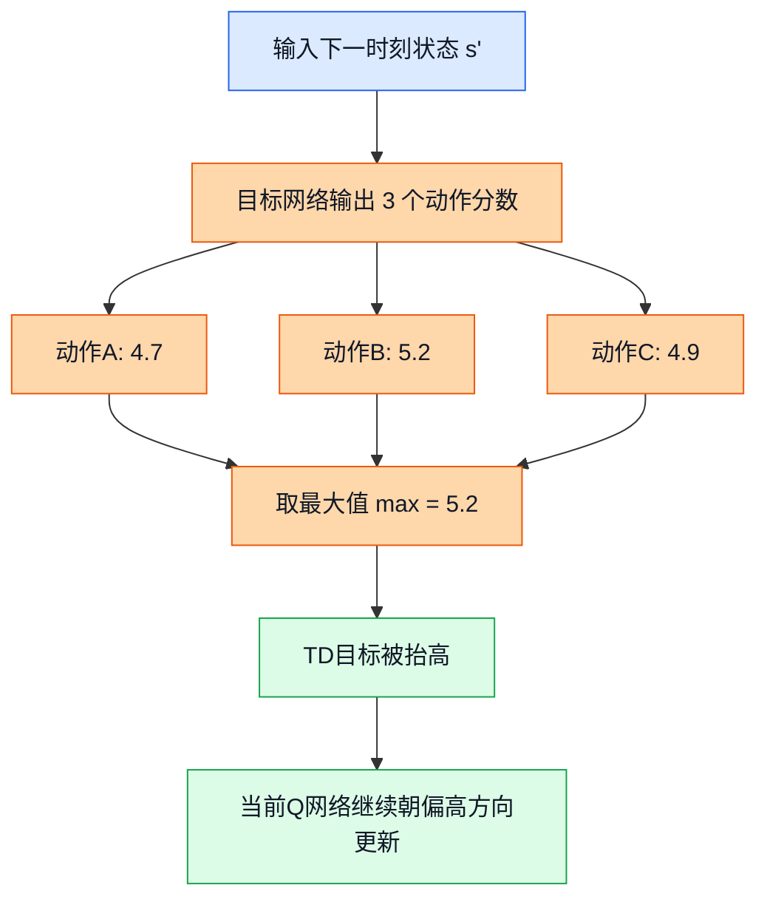
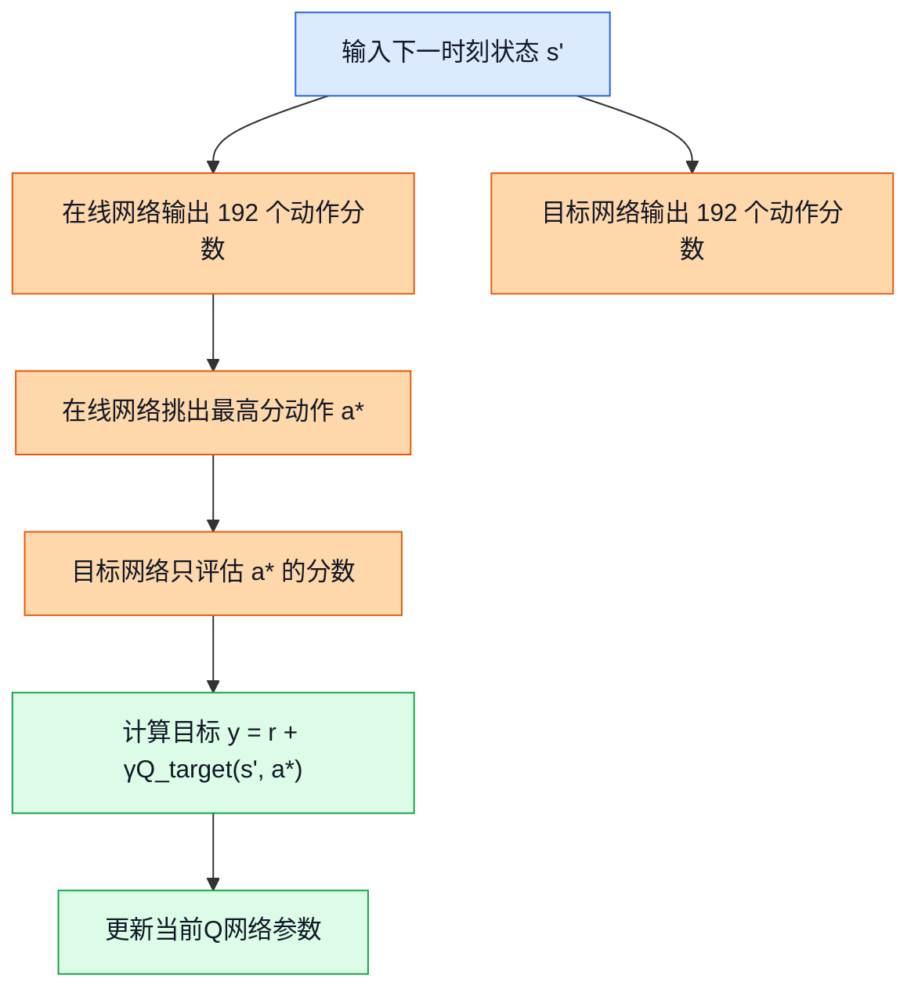
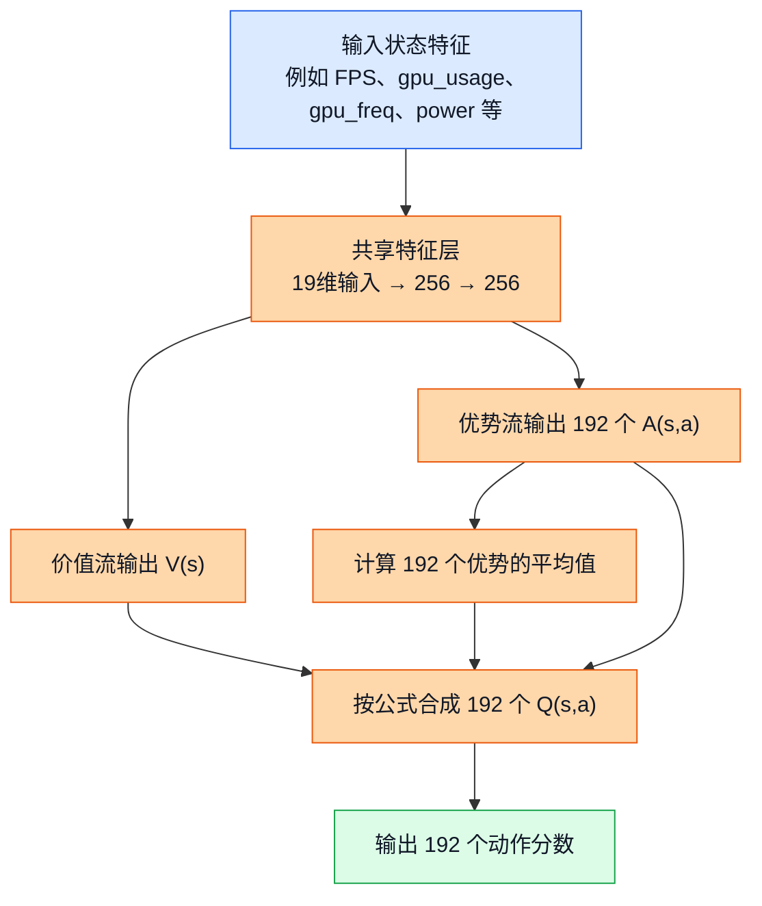

# 09. Double Dueling DQN：让 DQN 少一点“自信过头”，多一点“看清局势”

## 前置阅读

- 建议先读 [07_Tabular_Q_Learning.md](/E:/Ecode/RL-Doc/.ralphy-worktrees/agent-9-1775073858186-2wl9n5/learn/07_Tabular_Q_Learning.md)
- 建议先读 [08_Deep_Q_Networks.md](/E:/Ecode/RL-Doc/.ralphy-worktrees/agent-9-1775073858186-2wl9n5/learn/08_Deep_Q_Networks.md)
- 如果前两篇还没写完，至少先知道三件事：什么是状态（State）、动作（Action）、奖励（Reward），以及 DQN 会输出 192 个动作分数

## 这一篇要解决什么问题

到了 DQN 这一步，我们已经能用一个神经网络把 19 个左右的连续状态特征，直接映射成 192 个离散 DCVS 动作的 $Q(s,a)$ 分数。这个项目里常见的真实范围也先记一下：GPU 频率大致在 282 到 710 MHz，目标帧率通常盯在 59 到 60 FPS，功耗观测范围大致在 0 到 8000 mW。

但朴素 DQN 还有两个常见毛病：

1. 它容易把未来回报估得偏高，这叫过估计偏差（Overestimation Bias）。
2. 它把“这个局面本身好不好”和“在这个局面里哪个动作更好”全揉在一起学，效率不高。

Double DQN（Double Deep Q-Network）主要修第一个毛病，Dueling DQN（Dueling Deep Q-Network）主要修第二个毛病。把两者合起来，就是大家常说的 Double Dueling DQN。

先提醒一句很重要的话：**它们提升的是价值学习质量，不是离线强化学习（Offline Reinforcement Learning）里的分布偏移问题。** 当前项目里的离线数据只覆盖了大约 $30 / 192 = 15.6\%$ 的动作，而且很多日志还是“整轮只跑一个固定动作”。这种情况下，就算你把 DQN 改得再聪明，它也不会自动变成 CQL（Conservative Q-Learning）或 IQL（Implicit Q-Learning）。

## 为什么朴素 DQN 在 DCVS 里还不够稳

从现有三份源分析文档里，可以先提炼出一个共同判断：

- 如果你要做**手机运行时**的安全自适应控制，第三份文档更偏向安全短历史上下文老虎机（Safe Short-History Contextual Bandit）。
- 如果你要做**离线数据训练**，第一份和第二份文档更偏向 CQL、IQL 这类更保守的方法。
- 朴素在线 DQN 或表格 Q-learning 可以做基线（Baseline），但不是当前阶段的最终首选。

它们看起来像“意见不统一”，其实底层假设不同：

| 关注点 | 更像哪类问题 | 更合适的方法 |
|---|---|---|
| 当前窗口里立刻选一个安全动作 | 上下文决策（Contextual Decision） | 安全上下文老虎机 |
| 只用离线日志学策略，而且动作覆盖很差 | 离线 RL | CQL / IQL |
| 有足够在线交互，想把 DQN 做得更稳一点 | 在线值函数学习 | Double DQN / Dueling DQN |

所以这一篇的定位很明确：**不是说 Double Dueling DQN 会成为当前项目第一推荐方案，而是帮你搞清楚，为什么在“DQN 这条路线”里，大家后来几乎都会把它升级成 Double + Dueling。**

---

## 一、过估计偏差（Overestimation Bias）

### 1. 直觉类比

想象你考完试后，自己给自己估分。

- 语文你觉得大概 110。
- 数学你觉得大概 118。
- 英语你觉得大概 115。

如果这三个估分里都带一点随机误差，你最后往往会盯着最高的那个分数看，然后说：“我这次应该能考 118 以上。”

问题就在这里：**你不是平均地看待三个估分，而是专门挑最大的那个。** 一旦你总是挑最大值，正向误差就更容易被选中，整个人就会显得“自信过头”。

DQN 里那个

$$
\max_{a'} Q(s', a')
$$

也会干同样的事。

### 2. 正式定义

设真实最优价值是 $Q^*(s', a)$，但神经网络给出的估计值带有误差：

$$
\hat{Q}(s', a) = Q^*(s', a) + \epsilon_a
$$

其中 $\epsilon_a$ 是估计误差。就算这些误差平均来说并不偏大，也就是“有时高估，有时低估”，只要你后面还要做一次最大值选择：

$$
\max_a \hat{Q}(s', a)
$$

它就会更容易挑中“误差偏正”的那个动作，于是产生系统性的高估。

更正式一点写，就是：

$$
\mathbb{E}\left[\max_a \hat{Q}(s', a)\right] \ge \max_a Q^*(s', a)
$$

这里的左边可以理解成“重复很多次后，网络给出的最大估计值的平均水平”。

> **补充知识：期望（Expectation）到底是什么**
>
> 期望可以把它先理解成“如果同样的事重复很多很多次，平均下来会是多少”。比如掷骰子一次可能是 1，也可能是 6；但掷很多次后，平均值会慢慢靠近一个稳定数字。
>
> 放到这里，你不用把它想得太抽象。它只是想表达：虽然单次估计可能有高有低，但“每次都取最大”这个动作，会让长期平均结果往偏高的方向跑。

### 3. 公式推导 + Mermaid 图

朴素 DQN 的目标值（target）是：

$$
y_{\text{DQN}} = r + \gamma \max_{a'} Q_{\bar{\theta}}(s', a')
$$

这里 $\bar{\theta}$ 表示目标网络（Target Network）的参数。

问题出在这一步：

1. 网络先给每个动作一个带噪声的估计值。
2. 再从里面拿最大值。
3. 最大值天然更容易是“真值 + 正误差”。
4. 这个偏高的目标值又会反过来训练当前网络。
5. 于是高估被一轮轮传下去。

这张图展示了朴素 DQN 的“高估是怎么一步步长出来的”。

图里的关键路径只有一条：**先估计，再取最大，再把这个最大值当真。** 只要“取最大”这一步一直存在，偏乐观就会被不断放大。

### 4. DCVS 实际数值计算示例

下面我们用一个 DCVS 场景，把这个高估偏差手算出来。

#### 场景设定

当前我们刚执行完一个动作，进入下一状态 $s'$：

| 指标 | 数值 |
|---|---:|
| FPS | 58.8 |
| GPU 频率 | 430 MHz |
| GPU 利用率 | 93% |
| 功耗 | 5100 mW |

从 192 个离散动作里，我们先只拿 3 个动作举例：

| 动作 | DCVS 参数 |
|---|---|
| 动作A | `first_step_down=25`, `penalty_down=85`, `penalty_up=85`, `strict_frame=0` |
| 动作B | `first_step_down=10`, `penalty_down=90`, `penalty_up=90`, `strict_frame=0` |
| 动作C | `first_step_down=3`, `penalty_down=98`, `penalty_up=85`, `strict_frame=1` |

假设这 3 个动作在这个状态下的**真实**未来价值其实都差不多，都是 5 分上下：

| 动作 | 真实价值 $Q^*(s',a)$ |
|---|---:|
| 动作A | 5.0 |
| 动作B | 5.0 |
| 动作C | 5.0 |

但神经网络有估计误差，某一次给出的分数是：

| 动作 | 网络估计值 $\hat{Q}(s',a)$ | 误差 |
|---|---:|---:|
| 动作A | 4.7 | $-0.3$ |
| 动作B | 5.2 | $+0.2$ |
| 动作C | 4.9 | $-0.1$ |

现在一步一步算：

1. 先看三个估计值：$4.7,\ 5.2,\ 4.9$
2. 取最大值：$\max(4.7, 5.2, 4.9) = 5.2$
3. 真实最大值其实是：$\max(5.0, 5.0, 5.0) = 5.0$
4. 所以这一次的高估量是：

$$
5.2 - 5.0 = 0.2
$$

如果这种事情多发生几次，偏差会更明显。比如连续 3 次网络估计如下：

| 轮次 | 动作A | 动作B | 动作C | 取到的最大值 |
|---|---:|---:|---:|---:|
| 第1次 | 4.7 | 5.2 | 4.9 | 5.2 |
| 第2次 | 5.1 | 4.8 | 4.9 | 5.1 |
| 第3次 | 4.8 | 5.0 | 5.3 | 5.3 |

这 3 次最大值的平均是：

$$
\frac{5.2 + 5.1 + 5.3}{3}
= \frac{15.6}{3}
= 5.2
$$

真实最大值始终是 5.0，但“估计后再取最大”的平均结果变成了 5.2。**这就是过估计偏差。**

---

## 二、Double DQN（Double Deep Q-Network）

### 1. 直觉类比

还是拿考试估分打比方。

朴素 DQN 相当于“同一个人既负责挑最高分，也负责确认这个最高分有多靠谱”。这很容易自我催眠。

Double DQN 的思路是：

- 先让一个人负责“挑出你最看好的动作”；
- 再让另一个人负责“给这个动作打分”。

这样做的重点不是完全消灭误差，而是**减少“同一份乐观误差既负责选人、又负责打分”的连锁反应**。

### 2. 正式定义

Double DQN 把“选动作”和“评动作”拆开：

1. 用在线网络（Online Network）选择下一状态里分数最高的动作：

$$
a^* = \arg\max_{a'} Q_{\theta}(s', a')
$$

2. 再用目标网络（Target Network）评估这个动作的价值：

$$
y_{\text{Double}} = r + \gamma Q_{\bar{\theta}}(s', a^*)
$$

把两步合起来写，就是：

$$
y_{\text{Double}} = r + \gamma Q_{\bar{\theta}}\left(s', \arg\max_{a'} Q_{\theta}(s', a')\right)
$$

对比一下朴素 DQN：

$$
y_{\text{DQN}} = r + \gamma \max_{a'} Q_{\bar{\theta}}(s', a')
$$

区别就在于：

- 朴素 DQN：同一个网络的分数既参与“选最大”，又直接被拿来做目标值。
- Double DQN：在线网络只负责“选谁最好”，目标网络只负责“这个人到底值多少”。

### 3. 公式推导 + Mermaid 图

Double DQN 的推导逻辑并不复杂，本质上就是把原来的一个 `max` 拆成两步：

$$
\max_{a'} Q_{\bar{\theta}}(s', a')
\quad \Longrightarrow \quad
Q_{\bar{\theta}}\left(s', \arg\max_{a'} Q_{\theta}(s', a')\right)
$$

这张图展示了 Double DQN 的目标值是怎么计算出来的。

图中的关键变化只有一句话：**“谁看起来最好”由在线网络说了算，但“它到底值多少”由目标网络来核实。** 因为两份网络参数不完全一样，它们的误差也不完全同步，于是高估会比朴素 DQN 轻一些。

### 4. DCVS 实际数值计算示例

现在我们把 Double DQN 目标值手算一遍。

#### 第一步：写出当前转移

某一步交互数据是：

| 项目 | 数值 |
|---|---:|
| 当前状态 $s_t$ 的 FPS | 58.2 |
| 当前状态 $s_t$ 的 GPU 利用率 | 94% |
| 当前状态 $s_t$ 的 GPU 频率 | 430 MHz |
| 执行动作 $a_t$ | `first_step_down=10`, `penalty_down=90`, `penalty_up=90`, `strict_frame=0` |
| 到达下一状态 $s_{t+1}$ 后的 FPS | 59.4 |
| 到达下一状态 $s_{t+1}$ 后的 GPU 频率 | 525 MHz |
| 到达下一状态 $s_{t+1}$ 后的功耗 | 5600 mW |

#### 第二步：先算即时奖励 $r$

我们沿用源文档里给出的奖励形式：

$$
reward = fps\_component + freq\_component + power\_component
$$

因为下一状态 FPS 是 59.4，已经达到 59 以上，所以：

$$
fps\_component = 20
$$

GPU 频率是 525 MHz，所以：

$$
freq\_component = \frac{900 - 525}{80}
= \frac{375}{80}
= 4.6875
$$

功耗是 5600 mW，所以：

$$
power\_component = \frac{6000 - 5600}{400}
= \frac{400}{400}
= 1
$$

于是即时奖励为：

$$
r = 20 + 4.6875 + 1 = 25.6875
$$

#### 第三步：在线网络负责选动作

假设在线网络在下一状态 $s_{t+1}$ 上，对 3 个候选动作给出的分数是：

| 动作 | 在线网络 $Q_{\theta}(s_{t+1}, a)$ |
|---|---:|
| 动作A | 27.4 |
| 动作B | 28.1 |
| 动作C | 27.9 |

所以在线网络选出的最优动作是动作B，因为：

$$
\arg\max(27.4, 28.1, 27.9) = \text{动作B}
$$

#### 第四步：目标网络只评估动作B

目标网络在同一个下一状态上的分数是：

| 动作 | 目标网络 $Q_{\bar{\theta}}(s_{t+1}, a)$ |
|---|---:|
| 动作A | 26.8 |
| 动作B | 27.0 |
| 动作C | 27.6 |

Double DQN 不会直接取这里的最大值 27.6，而是只取“在线网络挑出来的动作B”的分数 27.0。

所以：

$$
y_{\text{Double}} = 25.6875 + 0.95 \times 27.0
$$

先算折扣后的未来价值：

$$
0.95 \times 27.0 = 25.65
$$

再加上即时奖励：

$$
y_{\text{Double}} = 25.6875 + 25.65 = 51.3375
$$

#### 第五步：顺手和朴素 DQN 比一下

如果是朴素 DQN，它会直接取目标网络里的最大值 27.6：

$$
y_{\text{DQN}} = 25.6875 + 0.95 \times 27.6
$$

先算：

$$
0.95 \times 27.6 = 26.22
$$

所以：

$$
y_{\text{DQN}} = 25.6875 + 26.22 = 51.9075
$$

两者差值是：

$$
51.9075 - 51.3375 = 0.57
$$

这 0.57 就可以看成“朴素 DQN 在这一步更乐观了一点点”。在海量训练步里，这种“每次都乐观一点点”的累积，会很烦。

---

## 三、Dueling DQN（Dueling Deep Q-Network）

### 1. 直觉类比

想象你现在要给一个游戏局面打分。

有两种情况很常见：

1. 局面本身已经很好了。比如 FPS 稳在 60，GPU 利用率只有 20%，功耗也才 2100 mW。这个时候你随便挑几个相近动作，结果都不会差太多。
2. 局面本身已经很危险了。比如 FPS 掉到 58，GPU 利用率 96%，当前频率只有 430 MHz。这个时候动作选错一点点，后果就很明显。

所以一个状态的好坏，其实可以拆成两部分：

- 这个状态本身值不值得开心，这叫状态价值（State Value）。
- 在这个状态里，某个动作比“平均动作”好多少，这叫优势函数（Advantage Function）。

Dueling DQN 就是在让网络把这两件事分开学。

### 2. 正式定义

Dueling DQN 让神经网络输出两路信息：

1. 状态价值：

$$
V(s)
$$

它表示“光看这个状态，不管具体选哪个动作，这个局面整体有多好”。

2. 优势值：

$$
A(s,a)
$$

它表示“在这个状态里，动作 $a$ 比平均动作好多少”。

最后把两者合成 Q 值：

$$
Q(s,a) = V(s) + A(s,a) - \frac{1}{|\mathcal{A}|}\sum_{a'} A(s,a')
$$

这里 $|\mathcal{A}| = 192$，表示总动作数是 192。

### 3. 公式推导 + Mermaid 图

你可能会问：为什么不是最简单的

$$
Q(s,a) = V(s) + A(s,a)
$$

因为这样会有一个“拆分不唯一”的问题。

比如某个状态下：

$$
V(s) = 10,\quad A(s,a) = 2
$$

那么 Q 值是：

$$
Q(s,a) = 12
$$

但如果我换一种写法：

$$
V(s) = 11,\quad A(s,a) = 1
$$

Q 值还是 12。也就是说，网络会不知道这 12 分到底该记到 $V$ 身上，还是该记到 $A$ 身上。

所以 Dueling DQN 会把优势值做一个“减去平均值”的中心化处理：

$$
\frac{1}{|\mathcal{A}|}\sum_{a'} A(s,a')
$$

这样就等于强行告诉网络：**优势值只负责表达“比平均水平高还是低”，不要把整体状态好坏也偷偷塞进去。**

> **补充知识：为什么要减去平均值**
>
> 你可以把“减去平均值”理解成先把全班同学的平均分定出来，再看每个人高出平均多少、低于平均多少。这样“班级整体水平”与“某个人比平均高多少”就被拆开了。
>
> 放到 Dueling DQN 里，$V(s)$ 负责“这个局面整体好不好”，$A(s,a)$ 负责“这个动作比平均动作好多少”。两个人分工清楚，训练就更稳。

这张图展示了 Dueling 网络结构：先抽共享特征，再分成 $V$ 流和 $A$ 流，最后再合成 192 个动作的 Q 值。

图里的关键路径是：**共享层先理解“当前局势”，价值流判断局势整体好坏，优势流判断每个动作相对平均值的偏高偏低，最后再合成 Q 值。**

### 4. DCVS 实际数值计算示例

下面我们分别看两个状态。这样最容易体会 Dueling DQN 的价值。

#### 例子A：状态本身已经很好，动作差异不大

当前状态：

| 指标 | 数值 |
|---|---:|
| FPS | 60.1 |
| GPU 利用率 | 18% |
| GPU 频率 | 587 MHz |
| 功耗 | 2100 mW |

这时候我们从 192 个动作里挑 4 个代表动作来看：

| 动作 | 参数组合 |
|---|---|
| 动作1 | `25 / 85 / 85 / 0` |
| 动作2 | `15 / 90 / 90 / 0` |
| 动作3 | `10 / 95 / 90 / 1` |
| 动作4 | `3 / 98 / 85 / 1` |

假设网络学到：

$$
V(s) = 18.0
$$

优势流给出的原始优势值是：

$$
A(s,\cdot) = [-0.2,\ 0.1,\ 0.3,\ 0.2]
$$

先算平均值：

$$
\text{mean}(A) = \frac{-0.2 + 0.1 + 0.3 + 0.2}{4}
= \frac{0.4}{4}
= 0.1
$$

接着逐个动作计算 Q 值。

动作1：

$$
Q(s,a_1) = 18.0 + (-0.2) - 0.1 = 17.7
$$

动作2：

$$
Q(s,a_2) = 18.0 + 0.1 - 0.1 = 18.0
$$

动作3：

$$
Q(s,a_3) = 18.0 + 0.3 - 0.1 = 18.2
$$

动作4：

$$
Q(s,a_4) = 18.0 + 0.2 - 0.1 = 18.1
$$

最后得到：

| 动作 | Q 值 |
|---|---:|
| 动作1 | 17.7 |
| 动作2 | 18.0 |
| 动作3 | 18.2 |
| 动作4 | 18.1 |

你会发现这 4 个分数都挨得很近。说明什么？说明在这个“本来就很轻松”的状态下，**状态质量主导一切**，也就是 $V(s)$ 更重要。

#### 例子B：状态本身很危险，动作差异一下子变大

现在换一个状态：

| 指标 | 数值 |
|---|---:|
| FPS | 58.1 |
| GPU 利用率 | 96% |
| GPU 频率 | 430 MHz |
| 功耗 | 4700 mW |

假设网络学到：

$$
V(s) = 6.5
$$

优势流输出：

$$
A(s,\cdot) = [-2.0,\ -0.8,\ 2.4,\ 1.2]
$$

先算平均值：

$$
\text{mean}(A) = \frac{-2.0 + (-0.8) + 2.4 + 1.2}{4}
= \frac{0.8}{4}
= 0.2
$$

逐个动作计算：

动作1：

$$
Q(s,a_1) = 6.5 + (-2.0) - 0.2 = 4.3
$$

动作2：

$$
Q(s,a_2) = 6.5 + (-0.8) - 0.2 = 5.5
$$

动作3：

$$
Q(s,a_3) = 6.5 + 2.4 - 0.2 = 8.7
$$

动作4：

$$
Q(s,a_4) = 6.5 + 1.2 - 0.2 = 7.5
$$

最终：

| 动作 | Q 值 |
|---|---:|
| 动作1 | 4.3 |
| 动作2 | 5.5 |
| 动作3 | 8.7 |
| 动作4 | 7.5 |

这一次动作之间的差距一下拉开了。说明在“FPS 快要掉线、GPU 已经吃满”的危险状态里，**精细动作区分开始主导结果**，也就是 $A(s,a)$ 更重要。

这正是 Dueling DQN 在 DCVS 里的直观意义：

- GPU 很闲时，很多动作都差不多，先判断“这个局势整体好不好”更重要。
- GPU 很忙时，动作差一点，结果就可能差很多，这时优势分支更有用。

---

## 四、把 Double 和 Dueling 合起来看

实际实现里，常见做法是：

1. 在线网络用 Dueling 结构输出 192 个 Q 值。
2. 目标网络也用同样的 Dueling 结构输出 192 个 Q 值。
3. 目标值计算时，再套上 Double DQN 的“在线选动作、目标网评动作”。

于是组合后的目标值写成：

$$
a^* = \arg\max_{a'} Q_{\theta}^{\text{dueling}}(s', a')
$$

$$
y = r + \gamma Q_{\bar{\theta}}^{\text{dueling}}(s', a^*)
$$

你可以把它理解成两层改进叠加：

- Double：减少“挑最大值”带来的过度乐观。
- Dueling：让网络更清楚地区分“局势整体好坏”和“具体动作差异”。

---

## 五、它在当前 DCVS 项目里到底值不值得上

### 1. 它解决了什么

Double Dueling DQN 确实能改善这些问题：

| 问题 | 是否有帮助 | 解释 |
|---|---|---|
| 朴素 DQN 的高估偏差 | 有帮助 | Double DQN 直接针对这个问题 |
| 状态整体好坏和动作优势混在一起 | 有帮助 | Dueling DQN 直接拆成两条流 |
| 19 维连续状态难以用 Q 表表示 | 有帮助 | 仍然是深度网络，不再靠表格 |
| 192 个离散动作评分 | 有帮助 | 输出层天然就是 192 维 |

### 2. 它没有解决什么

但它**没有**直接解决这些更关键的问题：

| 问题 | 是否解决 | 原因 |
|---|---|---|
| 离线数据动作覆盖只有 15.6% | 没解决 | 网络再好，也学不出没见过的可靠动作价值 |
| 单轮固定动作导致转移质量有限 | 没解决 | 数据收集方式本身就限制了学习信号 |
| 离线分布偏移（Distribution Shift） | 没解决 | 它不是保守离线 RL 方法 |
| 手机上在线探索的安全风险 | 没解决 | 还得靠护栏（Guardrail）、回退（Rollback）、最小驻留时间（Dwell Time） |

### 3. 为什么三份源文档没有把它排到第一

这个问题很关键，必须说透。

第一份源文档给出的结论是：**离线首选更像 Discrete CQL，备用是 IQL。**

原因是：

- 当前动作是 192 个离散动作，CQL 很好接。
- 当前数据覆盖差，CQL 会更保守。
- 朴素 DQN 即使升级成 Double Dueling DQN，也还是会面临数据分布外动作高估和离线偏移风险。

第二份源文档的结论也类似：**运行方向可以保留值函数型（Value-Based）思路，但离线主力还是 CQL / IQL，更安全。**

第三份源文档则更激进一些，它直接把**安全短历史上下文老虎机**放到了第一名。

背后的假设是：

- 当前项目更像“每个窗口根据上下文选一个安全动作”；
- 真机在线探索代价很高；
- 安全过滤、最小驻留时间、回退逻辑比纯粹追求最优 Q 值更重要。

所以，三份文档并不是在否认 Double Dueling DQN 的价值，而是在说：

> **如果你已经决定走 DQN 这条路线，那最好至少升级到 Double + Dueling；但如果你从整个项目目标倒推，当前阶段的第一选择仍然更可能是安全老虎机（Bandit）或保守离线强化学习。**

---

## 六、什么时候“状态质量主导”，什么时候“动作区分主导”

把前面的例子压缩成一句工程判断：

### 状态质量主导的典型场景

- FPS 已经稳定在 59.5 到 60.5
- GPU 利用率低于 30%
- GPU 频率已经在 525 到 587 MHz
- 功耗低于 2500 mW

这时候很多动作都能满足目标。网络更重要的任务，是先学会：

$$
V(s)\ \text{很高}
$$

也就是“这个局面本身就不错”。

### 动作区分主导的典型场景

- FPS 掉到 58 左右
- GPU 利用率超过 90%
- GPU 频率卡在 430 MHz 或更低
- 功耗已经上到 4500 mW 到 6000 mW

这时候动作之间的差别会被迅速放大。网络更重要的任务，是学会：

$$
A(s,a)\ \text{谁高谁低}
$$

也就是“到底该更激进升频，还是先别乱动”。

---

## 七、这一篇你最该记住的结论

Double Dueling DQN 不是什么全新算法宇宙，它更像是 DQN 的两次关键修补：

1. Double DQN 解决“总拿最高估计当真，容易自信过头”。
2. Dueling DQN 解决“局势整体好坏和动作相对好坏揉在一起学，效率不高”。
3. 把两者合起来后，在 19 维连续状态、192 个离散动作的 DCVS 问题里，价值学习质量通常会比朴素 DQN 更好。
4. 但它**没有**自动解决离线数据覆盖不足、分布偏移、在线探索安全性这些更难的问题。

## 关键收获

- 过估计偏差的根源不是“网络一定错得很多”，而是“估计完以后还要取最大值”，这会系统性挑中正误差。
- Double DQN 用“在线网络选动作，目标网络评动作”来减少这种偏乐观。
- Dueling DQN 把 $Q(s,a)$ 拆成 $V(s)$ 和 $A(s,a)$，很适合像 DCVS 这种“有时状态更重要，有时动作更重要”的场景。
- 在 GPU 空闲、FPS 很稳时，状态质量往往主导；在 GPU 满载、FPS 接近掉线时，精细动作区分往往主导。
- 对当前项目来说，Double Dueling DQN 是比朴素 DQN 更成熟的值函数型版本，但它本身不是离线安全学习的终点方案。
