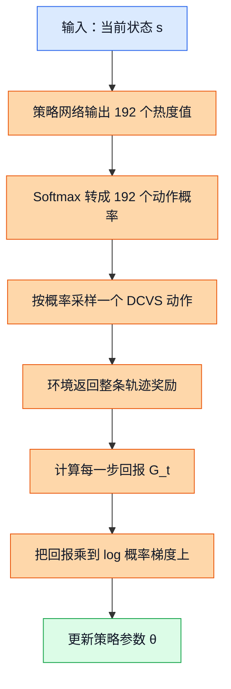

# 10. 策略梯度（Policy Gradient）与 REINFORCE

## 前置阅读

- `01_DCVS_Background.md`
- `02_RL_Core_Concepts.md`
- `07_Tabular_Q_Learning.md`
- `08_Deep_Q_Networks.md`
- `09_Double_Dueling_DQN.md`

## 这章要解决什么问题

前面几章你已经见过值方法（Value-based Method）的思路了：先估计“这个状态下每个动作有多好”，再选分数最高的动作。策略梯度走的是另一条路：它不先做一张评分表，而是直接学习一套“选动作的概率规则”，让高回报动作越来越常被选中，低回报动作越来越少被选中。

这件事在 GPU 动态时钟电压调节（Dynamic Clock and Voltage Scaling, DCVS）里很好理解。真实项目有 $6 \times 4 \times 4 \times 2 = 192$ 个离散动作，每个动作对应一组 DCVS 参数。值方法像“给 192 个动作逐个打分”，策略梯度像“直接调这 192 个动作的抽签概率”。后面学演员-评论家（Actor-Critic）和近端策略优化（Proximal Policy Optimization, PPO）时，你会一直用到这个视角。

后面所有例子都默认沿用这套项目量纲：GPU 频率大致落在 $282 \sim 710$ MHz，GPU 利用率在 $0\% \sim 100\%$，功耗大致在 $0 \sim 8000$ mW，目标帧率是 $59 \sim 60$ FPS，动作空间大小是 192。

## 1. 先把直觉立住：值方法和策略方法到底差在哪

| 角度 | 值方法 | 策略方法 |
|---|---|---|
| 你直接学什么 | $Q(s,a)$ 或 $V(s)$ | $\pi_\theta(a \mid s)$ |
| 做决定的方式 | 先打分，再取最大值 | 直接输出动作概率 |
| 直觉类比 | 给每道菜打分，选最高分 | 直接调整“下次点这道菜的概率” |
| 在 DCVS 里的样子 | 给 192 个动作都打分 | 直接输出 192 个动作的概率分布 |

如果你把值方法想成“老师先批卷子，再按分数录取”，那策略梯度更像“根据上一轮表现，直接调整招生比例”。表现好的方向多招一点，表现差的方向少招一点。

## 2. 概念一：策略梯度到底在干什么

### 2.1 直觉类比

想象你在带一个 GPU 调参新手。每隔几秒，他都要在 192 个动作里选一个。刚开始他没经验，可能比较随机。跑过很多局以后，你发现：

- 某些动作一选就更容易保住 $59 \sim 60$ FPS；
- 某些动作虽然省电，但一到高负载场景就掉到 $57$ FPS 以下；
- 还有些动作在轻负载时很好，在团战时却很差。

策略梯度做的事不是“记住所有动作的绝对分数”，而是“让好结果对应的动作概率上升，让差结果对应的动作概率下降”。

### 2.2 正式定义

策略（Policy）记作 $\pi_\theta(a \mid s)$，表示在状态 $s$ 下选择动作 $a$ 的概率，$\theta$ 是策略参数。

我们的优化目标是让长期平均回报（Return）尽量大：

$$
J(\theta) = \mathbb{E}_{\tau \sim \pi_\theta}[G_0]
$$

这里：

- $\tau$ 是一条轨迹（Trajectory），也就是一串状态、动作、奖励；
- $G_0$ 是从起点开始的累计折扣回报；
- $\mathbb{E}$ 表示“对很多次采样结果取平均”。

策略梯度的核心任务，就是求出：

$$
\nabla_\theta J(\theta)
$$

它表示：如果我把参数 $\theta$ 往某个方向轻轻推一点，长期回报会朝哪边变化。

> **补充知识：什么叫“概率分布上的梯度”**
>
> 梯度（Gradient）可以先别想得太玄。它就是“你把参数拧一下，结果会往哪边走、走多快”。在策略里，结果不再是一个分数，而是一整组概率。
>
> 例如两个动作的 Softmax 函数（Softmax Function）热度值分别是 $z_1 = 1.2$、$z_2 = 0.8$。先算指数：$e^{1.2} \approx 3.3201$，$e^{0.8} \approx 2.2255$，总和是 $5.5456$。所以概率分别是 $p_1 = 3.3201 / 5.5456 \approx 0.5987$，$p_2 = 2.2255 / 5.5456 \approx 0.4013$。如果把 $z_1$ 提高到 $1.4$，那么 $e^{1.4} \approx 4.0552$，新概率变成 $p_1 = 4.0552 / (4.0552 + 2.2255) \approx 0.6457$。这就说明：参数往上推，动作 1 的概率也会上升。

### 2.3 公式推导 + Mermaid 图

先看最常见的离散动作策略写法。假设策略网络对 192 个动作输出 192 个热度值 $z_1, z_2, \ldots, z_{192}$，那么：

$$
\pi_\theta(a_i \mid s) = \frac{e^{z_i}}{\sum_{j=1}^{192} e^{z_j}}
$$

如果某个动作带来了更高的长期回报，我们就希望它对应的 $z_i$ 变大，从而让它的概率变大。

这张图展示了“策略参数如何一路影响到最终更新方向”。



图里的关键路径是：状态先变成动作概率，动作概率再通过一次真实交互变成回报，最后回报反过来影响参数更新。也就是说，策略梯度不是“看一个动作当前爽不爽”，而是“看这个动作最后让整条轨迹变好了还是变坏了”。

### 2.4 DCVS 实际数值计算示例

为了能手算，我们暂时不把 192 个动作全展开，而是只从里面挑两个真实范围内的动作做例子：

- 动作 A：`first_step_down=20, penalty_down=85, penalty_up=85, strict_frame=0`
- 动作 B：`first_step_down=5, penalty_down=95, penalty_up=98, strict_frame=1`

把它们理解成：

- 动作 A 更激进，更偏省电；
- 动作 B 更保守，更偏保帧。

现在看一个状态：

| 指标 | 数值 |
|---|---:|
| 当前 GPU 频率 | $430$ MHz |
| 当前 GPU 利用率 | $82\%$ |
| 当前功耗 | $4600$ mW |
| 当前 FPS | $58.8$ |
| 目标 FPS | $59 \sim 60$ |

假设当前策略在这个状态下给出的概率是：

$$
\pi_\theta(\text{动作 A} \mid s) = 0.62,\quad \pi_\theta(\text{动作 B} \mid s) = 0.38
$$

如果接下来多次真实运行都发现动作 B 更能把 FPS 拉回到 $59 \sim 60$，那策略梯度就会把动作 B 的概率往上推，比如从 $0.38$ 慢慢推到 $0.45$、$0.52$，而不是像值方法那样先显式学一整张 $Q(s,a)$ 表。

## 3. 概念二：策略梯度定理为什么会长成这个样子

### 3.1 直觉类比

你可以把 REINFORCE 想成赛后复盘。

- 这一局整体打得很好，就把这局里做过的关键动作“记一功”；
- 这一局整体打得很差，就把这局里做过的关键动作“记一过”；
- 一局结束后，按整局成绩回头修正每一步的动作倾向。

所以，更新公式里一定会同时出现两样东西：

- “我当时到底选了什么动作”的信息；
- “这条轨迹最后成绩怎样”的信息。

### 3.2 正式定义

策略梯度定理（Policy Gradient Theorem）的常见写法是：

$$
\nabla_\theta J(\theta) =
\mathbb{E}_{\tau \sim \pi_\theta}\left[
\sum_{t=0}^{T-1}
\nabla_\theta \log \pi_\theta(a_t \mid s_t) \cdot G_t
\right]
$$

这里：

- $\log \pi_\theta(a_t \mid s_t)$ 是“当前策略给这一步已选动作的对数概率（Log-Probability）”；
- $G_t$ 是从第 $t$ 步开始往后的累计回报；
- $\nabla_\theta \log \pi_\theta(a_t \mid s_t)$ 决定“概率该往哪边调”；
- $G_t$ 决定“这次该调多大，以及是鼓励还是打压”。

如果 $G_t$ 很大，说明这一步所在的后续轨迹整体不错，就该增加这类动作的概率；如果 $G_t$ 很差，说明后续整体不行，就该减少这类动作的概率。

> **补充知识：为什么公式里会冒出 $\log \pi$**
>
> 因为一条轨迹的概率是很多步动作概率连乘起来的。连乘直接求导很麻烦，而对数有个好处：$\log(xy)=\log x + \log y$，会把连乘变成连加。
>
> 还有一个常用小技巧：$\nabla p = p \nabla \log p$。它的意思是，你可以先对对数求导，再乘回原来的概率。这样一来，整个式子会变得很好整理。

### 3.3 公式推导 + Mermaid 图

先把目标函数按轨迹展开：

$$
J(\theta) = \sum_{\tau} P(\tau; \theta) R(\tau)
$$

对参数求梯度：

$$
\nabla_\theta J(\theta) = \sum_{\tau} \nabla_\theta P(\tau; \theta) R(\tau)
$$

用上刚才那个技巧 $\nabla p = p \nabla \log p$：

$$
\nabla_\theta J(\theta)
=
\sum_{\tau} P(\tau; \theta)\nabla_\theta \log P(\tau; \theta) R(\tau)
$$

也就是：

$$
\nabla_\theta J(\theta)
=
\mathbb{E}_{\tau \sim \pi_\theta}
\left[\nabla_\theta \log P(\tau; \theta) R(\tau)\right]
$$

而一条轨迹的概率可以写成：

$$
P(\tau; \theta)
=
\rho(s_0)
\prod_{t=0}^{T-1}
\pi_\theta(a_t \mid s_t)
P(s_{t+1} \mid s_t, a_t)
$$

取对数：

$$
\log P(\tau; \theta)
=
\log \rho(s_0)
+ \sum_{t=0}^{T-1} \log \pi_\theta(a_t \mid s_t)
+ \sum_{t=0}^{T-1} \log P(s_{t+1} \mid s_t, a_t)
$$

环境转移概率 $P(s_{t+1} \mid s_t, a_t)$ 不由策略参数 $\theta$ 决定，所以对 $\theta$ 求导后会消失，只剩下策略自己的那一项。于是就得到：

$$
\nabla_\theta J(\theta)
=
\mathbb{E}_{\tau \sim \pi_\theta}
\left[
\sum_{t=0}^{T-1}
\nabla_\theta \log \pi_\theta(a_t \mid s_t) \cdot G_t
\right]
$$

这张图展示了这个推导链条。

```mermaid
flowchart TD
    A[目标：最大化 J(θ)] --> B[把 J 展开成轨迹概率乘轨迹回报]
    B --> C[对轨迹概率求导]
    C --> D[用 ∇p = p∇logp 改写]
    D --> E[把轨迹概率拆成 初始状态 × 策略 × 环境转移]
    E --> F[环境转移不含 θ 因而求导后消失]
    F --> G[只剩每一步的 ∇logπ(a_t|s_t)]
    G --> H[再乘上从该步开始的回报 G_t]

    classDef input fill:#dbeafe,stroke:#2563eb,color:#111827;
    classDef process fill:#fed7aa,stroke:#ea580c,color:#111827;
    classDef output fill:#dcfce7,stroke:#16a34a,color:#111827;

    class A input;
    class B,C,D,E,F,G process;
    class H output;
```

这条推导里最关键的一步，是把“难算的整条轨迹概率”变成“每一步已选动作的对数概率之和”。这就是为什么策略梯度最后长成了“$\nabla \log \pi \times G_t$”的样子。

### 3.4 DCVS 实际数值计算示例

下面用一个 3 步 DCVS 轨迹来手算 $G_t$。折扣因子（Discount Factor）取 $\gamma = 0.9$。

我们沿用源文档里的奖励结构：

$$
r =
r_{\text{fps}} + r_{\text{freq}} + r_{\text{power}}
$$

其中

$$
r_{\text{fps}} =
\begin{cases}
-10(57-\text{fps}), & \text{fps} < 57 \\
-2(59-\text{fps}), & 57 \le \text{fps} < 59 \\
20, & \text{fps} \ge 59
\end{cases}
$$

$$
r_{\text{freq}} = \frac{900 - \text{gpu\_freq\_mhz}}{80}
$$

$$
r_{\text{power}} = \frac{6000 - \text{power\_mw}}{400}
$$

假设 3 个连续决策窗口的数据如下：

| 时刻 | FPS | GPU 频率 | 功耗 | 奖励计算 |
|---|---:|---:|---:|---|
| $t=0$ | $60.1$ | $430$ MHz | $3600$ mW | $20 + \frac{900-430}{80} + \frac{6000-3600}{400}$ |
| $t=1$ | $59.4$ | $500$ MHz | $4100$ mW | $20 + \frac{900-500}{80} + \frac{6000-4100}{400}$ |
| $t=2$ | $57.8$ | $590$ MHz | $5200$ mW | $-2(59-57.8) + \frac{900-590}{80} + \frac{6000-5200}{400}$ |

现在逐步算：

第 1 步，算 $t=0$ 的即时奖励：

$$
r_0 = 20 + \frac{470}{80} + \frac{2400}{400}
= 20 + 5.875 + 6
= 31.875
$$

第 2 步，算 $t=1$ 的即时奖励：

$$
r_1 = 20 + \frac{400}{80} + \frac{1900}{400}
= 20 + 5 + 4.75
= 29.75
$$

第 3 步，算 $t=2$ 的即时奖励：

$$
r_2 = -2(1.2) + \frac{310}{80} + \frac{800}{400}
= -2.4 + 3.875 + 2
= 3.475
$$

接着从后往前算回报：

$$
G_2 = r_2 = 3.475
$$

$$
G_1 = r_1 + \gamma G_2
= 29.75 + 0.9 \times 3.475
= 29.75 + 3.1275
= 32.8775
$$

$$
G_0 = r_0 + \gamma G_1
= 31.875 + 0.9 \times 32.8775
= 31.875 + 29.58975
= 61.46475
$$

这三个数的含义是：

- 第 2 步往后看，只剩一个一般般的尾巴，所以 $G_2$ 很小；
- 第 1 步往后看，还有一次不错的回报加上一个尾巴，所以 $G_1$ 更大；
- 第 0 步往后看，整条轨迹总体都还不错，所以 $G_0$ 最大。

REINFORCE 更新时，就是拿这样的 $G_t$ 去加权每一步的对数概率梯度。

## 4. 概念三：REINFORCE 怎么更新策略

### 4.1 直觉类比

REINFORCE 可以理解成最朴素的“整局结算后再复盘”。

- 先完整打一局；
- 局打完了，回头给每一步算“从这里开始后面一共挣了多少分”；
- 然后把这些分数拿来奖励或惩罚当时做过的动作。

它是一种蒙特卡洛（Monte Carlo）策略梯度方法，也就是：必须等一整条轨迹跑完，才能做更新。

### 4.2 正式定义

REINFORCE 的单次更新形式可以写成：

$$
\theta \leftarrow \theta +
\alpha
\sum_{t=0}^{T-1}
\nabla_\theta \log \pi_\theta(a_t \mid s_t) \cdot G_t
$$

这里 $\alpha$ 是学习率。你可以把它看成“每次改参数时，手要拧多大”。

### 4.3 公式推导 + Mermaid 图

这张图展示的是 REINFORCE 的完整训练流程，而不是某一个局部公式。

```mermaid
flowchart TD
    A[输入：当前策略参数 θ] --> B[采样一条完整 DCVS 轨迹]
    B --> C[记录每步状态 动作 奖励]
    C --> D[从后往前计算每步回报 G_t]
    D --> E[计算每步的 ∇logπ(a_t|s_t) × G_t]
    E --> F[把所有时间步的梯度加总]
    F --> G[更新策略参数 θ]
    G --> H[用新策略重新采样下一条轨迹]

    classDef input fill:#dbeafe,stroke:#2563eb,color:#111827;
    classDef process fill:#fed7aa,stroke:#ea580c,color:#111827;
    classDef output fill:#dcfce7,stroke:#16a34a,color:#111827;

    class A input;
    class B,C,D,E,F,G process;
    class H output;
```

图中的关键路径只有一句话：先收集完整轨迹，再按回报回头修正每一步动作概率。它和 DQN 这类边交互边做一步 Bellman 更新的方法非常不一样。

### 4.4 DCVS 实际数值计算示例

继续用上面那条轨迹。为了把 Softmax 更新手算出来，我们只看 $t=1$ 这个时间步，并且只比较两个候选动作：

- 动作 A：激进省电
- 动作 B：保守保帧

假设当前策略在状态 $s_1$ 下输出两个热度值：

$$
z_A = 0.30,\quad z_B = 0.00
$$

先转成概率：

$$
e^{0.30} \approx 1.3499,\quad e^{0.00} = 1
$$

$$
\pi_\theta(A \mid s_1) = \frac{1.3499}{1.3499 + 1} \approx 0.5744
$$

$$
\pi_\theta(B \mid s_1) = \frac{1}{1.3499 + 1} \approx 0.4256
$$

这一步实际采样到了动作 B，而且我们刚刚已经算过：

$$
G_1 = 32.8775
$$

对于 2 动作 Softmax，如果选中了动作 B，那么对两个热度值的对数概率梯度分别是：

$$
\frac{\partial \log \pi_\theta(B \mid s_1)}{\partial z_A}
= -\pi_\theta(A \mid s_1)
= -0.5744
$$

$$
\frac{\partial \log \pi_\theta(B \mid s_1)}{\partial z_B}
= 1 - \pi_\theta(B \mid s_1)
= 1 - 0.4256
= 0.5744
$$

取学习率 $\alpha = 0.005$，更新量是：

$$
\Delta z_A
= \alpha \cdot G_1 \cdot (-0.5744)
= 0.005 \times 32.8775 \times (-0.5744)
\approx -0.0944
$$

$$
\Delta z_B
= \alpha \cdot G_1 \cdot 0.5744
= 0.005 \times 32.8775 \times 0.5744
\approx 0.0944
$$

更新后的热度值变成：

$$
z_A' = 0.30 - 0.0944 = 0.2056
$$

$$
z_B' = 0.00 + 0.0944 = 0.0944
$$

再把它转回概率：

$$
e^{0.2056} \approx 1.2283,\quad e^{0.0944} \approx 1.0990
$$

$$
\pi_{\theta'}(B \mid s_1)
=
\frac{1.0990}{1.2283 + 1.0990}
=
\frac{1.0990}{2.3273}
\approx 0.4722
$$

所以，动作 B 的概率从：

$$
0.4256 \rightarrow 0.4722
$$

这就是 REINFORCE 最核心的味道：如果某个动作处在一条高回报轨迹里，它未来再被选中的概率就会被推高。

## 5. 概念四：为什么 REINFORCE 方差大，baseline 又能帮什么忙

### 5.1 直觉类比

如果你只看“这一局总分高不高”就给每一步动作记功记过，噪声会非常大。因为一局最后打得好，可能不只是某一步动作选得好，也可能是后面场景突然变简单了，或者系统温度刚好回落了。

这就像你带队打比赛，只看全队总分来评价某一个回合的战术，很容易把功劳和锅都分错。

### 5.2 正式定义

REINFORCE 常见的降方差方式，是引入一个基线（Baseline）$b(s_t)$：

$$
\nabla_\theta J(\theta) =
\mathbb{E}
\left[
\sum_{t=0}^{T-1}
\nabla_\theta \log \pi_\theta(a_t \mid s_t)
\bigl(G_t - b(s_t)\bigr)
\right]
$$

其中 $G_t - b(s_t)$ 往往叫优势（Advantage）或“超出基线的部分”。

直觉上：

- 如果实际回报比基线高，说明“这一步比平均水平好”，就鼓励；
- 如果实际回报比基线低，说明“这一步比平均水平差”，就打压。

> **补充知识：为什么减去 baseline 不会把正确方向搞坏**
>
> 关键点是 baseline 只依赖状态，不依赖本步具体选了哪个动作。对固定状态 $s$ 来说，
>
> $$
> \sum_a \pi_\theta(a \mid s)\nabla_\theta \log \pi_\theta(a \mid s)
> =
> \sum_a \nabla_\theta \pi_\theta(a \mid s)
> =
> \nabla_\theta \sum_a \pi_\theta(a \mid s)
> =
> \nabla_\theta 1
> =
> 0
> $$
>
> 也就是说，baseline 主要是“重新居中”，让更新更稳，不会系统性地把期望梯度带偏。

### 5.3 公式推导 + Mermaid 图

这张图展示的是 baseline 如何改变更新信号。

```mermaid
flowchart TD
    A[输入：每步回报 G_t] --> B[估计当前状态的 baseline b(s_t)]
    B --> C[计算差值 G_t - b(s_t)]
    C --> D[差值为正：提高该动作概率]
    C --> E[差值为负：降低该动作概率]
    D --> F[更新更聚焦于高于平均的轨迹]
    E --> F

    classDef input fill:#dbeafe,stroke:#2563eb,color:#111827;
    classDef process fill:#fed7aa,stroke:#ea580c,color:#111827;
    classDef output fill:#dcfce7,stroke:#16a34a,color:#111827;

    class A input;
    class B,C,D,E process;
    class F output;
```

图里的关键点不是“公式变复杂了”，而是“更新信号从原始回报，变成了高于还是低于平均线”。这一步会让训练稳定很多，也正因为如此，后面的 Actor-Critic 会专门去学这个 baseline。

### 5.4 DCVS 实际数值计算示例

假设同一个起始场景下，我们收集到了 3 条轨迹，它们的起点都差不多：GPU 频率都在 $430 \sim 470$ MHz，目标都是保住 $59 \sim 60$ FPS。

3 条轨迹的起始回报分别是：

$$
G_0^{(1)} = 61.46,\quad
G_0^{(2)} = 52.30,\quad
G_0^{(3)} = 36.10
$$

如果直接拿这些数做权重，那么三条轨迹都会推动“已选动作概率上升”，只是力度不同。但这里有个问题：第 3 条轨迹其实明显比另外两条差，它不应该继续被鼓励。

先算一个简单 baseline，这里就取平均值：

$$
b = \frac{61.46 + 52.30 + 36.10}{3}
= \frac{149.86}{3}
= 49.9533
$$

再算每条轨迹的“超出基线部分”：

$$
A^{(1)} = 61.46 - 49.9533 = 11.5067
$$

$$
A^{(2)} = 52.30 - 49.9533 = 2.3467
$$

$$
A^{(3)} = 36.10 - 49.9533 = -13.8533
$$

现在信号就更清楚了：

- 第 1 条轨迹明显高于平均，强烈鼓励；
- 第 2 条轨迹只比平均好一点，轻微鼓励；
- 第 3 条轨迹低于平均，应该打压。

这就是 baseline 的价值。它不要求你知道“绝对多少分才算好”，它只要求你先有一条“平均线”。

## 6. 放回 DCVS 场景：为什么纯 REINFORCE 不是当前项目首选

三份源分析文档虽然对首选算法有分歧，但有一点很一致：**纯 REINFORCE 都不是当前项目的一线推荐。**

原因不是它原理不对，而是工程条件不匹配。

| 问题 | REINFORCE 会遇到什么麻烦 | 对当前 GPU DCVS 项目的影响 |
|---|---|---|
| 必须拿完整轨迹更新 | 不能像 Q-learning 那样每拿到一步转移就立即学习 | 真机一轮实验要花真实时间，更新太慢 |
| 方差大 | 同样动作可能因为场景切换、热状态不同而回报波动很大 | 训练不稳，调参很容易抖 |
| 样本效率低 | 往往需要很多条在线轨迹 | 手机端探索代价高，掉帧风险直接影响体验 |
| 需要在线采样 | 它本质上更偏 on-policy 学习 | 现有项目更偏离线日志驱动，和 REINFORCE 不合拍 |
| 安全性弱 | 训练早期策略比较随机 | 容易选出导致 FPS 跌破 $57$ 的危险动作 |

再把项目现状代进去看，就更清楚了：

- 当前动作空间是 192 个离散动作，离散保守离线强化学习更自然；
- 源文档强调现有数据覆盖率大约只有 $30/192$，而且很多轨迹里动作固定不变；
- 一个文档把离散保守 Q 学习（Conservative Q-Learning, CQL）排在第一；
- 一个文档把隐式 Q 学习（Implicit Q-Learning, IQL）排在前列；
- 还有一个文档把安全短历史上下文老虎机（Safe Short-History Contextual Bandit）排在第一。

这些推荐背后的共同逻辑是：

1. 先尽量利用已有日志数据。
2. 尽量减少危险在线探索。
3. 让运行时推理足够快、足够稳。

而纯 REINFORCE 的长处，更像是“把策略梯度这条线讲明白”，让你后面理解：

- 为什么 Actor 要直接输出动作概率；
- 为什么 Critic 或 baseline 能帮忙降方差；
- 为什么 PPO 要限制策略每次别改太猛。

所以这章在整套课程里的定位很明确：**它是理论台阶，不是当前项目最务实的首发方案。**

## 关键收获

- 值方法是“先打分再选最大值”，策略梯度是“直接调动作概率”。
- 策略梯度的核心公式是
  $$
  \nabla_\theta J(\theta) =
  \mathbb{E}\left[\sum_t \nabla_\theta \log \pi_\theta(a_t \mid s_t) \cdot G_t\right]
  $$
  它的含义就是：高回报轨迹里的动作要更常被选到。
- REINFORCE 是最基础的蒙特卡洛策略梯度算法，必须先跑完整条轨迹，再回头更新每一步。
- baseline 的作用是把“原始回报”变成“高于还是低于平均线”，从而降低方差，让训练更稳。
- 在当前 GPU DCVS 项目里，纯 REINFORCE 不适合作为首发方案，主要因为它需要完整在线轨迹、方差大、样本效率低，而且安全探索风险高。
- 但如果你把这章彻底吃透，后面的 Actor-Critic、A2C、PPO 就会顺很多，因为它们本质上都是在 REINFORCE 的基础上做稳定化和提效。
