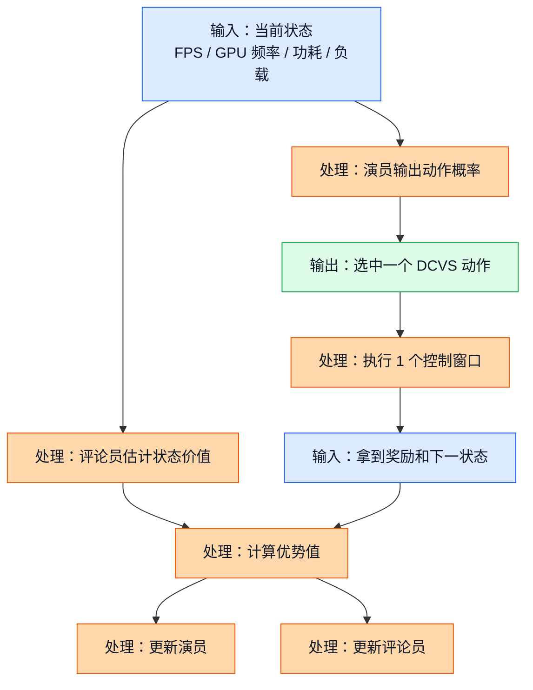

# 11. 演员-评论员（Actor-Critic）与优势演员-评论员（Advantage Actor-Critic, A2C）

## 前置阅读

- 建议先读“状态、动作、奖励”这些最基础概念。
- 如果你已经看过“价值函数”“时序差分（Temporal Difference, TD）”“策略梯度（Policy Gradient）”“REINFORCE”，这一章会更顺。
- 如果前面的章节你还没看全，也可以直接读这一章。本文会把需要的概念在文中补齐。

---

## 这章想解决什么问题

前面学策略梯度时，很多人会有一个共同感受：它能学，但学得有点“飘”。
今天这一局明明还行，参数却一下子改猛了；明天这一局明明踩坑了，更新方向又不够稳。

这时候，**演员-评论员（Actor-Critic）** 的想法就很自然了：

- 让一个网络专门负责“选动作”，这叫**演员（Actor）**；
- 让另一个网络专门负责“打分”，这叫**评论员（Critic）**。

放到 GPU DCVS 里，你可以把它想成：

- 演员像一个运行时调参工程师，负责从 192 个 DCVS 离散动作里挑一个；
- 评论员像一个老工程师，专门判断“这个状态下，刚才那步到底值不值”。

这套思路的重点不是让策略变复杂，而是让更新更稳、更少瞎猜。

---

## 1. 为什么只靠 REINFORCE 容易抖

### 1.1 直觉类比

想象你在带一个新人调 GPU 参数。
如果你每次都只在 10 秒后看一句总评：“这一段整体不错”或者“这一段整体很差”，那新人会很难知道：

- 是因为刚才那一步降频太激进了？
- 还是因为场景刚好切到团战，谁来都难？

REINFORCE 的典型问题，就是它经常把“动作本身好不好”和“环境刚好变了”混在一起。

### 1.2 正式定义

在最基础的策略梯度里，我们希望最大化期望回报：

$$
J(\theta) = \mathbb{E}_{\pi_\theta}\left[\sum_{t=0}^{T} \gamma^t r_t\right]
$$

它对应的一种常见更新形式是：

$$
\nabla_\theta J(\theta) \approx \mathbb{E}\left[\nabla_\theta \log \pi_\theta(a_t \mid s_t)\, G_t\right]
$$

这里：

- $\pi_\theta(a_t \mid s_t)$ 表示在状态 $s_t$ 下选动作 $a_t$ 的概率；
- $G_t$ 表示从时刻 $t$ 开始往后的累计回报；
- $\gamma$ 是折扣因子（Discount Factor）。

问题在于，$G_t$ 往往波动很大。
一旦波动大，梯度方向就会吵吵闹闹，训练容易不稳定。

> 补充知识
>
> 折扣因子 $\gamma$ 可以理解成“你有多在乎未来”。如果 $\gamma = 0$，那就只看眼前这一步；如果 $\gamma$ 接近 $1$，那就表示你愿意把未来很多步的结果都算进来。
>
> 在 DCVS 里这很合理，因为你现在把频率压低一点，可能不是这一秒立刻出问题，而是后面几秒团战来了才开始掉帧。

### 1.3 一个 DCVS 小例子

先用项目里已经出现过的奖励思路举个最简单的例子：

$$
\text{reward} = \mathrm{fps\_component} + \mathrm{freq\_component} + \mathrm{power\_component}
$$

其中：

$$
\mathrm{fps\_component} =
\begin{cases}
-10 \times (57 - fps), & fps < 57 \\
-2 \times (59 - fps), & 57 \le fps < 59 \\
20, & fps \ge 59
\end{cases}
$$

$$
\mathrm{freq\_component} = \frac{900 - \mathrm{gpu\_freq\_mhz}}{80}
$$

$$
\mathrm{power\_component} = \frac{6000 - \mathrm{power\_mw}}{400}
$$

假设当前一个 5 秒窗口里：

- 帧率 $fps = 58.6$
- GPU 频率 $gpu\_freq = 587$ MHz
- GPU 功耗 $power = 4200$ mW

一步一步算：

1. 先算帧率项。因为 $57 \le 58.6 < 59$，所以

$$
\mathrm{fps\_component} = -2 \times (59 - 58.6) = -2 \times 0.4 = -0.8
$$

2. 再算频率项：

$$
\mathrm{freq\_component} = \frac{900 - 587}{80} = \frac{313}{80} = 3.9125
$$

3. 再算功耗项：

$$
\mathrm{power\_component} = \frac{6000 - 4200}{400} = \frac{1800}{400} = 4.5
$$

4. 最后相加：

$$
\text{reward} = -0.8 + 3.9125 + 4.5 = 7.6125
$$

这个数字本身没问题，但如果你只拿它去更新策略，你还是不知道：

- 这一步其实不错，只是场景马上变复杂了；
- 还是这一步本来就一般。

于是，评论员就该上场了。

---

## 2. 新概念一：演员-评论员（Actor-Critic）

这一节按照固定四步来讲。

### 2.1 直觉类比

把 Actor-Critic 想成两个人搭班：

- 演员负责“做决定”；
- 评论员负责“告诉演员，刚才这步比平时好，还是比平时差”。

如果只让演员自己回忆整局输赢，它很容易把很多偶然因素都怪到自己头上。
但如果旁边一直有个评论员在报数：

- “这一拍其实比平均水平好”
- “这一拍看起来省电，但已经把 FPS 压到危险线附近了”

演员的学习就会稳很多。

### 2.2 正式定义

Actor-Critic 通常会维护两个对象：

1. 策略网络，也就是演员：

$$
\pi_\theta(a \mid s)
$$

它负责输出“在状态 $s$ 下，各个动作被选中的概率”。

2. 价值网络，也就是评论员：

$$
V_\phi(s)
$$

它负责估计“站在状态 $s$，未来大概能拿到多少总回报”。

进一步地，我们还会关心**优势函数（Advantage Function）**：

$$
A(s,a) = Q(s,a) - V(s)
$$

它的意思很朴素：

- $V(s)$ 是“这个状态下，平均来说大概能有多好”；
- $Q(s,a)$ 是“这个状态下，如果你硬是做了动作 $a$，会有多好”；
- 两者相减，就是“这个动作比平均水平好多少”。

如果 $A(s,a) > 0$，说明这步比平均水平好；
如果 $A(s,a) < 0$，说明这步拖后腿了。

> 补充知识
>
> 这里的“平均水平”不是口头说说，而是评论员网络学出来的一个基准值。你可以把它想成“这个状态下，正常发挥大概能拿多少分”。
>
> 所以优势函数不是在问“绝对好不好”，而是在问“相对这个状态本来的平均水平，到底更好还是更差”。这正是它能降低波动的原因。

### 2.3 公式推导 + Mermaid 图

实际实现时，很多 Actor-Critic 会直接用**时序差分误差（Temporal Difference Error, TD Error）** 来近似优势：

$$
A_t \approx \delta_t = r_t + \gamma V_\phi(s_{t+1}) - V_\phi(s_t)
$$

为什么这个式子有直觉？

- $V_\phi(s_t)$ 是“评论员原本对当前状态的预期”；
- $r_t + \gamma V_\phi(s_{t+1})$ 是“这一步真正走完后，看起来应该值多少”；
- 两者相减，就是“原来估低了还是估高了”。

这张图展示了 Actor-Critic 在 DCVS 场景里一次“决策 + 打分 + 回写”的最小闭环。

图里的关键路径是：先决策，再观察结果，最后用“结果和原预期的差距”去同时改演员和评论员。
演员不再盲目地听整段总分，而是听评论员给出的“这一步相对平均值到底好不好”。

### 2.4 DCVS 实际数值计算示例

我们用一个贴近项目约束的状态来算一次。

假设当前状态是：

| 指标 | 数值 |
|---|---:|
| FPS | 58.6 |
| GPU 频率 | 587 MHz |
| GPU 利用率 | 78% |
| GPU 功耗 | 4200 mW |
| 目标 FPS | 59 到 60 |

真实系统里有 $192 = 6 \times 4 \times 4 \times 2$ 个离散动作。
为了让纸笔能跟上，下面只展开经过安全过滤后的 4 个候选动作。你可以把它理解成“从 192 个动作里先挑出 4 个相对安全的备选”。

| 候选动作 | `first_step_down` | `penalty_down` | `penalty_up` | `strict_frame` | 演员输出 logit |
|---|---:|---:|---:|---:|---:|
| 动作 A | 10 | 90 | 85 | 0 | 2.1 |
| 动作 B | 5 | 95 | 90 | 1 | 1.6 |
| 动作 C | 15 | 90 | 95 | 0 | 0.8 |
| 动作 D | 20 | 98 | 98 | 1 | 0.5 |

演员通常会把这些 logit 经过 **Softmax** 变成概率：

$$
\pi_\theta(a_i \mid s) = \frac{e^{z_i}}{\sum_j e^{z_j}}
$$

> 补充知识
>
> Softmax 的作用，就是把一堆任意实数分数，压成一组介于 $0$ 和 $1$ 之间、并且总和等于 $1$ 的概率。谁的分数更高，谁的概率就更大。
>
> 这里的 $e^{z_i}$ 不需要你把它想得很玄。你只要记住：分数差一点点，经过指数函数后，概率差距会被放大。所以 Softmax 会让“更看好的动作”更容易被选中。

先算指数：

$$
e^{2.1} = 8.1662,\quad
e^{1.6} = 4.9530,\quad
e^{0.8} = 2.2255,\quad
e^{0.5} = 1.6487
$$

再算分母：

$$
8.1662 + 4.9530 + 2.2255 + 1.6487 = 16.9934
$$

于是四个动作的概率分别是：

$$
\pi(A \mid s) = \frac{8.1662}{16.9934} = 0.4805
$$

$$
\pi(B \mid s) = \frac{4.9530}{16.9934} = 0.2915
$$

$$
\pi(C \mid s) = \frac{2.2255}{16.9934} = 0.1310
$$

$$
\pi(D \mid s) = \frac{1.6487}{16.9934} = 0.0970
$$

假设这次真的选中了动作 A。
一个控制窗口后，我们已经算出即时奖励：

$$
r_t = 7.6125
$$

同时评论员给出两个估计：

$$
V_\phi(s_t) = 12.4,\quad V_\phi(s_{t+1}) = 13.1
$$

那么优势近似值就是：

$$
A_t \approx \delta_t = 7.6125 + 0.99 \times 13.1 - 12.4
$$

先算未来项：

$$
0.99 \times 13.1 = 12.969
$$

再相加：

$$
7.6125 + 12.969 = 20.5815
$$

最后减去当前价值：

$$
A_t = 20.5815 - 12.4 = 8.1815
$$

这个结果是正的，说明动作 A 比评论员原本预期得更好。
也就是说，这一步应该被鼓励。

---

## 3. 新概念二：优势演员-评论员（Advantage Actor-Critic, A2C）

Actor-Critic 是一个大类。
A2C 是这个家族里很经典、也很适合教学理解的一种。

### 3.1 直觉类比

如果普通 Actor-Critic 像“教练边看边点评”，那 A2C 更像：

- 不只看刚刚那 1 步；
- 而是把接下来几步的短期连锁反应也一起算进去；
- 然后统一做一次更稳的同步更新。

放到 DCVS 里，这个思路很自然。
因为一次调参往往不会只影响当前这一秒，还会影响后面几秒：

- 降频太快，可能下一小段才开始掉帧；
- 频率稳住了，可能后面功耗慢慢变好；
- 热量积累，也可能让后面几个窗口的选择空间变窄。

所以 A2C 往往比“只看一步”的更新更有上下文感。

### 3.2 正式定义

A2C 常被看成 **异步优势演员-评论员（Asynchronous Advantage Actor-Critic, A3C）** 的同步版。
它的核心不是“异步”还是“同步”这四个字，而是两件事：

1. 用优势而不是原始总回报来更新策略；
2. 用一小段 $n$ 步回报来给评论员和演员提供更稳的训练信号。

一个常见的 $n$ 步回报写法是：

$$
R_t^{(n)} = r_t + \gamma r_{t+1} + \gamma^2 r_{t+2} + \cdots + \gamma^{n-1} r_{t+n-1} + \gamma^n V_\phi(s_{t+n})
$$

然后把优势写成：

$$
A_t = R_t^{(n)} - V_\phi(s_t)
$$

演员常见的损失是：

$$
L_{\text{actor}} = - \log \pi_\theta(a_t \mid s_t)\, A_t
$$

评论员常见的损失是：

$$
L_{\text{critic}} = \frac{1}{2}\left(R_t^{(n)} - V_\phi(s_t)\right)^2
$$

有些实现还会再加一个熵奖励（Entropy Bonus）鼓励探索，但为了把核心思路讲清楚，这里先不加。

> 补充知识
>
> 你可以把 $R_t^{(n)}$ 理解成“往前看 $n$ 步的短账单”。它既没有 Monte Carlo 那样等到整局结束才结算，也不像一步 TD 那样只盯着下一步。
>
> 这在工程上很实用，因为它在“信息够多”和“波动别太大”之间取了个折中。

> 补充知识
>
> 梯度下降（Gradient Descent）不用想得太复杂。损失函数大，说明模型当前做得差；损失函数小，说明模型当前做得更好。训练时就是不断微调参数，让损失往更小的方向走。
>
> 在 A2C 里，评论员想把自己的估计误差变小，演员想让“高优势动作的概率变大、低优势动作的概率变小”。

### 3.3 公式推导 + Mermaid 图

这张图展示了 A2C 在一个短 rollout 里是怎么把“多步奖励”汇总成一次更新信号的。

图中的关键路径是：先收集一小段连续窗口，再把这段窗口的奖励折算成一个三步回报，最后用这个回报同时更新演员和评论员。
这也是 A2C 比“只看一步”的版本更稳的一大原因。

### 3.4 DCVS 实际数值计算示例

下面我们用一组完全可笔算的 DCVS 数字，算一次三步 A2C 更新。

假设控制器连续观察到 3 个窗口，动作都来自同一个 192 离散动作空间：

| 时间 | FPS | GPU 频率 | 功耗 | 即时奖励 |
|---|---:|---:|---:|---:|
| $t$ | 58.6 | 587 MHz | 4200 mW | $r_t = 7.6125$ |
| $t+1$ | 59.4 | 490 MHz | 3500 mW | $r_{t+1} = 31.375$ |
| $t+2$ | 60.1 | 430 MHz | 3000 mW | $r_{t+2} = 33.375$ |

这些奖励怎么算，我们一步一步展开。

先看 $t+1$ 这个窗口：

1. 因为 $fps = 59.4 \ge 59$，所以

$$
\mathrm{fps\_component} = 20
$$

2. 频率项：

$$
\mathrm{freq\_component} = \frac{900 - 490}{80} = \frac{410}{80} = 5.125
$$

3. 功耗项：

$$
\mathrm{power\_component} = \frac{6000 - 3500}{400} = \frac{2500}{400} = 6.25
$$

4. 所以：

$$
r_{t+1} = 20 + 5.125 + 6.25 = 31.375
$$

再看 $t+2$：

1. 因为 $fps = 60.1 \ge 59$，所以

$$
\mathrm{fps\_component} = 20
$$

2. 频率项：

$$
\mathrm{freq\_component} = \frac{900 - 430}{80} = \frac{470}{80} = 5.875
$$

3. 功耗项：

$$
\mathrm{power\_component} = \frac{6000 - 3000}{400} = \frac{3000}{400} = 7.5
$$

4. 所以：

$$
r_{t+2} = 20 + 5.875 + 7.5 = 33.375
$$

现在假设：

$$
\gamma = 0.99,\quad V_\phi(s_t) = 74.2,\quad V_\phi(s_{t+3}) = 12.0
$$

三步回报是：

$$
R_t^{(3)} = r_t + \gamma r_{t+1} + \gamma^2 r_{t+2} + \gamma^3 V_\phi(s_{t+3})
$$

把数字代进去：

$$
R_t^{(3)} = 7.6125 + 0.99 \times 31.375 + 0.99^2 \times 33.375 + 0.99^3 \times 12.0
$$

分步算：

$$
0.99 \times 31.375 = 31.06125
$$

$$
0.99^2 = 0.9801
$$

$$
0.9801 \times 33.375 = 32.7108375
$$

$$
0.99^3 = 0.970299
$$

$$
0.970299 \times 12.0 = 11.643588
$$

把四项全部加起来：

$$
R_t^{(3)} = 7.6125 + 31.06125 + 32.7108375 + 11.643588 = 83.0281755
$$

于是优势就是：

$$
A_t = 83.0281755 - 74.2 = 8.8281755
$$

如果当前动作的策略概率还是刚才算出来的：

$$
\pi_\theta(a_t \mid s_t) = 0.4805
$$

那演员损失就是：

$$
L_{\text{actor}} = -\log(0.4805) \times 8.8281755
$$

先算对数：

$$
\log(0.4805) \approx -0.6492
$$

代进去：

$$
L_{\text{actor}} = -(-0.6492) \times 8.8281755 \approx 5.7316
$$

评论员损失是：

$$
L_{\text{critic}} = \frac{1}{2}(8.8281755)^2
$$

先平方：

$$
(8.8281755)^2 \approx 77.9367
$$

再乘 $\frac{1}{2}$：

$$
L_{\text{critic}} \approx 38.9683
$$

这组数字告诉你两件事：

- 优势为正，说明这段 rollout 对当前动作是正反馈；
- 评论员的误差也不小，说明它对这个状态的价值判断还可以继续校准。

---

## 4. A2C 放到 GPU DCVS 里，应该怎么理解

### 4.1 状态、动作、奖励分别长什么样

把 A2C 放到这个项目里，一个自然的建模方式是：

- 状态 $s_t$：当前窗口的 FPS、GPU 频率、GPU 利用率、功耗、延迟、上一动作等特征；
- 动作 $a_t$：192 个离散 DCVS 参数组合；
- 奖励 $r_t$：同时考虑 FPS 达标、频率、功耗。

一个比较实用的状态可以长这样：

| 特征 | 例子 |
|---|---:|
| 当前 FPS | 58.6 |
| GPU 频率 | 587 MHz |
| GPU 利用率 | 78% |
| GPU 功耗 | 4200 mW |
| Fence 平均延迟 | 11 ms |
| GPU headroom | 2.8 ms |
| 上一个动作是否激进降频 | 1 |

动作空间则是：

$$
6 \times 4 \times 4 \times 2 = 192
$$

也就是：

- `first_step_down` 有 6 个取值；
- `penalty_down` 有 4 个取值；
- `penalty_up` 有 4 个取值；
- `strict_frame` 有 2 个取值。

这点很重要：**当前项目是离散动作空间（Discrete Action Space）**，所以 A2C 里的演员通常会输出一个 192 维分类分布，用 Softmax 选动作。
如果以后把动作改成“连续残差微调”，比如让参数在一个连续区间里小步挪动，那演员的输出形式也要跟着变，通常会从“分类概率”改成“连续分布参数”。
也就是说，**问题怎么定义，直接决定算法长什么样**。

### 4.2 A2C 在这个问题上的优点

如果你把 DCVS 明确看成一个**马尔可夫决策过程（Markov Decision Process, MDP）**，那 A2C 的优点是很直观的：

1. 它承认“当前动作会影响后面几个窗口”；
2. 它直接优化策略，不需要像 Q-learning 那样每次都先估所有动作的 Q 值；
3. 对连续状态输入很自然，适合吃 15 到 20 维这类连续特征。

从教学角度看，A2C 很适合帮你真正建立“策略网络 + 价值网络协同训练”的直觉。

### 4.3 A2C 在这个问题上的硬伤

但一落到这次项目的真实数据条件，问题就来了。

从三份源文档能抽出的共同现实是：

- 当前数据覆盖远远不完整；
- 已有样本里，很多是“一轮 benchmark 里动作固定”的日志；
- 真机在线探索代价高，掉帧风险也高；
- 首发目标更偏“安全上线”，不是“大胆在线试错”。

A2C 的关键短板正好撞上这些现实：

1. **它通常是同策略（On-Policy）方法**
   也就是说，训练时希望用“当前策略刚刚采到的数据”来更新当前策略。

2. **它更依赖在线交互**
   你如果只有旧日志，而且这些日志大部分不是按当前策略采出来的，A2C 就不舒服。

3. **它需要安全探索**
   在游戏运行时随便试动作，可能直接把 FPS 从 59 附近打到 57 以下。

> 补充知识
>
> 同策略（On-Policy）可以粗暴理解成“边跑边学，而且主要学自己刚刚跑出来的数据”；异策略（Off-Policy）则更像“我也能拿别人以前采过的数据来学”。
>
> 这就是为什么离线强化学习（Offline RL）会更偏爱 CQL、IQL 这类方法。它们就是冲着“我手里主要是旧日志”这个现实去设计的。

### 4.4 为什么三份源文档没有把 A2C 列成首选

这三份文档看起来意见不完全一样，但它们对 A2C 不热情，其实是因为默认前提差不多。

| 来源 | 它更看重什么 | 隐含假设 | 对 A2C 的含义 |
|---|---|---|---|
| `RL_Algorithm_Selection...` | 离线训练、安全性、192 离散动作直接适配 | 当前首发应优先用离线保守方法 | A2C 不占优，因为它不是为离线固定日志设计的 |
| `RL_DCVS_AI_Integrated_Decision...` | 生产可控性、安全壳、低风险上线 | 先做 CQL + 安全过滤更稳 | A2C 的在线探索风险太高 |
| `RL_DCVS_Runtime_Adaptive_Independent_Decision...` | 运行时上下文决策、短历史、快速响应 | 这个问题很多时候更像 safe contextual bandit | A2C 有点“建模太重” |

真正分歧的根子，不是“谁更懂 RL”，而是“大家把问题看成什么问题”。

可以把它们压成下面这张判断表：

| 问题表述 | 更自然的方法 | A2C 位置 |
|---|---|---|
| 当前动作几乎不影响未来，只要看当前上下文 | 上下文 bandit | 通常不划算 |
| 当前动作会影响后面几个窗口，但你主要只有离线日志 | CQL / IQL | 不如离线 RL |
| 当前动作明显影响未来，而且你能安全地在线采样 | A2C / PPO / 其他在线策略梯度 | 才有竞争力 |

所以，A2C 不是“坏算法”。
它只是更适合下面这种前提：

- 你能在线持续采样；
- 你能接受一定探索成本；
- 你确认这个问题确实是 MDP，不是 bandit；
- 你手里有足够安全的回退机制。

而这几个前提，恰好都不是当前项目最强的那一面。

---

## 5. 如果以后数据条件变好了，A2C 还有没有机会

有，而且不是小机会。

如果未来你把数据链路补到下面这个程度：

- 一轮采集中会切换多个动作，而不是整轮固定一个动作；
- 能拿到更完整的 $(s_t, a_t, r_t, s_{t+1})$ 转移；
- 有安全护栏，允许小步在线探索；
- 能用 3 到 10 秒窗口稳定运行策略；

那 A2C 就会从“教学上很重要”逐步变成“工程上值得试”。

一个比较合理的演进路线会是：

1. 先用保守离线方法做冷启动，比如 CQL 或 IQL；
2. 再在安全动作子集上做小步在线适应；
3. 如果确认长时序效应很强，再考虑 A2C 或 PPO 这类在线策略方法。

也就是说，A2C 更像第二阶段甚至第三阶段选手，而不是当前最稳的首发选手。

---

## 关键收获

1. 演员-评论员（Actor-Critic）的核心，不是多了一个网络这么简单，而是多了一个“平均水平基准”，让策略更新不那么飘。
2. 优势演员-评论员（A2C）会把短期多步回报折成一个更稳的训练信号，用优势 $A_t = R_t^{(n)} - V(s_t)$ 来同时更新演员和评论员。
3. 在 GPU DCVS 里，A2C 很适合理解“动作会影响未来几个窗口”的 MDP 思维，也很适合学习策略网络和价值网络怎么配合。
4. 但结合这次项目的真实条件，A2C 不是当前首推方案。原因不是它不先进，而是它更偏在线、同策略、需要安全探索，而现有资料更支持离线保守方法或安全上下文决策。
5. 如果未来日志覆盖更完整、轮内能切换动作、并且具备安全在线回路，A2C 的工程价值会明显上升。
