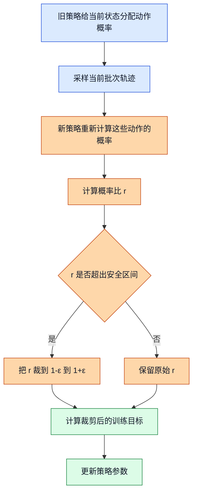
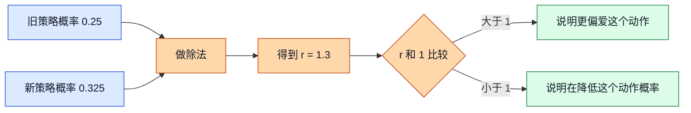
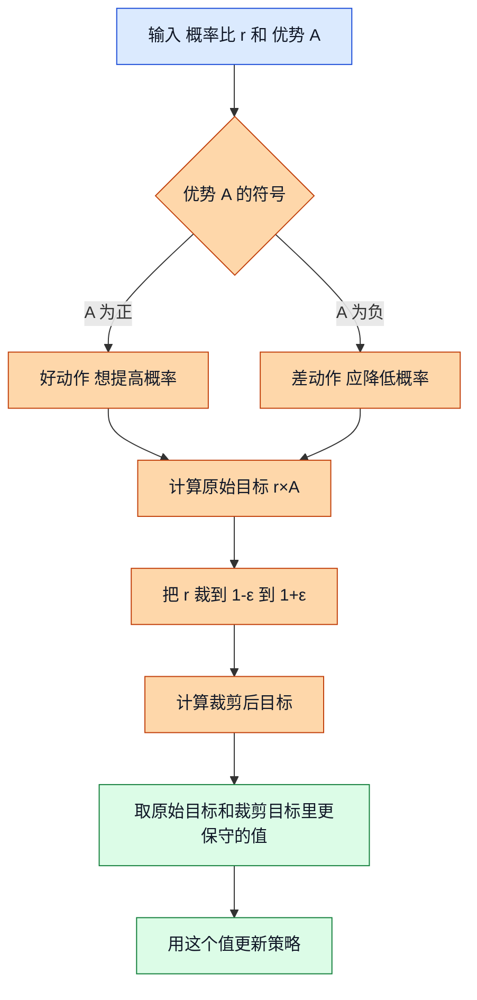
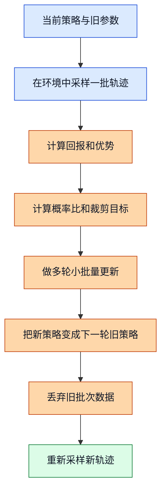

# 12. 近端策略优化（Proximal Policy Optimization, PPO）

## 前置阅读

- 无。本文按从零开始来讲，单独阅读也能看懂。
- 如果你已经读过策略梯度（Policy Gradient）和演员-评论家（Actor-Critic）相关材料，会更容易把 PPO 放回大图里。

## 这篇文档想解决什么问题

PPO 经常被说成“比较稳的策略梯度算法”。这句话没错，但太空了。对 GPU DCVS 这个项目来说，你真正需要搞明白的是两件事：

1. PPO 到底想解决什么痛点。
2. 为什么它在很多强化学习课程里很重要，但在我们这个项目里又不是首发主线。

先把结论放前面：

- PPO 的核心想法很朴素：策略（Policy）每次更新可以变，但不要一下子变太猛。
- 它主要靠一个“裁剪”动作，把过大的策略变化硬生生按住。
- 它在仿真环境里很好用，但在当前 GPU DCVS 真机场景里，源文档一致给了它低排名，核心原因是：同策略（On-Policy）样本效率差、真机探索风险高、离线日志利用能力弱。

## 一眼看懂 PPO 在干嘛

你可以把 PPO 想成一个刚学开车的人。

- 强化学习智能体（Agent）像新手司机。
- 每次参数更新，像教练让你“下一圈试着多打一点方向盘”。
- 如果一次改太猛，车就可能直接冲出车道。
- PPO 的做法就是：允许你改，但每次只准“小步快跑”。

放到 DCVS 里也一样：

- 状态（State）是当前这几秒的 FPS、GPU 频率、GPU 利用率、功耗、延迟等指标。
- 动作（Action）是 192 个离散 `action_id` 之一。
- 奖励（Reward）要同时考虑 FPS、频率和功耗。
- PPO 负责调整“每个状态下选哪个 `action_id` 的概率”，但不允许这个概率表一夜之间大变脸。

## 概念一：信任区域（Trust Region）

### 1. 直觉类比

想象你在调一个很敏感的游戏画质旋钮。昨天你试出来“往左拧 5 格”最舒服，今天你突然一口气拧 50 格，很可能直接把画面弄崩。

信任区域就是在说：可以继续调，但先别离昨天那个还算靠谱的设置太远。

### 2. 正式定义

更正式一点，PPO 想让“新策略”和“旧策略”在同一个状态下给出的动作概率不要差太多。严格一点的信任区域方法会直接约束两个概率分布的距离，比如用：

$$
D_{\mathrm{KL}}\bigl(\pi_{\theta_{\mathrm{old}}}(\cdot|s)\,\|\,\pi_{\theta}(\cdot|s)\bigr)
$$

来衡量新旧策略差了多少。

PPO 没有像 TRPO 那样硬解一个复杂约束优化，而是用了更工程化的近似办法：只要发现某个动作的概率变化太猛，就把这次变化裁掉一部分。

> 补充知识：KL 散度（KL Divergence）
>
> KL 散度可以先把它当成“新旧两张概率表有多不像”。比如旧策略在某个状态下给 `action 72` 的概率是 0.25，新策略突然提到 0.80，虽然两个都还是合法概率，但行为习惯已经变得很不一样了。
>
> 它不是简单的减法，而是专门给“概率分布”准备的距离感指标。值越小，说明新旧策略越像；值越大，说明你这一步改得越猛。PPO 的想法就是：奖励可以追，但别一下子把策略改得面目全非。

### 3. 公式推导 + Mermaid 图

如果完全不做限制，策略梯度会想办法把“看起来不错”的动作概率越推越高。最直接的更新目标可以写成：

$$
L_t(\theta) = r_t(\theta)\hat{A}_t
$$

这里：

- $r_t(\theta)$ 是新旧策略对当前动作的概率比。
- $\hat{A}_t$ 是这个动作的优势函数（Advantage），意思是“它比当前平均水平好多少或差多少”。

问题在于，只要 $\hat{A}_t > 0$，模型就会很想把 $r_t(\theta)$ 推得越来越大。于是 PPO 加上一个“别冲太猛”的机制。

这张图展示了“信任区域”在 PPO 里是怎么落地的。

图里的关键路径是：先用旧策略采样，再让新策略回头检查“我对这些动作的偏好改了多少”，如果改得太猛，就把更新幅度削平一点。这样做的目标不是追求绝对最优一步，而是减少“这一步太激进，下一步全崩”的风险。

### 4. DCVS 实际数值计算示例

假设当前窗口的状态是：

- FPS = 58.6
- GPU 频率 = 430 MHz
- GPU 利用率 = 92%
- 功耗 = 5100 mW
- 动作空间 = 192 个离散 `action_id`

旧策略在这个状态下，对 `action 72` 的概率是：

$$
\pi_{\theta_{\mathrm{old}}}(a=72|s)=0.25
$$

一次梯度更新后，新策略想把它直接提到：

$$
\pi_{\theta}(a=72|s)=0.40
$$

现在一步一步算概率比：

$$
r_t(\theta)=\frac{\pi_\theta(a_t|s_t)}{\pi_{\theta_{\mathrm{old}}}(a_t|s_t)}
=\frac{0.40}{0.25}=1.60
$$

如果我们设 $\epsilon = 0.2$，那 PPO 允许的安全区间是：

$$
[1-\epsilon,\;1+\epsilon]=[0.8,\;1.2]
$$

因为 $1.60 > 1.20$，说明这一步把 `action 72` 的概率推得太猛了。PPO 的态度不是“完全不许变”，而是：

$$
1.60 \rightarrow 1.20
$$

也就是把这次过猛的更新压回信任区域里。你可以把它理解成：

- 原计划：一脚油门直接冲到 1.60 倍。
- PPO：不行，这一步最多只能按 1.20 倍算。

这就是“信任区域”的工程版落地方式。

## 概念二：概率比（Probability Ratio）

### 1. 直觉类比

把旧策略和新策略想成两个教练。

- 旧教练说：这个状态下，你有 25% 概率选 `action 72`。
- 新教练说：不，这个动作值得更常用一点，提到 32.5%。

概率比问的不是“新概率是多少”，而是“新教练比旧教练更偏爱这个动作多少倍”。

### 2. 正式定义

PPO 最核心的量之一就是：

$$
r_t(\theta)=\frac{\pi_\theta(a_t|s_t)}{\pi_{\theta_{\mathrm{old}}}(a_t|s_t)}
$$

它的含义很直接：

- 如果 $r_t(\theta)=1$，说明新旧策略对这个动作的偏好没变。
- 如果 $r_t(\theta)>1$，说明新策略更偏爱这个动作。
- 如果 $r_t(\theta)<1$，说明新策略在降低这个动作的概率。

> 补充知识：概率比到底在看什么
>
> 这里不是在比较两个不同动作谁大谁小，而是在比较“同一个动作在新旧两版策略里被喜欢的程度”。所以分子和分母必须是同一个状态、同一个动作，只是参数版本不同。
>
> 你可以把它理解成“偏好放大倍数”。比如旧策略给 0.10，新策略给 0.13，那就是放大了 1.3 倍；旧策略给 0.20，新策略给 0.16，那就是缩成了 0.8 倍。

### 3. 公式推导 + Mermaid 图

PPO 用概率比，而不是直接用新概率，有两个好处：

1. 它能直接看出“变化了多少倍”。
2. 它天然以旧策略为基准，很适合做“小步更新”。

这张图展示了概率比是怎么从新旧策略概率里算出来的。

图里的关键点只有一个：PPO 不盯着“最终概率是多少”，它盯着“这次相对上次改了多少倍”。因为真正危险的，往往不是概率高本身，而是“这一步改太快”。

### 4. DCVS 实际数值计算示例

虽然真实动作空间有 192 个动作，但手算时没必要把 192 个全展开。下面只截 3 个动作来看：

| 动作 | 旧策略概率 | 新策略概率 | 概率比 $r$ |
|---|---:|---:|---:|
| `action 72` | 0.25 | 0.325 | $0.325 / 0.25 = 1.3$ |
| `action 90` | 0.15 | 0.135 | $0.135 / 0.15 = 0.9$ |
| `action 121` | 0.10 | 0.09 | $0.09 / 0.10 = 0.9$ |

把第一行完整手算一遍：

$$
r_{72}=\frac{0.325}{0.25}
$$

先把小数变成更容易心算的形式：

$$
\frac{0.325}{0.25}=\frac{32.5}{25}
$$

继续算：

$$
\frac{32.5}{25}=1.3
$$

解释：

- `action 72` 的概率被放大了 1.3 倍。
- 如果它对应的是一个好动作，这可能是合理方向。
- 但如果一次就放大太多，PPO 还会继续问：1.3 倍会不会已经过猛了？

## 概念三：裁剪代理目标（Clipped Surrogate Objective）

### 1. 直觉类比

还拿学开车来类比。

- 某次转弯转得不错，教练会说“下次可以再多一点”。
- 但不会说“那你下次直接多打十倍方向盘试试”。

PPO 里的“裁剪代理目标”就是这个教练。它会奖励朝正确方向更新，但只奖励到一个上限，超过上限的那部分不给你算。

### 2. 正式定义

PPO 最经典的目标函数是：

$$
L^{\mathrm{CLIP}}(\theta)=\hat{\mathbb{E}}_t\Bigl[\min\bigl(r_t(\theta)\hat{A}_t,\ \mathrm{clip}(r_t(\theta),1-\epsilon,1+\epsilon)\hat{A}_t\bigr)\Bigr]
$$

逐项解释：

- $r_t(\theta)$：新旧策略对同一个动作的概率比。
- $\hat{A}_t$：优势函数，表示这个动作比“当前平均水平”更好还是更差。
- $\mathrm{clip}(r_t(\theta),1-\epsilon,1+\epsilon)$：把概率比裁到安全区间。
- $\min(\cdot,\cdot)$：让算法在“原始收益”和“裁剪后收益”里取更保守的那个。

> 补充知识：优势函数（Advantage）
>
> 优势函数可以先粗暴理解成“这个动作到底值不值得比原来更常选”。如果 $\hat{A}_t > 0$，说明这个动作比当前平均水平好；如果 $\hat{A}_t < 0$，说明它比平均水平差。
>
> 很多实现里会先让评论家（Critic）给出一个状态价值 $V(s_t)$，再用“实际拿到的回报减去这个基线”得到优势。你可以把它看成“这次考试分数减去班级平均分”。高于平均就是正优势，低于平均就是负优势。

> 补充知识：梯度上升（Gradient Ascent）
>
> 监督学习里你更常见“梯度下降”，因为目标是把损失降下来。PPO 这里更像“梯度上升”，因为我们希望把目标函数尽量抬高。
>
> 但别被名字吓到，本质都是顺着一个“会变好”的方向小步移动参数。PPO 的难点不在“上升还是下降”，而在“别一下走太大步”。

### 3. 公式推导 + Mermaid 图

先从最朴素的想法出发：

$$
\text{原始目标} = r_t(\theta)\hat{A}_t
$$

如果 $\hat{A}_t > 0$，模型就想把 $r_t(\theta)$ 往大了推。

如果 $\hat{A}_t < 0$，模型就应该降低这个动作的概率。

但无论是往上推还是往下压，只要一步太猛，都可能让训练不稳定。所以 PPO 再补一层：

$$
\text{裁剪后比例} = \mathrm{clip}(r_t(\theta),1-\epsilon,1+\epsilon)
$$

然后比较：

$$
r_t(\theta)\hat{A}_t
\quad \text{和} \quad
\mathrm{clip}(r_t(\theta),1-\epsilon,1+\epsilon)\hat{A}_t
$$

最后取更保守的那个。

这张图展示了裁剪代理目标的判断逻辑。

图里的关键路径是：先判断这个动作到底是好是坏，再看新策略对它改了多少，最后用“更保守”的目标来更新。也就是说，PPO 不是让模型胆小，而是强迫它在每一步都别太冲动。

### 4. DCVS 实际数值计算示例

先做题目里要求的紧凑例子。设：

$$
r=1.3,\qquad \epsilon=0.2
$$

那么裁剪后的比例是：

$$
\mathrm{clip}(1.3,0.8,1.2)=1.2
$$

#### 情况 A：这是一个好动作，$\hat{A}=+5$

先算原始目标：

$$
r\hat{A}=1.3\times 5=6.5
$$

再算裁剪后目标：

$$
\mathrm{clip}(r)\hat{A}=1.2\times 5=6.0
$$

PPO 取两者里的较小值：

$$
\min(6.5,6.0)=6.0
$$

结论：这个动作虽然好，但“加分”最多只按 6.0 算，不让你因为一次好运就把它过度吹上天。

#### 情况 B：这是一个差动作，$\hat{A}=-3$

先算原始目标：

$$
r\hat{A}=1.3\times (-3)=-3.9
$$

再算裁剪后目标：

$$
\mathrm{clip}(r)\hat{A}=1.2\times (-3)=-3.6
$$

PPO 还是取较小值：

$$
\min(-3.9,-3.6)=-3.9
$$

结论：如果一个本来就差的动作还被新策略提了概率，PPO 不会替它“擦屁股”，反而会让这个错误更明显地出现在目标里。

下面把这个例子真正落到 DCVS 数字上。

#### DCVS 好动作例子

假设一次动作执行后，观测到：

- FPS = 59.4
- GPU 频率 = 430 MHz
- 功耗 = 5100 mW
- 旧策略选中 `action 72` 的概率 = 0.25
- 新策略把它提高到 0.325
- 评论家估计该状态价值 $V(s_t)=23.125$

按照源文档推荐的奖励函数：

$$
\mathrm{reward}=\mathrm{fps\_component}+\mathrm{freq\_component}+\mathrm{power\_component}
$$

其中：

$$
\mathrm{fps\_component}=20 \qquad (\text{因为 } FPS \ge 59)
$$

$$
\mathrm{freq\_component}=\frac{900-430}{80}=\frac{470}{80}=5.875
$$

$$
\mathrm{power\_component}=\frac{6000-5100}{400}=\frac{900}{400}=2.25
$$

总奖励：

$$
\mathrm{reward}=20+5.875+2.25=28.125
$$

优势函数近似成“实际奖励减去状态价值基线”：

$$
\hat{A}=28.125-23.125=5.0
$$

概率比：

$$
r=\frac{0.325}{0.25}=1.3
$$

设 $\epsilon=0.2$，则：

$$
\mathrm{clip}(r,0.8,1.2)=1.2
$$

原始目标：

$$
r\hat{A}=1.3\times 5.0=6.5
$$

裁剪目标：

$$
1.2\times 5.0=6.0
$$

最终这一步按：

$$
\min(6.5,6.0)=6.0
$$

来记账。

#### DCVS 差动作例子

再看一个危险动作。假设在高负载时把频率压得过低，结果观测到：

- FPS = 55.5
- GPU 频率 = 282 MHz
- 功耗 = 2200 mW
- 旧策略给这个动作的概率 = 0.10
- 新策略错误地把它提高到 0.13
- 评论家估计 $V(s_t)=5.225$

先算奖励的三个部分。

因为 $FPS < 57$，所以：

$$
\mathrm{fps\_component}=-10\times(57-55.5)
$$

先算括号：

$$
57-55.5=1.5
$$

再乘以 $-10$：

$$
\mathrm{fps\_component}=-10\times 1.5=-15.0
$$

频率项：

$$
\mathrm{freq\_component}=\frac{900-282}{80}=\frac{618}{80}=7.725
$$

功耗项：

$$
\mathrm{power\_component}=\frac{6000-2200}{400}=\frac{3800}{400}=9.5
$$

总奖励：

$$
\mathrm{reward}=-15.0+7.725+9.5=2.225
$$

优势函数：

$$
\hat{A}=2.225-5.225=-3.0
$$

概率比：

$$
r=\frac{0.13}{0.10}=1.3
$$

原始目标：

$$
r\hat{A}=1.3\times(-3.0)=-3.9
$$

裁剪后目标：

$$
1.2\times(-3.0)=-3.6
$$

最终：

$$
\min(-3.9,-3.6)=-3.9
$$

这一步的意思很明确：模型居然想把一个会把 FPS 打到 55.5 的动作提概率，那 PPO 会把这种错误清清楚楚地反映在目标里。

## PPO 的完整训练流程

### 1. 直觉类比

PPO 很像“边打游戏边记笔记再复盘”：

1. 先按当前策略玩一段。
2. 记下每一步发生了什么。
3. 回头算哪些动作值得更常做，哪些该少做。
4. 小心更新策略。
5. 旧笔记作废，再去采一批新数据。

### 2. 正式定义

这就是同策略（On-Policy）的核心：训练时用的数据，必须主要来自当前这版策略，或者至少非常接近当前策略。

这带来两个后果：

- 好处：训练目标和采样分布更一致，理论上更“干净”。
- 坏处：旧数据不能像离策略（Off-Policy）方法那样反复拿来榨干，样本效率会明显更差。

### 3. 算法流程 + Mermaid 图

这张图展示了 PPO 的标准训练循环。

图里的关键路径是最后两步：旧数据会被很快“过期”。这正是 PPO 在仿真里常见、但在真机里偏贵的根源，因为你得不停重新跑环境采样。

### 4. DCVS 实际数值计算示例

源文档给出的判断是：PPO 往往需要 $10^5 \sim 10^6$ 级别的交互步数，而且当前真机一轮实验按 30 秒估算。

那我们直接手算成本。

#### 情况 A：需要 $10^5$ 步

总时间：

$$
100000\times 30 = 3000000\ \text{秒}
$$

换成小时：

$$
\frac{3000000}{3600}=833.33\ \text{小时}
$$

换成天：

$$
\frac{833.33}{24}=34.72\ \text{天}
$$

#### 情况 B：需要 $10^6$ 步

总时间：

$$
1000000\times 30 = 30000000\ \text{秒}
$$

换成小时：

$$
\frac{30000000}{3600}=8333.33\ \text{小时}
$$

换成天：

$$
\frac{8333.33}{24}=347.22\ \text{天}
$$

也就是说，如果真按这种量级去做在线 PPO，时间成本可能从一个多月直接飙到接近一年。对移动端真机调参来说，这几乎就是在跟项目排期硬碰硬。

## 为什么源文档都把 PPO 排名放得很低

### 1. 在线探索风险高

直觉上很好理解：如果模型在高负载、95% GPU 利用率附近，突然尝试一个过于激进的低频动作，比如 282 MHz，那一局游戏里的用户不会关心你是不是在“探索”，他只会看到掉帧。

正式一点说，当前项目的核心目标是先守住 FPS 59 到 60，再尽量降频降功耗。在线 PPO 早期必然会经历大量还不够靠谱的试探动作，这和真机安全要求是冲突的。

上面的差动作例子已经给过具体数字：

- 282 MHz、55.5 FPS、2200 mW 这组结果的总奖励只有 2.225。
- 而 430 MHz、59.4 FPS、5100 mW 的总奖励是 28.125。

两者相差：

$$
28.125-2.225=25.9
$$

这不是“小抖动”，而是肉眼能感知到的体验断层。

### 2. 同策略样本效率太差

PPO 的数据用法很“新鲜”，但也很“浪费”。

- 用过一两轮的小批次数据，很快就不再适合当前策略。
- 你不能像离线强化学习（Offline Reinforcement Learning）那样把历史日志反复训练很多遍。

这和当前项目的现实非常不合拍，因为我们已经有逐帧 CSV、想优先利用离线数据，而不是先拿真实手机做长时间危险探索。

### 3. 离线日志利用能力弱

三份源文档都提到一个关键现实：

- 当前总覆盖大约只有 30/192 个动作。
- 选定样本文件里甚至只有一个动作 `action 72`。

这意味着什么？

- PPO 天生更适合“我能持续跟环境交互，再采一批当前策略数据”的场景。
- 但我们手上更多是固定日志。
- 如果硬把 PPO 拿来啃这种日志，就会遇到分布不匹配（Distribution Mismatch）问题。

换句话说，不是 PPO 完全不能训练，而是它和当前数据形态天然不对口。

## 三份源文档分别怎么评价 PPO

| 源文档 | 对 PPO 的结论 | 背后的核心假设 |
|---|---|---|
| `RL_Algorithm_Selection_for_GPU_DCVS_Tuning_20260401.md` | 不推荐，排第 5 | 假设当前要优先利用离线数据，且 192 个离散动作更适合离散离线 RL |
| `RL_DCVS_AI_Integrated_Decision_2026-04-01.md` | 不作为主线，排第 5 | 假设目标是尽快做可上线方案，固定日志上的“离线 PPO”有明显分布偏差风险 |
| `RL_DCVS_Runtime_Adaptive_Independent_Decision_GPT-5.4_2026-04-01_135421.md` | 推荐度 3/10 | 假设当前问题更像短历史上下文决策，安全上下文 bandit 比完整在线深度 RL 更现实 |

这三份文档对 PPO 的低评价是一致的，但它们看问题的角度不完全一样：

- 第一份更强调“动作空间和数据形态匹不匹配”。
- 第二份更强调“工程上线时能不能稳妥利用当前日志”。
- 第三份更强调“你这个 runtime 任务到底是不是非得上完整 MDP 深度 RL”。

所以，PPO 不是“理论上烂”，而是“在当前这个项目阶段和这个数据条件下，不划算”。

## 那为什么还值得学 PPO

因为它把策略梯度里最重要的一条经验讲得非常清楚：

- 更新不是越猛越好。
- 好动作要提高概率，但不能一把梭。
- 坏动作要降概率，而且要能稳稳地降。

你哪怕最后不用 PPO 做主线，学完它也会更容易理解：

- 为什么需要优势函数。
- 为什么 Actor-Critic 比纯 REINFORCE 更实用。
- 为什么后面的 SAC、TRPO、IQL、CQL 各自在解决不同的“稳定性/数据利用”问题。

## 关键收获

- 近端策略优化（Proximal Policy Optimization）本质上是在做“有刹车的策略梯度更新”。
- 它用概率比 $r_t(\theta)$ 衡量新旧策略对同一动作的偏好变化，再用裁剪代理目标把过猛更新压回去。
- 最关键的公式是裁剪代理目标：

$$
L^{\mathrm{CLIP}}(\theta)=\hat{\mathbb{E}}_t\Bigl[\min\bigl(r_t(\theta)\hat{A}_t,\ \mathrm{clip}(r_t(\theta),1-\epsilon,1+\epsilon)\hat{A}_t\bigr)\Bigr]
$$

- 在 DCVS 的具体数字里，$r=1.3$、$\epsilon=0.2$、$\hat{A}=5$ 时，原始目标 6.5 会被压到 6.0；这就是“允许变好，但不许一步冲太猛”。
- 当前项目不适合把 PPO 当主线，原因不是它没名气，而是它和现实条件冲突：真机探索危险、同策略样本效率低、离线日志覆盖稀疏且难反复利用。
- 学懂 PPO 依然很值，因为它能帮你真正理解“策略优化为什么需要稳”，也能帮你看清为什么这个项目最后更偏向 CQL、IQL 或安全上下文 bandit。
