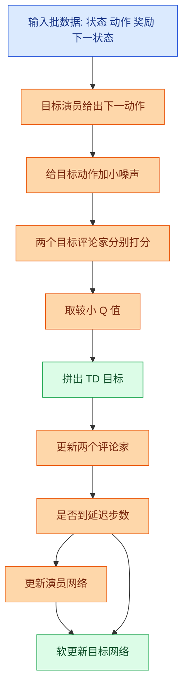
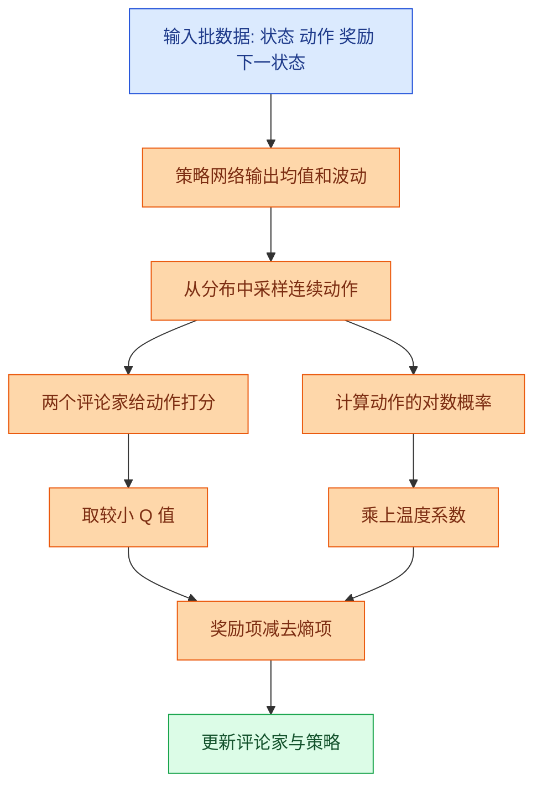

# 13. SAC 与 TD3：连续控制为什么强，但为什么当前 DCVS 项目还不该直接上

## 前置阅读

- 建议先读 `learn/10_Policy_Gradient_REINFORCE.md`
- 建议先读 `learn/11_Actor_Critic_A2C.md`
- 建议先读 `learn/12_PPO.md`
- 如果前面的文档暂时还没生成，也可以直接读本篇；我会把关键背景补齐

这一篇的目标很明确：你要先看懂两件事。

第一，双延迟深度确定性策略梯度（Twin Delayed Deep Deterministic Policy Gradient, TD3）和软演员评论家（Soft Actor-Critic, SAC）为什么会在机器人控制、自动驾驶、机械臂这类连续控制任务里很常见。第二，为什么它们一旦放到当前这个 GPU DCVS 场景里，就会立刻撞上“动作空间其实是离散编码”的工程现实。

换句话说，本篇不是为了让你背公式，而是为了让你真正看懂一句话：

> 算法不是单独选的，算法总是跟着问题建模走。
> 你把动作定义成离散动作表，和把动作定义成连续残差，最后适合的算法会完全不一样。

为了和项目里的真实场景对齐，本文默认你脑子里一直带着这几个数值边界：

- GPU 频率常见范围是 `282-710 MHz`
- 目标帧率通常盯在 `59-60 FPS`
- 功耗观测范围可以粗看成 `0-8000 mW`
- 当前动作空间是 `192` 个离散组合，而不是天然连续的控制旋钮

---

## 一、先别急着学算法，先看动作空间长什么样

### 概念一：离散动作编码（Discrete Action Encoding） vs 连续残差控制（Continuous Residual Control）

#### 1. 直觉类比

你可以把这两种动作空间想成两种完全不同的调参方式。

- 离散动作编码，像是空调遥控器上已经做好的 `192` 个预设档位。你每次只能按一个现成按钮，比如“省电档 72”。
- 连续残差控制，像是你手里拿着一个可以细拧的旋钮。你不是在选某个固定档位，而是在说：“把 `first_step_down` 再加 `2.5`，把 `penalty_down` 再减 `1.3`。”

这两种方式没有谁天然更高级，关键在于底层硬件和数据到底支持哪一种。

#### 2. 正式定义

当前项目里，动作空间（Action Space）来自四个可调参数的笛卡尔积：

$$
\mathcal{U}=
\{3,5,10,15,20,25\}
\times
\{85,90,95,98\}
\times
\{85,90,95,98\}
\times
\{0,1\}
$$

所以离散动作总数是：

$$
|\mathcal{U}| = 6 \times 4 \times 4 \times 2 = 192
$$

如果把四个参数的索引分别记成 $i_{fsd}, i_{pd}, i_{pu}, i_{sf}$，那么一个离散动作编号可以写成：

$$
\text{action\_id}
=
\Bigl(\bigl(i_{fsd}\times 4 + i_{pd}\bigr)\times 4 + i_{pu}\Bigr)\times 2 + i_{sf}
$$

而连续残差控制不是直接输出 `action_id`，而是先选一个基础参数向量 $u_{\text{base}}$，再加一个连续残差 $\Delta u$：

$$
u_{\text{cont}} = u_{\text{base}} + \Delta u
$$

如果底层驱动只接受合法离散值，那还得再做一次“投影回合法动作”的处理：

$$
u_{\text{real}} = \operatorname{Proj}_{\mathcal{U}}(u_{\text{cont}})
$$

这一步看起来像小事，实际上正是当前项目里 TD3 / SAC 落地成本高的核心原因。

#### 3. 公式推导 + Mermaid 图

这张图展示的是：同样看到一段运行时状态，离散动作和连续残差会走两条完全不同的控制链路。

图里的关键路径是右边这条连续控制链。它比左边多了一步“投影到合法参数集合”，这说明连续算法不是不能用，而是你先得把“连续输出怎么变成可写入 sysfs 的合法动作”这件事定义清楚。

#### 4. DCVS 实际数值计算示例

先看离散编码。题目里给了一个具体例子：

$$
\{fsd:10,\ pd:90,\ pu:85,\ sf:0\}
\Longleftrightarrow
\text{action\_id}=72
$$

我们把中间过程完整算一遍。

第一步，给每个参数找索引：

- `first_step_down = 10`，在 `[3,5,10,15,20,25]` 里的索引是 $2$
- `penalty_down = 90`，在 `[85,90,95,98]` 里的索引是 $1$
- `penalty_up = 85`，在 `[85,90,95,98]` 里的索引是 $0$
- `strict_frame = 0`，在 `[0,1]` 里的索引是 $0$

第二步，代入编码公式：

$$
\text{action\_id}
=
\Bigl(\bigl(2\times 4 + 1\bigr)\times 4 + 0\Bigr)\times 2 + 0
$$

先算最里面：

$$
2\times 4 = 8
$$

再往外算：

$$
8 + 1 = 9
$$

继续：

$$
9\times 4 = 36
$$

再加上 $i_{pu}=0$：

$$
36 + 0 = 36
$$

最后乘 $2$ 再加 $0$：

$$
36\times 2 + 0 = 72
$$

所以结果确实是：

$$
\text{action\_id}=72
$$

现在换成连续残差控制。假设我们把 `action_id=72` 对应的参数当成基础动作：

$$
u_{\text{base}} = (10,90,85,0)
$$

策略网络这次没有输出一个离散编号，而是输出残差：

$$
\Delta u = (+2.5,-1.3,0,0)
$$

那么连续动作的临时结果就是：

$$
u_{\text{cont}} = (10,90,85,0) + (2.5,-1.3,0,0) = (12.5,88.7,85,0)
$$

问题来了：`12.5` 和 `88.7` 不是当前离散表里天然存在的合法动作值。

- `12.5` 到 `10` 的距离是 $2.5$
- `12.5` 到 `15` 的距离也是 $2.5$
- `88.7` 到 `90` 的距离是 $1.3$
- `88.7` 到 `85` 的距离是 $3.7$

所以你会立刻遇到两个工程问题：

1. `12.5` 应该投到 `10` 还是 `15`？这不是数学自动给你的答案，而是你得自己定规则。
2. `strict_frame` 本来就是二值参数，连续残差对它天然不友好。

这就是为什么一旦动作空间还是当前这 `192` 个离散组合，TD3 / SAC 看起来“先进”，但接入成本并不低。

---

## 二、TD3：给连续控制上的“双保险”

双延迟深度确定性策略梯度（Twin Delayed Deep Deterministic Policy Gradient, TD3）可以把它理解成“给 DDPG 补了三个常见翻车点”的版本。它最核心的三招是：

- 双评论家（Twin Critics）：两个评委一起打分，取较低分，防止过分乐观
- 延迟演员更新（Delayed Actor Update）：先把打分器练稳，再让策略跟着走
- 目标策略平滑（Target Policy Smoothing）：给目标动作加一点小扰动，别让策略死盯一个过窄的尖点

### 概念二：TD3（Twin Delayed Deep Deterministic Policy Gradient）

#### 1. 直觉类比

想象你在招一个实习调参员。

- 如果只让一个评委打分，这个评委可能会把某个动作夸得太离谱。
- 如果有两个评委，而且最后取较低分，策略就没那么容易被“虚高评价”带偏。
- 再加上“策略别每一步都急着改”“目标动作附近多看看”，整个训练会稳很多。

所以 TD3 的本质，不是让动作更聪明，而是让连续动作学习时少犯“自我感动”的错误。

> 补充知识：确定性策略（Deterministic Policy）
> 确定性策略的意思是：在同一个状态下，策略永远给出同一个动作。比如你看到 `FPS=59.4`、`功耗=3200 mW`、`GPU 频率=430 MHz`，策略永远输出同一组残差。
>
> 这和随机策略（Stochastic Policy）不同。随机策略会先给出一个分布，再从分布里采样，所以同一个状态下可能会产生略有不同的动作。TD3 属于前者，SAC 属于后者。

> 补充知识：高斯分布（Gaussian Distribution）噪声
> 公式里常见的 $\mathcal{N}(0,\sigma^2)$ 可以把它理解成“以 0 为中心的小抖动”。大多数时候它离 0 很近，偶尔会大一点，但很少离得特别远。
>
> TD3 往目标动作里加这种小噪声，不是为了乱试，而是为了让评论家别把某一个极窄、极尖的动作点看得太神。你可以把它理解成“别只看针尖上的一个点，要看它附近这一小片区域值不值钱”。

#### 2. 正式定义

TD3 里，演员（Actor）网络输出一个确定性连续动作：

$$
a_t = \mu_\theta(s_t)
$$

它同时训练两个评论家：

$$
Q_{\phi_1}(s_t,a_t), \quad Q_{\phi_2}(s_t,a_t)
$$

目标动作先经过目标策略平滑：

$$
\tilde{a}_{t+1}
=
\operatorname{clip}\bigl(\mu_{\bar{\theta}}(s_{t+1}) + \epsilon,\ a_{\min},\ a_{\max}\bigr)
$$

其中噪声项是：

$$
\epsilon=
\operatorname{clip}\bigl(\mathcal{N}(0,\sigma^2),-c,c\bigr)
$$

然后用两个目标评论家里的较小值构造 TD 目标：

$$
y_t
=
r_t + \gamma (1-d_t)\min\Bigl(
Q_{\bar{\phi}_1}(s_{t+1},\tilde{a}_{t+1}),
Q_{\bar{\phi}_2}(s_{t+1},\tilde{a}_{t+1})
\Bigr)
$$

每个评论家的损失函数都是：

$$
L(\phi_i)=\mathbb{E}\Bigl[\bigl(Q_{\phi_i}(s_t,a_t)-y_t\bigr)^2\Bigr]
$$

演员不是每一步都更新，而是隔 $d$ 步才更新一次，目标是让评论家 1 给的分更高：

$$
J(\theta)=\mathbb{E}\bigl[Q_{\phi_1}(s_t,\mu_\theta(s_t))\bigr]
$$

一句话总结就是：TD3 用“取较小值 + 延迟更新 + 平滑目标动作”这三件事，来压住连续控制里最常见的过高估计问题。

#### 3. 公式推导 + Mermaid 图

这张图展示的是 TD3 一次训练迭代里，信息是怎么从样本流到两个评论家，再流回演员的。

图里的关键路径是中间这条“先双评论家打分，再取较小值”的链路。它直接对应 TD3 最重要的改进点。后面的“是否到延迟步数”说明演员不会每次都跟着评论家一起乱动，而是等评论家相对稳定一点再改。

#### 4. DCVS 实际数值计算示例

下面做一个能手算的 TD3 例子。为了贴近当前项目，我们仍然沿用源文档里的奖励设计：

$$
\text{reward} = \text{fps\_component} + \text{freq\_component} + \text{power\_component}
$$

假设当前一个时间窗口里的观测是：

- `FPS = 59.4`
- `gpu_freq = 430 MHz`
- `gpu_usage = 78%`
- `power = 3200 mW`

先算即时奖励。

因为 `FPS >= 59`，所以：

$$
\text{fps\_component}=20
$$

频率项：

$$
\text{freq\_component}=\frac{900-430}{80}=\frac{470}{80}=5.875
$$

功耗项：

$$
\text{power\_component}=\frac{6000-3200}{400}=\frac{2800}{400}=7
$$

所以总奖励是：

$$
r_t=20+5.875+7=32.875
$$

接着看下一状态。假设目标演员对基础动作 $(10,90,85,0)$ 给出的连续残差是：

$$
\mu_{\bar{\theta}}(s_{t+1})=(+1.8,-0.6,+0.9,+0.2)
$$

又假设平滑噪声是：

$$
\epsilon=(-0.4,+0.3,-0.2,+0.1)
$$

那么平滑后的目标动作就是：

$$
\tilde{a}_{t+1}
=(+1.8,-0.6,+0.9,+0.2)+(-0.4,+0.3,-0.2,+0.1)
$$

逐维相加得到：

$$
\tilde{a}_{t+1}=(+1.4,-0.3,+0.7,+0.3)
$$

如果把它加回基础参数：

$$
(10,90,85,0)+(+1.4,-0.3,+0.7,+0.3)=(11.4,89.7,85.7,0.3)
$$

这里你马上就能看到当前项目的尴尬点：`11.4`、`89.7`、`85.7`、`0.3` 都不是现成的离散动作表值，尤其 `strict_frame` 还是二值位。

现在假设两个目标评论家打分分别是：

$$
Q_{\bar{\phi}_1}=15.2,\quad Q_{\bar{\phi}_2}=13.9
$$

TD3 会取较小值：

$$
\min(15.2,13.9)=13.9
$$

再假设折扣因子（Discount Factor）是 $\gamma=0.99$，并且这一条样本不是终止状态，所以 $d_t=0$。那么 TD 目标是：

$$
y_t=32.875 + 0.99\times 13.9
$$

先算乘法：

$$
0.99\times 13.9 = 13.761
$$

再相加：

$$
y_t=32.875+13.761=46.636
$$

如果你错误地只用较大的那个评论家分数 `15.2`，那目标会变成：

$$
y_t^{\text{high}}=32.875 + 0.99\times 15.2
$$

先算：

$$
0.99\times 15.2=15.048
$$

所以：

$$
y_t^{\text{high}}=32.875+15.048=47.923
$$

两者差了：

$$
47.923-46.636=1.287
$$

这 `1.287` 就是“高估偏差”在一个具体样本里的可见差距。样本一多，策略就会被这种虚高分数越带越偏。

最后再看“延迟更新”。如果 `policy_delay = 2`：

- 第 1 步：只更新两个评论家
- 第 2 步：先更新评论家，再更新一次演员

这会让演员少一点“跟着噪声乱跑”的冲动。

---

## 三、SAC：高奖励之外，还要保留一点“好奇心”

软演员评论家（Soft Actor-Critic, SAC）和 TD3 很像，也有演员-评论家（Actor-Critic）结构，也常常配双评论家。但它最关键的一点不在“双”，而在“软（Soft）”。

这里的“软”，说白了就是：策略不只追求高奖励，还主动奖励“不要过早把自己锁死在一个动作上”。

### 概念三：最大熵强化学习（Maximum Entropy Reinforcement Learning）与 SAC

#### 1. 直觉类比

想象你在带一个新人调参。

- 如果他第一天碰巧发现“`action_id=72` 看起来还行”，然后之后永远只会这一个动作，那他很可能很快卡在局部最优。
- 如果他在“总体分数不错”的前提下，还愿意保留一点试探空间，他更可能在不同场景下找到更稳的控制策略。

SAC 的思路就是后者。它不希望策略太早变成“一条死路”，而是希望策略在高奖励和适度随机之间取得平衡。

> 补充知识：信息熵（Entropy）
> 熵可以先简单理解成“不确定性有多大”。如果一枚硬币正反各一半，你在抛之前完全说不准结果，它的熵就高。
>
> 反过来，如果一枚硬币 `99%` 都是正面，你几乎不用猜都知道会发生什么，它的熵就低。
>
> 所以在策略学习里，熵高通常表示“我还保留了多个可能动作”，熵低通常表示“我几乎已经把某一个动作当成唯一答案了”。

> 补充知识：概率分布（Probability Distribution）和高斯策略（Gaussian Policy）
> 在 SAC 里，策略通常不是直接吐出一个固定动作，而是先吐出一个“动作分布”。最常见的是高斯分布，也就是你熟悉的“钟形曲线”。
>
> 例如，策略可能说：`first_step_down` 的残差平均想加 `1.0`，但上下还会抖动一点，标准差是 `0.8`。这就表示“大多数时候会在 1.0 附近选动作，但不会永远卡死在 1.0”。这正是 SAC 能保留探索能力的关键。

#### 2. 正式定义

SAC 追求的不是普通累计回报，而是“奖励 + 熵奖励”：

$$
J(\pi)
=
\mathbb{E}_{\pi}\left[
\sum_t \bigl(r_t + \alpha H(\pi(\cdot|s_t))\bigr)
\right]
$$

其中 $H(\pi(\cdot|s_t))$ 是状态 $s_t$ 下策略的熵：

$$
H(\pi(\cdot|s_t))
=
-\mathbb{E}_{a_t\sim\pi}\bigl[\log \pi(a_t|s_t)\bigr]
$$

这里的 $\alpha$ 叫温度系数（Temperature Coefficient）。它决定你到底有多重视“保持随机性”。

- $\alpha$ 大：更鼓励探索
- $\alpha$ 小：更接近只看奖励

SAC 的评论家目标通常写成：

$$
y_t
=
r_t + \gamma (1-d_t)
\left[
\min_i Q_{\bar{\phi}_i}(s_{t+1},a_{t+1})
- \alpha \log \pi_\theta(a_{t+1}|s_{t+1})
\right]
$$

其中：

$$
a_{t+1}\sim \pi_\theta(\cdot|s_{t+1})
$$

演员更新时，等价地最小化下面这个目标：

$$
J_\pi(\theta)
=
\mathbb{E}_{s_t}\left[
\alpha \log \pi_\theta(a_t|s_t)
- \min_i Q_{\phi_i}(s_t,a_t)
\right]
$$

这个式子很关键。因为训练时我们在“最小化”它，所以：

- 如果某个动作有更高的 $Q$ 值，会让目标更小，策略更喜欢它
- 如果某个动作来自更有熵的分布，$\log \pi(a|s)$ 往往更小，也会把目标压低一些

这就是 SAC 为什么会表现出“既贪分，又不想太早锁死”的原因。

#### 3. 公式推导 + Mermaid 图

这张图展示的是 SAC 一次训练时，奖励项和熵项是怎么一起进入更新目标的。

图里最关键的是中下方这一步：“奖励项减去熵项”。注意这里不是简单地“奖励越大越好”，而是要把策略当前到底有多死板、还有没有探索空间，一起算进去。

#### 4. DCVS 实际数值计算示例

下面也做一个能手算的 SAC 例子。假设当前窗口观测是：

- `FPS = 59.2`
- `gpu_freq = 450 MHz`
- `gpu_usage = 82%`
- `power = 3500 mW`

先算即时奖励。

因为 `FPS >= 59`，所以：

$$
\text{fps\_component}=20
$$

频率项：

$$
\text{freq\_component}=\frac{900-450}{80}=\frac{450}{80}=5.625
$$

功耗项：

$$
\text{power\_component}=\frac{6000-3500}{400}=\frac{2500}{400}=6.25
$$

总奖励：

$$
r_t=20+5.625+6.25=31.875
$$

为了方便手算，我们只演示两个连续维度的残差：`first_step_down` 和 `penalty_down`。假设策略网络输出的是两个高斯分布：

$$
\Delta fsd \sim \mathcal{N}(1.0,0.8^2)
$$

$$
\Delta pd \sim \mathcal{N}(-0.5,0.6^2)
$$

这次采样得到：

$$
\Delta fsd = 1.6,\quad \Delta pd = -1.1
$$

如果基础动作还是 $(10,90,85,0)$，那么连续动作临时值变成：

$$
(10,90,85,0)+(1.6,-1.1,0,0)=(11.6,88.9,85,0)
$$

还是那句话：这在数学上没问题，但对当前离散动作表来说，真正落地前还得做合法化投影。

现在假设：

- 对数概率（Log Probability）是 $\log \pi(a_{t+1}|s_{t+1})=-1.7$
- 两个目标评论家分数是 $15.0$ 和 $14.5$
- 所以取较小值后得到 $14.5$
- 温度系数 $\alpha=0.2$
- 折扣因子 $\gamma=0.99$

先算“熵修正后的下一步价值”：

$$
14.5 - 0.2\times(-1.7)
$$

先算乘法：

$$
0.2\times(-1.7)=-0.34
$$

再代回去：

$$
14.5 - (-0.34)=14.84
$$

于是评论家目标值变成：

$$
y_t=31.875 + 0.99\times 14.84
$$

先算乘法：

$$
0.99\times 14.84=14.6916
$$

再相加：

$$
y_t=31.875+14.6916=46.5666
$$

如果完全不要熵项，也就是让 $\alpha=0$，那目标值会是：

$$
y_t^{(\alpha=0)}=31.875 + 0.99\times 14.5
$$

先算：

$$
0.99\times 14.5=14.355
$$

再相加：

$$
y_t^{(\alpha=0)}=31.875+14.355=46.23
$$

两者差了：

$$
46.5666-46.23=0.3366
$$

这 `0.3366` 就是“保留一点随机性”在这个样本上带来的额外价值。

如果再从演员损失角度看，同一个状态下比较两个候选动作：

- 候选动作 A：$Q=14.6,\ \log \pi=-0.1$
- 候选动作 B：$Q=14.5,\ \log \pi=-1.7$

代入演员目标：

$$
J_A = 0.2\times(-0.1)-14.6=-0.02-14.6=-14.62
$$

$$
J_B = 0.2\times(-1.7)-14.5=-0.34-14.5=-14.84
$$

因为 SAC 训练时要最小化 $J_\pi$，所以：

$$
J_B < J_A
$$

也就是说，哪怕 B 的 $Q$ 值略低一点，只要它能让策略保持更多探索空间，它仍然可能被偏好。这就是 SAC 和 TD3 最本质的分水岭。

---

## 四、放回当前 GPU DCVS 项目里看：为什么它们现在都不是首选

到这里你应该能看出来，TD3 和 SAC 本身都不差，问题在于它们主要是为连续动作空间准备的。

而当前项目的现实是：

- 动作空间是 `192` 个离散 `action_id`
- 一个源文档明确把 `TD3+BC` 排在第 `3`，但同时指出要先把动作空间改成连续参数控制
- 另一个源文档更进一步，直接把当前问题看成“安全的短历史上下文决策”，优先考虑安全上下文 Bandit 或离散离线强化学习
- 源文档里的样本还出现过“整份日志只有 `action_id=72`”这种极低动作多样性情况

这几份分析看起来像在打架，其实不是。它们只是站在不同假设上做推荐。

| 假设前提 | 更自然的算法 | 为什么 |
|---|---|---|
| 当前动作仍是 `192` 个离散 `action_id` | 离散 CQL、IQL、安全上下文 Bandit | 直接匹配现有动作编码，离线日志也更好利用 |
| 未来把动作改成连续残差，并且驱动真的接受连续控制 | TD3、SAC、TD3+BC | 连续 Actor 才能发挥价值 |
| 在线试错成本极高，FPS 崩一次都很痛 | 保守离线 RL 或带安全壳的 Bandit | 比连续在线探索更稳 |

你可以把分歧总结成一句话：

> 不是 “TD3 / SAC 行不行”，而是“你愿不愿意先付出动作空间重构这笔工程成本”。

### 一个很具体的工程障碍

当前动作表里有四个维度：

- `first_step_down`：6 个离散值
- `penalty_down`：4 个离散值
- `penalty_up`：4 个离散值
- `strict_frame`：2 个离散值

如果你硬要把它们改造成连续控制，至少要回答下面这些问题：

1. `strict_frame` 这种二值参数，连续输出后怎么解释？
2. 连续动作落到非法值时，投影规则怎么定？
3. 离线数据目前主要是离散动作日志，连续空间里的大片区域根本没见过，评论家凭什么敢打分？
4. 如果最后还是要把连续动作投回离散表，那相比直接做离散离线 RL，连续化到底多带来了多少收益？

这就是为什么源文档会认为 `TD3+BC` 是“以后可能有价值”，但“当前重构成本较高”。

### 那 TD3 和 SAC 谁更适合未来的连续版 DCVS？

如果未来真的把动作重构成连续残差控制，那两者都可以重新进入候选名单。

| 维度 | TD3 | SAC |
|---|---|---|
| 策略类型 | 确定性策略 | 随机策略 |
| 训练重点 | 压高估、求稳定 | 奖励和熵一起优化 |
| 探索方式 | 主要靠外加噪声 | 策略内部自带随机性 |
| 工程直觉 | 像“稳一点的连续控制器” | 像“既控分又保留试探空间的控制器” |
| 对当前离散 DCVS 的改造要求 | 高 | 同样高 |

如果只讨论“未来连续版”的潜力：

- TD3 更像一个保守、直给的连续控制器
- SAC 更像一个更灵活、对多场景切换更友好的连续控制器

但如果讨论“今天这个项目马上落地”：

> 动作空间设计，比 TD3 和 SAC 之间的细微优劣更重要。

---

## 关键收获

- TD3 和 SAC 都是现代连续控制里很重要的演员-评论家方法，但它们的前提是动作最好真的是连续的。
- TD3 的核心是三件事：双评论家取较小值、延迟更新演员、给目标动作加平滑噪声。
- SAC 的核心不是“更复杂”，而是把“奖励最大化”和“保持一定随机性”同时写进了目标函数。
- 在当前 GPU DCVS 项目里，`action_id` 的离散编码、`192` 个固定组合、以及 `strict_frame` 这种二值参数，都会让连续控制落地变得别扭。
- 源文档之间的分歧，本质上来自问题建模不同：保留离散动作时，离散 CQL / IQL / 安全上下文 Bandit 更自然；只有在动作空间真的连续化之后，TD3 / SAC 才会成为更现实的主力候选。
