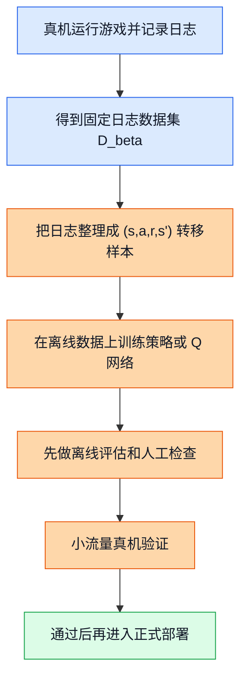
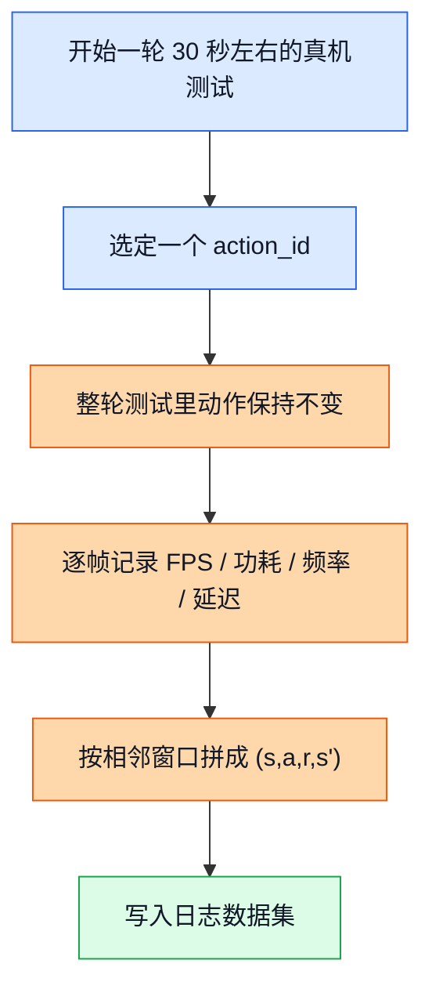
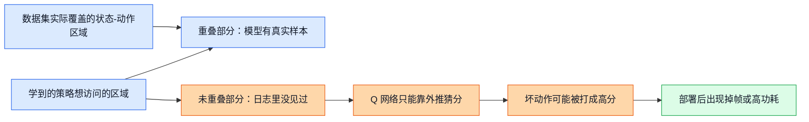
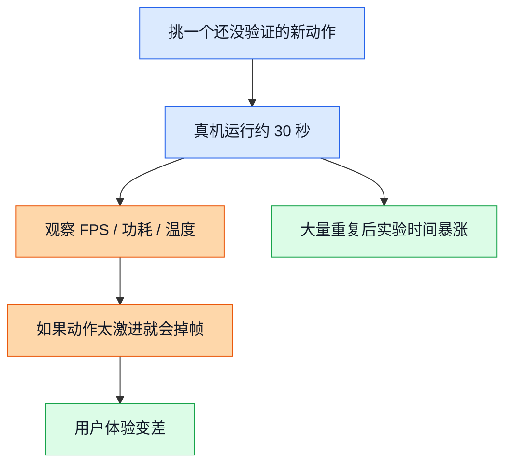
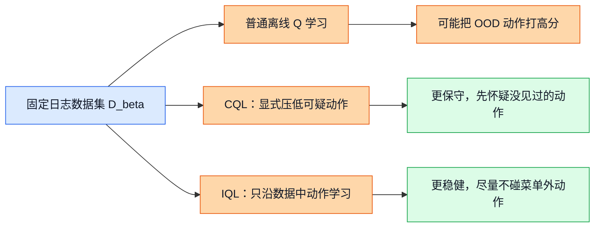

# 14. 离线强化学习基础

## 前置阅读

- 建议先读 `01_DCVS_Background.md`，先把 GPU DCVS、FPS 目标、功耗指标这些业务背景装进脑子里。
- 建议先读 `02_RL_Core_Concepts.md`，至少知道状态、动作、奖励、Q 值这些最基本的词。
- 建议先读 `05_Contextual_Bandits.md`，这样你更容易看懂“什么时候 bandit 就够了，什么时候必须上完整 RL”。
- 建议先读 `13_SAC_TD3.md`，先知道很多现代方法天生偏连续动作，而我们当前是 `192` 个离散动作。
- 如果你还没读过上面几篇，也可以直接读本文；本文会把必要背景重新讲清楚。

这篇文档只做一件事：把“为什么本项目离不开离线强化学习（Offline Reinforcement Learning）”讲透，同时把它最麻烦的坑讲透。你会看到，离线 RL 不是“更高级的在线探索”，它恰恰是在真机探索太贵、太慢、太危险的时候，先靠历史日志学会一个靠谱起点。

## 1. 为什么这个项目离不开离线强化学习

### 1.1 直觉类比

想象你在教一个新手司机开车。

- 在线探索像什么？像你直接把他扔到高速上，说“你自己多试试，撞几次就会了”。
- 离线强化学习像什么？像你先给他看一大堆老司机的行车记录仪，让他先学会“什么情况该减速、什么情况不能乱变道”，然后再小心上路。

GPU DCVS 调参也是一样。真机上的每一次“试试看这个动作行不行”，都不是免费的。一次实验往往就要真实跑 `30` 秒以上，而且如果动作太激进，用户看到的不是一串训练日志，而是直接掉帧、卡顿、发热。

所以这个项目天然适合先走“先看历史日志、再谨慎上线”的路线，这就是离线 RL 的核心价值。

### 1.2 正式定义

离线强化学习（Offline Reinforcement Learning），也常叫批量强化学习（Batch RL），指的是：

> 训练阶段**只能**使用一份已经收集好的固定日志数据集，不能一边训练一边继续和环境随意交互；目标是在这份固定数据上学出一个尽可能好的策略（Policy）。

在 DCVS 里，这份固定数据通常来自真机采集日志。我们可以把它记成：

$$
\mathcal{D}_{\beta} = \{(s_t, a_t, r_t, s_{t+1})\}_{t=1}^{N}
$$

这里：

- $s_t$ 是时刻 $t$ 的状态，比如 `gpu_usage_pct`、`gpu_freq_hz`、`gpu_power_mw`、`actual_dur_ms`、`lateness_ms`、`fence_avg_latency_ms` 等特征组成的向量。
- $a_t$ 是动作，这个项目里是 `192` 个离散 `action_id` 之一。
- $r_t$ 是奖励，通常跟 FPS 是否达标、频率是否够低、功耗是否够低有关。
- $s_{t+1}$ 是执行动作后的下一个状态。
- 下标里的 $\beta$ 表示这些数据是由某个行为策略（Behavior Policy）收集出来的，后面我们马上讲它是什么。

离线 RL 要优化的目标不变，仍然是想让长期累计回报最大：

$$
J(\pi) = \mathbb{E}_{\tau \sim \pi}\left[\sum_{t=0}^{T}\gamma^t r_t\right]
$$

区别只在于：训练时不能随便去环境里试，只能依赖固定数据 $\mathcal{D}_{\beta}$。

换句话说，它解决的是下面这个问题：

$$
\max_{\pi} J(\pi)
\quad
\text{subject to training only on } \mathcal{D}_{\beta}
$$

这条约束非常关键，因为它一口气把“安全性”和“数据覆盖不足”两个难题都带进来了。

### 1.3 公式逻辑和训练流程

这张图展示了什么：从真机日志到离线训练，再到谨慎上线验证的完整链路。

图里的关键路径是：先采数据，再整理转移，再训练，再验证，最后上线。离线 RL 最怕的就是跳过中间这些保守步骤，直接把“日志里看起来不错”的策略扔上手机跑，那样很容易被数据分布外的动作坑到。

> 补充说明：源文档里同时出现过 `power_ma`、`gpu_power_mw`、`delta_total_uj` 这几种功耗相关口径，说明 reward 口径还在收敛中。本文只把它们当成“功耗越高越不好”的同向信号来理解，重点放在离线 RL 的思路上，不把单位差异当成这里的主角。

### 1.4 DCVS 实际数值计算示例

我们用一个真实量级的 DCVS 窗口来看看，一条日志样本是怎么变成离线 RL 训练材料的。

假设某个时间窗口里观测到：

- `gpu_freq = 465 MHz`
- `gpu_usage = 82%`
- `power = 3200 mW`
- `fps = 59.4`
- `lateness_ms = 0.3`
- 动作是 `action_id = 72`

源文档里建议统一的奖励形式是：

$$
reward = fps\_component + freq\_component + power\_component
$$

其中：

$$
fps\_component =
\begin{cases}
-10 \times (57 - fps), & fps < 57 \\
-2 \times (59 - fps), & 57 \le fps < 59 \\
20, & fps \ge 59
\end{cases}
$$

$$
freq\_component = \frac{900 - gpu\_freq\_{mhz}}{80}
$$

$$
power\_component = \frac{6000 - power}{400}
$$

现在一步一步代进去：

1. 因为 $fps = 59.4 \ge 59$，所以

$$
fps\_component = 20
$$

2. 频率项：

$$
freq\_component = \frac{900 - 465}{80} = \frac{435}{80} = 5.4375
$$

3. 功耗项：

$$
power\_component = \frac{6000 - 3200}{400} = \frac{2800}{400} = 7
$$

4. 总奖励：

$$
r_t = 20 + 5.4375 + 7 = 32.4375
$$

如果下一个窗口观测到：

- `gpu_freq = 430 MHz`
- `gpu_usage = 78%`
- `power = 3000 mW`
- `fps = 60.1`
- `lateness_ms = 0.0`

那么这条转移样本就可以写成：

$$
(s_t, a_t, r_t, s_{t+1})
=
([82,465,3200,59.4,0.3],\ 72,\ 32.4375,\ [78,430,3000,60.1,0.0])
$$

这就是离线 RL 吃进去的最基本“粮食”。

## 2. 行为策略和日志数据集，到底是什么

### 2.1 直觉类比

你在看行车记录仪时，真正能看到的不是“所有可能的开法”，而只是“那个司机当时实际怎么开了”。这位司机的驾驶习惯，就是行为策略。

在 DCVS 项目里也一样。真机采集脚本不会把 `192` 个动作全都平均试一遍，它只会按某种已有规则去跑。这个“规则”可能是：

- 固定动作跑完整轮 benchmark；
- 当前脚本里某个预设采样逻辑；
- 某个旧控制器本来就会做出的选择。

这些实际产生数据的规则，统称为行为策略（Behavior Policy）。

### 2.2 正式定义

行为策略（Behavior Policy）记作 $\beta(a|s)$，意思是：

> 在状态 $s$ 下，数据收集器实际会以多大概率选到动作 $a$。

由它收集出来的整份日志，叫日志数据集（Logged Dataset）。

在本文里，你可以先把这两个词记成下面这样：

| 术语 | 一句话理解 | 在 DCVS 里对应什么 |
|---|---|---|
| 行为策略（Behavior Policy） | “数据是按什么规则收出来的” | 固定动作测试脚本、旧控制器、已有调参策略 |
| 日志数据集（Logged Dataset） | “这套规则实际留下来的历史记录” | 逐帧 CSV、按窗口聚合后的 `(s,a,r,s')` 样本 |

源文档给出的关键信息是：

- 总动作空间大小是 `192 = 6 × 4 × 4 × 2`。
- 当前已采集动作大约只有 `30` 个。
- 也就是动作覆盖率大约是：

$$
\text{动作覆盖率} = \frac{30}{192} = 0.15625 = 15.625\%
$$

- 没被覆盖到的动作还有：

$$
192 - 30 = 162
$$

- 未覆盖比例是：

$$
\frac{162}{192} = 0.84375 = 84.375\%
$$

这已经说明一个很现实的问题：日志不是“全世界”，它只是全世界里的一小块。

### 2.3 日志是怎么收成训练样本的

这张图展示了什么：一轮真机 benchmark 是如何变成离线 RL 的训练样本，以及“轮内动作固定”为什么是个大限制。

图里的关键点在 `B -> C` 这一步。因为一整轮里动作不切换，所以你拿到的大多是“动作保持不变时，环境自己怎么慢慢漂移”的数据，而不是“我从动作 72 切到动作 150 之后，系统马上会怎么变”的数据。

这会直接影响后面能不能学到高质量的状态转移关系。

### 2.4 DCVS 实际数值计算示例

我们用一个更具体的采集例子来看。

假设某轮 `30` 秒测试被切成 `6` 个 `5` 秒窗口，而且整轮都固定用 `action_id = 72`。那么动作序列是：

$$
[72,\ 72,\ 72,\ 72,\ 72,\ 72]
$$

假设每个窗口的观测值如下：

| 窗口 | action_id | FPS | GPU 频率 (MHz) | 功耗 (mW) |
|---|---:|---:|---:|---:|
| 1 | 72 | 59.8 | 480 | 3400 |
| 2 | 72 | 59.6 | 470 | 3350 |
| 3 | 72 | 59.3 | 460 | 3300 |
| 4 | 72 | 59.0 | 455 | 3360 |
| 5 | 72 | 58.7 | 450 | 3420 |
| 6 | 72 | 58.9 | 452 | 3390 |

那么这轮数据能提供多少条“动作 72 的转移样本”？

1. 相邻窗口能组成的转移数是 `6 - 1 = 5` 条。
2. 这 `5` 条里，动作全部都是 `72`。
3. 这轮数据里，关于 `action_id = 150` 的样本数是：

$$
0
$$

4. 如果一个 CSV 文件里甚至像源文档提到的那样，“所有行都只有 `action_id = 72`”，那这个文件的动作覆盖率就是：

$$
\frac{1}{192} \approx 0.005208 = 0.5208\%
$$

这就是为什么日志数据集虽然很宝贵，但它绝不等于“什么都见过了”。

## 3. 分布偏移、OOD 动作和外推误差，为什么是离线 RL 的死穴

### 3.1 直觉类比

假设你只给新手司机看“白天、干燥、城市道路”的行车记录。

后来你让他自己开车时，他突然跑去了“夜晚、下雨、高速匝道”。这时候他不是在“熟悉场景里做选择”，而是在“没真正见过的区域里硬猜”。这个“训练时看过的世界”和“部署时真的会走到的世界”之间的不一致，就是分布偏移（Distribution Shift）。

### 3.2 正式定义

当数据是由行为策略 $\beta$ 收集的，而你最后学出来的是另一个策略 $\pi$ 时，两者访问到的状态-动作区域通常不一样。常见写法是：

$$
d_{\beta}(s,a) \neq d_{\pi}(s,a)
$$

这里的 $d_{\beta}(s,a)$ 可以先直觉地理解成：

> 在历史日志里，状态 $s$ 和动作 $a$ 这对组合到底出现得多不多。

如果某个动作在某个状态附近几乎没出现过，甚至从没出现过，我们就说它属于分布外动作（Out-of-Distribution Actions, OOD Actions）。

这时，如果 Q 值（Q-Value）网络还要硬给它打分，就容易产生外推误差（Extrapolation Error）：

$$
\epsilon_{\text{ext}}(s,a) = \hat{Q}(s,a) - Q^{\text{true}}(s,a)
$$

其中：

- $\hat{Q}(s,a)$ 是模型估出来的分数；
- $Q^{\text{true}}(s,a)$ 是这个动作真正能拿到的长期分数；
- 如果 $\epsilon_{\text{ext}}(s,a)$ 很大而且是正的，就说明模型在“没见过的地方瞎乐观”。

> 补充知识：什么是概率分布（Probability Distribution）？
>
> 你可以先把它想成一张“出现频率直方图”。比如你统计很多次实验后发现，`gpu_usage` 落在 `70%~80%` 的次数很多，落在 `0%~10%` 的次数很少，那么这两个区间对应的柱子就会一高一低。柱子的高低，表达的就是“某种情况出现得多不多”。
>
> 再用掷骰子想一遍。如果骰子是公平的，`1` 到 `6` 每个点数出现的概率都差不多，分布就比较平均；如果这个骰子被做过手脚，`6` 经常出现、`1` 很少出现，那它的分布就偏了。离线 RL 里的问题也是一样：如果日志里老是只出现少数几个动作，那么模型眼里的世界就会“偏”，它对没见过的动作自然容易看走眼。

### 3.3 分布偏移是怎么把模型带沟里的

这张图展示了什么：数据集覆盖的状态-动作区域，与学到的策略想访问的区域并不完全重合；未重合的那部分，就是外推误差最容易爆炸的地方。

图里的关键路径是 `B -> D -> E -> F -> G`。只要新策略跑到了日志没覆盖过的区域，Q 网络就不得不“猜”。而神经网络的坏毛病之一，就是它有时候会把这种猜测猜得特别自信。

### 3.4 DCVS 实际数值计算示例

现在我们来手算一个最关键的例子：模型怎样把一个没见过的动作，错打成特别高的 Q 值。

假设当前状态是：

- `gpu_usage = 88%`
- `gpu_freq = 430 MHz`
- `power = 4100 mW`
- `fps = 59.2`
- `lateness_ms = 0.4`

并且这附近的历史日志里，模型主要见过两个动作：

- `action_id = 72`，平均奖励大约是 `+8`
- `action_id = 88`，平均奖励大约是 `+6`

但是 `action_id = 150` 在这附近没出现过，属于 OOD 动作。此时一个普通的离线 Q 网络可能给出下面的预测：

$$
\hat{Q}(s,72) = 8,\quad \hat{Q}(s,88) = 6,\quad \hat{Q}(s,150) = 15
$$

因为 `15` 最大，贪心策略会选 `action_id = 150`。

问题来了：如果这个动作真的被部署到手机上，结果变成了下面这样：

- `fps = 54.8`
- `gpu_freq = 350 MHz`
- `power = 2500 mW`

我们按统一奖励公式重新手算一次真实奖励。

第一步，先算 FPS 项。因为 $54.8 < 57$，进入重罚区：

$$
fps\_component = -10 \times (57 - 54.8) = -10 \times 2.2 = -22
$$

第二步，算频率项：

$$
freq\_component = \frac{900 - 350}{80} = \frac{550}{80} = 6.875
$$

第三步，算功耗项：

$$
power\_component = \frac{6000 - 2500}{400} = \frac{3500}{400} = 8.75
$$

第四步，总真实奖励：

$$
Q^{\text{true}}(s,150) \approx -22 + 6.875 + 8.75 = -6.375
$$

最后，外推误差就是：

$$
\epsilon_{\text{ext}}(s,150) = \hat{Q}(s,150) - Q^{\text{true}}(s,150)
= 15 - (-6.375) = 21.375
$$

这 `21.375` 的误差不是小噪声，而是“模型以为这是最佳动作，实际上它会让 FPS 直接掉到危险区”的级别。

这也是为什么源文档一直强调：在离线日志上直接套普通 DQN 式做法，风险很高。

## 4. 为什么真机探索昂贵，而且对用户不友好

### 4.1 直觉类比

还是拿新手司机类比。你当然可以说：“不会就多上路练。”但如果每次练车都要上高速，而且一出错就堵住后面一排车，这种练法就不现实了。

手机真机探索也是同样的逻辑。每次试一个新动作，都是真设备、真工作负载、真掉帧风险，不是模拟器里的假摔。

### 4.2 正式定义

在线探索（Online Exploration）指的是：模型一边运行，一边真的去试以前没把握的动作。

在本项目里，这件事贵在两层：

1. **时间贵**：一次实验往往要真实跑 `30` 秒左右。
2. **体验贵**：如果动作太激进，FPS 会掉，用户会直接看到卡顿。

先只算时间账。假设你想把 `192` 个动作都在真机上粗扫一遍，每个动作只跑 `30` 秒，那么总时长是：

$$
T_{\text{full sweep}} = 192 \times 30 = 5760 \text{ 秒}
$$

把它换成分钟：

$$
5760 \div 60 = 96 \text{ 分钟}
$$

如果你还想考虑 `5` 种不同游戏场景、`3` 个温度区间，那么总时长会变成：

$$
T_{\text{matrix}} = 192 \times 30 \times 5 \times 3 = 86400 \text{ 秒}
$$

继续换算：

$$
86400 \div 3600 = 24 \text{ 小时}
$$

这还只是“每个组合只跑一次”的超粗版本，没有算重复实验、冷机热机切换、异常重试和人工分析时间。

### 4.3 一个坏动作会怎么伤到真实系统

这张图展示了什么：一次在线探索并不是“试错一下而已”，它会直接消耗时间，而且可能把用户体验一起拖下去。

图里的两条结果都很实际：要么你在时间上付出代价，要么你在体验上付出代价，很多时候两边一起付。

### 4.4 DCVS 实际数值计算示例

假设你连续测试 `10` 个还没验证过的动作，每个动作都跑 `30` 秒。

总实验时长是：

$$
10 \times 30 = 300 \text{ 秒} = 5 \text{ 分钟}
$$

再假设其中有 `4` 个动作会让 FPS 从目标区间 `59~60` 掉到 `55` 左右，那么用户真正看到的“明显不舒服”的时间至少是：

$$
4 \times 30 = 120 \text{ 秒} = 2 \text{ 分钟}
$$

也就是说，你只是做了 `10` 次不确定探索，就已经消耗了 `5` 分钟实验时间，并且制造了 `2` 分钟明显掉帧。对手机上的运行时调参来说，这个代价一点也不便宜。

这就是离线 RL 被需要的现实原因：它不是“更学术”，而是“更省命”。

## 5. 当前项目到底更像 bandit，还是更像 offline RL

读三份源文档时，你会发现它们的结论并不完全一样：

- 一份文档把离散 CQL（Conservative Q-Learning）排第一；
- 一份文档给出的组合是“CQL 主策略 + 安全过滤 + 可选 bandit 适配”；
- 还有一份文档把“安全短历史上下文老虎机（Safe Short-History Contextual Bandit）”排第一，把 IQL/CQL warm start 放到第二阶段。

这不是谁对谁错，而是它们盯着的假设不同。

| 文档 | 它最看重什么 | 它隐含的关键假设 | 所以给出的结论 |
|---|---|---|---|
| `RL_Algorithm_Selection_for_GPU_DCVS_Tuning_20260401.md` | 安全、离线可训练性、离散动作天然适配 | 热积累、governor 惯性、场景切换说明问题有明显时间依赖；后续还能把数据采集改造成更像 MDP | 离散 CQL 第一，IQL 第二 |
| `RL_DCVS_AI_Integrated_Decision_2026-04-01.md` | 当前离线日志如何最快变成可部署方案 | 可以先用离线策略给出主判断，再用运行时安全规则兜底 | CQL 主策略，bandit 做增强层 |
| `RL_DCVS_Runtime_Adaptive_Independent_Decision_GPT-5.4_2026-04-01_135421.md` | 运行时快速、安全、自适应 | 当前更像“看当前上下文选当前动作”；日志里动作覆盖不足，轮内还不切换动作，所以首发不要把自己绑死在 full RL 上 | 上下文 bandit 第一，IQL/CQL warm start 第二阶段 |

把它们合在一起，你会得到一个更准确的说法：

> 离线 RL 是本项目非常重要的训练方向，但在“今天就要首发一个运行时控制器”的约束下，bandit 可能是更轻、更稳的第一步；而一旦数据覆盖变好、轮内动作开始切换、长期时序效应被证实更强，离线 RL 的优先级就会迅速上升。

所以本文的立场不是“bandit 和 offline RL 二选一”，而是：

- **运行时首发控制器**，当前很可能偏 bandit；
- **安全地利用历史日志做训练**，核心方法必须看 offline RL；
- **真正困难的地方**，就在于如何处理离线数据覆盖不足带来的外推误差。

## 6. 那怎么解决外推误差：先给 CQL 和 IQL 铺垫

### 6.1 直觉类比

面对没见过的动作，常见有两种更靠谱的做法。

- 保守离线强化学习里的 CQL（Conservative Q-Learning），像一个很悲观的评估员：没见过？那我先把你的分压低，宁可错过一点，也别乱放进来。
- IQL（Implicit Q-Learning）像什么？像一个只看菜单内菜品的点餐顾问：菜单上没有的菜，我干脆不评价；我只从历史上真正点过、而且效果不错的菜里学。

这两种思路都在解决同一个问题：不要让模型对 OOD 动作过度自信。

### 6.2 正式定义

先只抓住最核心的一层意思：

- CQL：在普通 Q 学习的基础上，额外加入“把可疑动作 Q 值压低”的机制。
- IQL：不去显式追逐“所有动作里谁的 Q 值最大”，而是沿着日志里已经出现过的高质量动作去学策略。

你可以先把它们记成下面两句非常朴素的话：

$$
\text{CQL 的核心倾向：让 } \hat{Q}(s,a_{\text{OOD}}) \text{ 变小}
$$

$$
\text{IQL 的核心倾向：只从 } (s,a) \in \mathcal{D}_{\beta} \text{ 的优质样本里提炼策略}
$$

它们都不是在“让模型更大胆”，而是在“让模型别乱自信”。

### 6.3 两条路线分别怎么保守

这张图展示了什么：面对同一份固定日志数据，普通离线 Q 学习、CQL、IQL 处理 OOD 动作的方式完全不同。

关键差别在于：

- 普通离线 Q 学习会对所有动作都打分，所以很容易把没见过的动作也打得很高；
- CQL 会主动给“可疑动作”降温；
- IQL 则更像“只沿着数据里确实出现过、而且质量不错的动作前进”。

### 6.4 DCVS 实际数值计算示例

还用前面的那个状态：

$$
\hat{Q}(s,72) = 8,\quad \hat{Q}(s,88) = 6,\quad \hat{Q}(s,150) = 15
$$

普通离线 Q 学习会直接选 `150`，因为它的预测分最高。

如果我们现在用“示意性数字”来模拟 CQL 和 IQL 的效果：

#### 情况 A：CQL 的保守压低

假设经过保守惩罚后，三个动作的分数变成：

$$
\hat{Q}_{\text{CQL}}(s,72)=7.5,\quad
\hat{Q}_{\text{CQL}}(s,88)=5.8,\quad
\hat{Q}_{\text{CQL}}(s,150)=3.0
$$

这时贪心选择变成：

$$
\arg\max_a \hat{Q}_{\text{CQL}}(s,a) = 72
$$

也就是说，CQL 宁可保守一点，也不愿意把那个没见过的 `150` 放到第一名。

#### 情况 B：IQL 的隐式学习

IQL 的思路不是“把 `150` 重新打个低分”，而是“我主要沿着日志里出现过的动作学”。如果这个状态附近日志里只可靠地出现过 `72` 和 `88`，那么它更可能在这两个动作里做选择：

$$
\max(\text{候选动作 }72, 88) = 72
$$

也就是说，它会把“菜单外动作 `150`”自然排除在重点考虑范围之外。

这两个方法都在回答同一个问题：

> 当普通离线 Q 学习在 OOD 动作上过度乐观时，怎样把这种乐观打回去？

下一篇 `15_CQL.md` 会详细讲“显式保守”，再下一篇 `16_IQL.md` 会详细讲“隐式避开 OOD”。

## 关键收获

- 离线强化学习不是“更复杂的在线探索”，而是“先用历史日志学，再谨慎上机”的安全路线，特别适合真机探索昂贵又危险的 DCVS 调参场景。
- 本项目当前动作空间是 `192` 个离散动作，但日志只覆盖了大约 `30` 个，动作覆盖率只有 `15.625%`，未覆盖比例高达 `84.375%`。
- 更麻烦的是，当前很多轨迹是“轮内动作固定”，这让数据更难回答“如果现在从动作 A 切到动作 B，会发生什么”。
- 分布偏移的本质是：日志里出现过的状态-动作区域，和新策略真正想去访问的区域不一样；一旦跑到日志没覆盖过的地方，Q 网络就会靠外推猜分。
- 外推误差最危险的情况不是“猜错一点”，而是把坏动作打成高分。本文手算的例子里，模型把未见动作预测成 `+15`，真实奖励却只有 `-6.375`，误差达到 `21.375`。
- 三份源文档结论不同，不是冲突，而是侧重点不同：如果看重当前运行时快速上线，bandit 更务实；如果看重安全地利用历史日志训练高质量策略，offline RL 就是绕不过去的核心方向。
- CQL 和 IQL 都是在解决同一个老大难问题：怎样避免模型对 OOD 动作过度自信。前者靠“显式保守”，后者靠“隐式只沿数据中好动作学习”。
