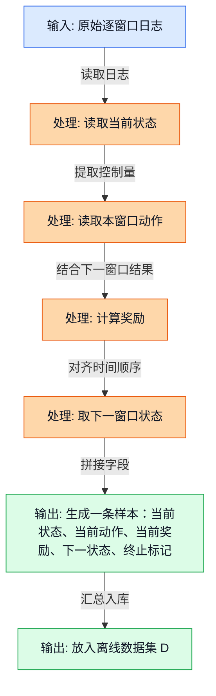
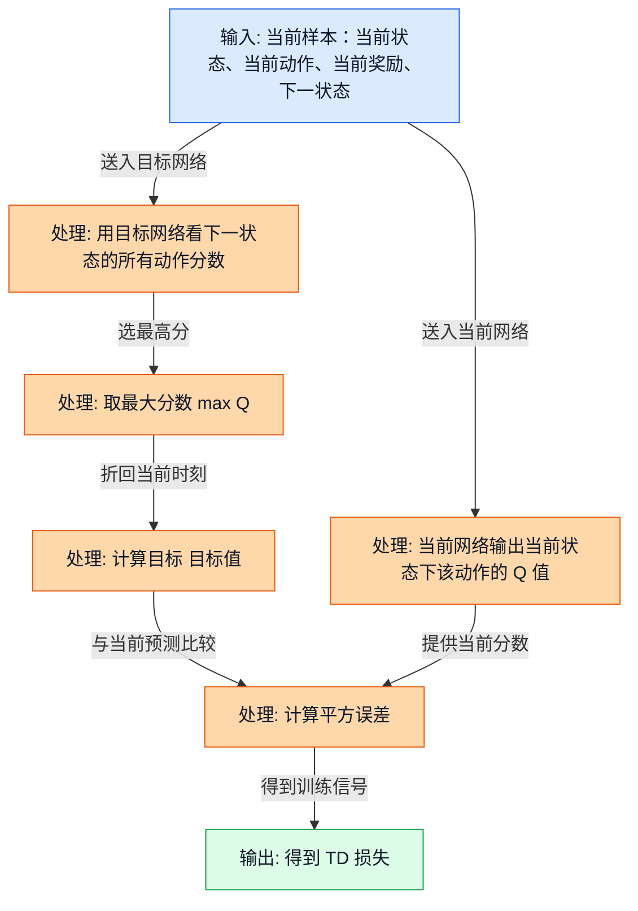
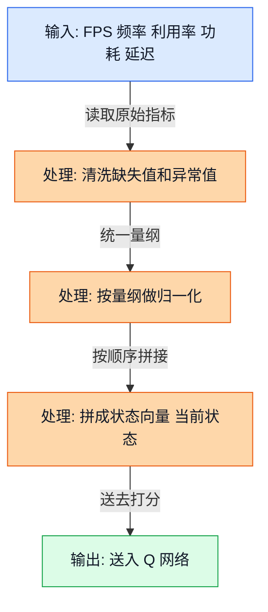
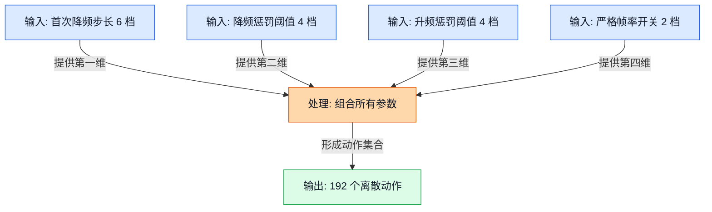
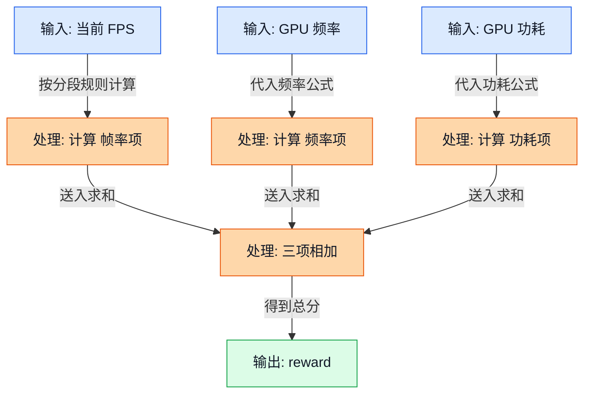
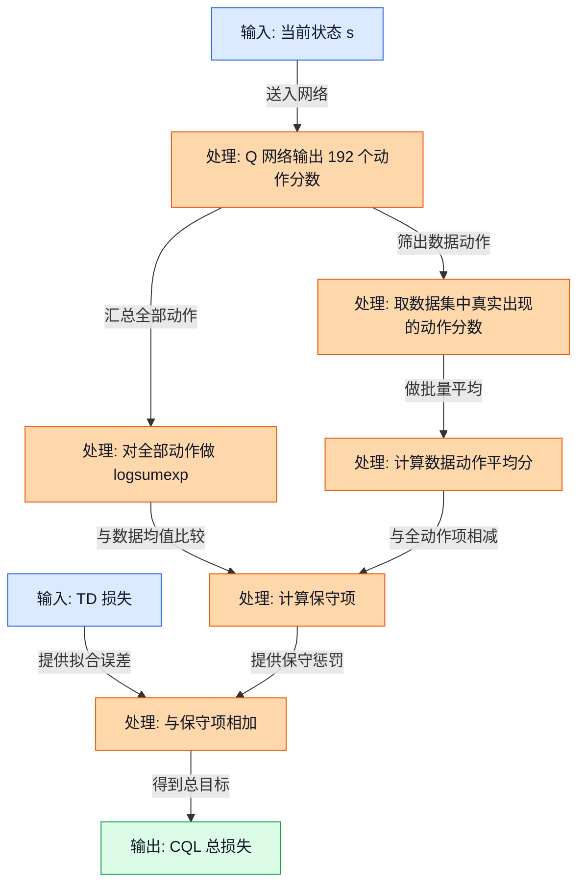
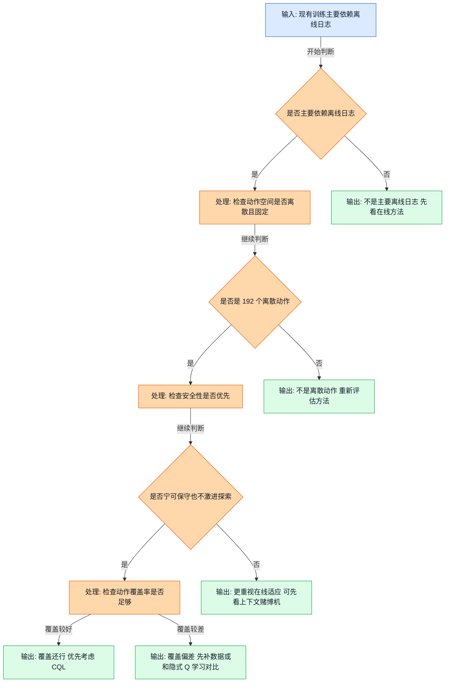

<!-- markdownlint-disable MD041 MD013 -->
## 前置阅读

- 无硬性要求；如果你已经读过前面的“离线强化学习基础”和“Q 值与 Bellman 更新基础”，会更轻松。
- 如果你还没读过，也可以直接看这篇。本文会把 CQL 需要的关键前置知识补齐。

# 15_CQL：保守 Q 学习（Conservative Q-Learning，CQL）怎么用在 GPU DCVS 调参里

这篇文档只做一件事：把 CQL 讲到“能看懂、能手算、能判断它适不适合这个项目”的程度。你会看到，CQL 不是一句“更安全的离线强化学习”就能讲完的东西。它真正厉害的地方在于：当你的数据只覆盖了 192 个动作里的一小部分时，它会主动压低那些“没怎么见过却被模型瞎吹高”的动作分数。

对 GPU DCVS（Dynamic Clock and Voltage Scaling）这个项目来说，这件事尤其重要，因为我们面对的是：

- 目标帧率（Frames Per Second，FPS）要稳定在 $59 \sim 60$
- GPU 频率大致落在 $282 \sim 710$ MHz
- 功耗大致落在 $0 \sim 8000$ mW
- 动作空间是 $6 \times 4 \times 4 \times 2 = 192$ 个离散动作
- 现有分析文档里明确提到，当前日志覆盖率大约只有 $30/192 \approx 15.6\%$

## 1. 先把争议讲清楚：为什么有的文档强推 CQL，有的文档却把它降级

三份源分析文档并不完全一致，但它们分歧的根子其实不神秘，主要是“问题怎么建模”不同。

| 来源 | 对 CQL 的态度 | 背后的默认假设 |
| --- | --- | --- |
| `RL_Algorithm_Selection_for_GPU_DCVS_Tuning_20260401.md` | 排名第 1 | 认为这是一个离散动作、离线日志、强安全约束的问题，所以 CQL 非常合适 |
| `RL_DCVS_AI_Integrated_Decision_2026-04-01.md` | 排名第 1 | 认为可以先离线训练 CQL，再在运行时加安全过滤器 |
| `RL_DCVS_Runtime_Adaptive_Independent_Decision_GPT-5.4_2026-04-01_135421.md` | 不是首发主方案 | 认为当前更像“短历史上下文决策”，首发更适合上下文赌博机（Contextual Bandit），CQL 更像第二阶段热启动（Warm Start） |

把它翻成大白话就是：

- 如果你更看重“先用已有离线日志训练一个稳一点的策略，再上线”，那 CQL 很有吸引力。
- 如果你更看重“运行时要马上跟着场景变化在线适应”，那你会觉得上下文赌博机更贴脸。
- 如果你担心当前日志覆盖太差，CQL 仍然有价值，但你必须接受它可能会偏保守。

所以，这篇不是要说“CQL 一定是最终答案”，而是要帮你弄明白：

1. CQL 解决的到底是哪类问题。
1. 它为什么在这个项目里被反复提起。
1. 它为什么会被夸“安全”，同时又会被吐槽“太保守”。

## 2. 离线强化学习（Offline Reinforcement Learning）到底在干什么

### 2.1 直觉类比

把你想成一个新来的调参工程师。你现在不能直接拿手机乱试 192 个 DCVS 参数组合，因为一旦试错过头，FPS 可能直接掉到不能玩。你手里只有前人留下来的日志，日志里写着：

- 当时看到了什么状态
- 当时用了什么动作
- 后来表现怎么样

离线强化学习就是：**先只靠历史日志学会“哪些动作大概率靠谱”，不急着上真机乱探索。**

### 2.2 正式定义

离线强化学习会从一个固定数据集 $\mathcal{D}$ 里学习策略。这个数据集通常写成：

$$
\mathcal{D} = \{(s_t, a_t, r_t, s_{t+1}, d_t)\}_{t=1}^{N}
$$

这里：

- $s_t$ 是时刻 $t$ 的状态（state）
- $a_t$ 是时刻 $t$ 采取的动作（action）
- $r_t$ 是这个动作带来的奖励（reward）
- $s_{t+1}$ 是下一个状态
- $d_t$ 是终止标记，结束时取 $1$，否则取 $0$

跟普通在线强化学习最大的区别是：**离线强化学习训练时不能再跟环境交互，只能吃现成日志。**

> **补充知识：数据分布（Data Distribution）是什么**
>
> 你可以把“数据分布”理解成“日志里常出现什么、少出现什么”。如果某类状态和动作在日志里经常出现，模型就更容易学稳；如果某个动作几乎没出现，模型对它就没有什么把握。
>
> 这也是离线强化学习最难的地方。模型一旦对“日志里很少见的动作”过分自信，就可能上线后做出很离谱的决策。CQL 处理的正是这个坑。

### 2.3 公式链路 + Mermaid 图

这张图展示的是：离线强化学习怎样把逐窗口 DCVS 日志变成训练样本。

图里的关键路径很简单：先从日志里拿到“当前状态 + 当前动作”，再根据下一窗口表现算奖励，最后拼成 $(s_t, a_t, r_t, s_{t+1}, d_t)$。后面不管你是做深度 Q 网络（Deep Q-Network，DQN）、CQL 还是隐式 Q 学习（Implicit Q-Learning，IQL），第一步都得先把数据整理成这种结构。

### 2.4 DCVS 实际数值计算示例

下面我们手工拼一条样本。假设当前窗口的观测是：

| 项目 | 数值 |
| --- | --- |
| 当前 FPS | $59.2$ |
| 当前 GPU 频率 | $640$ MHz |
| 当前 GPU 利用率 | $88\%$ |
| 当前 GPU 功耗 | $5600$ mW |

此时控制器选择了一个 DCVS 动作：

$$
a_t = (\text{first\_step\_down}=10,\ \text{penalty\_down}=90,\ \text{penalty\_up}=85,\ \text{strict\_frame}=0)
$$

动作生效后，下一个窗口变成：

| 项目 | 数值 |
| --- | --- |
| 下一窗口 FPS | $58.7$ |
| 下一窗口 GPU 频率 | $525$ MHz |
| 下一窗口 GPU 利用率 | $87\%$ |
| 下一窗口 GPU 功耗 | $4700$ mW |

现在用分析文档里推荐的奖励函数来算 $r_t$：

$$
\text{reward} = \text{fps\_component} + \text{freq\_component} + \text{power\_component}
$$

其中：

$$
\text{fps\_component} =
\begin{cases}
-10 \times (57 - \text{fps}), & \text{fps} < 57 \\
-2 \times (59 - \text{fps}), & 57 \le \text{fps} < 59 \\
20, & \text{fps} \ge 59
\end{cases}
$$

$$
\text{freq\_component} = \frac{900 - \text{gpu\_freq\_mhz}}{80}
$$

$$
\text{power\_component} = \frac{6000 - \text{power\_mw}}{400}
$$

逐步代入：

1. 因为 FPS 是 $58.7$，落在 $57 \le \text{fps} < 59$ 这一段，所以

$$
\mathrm{fps\_component} = -2 \times (59 - 58.7) = -2 \times 0.3 = -0.6
$$

1. 频率项：

$$
\mathrm{freq\_component} = \frac{900 - 525}{80} = \frac{375}{80} = 4.6875
$$

1. 功耗项：

$$
\mathrm{power\_component} = \frac{6000 - 4700}{400} = \frac{1300}{400} = 3.25
$$

1. 总奖励：

$$
r_t = -0.6 + 4.6875 + 3.25 = 7.3375
$$

所以，这条离线样本就是：

$$
(s_t,\ a_t,\ r_t,\ s_{t+1},\ d_t) = (s_t,\ a_t,\ 7.3375,\ s_{t+1},\ 0)
$$

## 3. Q 值（Q-value）为什么可以理解成“经验评分表”

### 3.1 直觉类比

你可以把 Q 值想成一张经验评分表：

- 横轴是“当前状态”
- 纵轴是“可以选的动作”
- 表里的分数是“现在这么选，后面长期看值不值”

分数越高，表示这个动作在当前状态下越值得试。

### 3.2 正式定义

Q 值的标准定义是：

$$
Q^{\pi}(s,a) = \mathbb{E}\left[\sum_{k=0}^{\infty}\gamma^k r_{t+k}\,\middle|\,s_t=s,\ a_t=a\right]
$$

意思是：在状态 $s$ 先执行动作 $a$，后面再按策略 $\pi$ 继续走，能拿到的折扣累计奖励的期望。

> **补充知识：期望（Expectation）和折扣因子（Discount Factor）怎么理解**
>
> 期望值可以粗暴理解成“平均下来大概会得到多少”。如果同一个状态下，某个动作有时表现好、有时表现一般，期望值就是把这些可能结果综合后的平均水平。
>
> 折扣因子 $\gamma$ 通常在 $0$ 到 $1$ 之间。它的作用是“越远的未来，分量稍微打点折”。比如 $\gamma=0.99$，说明我们仍然重视未来，但不会把 100 步之后的收益和眼前这一步看得一样重。

### 3.3 公式推导 + Mermaid 图

在离散动作问题里，最常见的更新目标是 Bellman 目标（Bellman Target）：

$$
y_t = r_t + \gamma (1 - d_t)\max_{a'} Q_{\bar{\theta}}(s_{t+1}, a')
$$

训练时会让当前网络输出的 $Q_{\theta}(s_t, a_t)$ 靠近这个目标，常见损失写成时序差分损失（Temporal Difference Loss，TD Loss）：

$$
L_{\text{TD}} = \frac{1}{2}\left(Q_{\theta}(s_t,a_t) - y_t\right)^2
$$

这张图展示的是：一条样本如何变成 TD 损失。

图中的关键路径是“先估计下一步最好的动作值，再把它折回来，加上眼前奖励，得到这一步应该接近的目标分数”。如果当前分数和目标差很大，损失就大，模型就会被推动着修正。

### 3.4 DCVS 实际数值计算示例

继续沿用上一节那条样本，刚才我们已经算出：

$$
r_t = 7.3375
$$

现在假设对于下一状态 $s_{t+1}$，模型在 192 个动作里给出的最高分是 $8.0$。为了便于手算，这里只展示其中 4 个代表动作的分数：

| 代表动作 | 预测 Q 值 |
| --- | --- |
| 动作 A | $8.0$ |
| 动作 B | $7.4$ |
| 动作 C | $7.9$ |
| 动作 D | $6.8$ |

所以：

$$
\max_{a'} Q_{\bar{\theta}}(s_{t+1}, a') = 8.0
$$

如果取 $\gamma = 0.99$，并且这一条不是终止样本，也就是 $d_t = 0$，那么：

$$
y_t = 7.3375 + 0.99 \times 8.0
$$

先算折扣后的未来值：

$$
0.99 \times 8.0 = 7.92
$$

再加上当前奖励：

$$
y_t = 7.3375 + 7.92 = 15.2575
$$

如果当前网络对这条样本动作给出的分数是：

$$
Q_{\theta}(s_t,a_t) = 13.8
$$

那么差值是：

$$
Q_{\theta}(s_t,a_t) - y_t = 13.8 - 15.2575 = -1.4575
$$

平方之后：

$$
(-1.4575)^2 = 2.12430625
$$

再乘上 $\frac{1}{2}$：

$$
L_{\text{TD}} = \frac{1}{2} \times 2.12430625 = 1.062153125
$$

这个值说明：当前这条样本上，模型把分数估低了，还要继续往正确目标靠。

## 4. 状态设计（State Design）：CQL 到底“看见”了什么

### 4.1 直觉类比

你可以把状态向量想成调参工程师面前的仪表盘快照。仪表盘上不是只看一个 FPS，而是要一起看：

- 帧率稳不稳
- GPU 频率高不高
- GPU 利用率忙不忙
- 功耗大不大
- 延迟是不是开始变糟

状态设计做得越好，Q 值就越像“对真实情况有判断的评分表”。

### 4.2 正式定义

结合源分析文档，一个比较实用的状态可以写成：

$$
s_t =
\left[
\text{fps},
\mathrm{gpu\_freq},
\mathrm{gpu\_usage},
\mathrm{gpu\_power},
\text{lateness},
\mathrm{fence\_avg\_latency},
\mathrm{gpu\_headroom},
\mathrm{cpu\_freq},
\mathrm{cpu\_usage},
\mathrm{delta\_total\_uj},
\ldots
\right]
$$

工程上通常不会直接把原始值生喂给网络，而是会做归一化（Normalization）：

$$
x_{\text{norm}} = \frac{x - x_{\min}}{x_{\max} - x_{\min}}
$$

> **补充知识：归一化（Normalization）为什么有用**
>
> 不同特征的量纲差别很大。比如 GPU 频率是几百 MHz，功耗是几千 mW，而 GPU 利用率是 $0 \sim 100$。如果不先把它们缩放到差不多的范围，网络训练时会更容易被大数值特征“带偏”。
>
> 归一化不是魔法，它不会凭空增加信息，只是让不同特征更容易放在一起学。

### 4.3 公式推导 + Mermaid 图

这张图展示的是：原始监控指标怎样被整理成一个可训练的状态向量。

图里的关键点是：CQL 学的不是“原始日志文本”，而是清洗过、尺度相近、能反映当前系统状态的数值向量。如果状态里缺了关键上下文，比如延迟趋势或上一窗口负载，Q 值就会学得很飘。

### 4.4 DCVS 实际数值计算示例

假设某个窗口的关键原始值是：

| 特征 | 原始值 | 归一化方式 |
| --- | --- | --- |
| GPU 频率 | $587$ MHz | 用区间 $282 \sim 710$ 归一化 |
| GPU 利用率 | $92\%$ | 除以 $100$ |
| GPU 功耗 | $5200$ mW | 用区间 $0 \sim 8000$ 归一化 |
| FPS | $58.4$ | 用目标 $60$ 做比例缩放 |

逐步计算：

1. GPU 频率归一化：

$$
\mathrm{gpu\_freq\_norm} = \frac{587 - 282}{710 - 282} = \frac{305}{428} \approx 0.7126
$$

1. GPU 利用率归一化：

$$
\mathrm{gpu\_usage\_norm} = \frac{92}{100} = 0.92
$$

1. GPU 功耗归一化：

$$
\mathrm{gpu\_power\_norm} = \frac{5200}{8000} = 0.65
$$

1. FPS 比例化：

$$
\mathrm{fps\_norm} = \frac{58.4}{60} \approx 0.9733
$$

如果这里只取 4 个示意特征，那么一个简化后的状态向量可以写成：

$$
s_t = [0.9733,\ 0.7126,\ 0.92,\ 0.65]
$$

真实训练时当然会放入更多特征，但你可以先把它理解成“把当前系统压缩成一串数字”。

## 5. 动作设计（Action Design）：为什么 192 个离散动作和 CQL 很搭

### 5.1 直觉类比

想象你面前有 4 个调节旋钮，每个旋钮都有几个固定档位。那你每次决策其实不是“在连续空间里随便拧”，而是“从一堆预先定义好的组合里选一个方案”。

这正是离散动作问题最舒服的形状。

### 5.2 正式定义

这个项目里的动作由 4 个可调参数组成：

$$
a_t = (\text{first\_step\_down},\ \text{penalty\_down},\ \text{penalty\_up},\ \text{strict\_frame})
$$

它们的取值集合分别是：

$$
\text{first\_step\_down} \in \{3, 5, 10, 15, 20, 25\}
$$

$$
\text{penalty\_down} \in \{85, 90, 95, 98\}
$$

$$
\text{penalty\_up} \in \{85, 90, 95, 98\}
$$

$$
\text{strict\_frame} \in \{0, 1\}
$$

所以总动作数是：

$$
|\mathcal{A}| = 6 \times 4 \times 4 \times 2 = 192
$$

### 5.3 公式推导 + Mermaid 图

这张图展示的是：192 个动作是怎么从 4 个参数轴拼出来的。

图中的关键路径就是“4 个参数轴做笛卡尔积（Cartesian Product）”。这也是为什么 CQL 特别顺手，因为它本来就擅长在固定离散动作集合上学每个动作的 Q 值。

### 5.4 DCVS 实际数值计算示例

假设我们选了这样一个动作：

$$
a = (10,\ 90,\ 95,\ 1)
$$

它的意思是：

- `first_step_down = 10`
- `penalty_down = 90`
- `penalty_up = 95`
- `strict_frame = 1`

如果固定 `first_step_down = 10` 不变，那么剩下 3 个参数还能组合出：

$$
4 \times 4 \times 2 = 32
$$

种动作。

如果 4 个参数都允许变化，那么：

$$
6 \times 4 \times 4 \times 2 = 192
$$

这说明“动作不是一个数”，而是“4 个档位一起组成的一套策略”。

## 6. 奖励设计（Reward Design）：为什么一定要先保 FPS，再谈省电

### 6.1 直觉类比

奖励函数就像绩效打分表。你不能因为某个动作特别省电，就忘了它可能已经把游戏打到掉帧。对 DCVS 来说，顺序一定是：

1. 先保住体验
1. 再去争取更低频率
1. 最后再争取更低功耗

### 6.2 正式定义

源分析文档里推荐的奖励函数是：

$$
\text{reward} = \text{fps\_component} + \text{freq\_component} + \text{power\_component}
$$

其中：

$$
\text{fps\_component} =
\begin{cases}
-10 \times (57 - \text{fps}), & \text{fps} < 57 \\
-2 \times (59 - \text{fps}), & 57 \le \text{fps} < 59 \\
20, & \text{fps} \ge 59
\end{cases}
$$

$$
\text{freq\_component} = \frac{900 - \text{gpu\_freq\_mhz}}{80}
$$

$$
\text{power\_component} = \frac{6000 - \text{power\_mw}}{400}
$$

> **补充知识：分段函数（Piecewise Function）不用怕**
>
> 分段函数只是“不同区间用不同公式”。在这里的意思很直白：FPS 掉得特别厉害时，惩罚要更重；只差一点点时，惩罚稍微轻一些；达标了，就直接给比较大的正奖励。
>
> 这比“所有 FPS 情况都用一个线性公式”更符合工程直觉，因为游戏体验通常有明显的红线。

### 6.3 公式推导 + Mermaid 图

这张图展示的是：奖励函数如何把“体验、频率、功耗”三个目标揉成一个分数。

图里的关键点是：FPS 项不是和频率、功耗平起平坐的“普通加分项”，它其实更像门槛。只要 FPS 掉得太多，后面省下来的那点频率和功耗，很容易被惩罚吃掉。

### 6.4 DCVS 实际数值计算示例

我们来比较两个动作结果。

#### 动作结果 1：体验更稳，但没那么省电

- FPS = $59.4$
- GPU 频率 = $625$ MHz
- 功耗 = $5400$ mW

逐步计算：

$$
\mathrm{fps\_component} = 20
$$

$$
\mathrm{freq\_component} = \frac{900 - 625}{80} = \frac{275}{80} = 3.4375
$$

$$
\mathrm{power\_component} = \frac{6000 - 5400}{400} = \frac{600}{400} = 1.5
$$

$$
\text{reward}_1 = 20 + 3.4375 + 1.5 = 24.9375
$$

#### 动作结果 2：很省电，但已经开始影响体验

- FPS = $56.5$
- GPU 频率 = $450$ MHz
- 功耗 = $3200$ mW

逐步计算：

$$
\mathrm{fps\_component} = -10 \times (57 - 56.5) = -10 \times 0.5 = -5
$$

$$
\mathrm{freq\_component} = \frac{900 - 450}{80} = \frac{450}{80} = 5.625
$$

$$
\mathrm{power\_component} = \frac{6000 - 3200}{400} = \frac{2800}{400} = 7
$$

$$
\text{reward}_2 = -5 + 5.625 + 7 = 7.625
$$

这两个例子特别值得你记住：第二个动作虽然更省电、更低频，但总奖励反而低很多，因为它踩到了 FPS 红线。

## 7. 保守 Q 学习（Conservative Q-Learning，CQL）到底保守在哪里

### 7.1 直觉类比

想象你在看一家从没吃过的外卖店。平台上老店有很多评价，新店几乎没有评价。一个“激进”的系统可能会说：“这家新店看起来挺不错，我给它很高分。” 但一个“保守”的系统会说：“先别急着吹这么高，证据不够时，宁可估低一点。”

CQL 做的就是这件事：

- 对数据里见过的动作，允许学高分
- 对数据里没怎么见过的动作，不轻易给高分

### 7.2 正式定义

在离散动作场景里，CQL 常见的目标函数可以写成：

$$
L_{\text{CQL}} =
L_{\text{TD}}
+
\alpha
\left(
\mathbb{E}_{s \sim \mathcal{D}}
\left[
\log \sum_{a \in \mathcal{A}} \exp(Q_{\theta}(s,a))
\right]
-
\mathbb{E}_{(s,a)\sim \mathcal{D}}[Q_{\theta}(s,a)]
\right)
$$

其中：

- $L_{\text{TD}}$ 负责“把见过的数据学准”
- $\alpha$ 控制保守强度
- 对数指数和（logsumexp）项 $\log \sum_a \exp(Q(s,a))$ 会盯住“所有动作里那些特别高的 Q 值”
- $\mathbb{E}_{(s,a)\sim \mathcal{D}}[Q(s,a)]$ 只看数据集里真正出现过的动作

如果某些日志里几乎没见过的动作，Q 值却被模型抬得很高，那么前面那一项就会变大，训练就会把这些高得离谱的分数压下来。

> **补充知识：对数指数和（logsumexp）为什么会盯住大分数**
>
> `exp` 会把大的数放得更大，小的数压得更小。比如 $e^{13}$ 会比 $e^{10}$ 大得多。所以把一堆 Q 值先做指数，再相加，最大的那几个值会最有存在感。
>
> 再取一个对数 `log`，是为了把数值拉回比较稳定的范围，避免直接爆掉。你可以把 `logsumexp` 理解成一种“偏向最大值、但又不是只看最大值”的平滑版本。

### 7.3 公式推导 + Mermaid 图

这张图展示的是：CQL 为什么比普通 DQN 多出一个“保守项”。

图中的关键路径是两条线一起走：

- 一条线是普通 TD 学习，保证“数据里见过的回报要学准”
- 另一条线是保守项，专门惩罚“所有动作里那些高得没根据的 Q 值”

这就是 CQL 的核心味道：**不是只追求把数据拟合好，还要主动防止模型对分布外动作（Out-of-Distribution Actions，OOD Actions）过分自信。**

### 7.4 DCVS 实际数值计算示例

现在我们来手算一次 CQL 损失。为了方便笔算，下面只拿 192 个动作里的 4 个代表动作举例。真实训练时，对数指数和会对全部 192 个动作一起算。

假设在某个状态 $s$ 下，Q 网络给 4 个代表动作的分数如下：

| 动作 | 说明 | Q 值 |
| --- | --- | --- |
| $a_1=(10,90,85,0)$ | 数据里真实出现过的动作 | $11.0$ |
| $a_2=(15,95,95,0)$ | 日志里几乎没见过，却被模型抬高 | $13.1$ |
| $a_3=(5,85,85,1)$ | 另一个代表动作 | $12.4$ |
| $a_4=(25,98,98,1)$ | 较低分动作 | $9.8$ |

同时，假设当前样本的即时奖励和下一状态最好动作分数分别是：

$$
r_t = 4.7125
$$

$$
\max_{a'}Q(s_{t+1},a') = 7.9
$$

并且我们取：

$$
\gamma = 0.99,\quad \alpha = 1.5
$$

### 第 1 步：先算 TD 目标

$$
y_t = 4.7125 + 0.99 \times 7.9
$$

先算折扣未来值：

$$
0.99 \times 7.9 = 7.821
$$

所以：

$$
y_t = 4.7125 + 7.821 = 12.5335
$$

### 第 2 步：算 TD 损失

数据动作是 $a_1$，它当前的 Q 值是 $11.0$，所以：

$$
Q(s,a_1) - y_t = 11.0 - 12.5335 = -1.5335
$$

平方：

$$
(-1.5335)^2 = 2.35162225
$$

乘上 $\frac{1}{2}$：

$$
L_{\text{TD}} = \frac{1}{2} \times 2.35162225 = 1.175811125
$$

### 第 3 步：算保守项里的 $\log\sum\exp$

先取 4 个动作里最大的 Q 值 $13.1$ 作为公共项，这样更好算：

$$
\log\sum_a \exp(Q(s,a))
=
13.1 + \log\left(
e^{11.0-13.1} + e^{13.1-13.1} + e^{12.4-13.1} + e^{9.8-13.1}
\right)
$$

逐项计算：

$$
e^{11.0-13.1} = e^{-2.1} \approx 0.1225
$$

$$
e^{13.1-13.1} = e^0 = 1
$$

$$
e^{12.4-13.1} = e^{-0.7} \approx 0.4966
$$

$$
e^{9.8-13.1} = e^{-3.3} \approx 0.0369
$$

把它们加起来：

$$
0.1225 + 1 + 0.4966 + 0.0369 = 1.6560
$$

再取对数：

$$
\log(1.6560) \approx 0.5042
$$

所以：

$$
\log\sum_a \exp(Q(s,a)) \approx 13.1 + 0.5042 = 13.6042
$$

### 第 4 步：减去数据动作的平均 Q 值

这里为了简单，只看当前样本里真实出现的动作 $a_1$，所以：

$$
\mathbb{E}_{(s,a)\sim\mathcal{D}}[Q(s,a)] \approx 11.0
$$

于是保守项内部差值为：

$$
13.6042 - 11.0 = 2.6042
$$

乘上 $\alpha = 1.5$：

$$
1.5 \times 2.6042 = 3.9063
$$

### 第 5 步：得到 CQL 总损失

$$
L_{\text{CQL}} = 1.175811125 + 3.9063 = 5.082111125
$$

这个结果怎么解释？

- TD 损失告诉模型：数据动作 $a_1$ 的分数还要往目标 $12.5335$ 靠
- 保守项告诉模型：你把 $a_2$ 这种没什么证据支撑的动作吹得太高了，要压下来

如果把 $a_2$ 的 Q 值从 $13.1$ 压低到 $11.8$，其他值先不动，再算一次：

$$
\log\sum\exp \approx 13.0259
$$

于是保守项内部差值会变成：

$$
13.0259 - 11.0 = 2.0259
$$

乘上 $\alpha = 1.5$：

$$
1.5 \times 2.0259 = 3.03885
$$

你会看到，保守项明显变小了。这正是 CQL 想要的效果。

## 8. 放回 GPU DCVS 语境里：什么时候 CQL 特别合适，什么时候要小心

这张图展示的是：在这个项目里，什么条件下更适合优先上 CQL。

图中的关键路径是：

- 如果你主要依赖离线日志
- 动作空间又是固定的 192 个离散组合
- 并且上线时宁可保守也不想冒险

那 CQL 就非常顺理成章。

但你也得记住两个现实问题：

1. 当前源文档里明确提到动作覆盖率大约只有 $30/192$。这意味着 CQL 很可能保守得比较明显。
1. 如果你真正想做的是“运行时强在线适应”，而不是“先离线学一个稳妥策略”，那上下文赌博机的确会更贴脸。

把三份源文档的分歧压成一句话就是：

- **站在离线安全控制的角度看，CQL 很强。**
- **站在运行时快速适应的角度看，CQL 更像一个稳妥起点，而不是唯一答案。**

## 9. 工程上最容易踩的 4 个坑

- 把 CQL 当成万能药。它擅长处理“离线日志 + 离散动作 + 安全优先”，不等于它自动解决所有在线适应问题。
- 状态设计太弱。如果只看 FPS 和频率，忽略 GPU 利用率、功耗、延迟趋势，Q 值很容易学歪。
- 奖励设计太贪省电。如果 FPS 惩罚不够重，模型会学会“低频低功耗但体验差”的坏习惯。
- 动作覆盖太差。如果大量动作从来没见过，CQL 往往会更保守，这不是 bug，而是它的本性。

## 关键收获

- CQL 的核心不是“普通 Q 学习再加一点正则”，而是**主动压低没有证据支撑的高 Q 值**。
- 对 GPU DCVS 这种 192 个离散动作、强安全约束的问题，CQL 天然很顺手。
- CQL 的优势来自保守，缺点也来自保守。动作覆盖只有 $30/192$ 时，它很可能不敢大胆推荐没见过的动作。
- 学 CQL 时一定要把 4 件事连起来看：离线数据长什么样、状态怎么设计、奖励怎么设计、保守项在数学上怎么工作。
- 三份源文档看起来意见不一，本质上不是谁对谁错，而是它们对“当前更像离线控制问题，还是更像运行时上下文决策问题”的假设不同。
