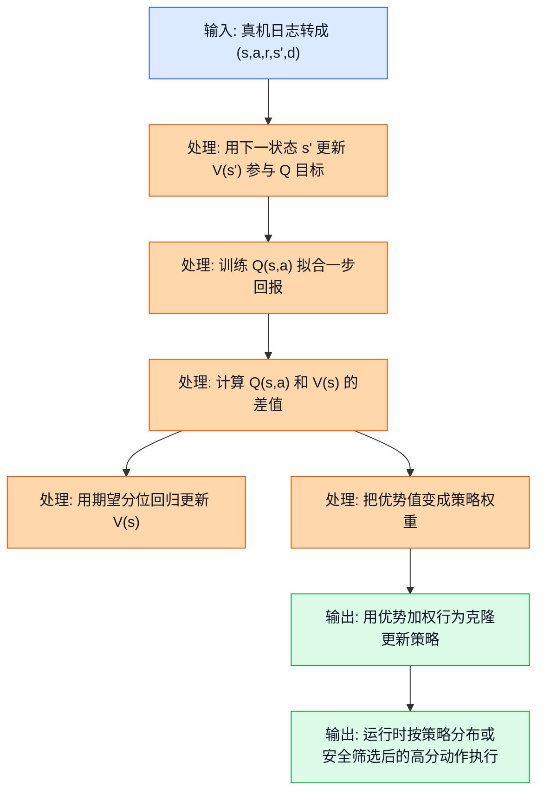
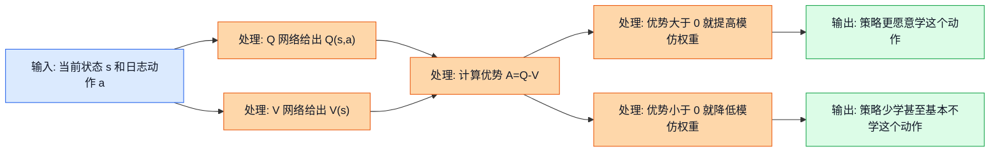
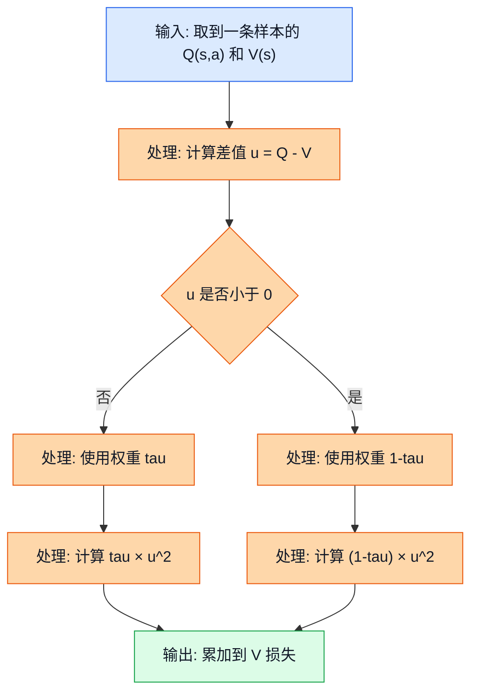
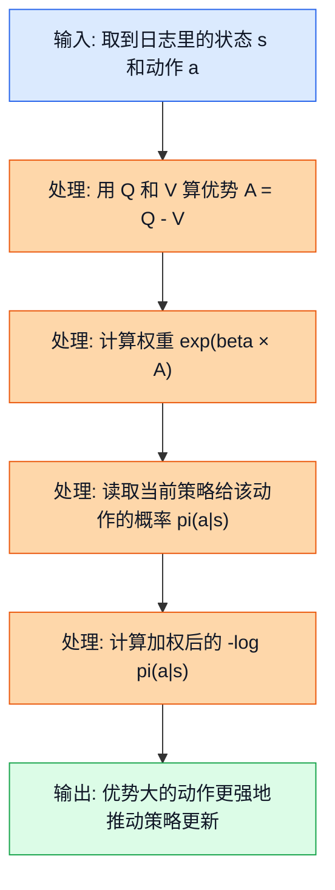
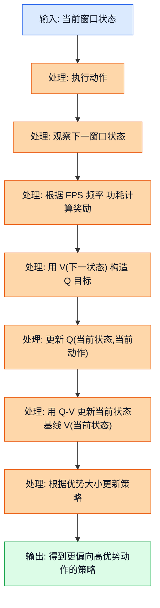
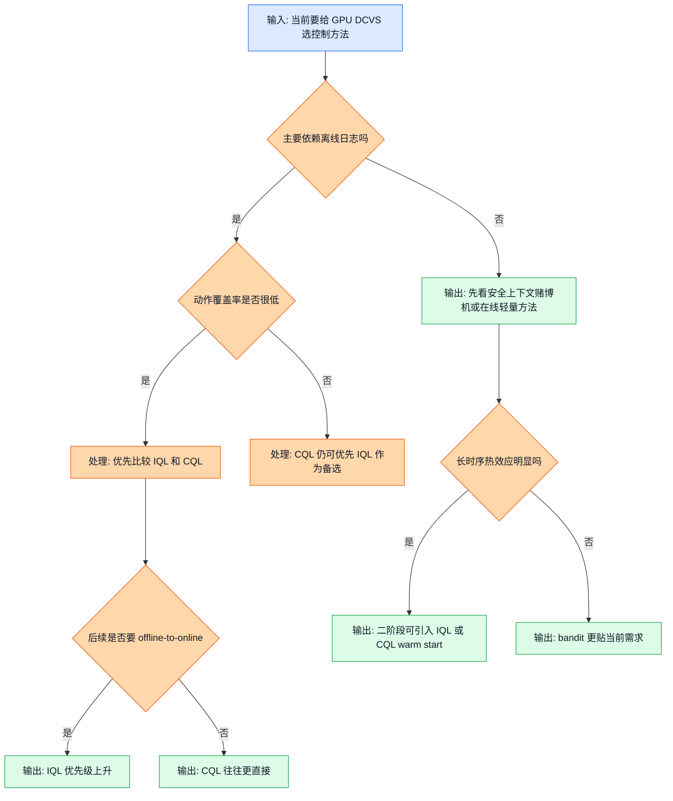

<!-- markdownlint-disable MD041 MD013 -->
## 前置阅读

- 建议先读 `02_RL_Core_Concepts.md`，先把状态、动作、奖励、Q 值这些最基本的词装进脑子里。
- 建议先读 `14_Offline_RL_Fundamentals.md`，先知道为什么这个项目离不开离线强化学习（Offline Reinforcement Learning）。
- 建议先读 `15_CQL.md`，这样你更容易看清楚 IQL 和 CQL 到底是在“保守”这件事上走了两条什么不同路线。
- 如果你还没读过上面几篇，也可以直接看本文；本文会把必要背景补齐。

# 16_IQL：隐式 Q 学习（Implicit Q-Learning，IQL）怎么用在 GPU DCVS 调参里

这篇文档只做一件事：把 IQL 讲到“你不光能看懂公式，还能判断它在 GPU DCVS 项目里什么时候比 CQL 更顺手”的程度。

很多人第一次看 IQL，会觉得它像一句很玄的话：

- 不显式评估分布外动作；
- 用期望分位回归（Expectile Regression）学一个状态价值函数；
- 再用优势加权行为克隆（Advantage-Weighted Behavior Cloning）把好动作学出来。

如果只停在这几句，基本等于没懂。因为真正决定你会不会用 IQL 的，不是术语本身，而是下面这几个现实问题：

- 现在动作空间明明是 `192 = 6 × 4 × 4 × 2` 个离散动作，它为什么还能用？
- 当前数据只覆盖大约 `30/192 = 15.625%` 的动作，它为什么常被说成“对低覆盖率更鲁棒”？
- 三份源分析文档为什么都提 IQL，但有人把它排第 2，有人把它放到第二阶段热启动（warm start）？

这篇会把这些问题一层一层拆开。

## 1. 先把分歧讲清楚：为什么 IQL 总被提到，但又很少被说成“当前唯一答案”

三份源分析文档都认可 IQL 有价值，但它们给 IQL 的“位置”并不一样。

| 来源 | 对 IQL 的态度 | 背后的默认假设 |
| --- | --- | --- |
| `RL_Algorithm_Selection_for_GPU_DCVS_Tuning_20260401.md` | 排名第 `2` | 认为当前是强离线、强安全、低动作覆盖问题，IQL 对 `30/192` 的覆盖不足比较鲁棒 |
| `RL_DCVS_AI_Integrated_Decision_2026-04-01.md` | 排名第 `2`，配运行时安全壳 | 认为 IQL 可以作为离线训练策略，再配安全过滤器上线 |
| `RL_DCVS_Runtime_Adaptive_Independent_Decision_GPT-5.4_2026-04-01_135421.md` | 二阶段增强方案，不是首发主控制器 | 认为当前更像“短历史上下文决策”，首发更偏安全上下文赌博机（Contextual Bandit） |

把这三份文档翻成大白话，其实就是三种不同的“问题建模”：

| 你怎么理解问题 | 更自然的方法 |
| --- | --- |
| “我主要靠离线日志先学一个稳妥策略，先别乱探索。” | CQL、IQL |
| “我最在意运行时每几秒都要立刻跟着场景变化做决策。” | 安全上下文赌博机 |
| “我现在先离线学会基础动作，后面还想小步在线接着学。” | IQL 特别有吸引力 |

所以，IQL 在这个项目里不是“没人要的备胎”，也不是“无脑第一名”。它更像一个很典型的第二选择：

- 如果你把问题看成纯离线离散控制，CQL 往往更直接；
- 如果你把问题看成强在线短时适应，bandit 更贴脸；
- 如果你想要一个**对低覆盖数据不那么脆弱，而且将来能自然接到离线到在线（offline-to-online）** 的方法，IQL 就很值得认真学。

## 2. IQL 到底想解决什么问题

### 2.1 直觉类比

想象你是一个新来的调参工程师，手里只有前人留下的 DCVS 历史日志。

你面前有两个难点：

1. 你不能拿真机去把 `192` 个动作全都试一遍，因为掉帧、发热、卡顿都是真实代价。
2. 你也不敢让模型对“日志里几乎没见过的动作”凭空拍脑袋。

IQL 的思路很像一个老主管在带新人：

- 先看历史日志里，哪些动作在相似状态下表现明显比“及格线”好；
- 对这些“明显更好”的动作，多学一点；
- 对那些普通甚至偏差的动作，少学一点；
- 不急着对每个没见过的动作都打高低分。

它不是在问：

> “192 个动作里，谁是我想象出来的理论最优动作？”

它更像在问：

> “历史日志里已经出现过的动作里，哪些是真的比当前基线更值得模仿？”

这就是 IQL 和很多离线 Q 学习方法最不一样的地方。

### 2.2 正式定义

IQL 仍然工作在一份固定离线数据集上：

$$
\mathcal{D} = \{(s_t, a_t, r_t, s_{t+1}, d_t)\}_{t=1}^{N}
$$

这里：

- $s_t$ 是状态（State），比如 `fps`、`gpu_freq`、`gpu_usage`、`power`、`lateness_ms` 等组成的向量；
- $a_t$ 是动作（Action），在当前项目里就是 `192` 个离散 `action_id` 之一；
- $r_t$ 是奖励（Reward）；
- $s_{t+1}$ 是下一状态；
- $d_t$ 是终止标记，结束时取 `1`，否则取 `0`。

IQL 训练时通常同时学三个东西：

1. 动作价值函数（Action Value Function）$Q(s,a)$
2. 状态价值函数（State Value Function）$V(s)$
3. 策略（Policy）$\pi(a|s)$

它们的核心关系是：

$$
A(s,a) = Q(s,a) - V(s)
$$

这里的 $A(s,a)$ 叫优势函数（Advantage Function），意思是：

> “这个动作比当前状态下的基准水平，到底高出了多少，或者低了多少。”

IQL 的关键不在于让策略去追逐“所有动作里的最大 Q 值”，而在于：

- 先让 $V(s)$ 学到一个偏向高回报样本的基准线；
- 再根据 $Q(s,a) - V(s)$ 的大小，决定哪些日志动作值得更用力模仿。

> 补充知识：状态价值函数（State Value Function）和动作价值函数（Action Value Function）有什么区别？
>
> 你可以把 $V(s)$ 理解成“这个状态大体值多少钱”，不指定具体动作；把 $Q(s,a)$ 理解成“在这个状态下，偏偏选这个动作，值多少钱”。
>
> 所以 $Q(s,a) - V(s)$ 就是在问：“这个动作比这个状态的平均水平好多少？” 如果结果是正的，说明这个动作高于基线；如果是负的，说明它拖后腿。

### 2.3 公式链路 + Mermaid 图

这张图展示的是：IQL 在离线 DCVS 数据上训练时，$Q$、$V$、策略三部分是怎么串起来的。

图里的关键路径是：

- 先用 $V(s')$ 帮 $Q$ 做一步目标；
- 再用 $Q(s,a)$ 去反过来修正 $V(s)$；
- 最后看某个日志动作比基线高多少，再决定策略要不要重点模仿它。

IQL 的“隐式”两个字，说白了就是：

> 它不是显式地对所有候选动作做一次“谁最大”的保守惩罚，而是通过 $V$ 和优势权重，间接把“该学谁”这件事学出来。

### 2.4 DCVS 实际数值计算示例

先看当前数据覆盖为什么会让 IQL 显得有吸引力。

源分析文档里给出的动作空间总数是：

$$
|\mathcal{A}| = 6 \times 4 \times 4 \times 2 = 192
$$

当前大约只采到了 `30` 个动作，因此动作覆盖率是：

$$
\text{覆盖率} = \frac{30}{192} = 0.15625 = 15.625\%
$$

没覆盖到的动作还有：

$$
192 - 30 = 162
$$

未覆盖比例是：

$$
\frac{162}{192} = 0.84375 = 84.375\%
$$

这个数字怎么解读？

- 如果你用一种特别依赖“在所有动作里做大范围比较”的方法，你会天然更担心那 `162` 个没见过的动作被瞎估高。
- IQL 的策略学习更像“把日志里表现更好的动作权重放大”，所以它在低覆盖率下常被认为更稳一点。

但这里要非常严谨地补一句：

> IQL 不是魔法。它并不等于“未见动作绝对不可能被选到”。如果工程实现里策略网络对 `192` 个动作都输出概率，它仍然可能给未见动作分一点概率。所以真部署时，最好配已见动作掩码（seen-action mask）、安全过滤器或者 top-k 安全候选集。

这句补充很重要，因为它解释了为什么源文档里常把 IQL 和 runtime safety shield 一起提。

## 3. IQL 的三件套：Q、V、策略到底分别干什么

### 3.1 直觉类比

你可以把 IQL 想成公司里三张表一起配合：

- $Q(s,a)$ 像“具体操作评分表”：在这个状态下选这个动作，长期值不值？
- $V(s)$ 像“状态基准线”：这个状态下，正常水平大概能拿多少分？
- $\pi(a|s)$ 像“执行手册”：真到运行时，在这个状态下到底更倾向选哪个动作？

单独看其中任何一个都不够：

- 只有 $Q$，你知道每个动作像多少分，但不容易直接知道“该不该学这个动作”；
- 只有 $V$，你知道状态的平均水位，但不知道具体该选哪一个动作；
- 只有策略，你会做，但不一定知道自己为什么这么做。

IQL 把三者拆开，正是为了让“打分”“定基线”“学动作”这三件事不要混成一锅。

### 3.2 正式定义

IQL 的三个核心损失常写成下面这样。

先是 $Q$ 网络：

$$
L_Q(\theta) =
\mathbb{E}_{(s,a,r,s',d)\sim\mathcal{D}}
\left[
\left(
r + \gamma (1-d)V_{\psi}(s') - Q_{\theta}(s,a)
\right)^2
\right]
$$

再是 $V$ 网络：

$$
L_V(\psi) =
\mathbb{E}_{(s,a)\sim\mathcal{D}}
\left[
L_2^\tau\left(Q_{\bar{\theta}}(s,a) - V_{\psi}(s)\right)
\right]
$$

其中：

$$
L_2^\tau(u) = |\tau - \mathbf{1}(u < 0)| \cdot u^2
$$

最后是策略网络：

$$
L_{\pi}(\phi) =
-\mathbb{E}_{(s,a)\sim\mathcal{D}}
\left[
\exp\left(\beta (Q_{\bar{\theta}}(s,a) - V_{\psi}(s))\right)
\log \pi_{\phi}(a|s)
\right]
$$

这里：

- $\gamma$ 是折扣因子（Discount Factor）；
- $\tau$ 是期望分位参数，常取大于 `0.5` 的值；
- $\beta$ 控制“优势越大，策略多偏爱它多少”；
- $\mathbf{1}(u<0)$ 是指示函数，条件成立时等于 `1`，否则等于 `0`。

> 补充知识：为什么要把策略损失写成 $\log \pi(a|s)$？
>
> 因为策略本质上是在学一个概率分布（Probability Distribution）：在状态 $s$ 下，各个动作被选中的概率分别是多少。$\log \pi(a|s)$ 只是把这个概率拿来做训练目标的一种常见写法。
>
> 你可以先把它理解成：如果某个动作本来就值得学，但当前策略给它的概率太低，那损失就会提醒模型“这个动作你给得太少了，往上提一点”。

### 3.3 公式关系 + Mermaid 图

这张图展示的是：三张表在 IQL 里如何配合。

图中的关键点就一句话：

> IQL 不直接问“所有动作里谁最大”，而是先问“这个日志动作比当前状态基线高不高”。

### 3.4 DCVS 实际数值计算示例

假设某个状态是：

- `fps = 59.3`
- `gpu_freq = 525 MHz`
- `gpu_usage = 84%`
- `power = 3600 mW`
- `lateness_ms = 0.1`

在这个状态下，我们先假设网络当前给出的分数是：

$$
Q(s, a_{72}) = 62.1
$$

$$
V(s) = 60.8
$$

那么动作 `a_72` 的优势就是：

$$
A(s, a_{72}) = 62.1 - 60.8 = 1.3
$$

如果另一个动作 `a_{25}` 的分数是：

$$
Q(s, a_{25}) = 59.7
$$

那么它的优势是：

$$
A(s, a_{25}) = 59.7 - 60.8 = -1.1
$$

现在取：

$$
\beta = 0.5
$$

分别算两个动作的优势权重：

对于 `a_72`：

$$
\exp(\beta A) = \exp(0.5 \times 1.3) = \exp(0.65) \approx 1.9155
$$

对于 `a_25`：

$$
\exp(\beta A) = \exp(0.5 \times -1.1) = \exp(-0.55) \approx 0.5769
$$

两者权重比值约为：

$$
\frac{1.9155}{0.5769} \approx 3.3202
$$

这说明什么？

- `a_72` 比当前基线高，所以它会被放大；
- `a_25` 比当前基线低，所以它被明显降权；
- 同一个状态里，策略会更愿意模仿 `a_72`，大约是 `a_25` 的 `3.32` 倍强度。

这就是 IQL 三件套配合后的第一层直觉。

## 4. 期望分位回归（Expectile Regression）到底在干什么

### 4.1 直觉类比

你可以把期望分位回归想成“定一个偏向优秀选手的及格线”。

假设一个班里有三类学生：

- 一类明显考得很好；
- 一类中等；
- 一类偏差。

如果你要定一个“普通平均线”，那高分和低分的影响差不多。
但如果你的目标不是普通平均线，而是“偏向优秀学生那边一点的参考线”，你就会：

- 对“低于参考线”的误差，罚得轻一点；
- 对“高于参考线”的误差，罚得重一点；
- 逼着这条线往更高表现那边靠。

IQL 里的 $V(s)$ 干的就是这件事。它不是在学“普通平均水平”，而是在学一个**偏向高回报动作的状态基线**。

### 4.2 正式定义

IQL 的 $V$ 损失是：

$$
L_V(\psi) =
\mathbb{E}_{(s,a)\sim\mathcal{D}}
\left[
L_2^\tau\left(Q_{\bar{\theta}}(s,a) - V_{\psi}(s)\right)
\right]
$$

其中：

$$
L_2^\tau(u) = |\tau - \mathbf{1}(u < 0)| \cdot u^2
$$

把它拆开看更直观：

当 $u \ge 0$ 时，也就是 $Q(s,a) \ge V(s)$，损失权重是：

$$
\tau \cdot u^2
$$

当 $u < 0$ 时，也就是 $Q(s,a) < V(s)$，损失权重是：

$$
(1-\tau) \cdot u^2
$$

如果 $\tau > 0.5$，那正误差会被看得更重。结果就是：$V(s)$ 会被推向“比普通平均更高一点”的位置。

> 补充知识：期望分位（Expectile）和分位数（Quantile）不是一回事
>
> 分位数更像“排第几名”，只关心左右两边人数比例；期望分位更像“允许误差大小参与投票”，因为它还是在用平方误差。也正因为这样，它比很多硬分段目标更适合拿神经网络去训练。
>
> 你可以先别死记它的统计学背景，只要记住一句话：当 $\tau$ 大于 `0.5` 时，$V(s)$ 会被推向高价值样本那一侧，而不是停在普通平均线。

### 4.3 公式推导 + Mermaid 图

这张图展示的是：一条样本进入 $V$ 网络后，IQL 怎么决定“这次误差该重罚还是轻罚”。

图中的关键路径是：

- 如果 $Q - V$ 是正的，说明这个动作比当前基线更好；
- 这时如果 $\tau$ 取大于 `0.5`，正误差会被更重地看待；
- 久而久之，$V$ 就会被推向“偏高回报”的那一侧。

### 4.4 DCVS 实际数值计算示例

为了便于手算，我们假设在同一种游戏场景里抽到 `3` 条相近状态样本，它们对应的动作分数分别是：

$$
Q_1 = 32.4,\quad Q_2 = 30.8,\quad Q_3 = 27.5
$$

先试一个候选状态基线：

$$
V(s) = 29.6
$$

并取：

$$
\tau = 0.7
$$

### 第 1 步：逐个算差值 $u = Q - V$

第一条样本：

$$
u_1 = 32.4 - 29.6 = 2.8
$$

第二条样本：

$$
u_2 = 30.8 - 29.6 = 1.2
$$

第三条样本：

$$
u_3 = 27.5 - 29.6 = -2.1
$$

### 第 2 步：根据正负决定权重

因为 $u_1 > 0$，所以权重是：

$$
0.7
$$

因为 $u_2 > 0$，所以权重也是：

$$
0.7
$$

因为 $u_3 < 0$，所以权重变成：

$$
1 - 0.7 = 0.3
$$

### 第 3 步：逐个算加权平方误差

第一条样本损失：

$$
0.7 \times (2.8)^2 = 0.7 \times 7.84 = 5.488
$$

第二条样本损失：

$$
0.7 \times (1.2)^2 = 0.7 \times 1.44 = 1.008
$$

第三条样本损失：

$$
0.3 \times (-2.1)^2 = 0.3 \times 4.41 = 1.323
$$

### 第 4 步：求平均损失

$$
L_V = \frac{5.488 + 1.008 + 1.323}{3}
$$

先把分子加起来：

$$
5.488 + 1.008 = 6.496
$$

$$
6.496 + 1.323 = 7.819
$$

再除以 `3`：

$$
L_V = \frac{7.819}{3} \approx 2.6063
$$

### 第 5 步：试着把基线往上提一点，看会发生什么

现在把候选基线改成：

$$
V(s) = 30.5
$$

重新计算：

$$
u_1 = 32.4 - 30.5 = 1.9
$$

$$
u_2 = 30.8 - 30.5 = 0.3
$$

$$
u_3 = 27.5 - 30.5 = -3.0
$$

对应损失变成：

$$
0.7 \times (1.9)^2 = 0.7 \times 3.61 = 2.527
$$

$$
0.7 \times (0.3)^2 = 0.7 \times 0.09 = 0.063
$$

$$
0.3 \times (-3.0)^2 = 0.3 \times 9 = 2.7
$$

平均损失：

$$
L_V = \frac{2.527 + 0.063 + 2.7}{3}
$$

先相加：

$$
2.527 + 0.063 = 2.59
$$

$$
2.59 + 2.7 = 5.29
$$

再除以 `3`：

$$
L_V = \frac{5.29}{3} \approx 1.7633
$$

你会看到，损失从：

$$
2.6063 \rightarrow 1.7633
$$

变小了。说明在这个例子里，$V(s)$ 往高表现那边移动是更合适的。这就是期望分位回归在“推高状态基线”的具体感觉。

## 5. 优势加权行为克隆（Advantage-Weighted Behavior Cloning）怎么让策略学会“多抄好作业”

### 5.1 直觉类比

想象你在带一个新人调参。你不会把所有历史动作一视同仁地让他全盘照抄，而是会这么做：

- 如果某个动作明显比当前基线好，就告诉他“这个动作你多记、多学、多练”；
- 如果某个动作只是凑合，学一点可以，但别太上头；
- 如果某个动作比基线还差，那就没必要重点模仿。

这就是优势加权行为克隆的核心思想。

它本质上还是在“学日志里的动作”，但不是平均地学，而是：

> 用优势值给每条日志动作打权重，越好的动作，越值得抄。

### 5.2 正式定义

IQL 的策略损失通常写成：

$$
L_{\pi}(\phi) =
-\mathbb{E}_{(s,a)\sim\mathcal{D}}
\left[
\exp(\beta A(s,a)) \log \pi_{\phi}(a|s)
\right]
$$

其中：

$$
A(s,a) = Q(s,a) - V(s)
$$

这个式子可以拆成两层看：

1. $\log \pi(a|s)$ 负责“把日志动作学进策略”
2. $\exp(\beta A)$ 负责“决定学多重”

如果某个动作的优势大：

$$
A(s,a) > 0
$$

那么：

$$
\exp(\beta A) > 1
$$

它会被放大。

如果某个动作的优势小于 `0`，那么：

$$
\exp(\beta A) < 1
$$

它会被降权。

> 补充知识：为什么会出现指数函数 $\exp(\cdot)$？
>
> 你可以先把指数函数理解成“把差距拉开”的放大器。输入稍微大一点，输出就会明显更大；输入是负数，输出就会掉到 `1` 以下。
>
> 这正适合 IQL 的需求。因为它不是只想知道“谁好谁坏”，而是想把“好多少”直接翻译成模仿强度。优势大一点的动作，被学到的力度就大很多；优势为负的动作，被快速降权。

### 5.3 公式推导 + Mermaid 图

这张图展示的是：一条日志动作怎么从“被记录下来”变成“被策略重点模仿”。

图中的关键路径是：

- 先算“这个动作比基线好多少”；
- 再把这个差值变成一个权重；
- 最后让策略主要去模仿那些真正超过基线的动作。

### 5.4 DCVS 实际数值计算示例

继续沿用上一节的三个动作分数，这次我们采用更合适的基线：

$$
V(s) = 30.5
$$

因此三个动作的优势分别是：

$$
A_1 = 32.4 - 30.5 = 1.9
$$

$$
A_2 = 30.8 - 30.5 = 0.3
$$

$$
A_3 = 27.5 - 30.5 = -3.0
$$

取：

$$
\beta = 0.4
$$

### 第 1 步：先把优势变成权重

第一条动作权重：

$$
w_1 = \exp(0.4 \times 1.9) = \exp(0.76) \approx 2.1383
$$

第二条动作权重：

$$
w_2 = \exp(0.4 \times 0.3) = \exp(0.12) \approx 1.1275
$$

第三条动作权重：

$$
w_3 = \exp(0.4 \times -3.0) = \exp(-1.2) \approx 0.3010
$$

这三个数已经告诉你方向了：

- 第一个动作被明显放大；
- 第二个动作只是轻微放大；
- 第三个动作几乎被放弃。

### 第 2 步：假设当前策略给这三个动作的概率

$$
\pi(a_1|s)=0.18,\quad \pi(a_2|s)=0.32,\quad \pi(a_3|s)=0.27
$$

先算对数项需要的负对数：

$$
-\log 0.18 \approx 1.7148
$$

$$
-\log 0.32 \approx 1.1394
$$

$$
-\log 0.27 \approx 1.3093
$$

### 第 3 步：逐个算加权损失项

第一条动作：

$$
w_1 \times (-\log \pi(a_1|s))
= 2.1383 \times 1.7148
\approx 3.6667
$$

第二条动作：

$$
w_2 \times (-\log \pi(a_2|s))
= 1.1275 \times 1.1394
\approx 1.2847
$$

第三条动作：

$$
w_3 \times (-\log \pi(a_3|s))
= 0.3010 \times 1.3093
\approx 0.3941
$$

### 第 4 步：求平均策略损失

$$
L_{\pi} \approx \frac{3.6667 + 1.2847 + 0.3941}{3}
$$

先相加：

$$
3.6667 + 1.2847 = 4.9514
$$

$$
4.9514 + 0.3941 = 5.3455
$$

再除以 `3`：

$$
L_{\pi} \approx \frac{5.3455}{3} \approx 1.7818
$$

### 第 5 步：如果策略更重视好动作，会发生什么

假设训练几步之后，策略把第一个好动作的概率从 `0.18` 提高到：

$$
0.40
$$

那它对应的负对数会变成：

$$
-\log 0.40 \approx 0.9163
$$

新的第一项损失变成：

$$
2.1383 \times 0.9163 \approx 1.9594
$$

和原来的：

$$
3.6667
$$

相比明显变小。这说明策略确实在往“更愿意选高优势动作”的方向移动。

## 6. 放回 GPU DCVS 语境里：用一条真实量级样本把 IQL 三步串起来

### 6.1 直觉类比

现在把视角从公式拉回手机真机。

你可以把一次 IQL 训练样本想成下面这个过程：

1. 当前窗口看到一堆性能和功耗信号；
2. 控制器执行了一个 `action_id`；
3. 下一窗口的 FPS、频率、功耗发生变化；
4. 这条变化被记成一条离线样本；
5. IQL 再根据这条样本更新 $Q$、$V$ 和策略。

这和普通“看一帧、拍一个动作”最大的不同是：

> IQL 不只是记住“这个动作拿了多少分”，而是同时问“它比当前状态基线好多少”。这个“高于基线多少”才是它决定学不学的关键。

### 6.2 正式定义

为了让例子自洽，我们先把状态、动作、奖励写清楚。

一个简化但够用的状态向量可以写成：

$$
s_t =
[
\text{fps}_t,\
\mathrm{gpu\_freq}_t,\
\mathrm{gpu\_usage}_t,\
\text{power}_t,\
\text{lateness}_t,\
\mathrm{actual\_dur}_t,\
\mathrm{fence\_latency}_t
]
$$

在当前项目里，动作空间是：

$$
|\mathcal{A}| = 6 \times 4 \times 4 \times 2 = 192
$$

每个动作是四个 DCVS 参数组合：

$$
a_t =
(\text{first\_step\_down},\ \text{penalty\_down},\ \text{penalty\_up},\ \text{strict\_frame})
$$

奖励继续沿用源分析文档里的统一版本：

$$
\text{reward} =
\mathrm{fps\_component}
+
\mathrm{freq\_component}
+
\mathrm{power\_component}
$$

其中：

$$
\mathrm{fps\_component} =
\begin{cases}
-10 \times (57 - \text{fps}), & \text{fps} < 57 \\
-2 \times (59 - \text{fps}), & 57 \le \text{fps} < 59 \\
20, & \text{fps} \ge 59
\end{cases}
$$

$$
\mathrm{freq\_component} = \frac{900 - \mathrm{gpu\_freq}_{mhz}}{80}
$$

$$
\mathrm{power\_component} = \frac{6000 - \text{power}_{mw}}{400}
$$

> 补充知识：为什么离线 RL 老是要写成 $(s,a,r,s')$？
>
> 因为它最关心的是“当前看到了什么”“做了什么”“拿到多少反馈”“下一步变成什么样”。只要把这四样东西凑齐，很多 RL 算法就能开始工作。
>
> 你可以把它理解成调参日志里的最小因果片段。没有它，你就很难把“哪个动作导致了后面的变化”讲清楚。

### 6.3 算法流程 + Mermaid 图

这张图展示的是：一条 DCVS 样本进入 IQL 后，训练链路怎么走。

图中的关键路径是：

- 下一窗口先决定这次动作到底值不值；
- $V(s_{t+1})$ 帮忙把未来也折回当前；
- 更新完 $Q$ 之后，再通过 $Q - V$ 告诉策略“这个动作是不是值得多学一点”。

### 6.4 DCVS 实际数值计算示例

下面我们把一条样本完整算到底。

假设当前窗口观测是：

- `fps = 58.8`
- `gpu_freq = 640 MHz`
- `gpu_usage = 91%`
- `power = 5200 mW`
- `lateness_ms = 0.5`
- `actual_dur_ms = 16.95`
- `fence_avg_latency_ms = 1.4`

此时执行动作：

$$
a_t = (\text{first\_step\_down}=10,\ \text{penalty\_down}=95,\ \text{penalty\_up}=90,\ \text{strict\_frame}=1)
$$

把它看作某个离散动作：

$$
action\_id = 118
$$

下一窗口观测到：

- `fps = 59.6`
- `gpu_freq = 525 MHz`
- `gpu_usage = 84%`
- `power = 3900 mW`
- `lateness_ms = 0.1`

#### 第 1 步：先算这条样本的奖励

因为下一窗口：

$$
\text{fps} = 59.6 \ge 59
$$

所以：

$$
\mathrm{fps\_component} = 20
$$

频率项：

$$
\mathrm{freq\_component} = \frac{900 - 525}{80} = \frac{375}{80} = 4.6875
$$

功耗项：

$$
\mathrm{power\_component} = \frac{6000 - 3900}{400} = \frac{2100}{400} = 5.25
$$

总奖励：

$$
r_t = 20 + 4.6875 + 5.25 = 29.9375
$$

#### 第 2 步：用下一状态的 $V(s_{t+1})$ 构造 Q 目标

假设当前网络给下一状态的基线估计是：

$$
V(s_{t+1}) = 31.4
$$

并取：

$$
\gamma = 0.99,\quad d_t = 0
$$

则一步目标是：

$$
y_t = r_t + \gamma (1-d_t)V(s_{t+1})
$$

代入数值：

$$
y_t = 29.9375 + 0.99 \times 31.4
$$

先算未来部分：

$$
0.99 \times 31.4 = 31.086
$$

再相加：

$$
y_t = 29.9375 + 31.086 = 61.0235
$$

#### 第 3 步：更新 $Q(s_t,a_t)$

假设当前 Q 网络对这条样本给出的分数是：

$$
Q(s_t, a_t) = 62.1
$$

则 TD 残差是：

$$
Q(s_t,a_t) - y_t = 62.1 - 61.0235 = 1.0765
$$

平方损失是：

$$
L_Q = (1.0765)^2 = 1.15885225
$$

这表示当前 Q 稍微估高了一点，需要往下修一点。

#### 第 4 步：算当前动作相对基线的优势

假设当前状态基线是：

$$
V(s_t) = 60.8
$$

则这个动作的优势为：

$$
A(s_t,a_t) = 62.1 - 60.8 = 1.3
$$

说明这个动作比当前状态基线高：

$$
1.3
$$

分，属于值得偏重模仿的动作。

#### 第 5 步：算策略该给它多大模仿权重

继续取：

$$
\beta = 0.5
$$

权重是：

$$
w = \exp(0.5 \times 1.3) = \exp(0.65) \approx 1.9155
$$

如果当前策略给这个动作的概率只有：

$$
\pi(a_t|s_t) = 0.22
$$

那么负对数是：

$$
-\log 0.22 \approx 1.5141
$$

对应的策略损失贡献是：

$$
w \times (-\log \pi(a_t|s_t))
= 1.9155 \times 1.5141
\approx 2.9011
$$

如果另一个动作在相似状态下的优势是：

$$
A = -1.2
$$

它的权重会变成：

$$
\exp(0.5 \times -1.2) = \exp(-0.6) \approx 0.5488
$$

在同样概率 `0.22` 下，它的损失贡献只有：

$$
0.5488 \times 1.5141 \approx 0.8310
$$

两者比值约为：

$$
\frac{2.9011}{0.8310} \approx 3.490
$$

这说明同样是日志动作，优势为正的动作会被策略重点学习，大约是负优势动作的 `3.49` 倍力度。

## 7. IQL、CQL、上下文赌博机（Contextual Bandit）到底怎么选

### 7.1 直觉类比

你可以把三者想成三种不同风格的调参主管。

- CQL 像一个特别谨慎的主管：没见过的动作，先别吹，先压着点。
- IQL 像一个重视“优秀历史案例”的主管：我不急着评所有动作，我先把日志里明显好的动作学扎实。
- 上下文赌博机像一个特别关注当前窗口的主管：别绕那么远，就看当前场景，马上挑一个最合适的动作。

所以它们争的不是“谁更高级”，而是“你现在到底把这个问题建模成什么”。

### 7.2 正式定义

在这个项目里，最关键的选择维度有五个：

| 维度 | 更偏 bandit 的情况 | 更偏 IQL / CQL 的情况 |
| --- | --- | --- |
| 问题结构：赌博机（Bandit）还是马尔可夫决策过程（MDP） | 当前动作主要影响当前窗口 | 当前动作会通过热积累、温控、延迟反馈影响后面很多窗口 |
| 训练方式：在线（Online）还是离线（Offline） | 允许持续在线试错和快速更新 | 先主要靠历史日志训练 |
| 动作类型：离散（Discrete）还是连续（Continuous） | 小规模离散动作也能做 | CQL 更贴离散，IQL 则更方便未来扩到连续 |
| 安全要求 | 可以接受一些探索 | 探索代价很高，宁可保守 |
| 数据覆盖率 | 覆盖足够广，在线还能补 | 当前只有 `30/192`，必须很小心地吃离线数据 |

结合三份源文档，可以压缩出下面这个结论：

- **如果你今天就要上一个离线离散安全方案，CQL 往往更直接。**
- **如果你想在低覆盖离线数据上先学出一个合理策略，并且后面准备接在线小步更新，IQL 特别值得做。**
- **如果你判断当前主需求就是“每 2 到 5 秒看当前上下文马上选动作”，而长时序效应还没有被证实很强，那安全上下文赌博机更贴脸。**

### 7.3 选择流程 + Mermaid 图

这张图展示的是：在 GPU DCVS 项目里，什么条件下更应该把 IQL 放上桌。

图中的关键路径是：

- 先看你是不是主要依赖离线日志；
- 再看动作覆盖够不够、未来是否要在线接着学；
- 最后再判断长时序效应到底强不强。

这也正是三份源文档给出不同排序的原因。

### 7.4 DCVS 实际数值计算示例

下面用一个非常具体的例子，说明“为什么长时序一旦明显，bandit 和 IQL/CQL 的判断就会分叉”。

假设有两个候选动作：

- 动作 X：当前窗口表现更猛，但后面容易因为热积累掉下来
- 动作 Y：当前窗口稍微保守一点，但后面更稳

如果只看当前窗口即时奖励：

$$
r_X = 29,\quad r_Y = 28
$$

这时候 bandit 很可能选：

$$
X
$$

因为它只看眼前这一拍。

但如果把后面 `3` 个窗口一起算进去，设折扣因子：

$$
\gamma = 0.99
$$

并假设未来奖励是：

对于动作 X：

$$
[29,\ 18,\ 17,\ 16]
$$

对于动作 Y：

$$
[28,\ 28,\ 28,\ 27]
$$

那长期回报分别是：

动作 X：

$$
G_X = 29 + 0.99 \times 18 + 0.99^2 \times 17 + 0.99^3 \times 16
$$

先算每一项：

$$
0.99 \times 18 = 17.82
$$

$$
0.99^2 = 0.9801,\quad 0.9801 \times 17 = 16.6617
$$

$$
0.99^3 = 0.970299,\quad 0.970299 \times 16 = 15.524784
$$

再相加：

$$
G_X = 29 + 17.82 + 16.6617 + 15.524784 = 79.006484
$$

动作 Y：

$$
G_Y = 28 + 0.99 \times 28 + 0.99^2 \times 28 + 0.99^3 \times 27
$$

逐项计算：

$$
0.99 \times 28 = 27.72
$$

$$
0.9801 \times 28 = 27.4428
$$

$$
0.970299 \times 27 = 26.198073
$$

再相加：

$$
G_Y = 28 + 27.72 + 27.4428 + 26.198073 = 109.360873
$$

最终比较：

$$
109.360873 - 79.006484 = 30.354389
$$

虽然动作 Y 当前少拿了 `1` 分，但长期多赚了：

$$
30.354389
$$

分。

这个例子说明：

- 如果热积累、温控、延迟反馈真的强，MDP 建模就很重要，IQL / CQL 的价值会上升；
- 如果后续影响并不强，只看当前窗口就够，bandit 的建模反而更简单直接。

## 8. 在这个项目里落地 IQL，最容易踩的 6 个坑

### 8.1 把“低覆盖率鲁棒”误解成“完全不怕低覆盖率”

IQL 对低覆盖率更稳，不等于 `30/192` 就够了。覆盖率只有：

$$
15.625\%
$$

时，策略仍然可能过度依赖那 `30` 个已见动作，泛化能力会很受限。

### 8.2 把“不会显式评估 OOD 动作”误解成“绝不会输出未见动作”

如果你的策略头对 `192` 个动作都输出概率，那未见动作仍可能被分到非零概率。实际部署最好加：

- seen-action mask
- top-k 安全候选集
- FPS 和功耗护栏

### 8.3 $\tau$ 取得太低，$V(s)$ 学成普通平均线

如果：

$$
\tau \approx 0.5
$$

那 $V(s)$ 就不再明显偏向高价值样本，IQL 的“挑好动作”能力会变弱。

### 8.4 $\beta$ 取得太高，策略容易塌成“只抄一个动作”

如果优势稍大一点就被指数放得特别夸张，策略会非常快地只盯着少数动作，离线数据的多样性会被浪费。

### 8.5 奖励口径不统一，模型学到的是“统计噪声”

源分析文档里出现过 `gpu_power_mw`、`power_ma`、`delta_total_uj` 之类不同功耗口径。如果奖励口径没统一，IQL 学到的不是“更省电”，而是“哪个字段当前碰巧数值更好看”。

### 8.6 状态只看当前帧，不看短历史趋势

如果热积累和 governor 惯性真的重要，那只看单个窗口会丢掉趋势信息。哪怕不上长序列模型，至少也应该考虑：

- 最近几窗的 `fps` 均值和波动
- 最近几窗的 `gpu_freq` 变化方向
- 最近几窗的 `power` 趋势
- 最近几窗的 `lateness_ms` 是否在恶化

## 关键收获

- IQL 的核心不是“比 CQL 更新一点点”，而是把问题拆成了三件事：$Q$ 负责动作打分，$V$ 负责状态基线，策略负责模仿高优势动作。
- 期望分位回归的作用，是把 $V(s)$ 推向“偏高回报”的那一侧，而不是停在普通平均线。
- 优势加权行为克隆的作用，是让策略重点抄那些明显高于基线的日志动作，而不是平均照抄所有动作。
- 在 GPU DCVS 项目里，IQL 特别适合“动作覆盖不足、先离线学、后面还想接 online warm start”的场景。
- IQL 的保守方式和 CQL 不一样：CQL 是显式压低没证据的高 Q 值，IQL 是绕开“对所有动作做大比较”，转而重点学习日志里高优势动作。
- 三份源文档对 IQL 排名不同，不是谁对谁错，而是它们对问题建模的假设不同：更偏离线安全控制时，IQL 是强备选；更偏即时上下文决策时，bandit 更贴当前需求；更偏 offline-to-online 过渡时，IQL 的价值会明显上升。
