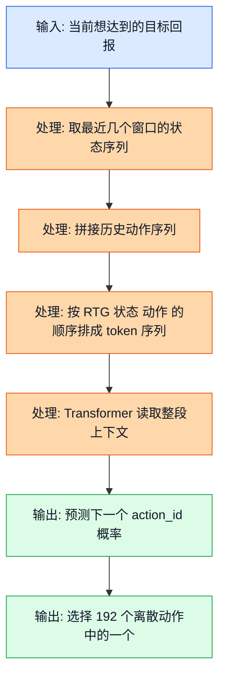
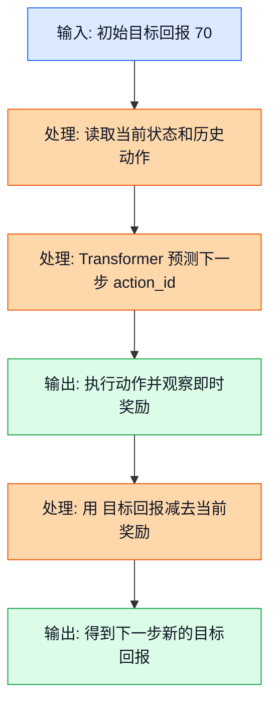
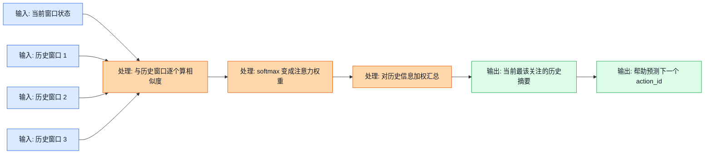
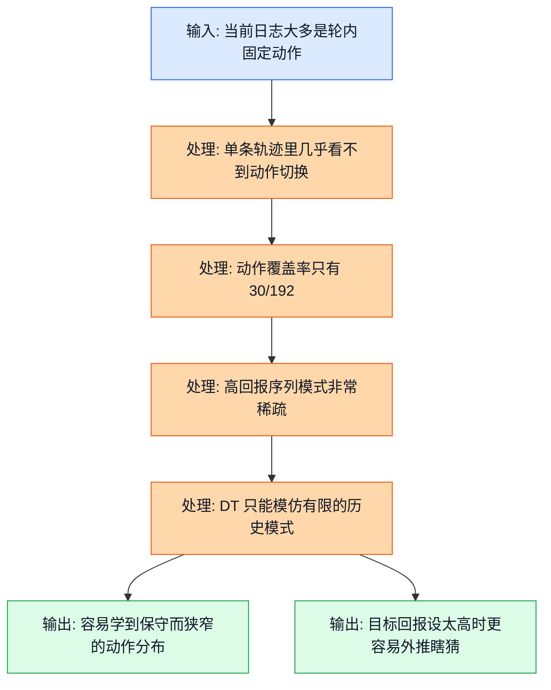

<!-- markdownlint-disable MD041 MD013 -->
## 前置阅读

- 建议先读 `02_RL_Core_Concepts.md`，至少先把状态、动作、奖励、回报这些基本词装进脑子里。
- 建议先读 `14_Offline_RL_Fundamentals.md`，这样你会更容易理解“为什么离线数据一旦覆盖不好，模型就会学歪”。
- 建议先读 `15_CQL.md`，这样你更容易看清楚：Decision Transformer 不是在和 CQL 重复做同一件事。
- 如果上面几篇你还没读，也可以直接看本文；本文会把必要背景重新补齐。

# 17_Decision_Transformer：决策 Transformer（Decision Transformer，DT）为什么很聪明，但当前 GPU DCVS 项目还不该把它当首发

这篇文档只做一件事：把决策 Transformer 讲到“你真的知道它在做什么，也知道它为什么暂时不适合当前项目”的程度。

很多人第一次看到它都会眼前一亮，因为它把强化学习（Reinforcement Learning，RL）换了个角度来做: 不再先学一个 Q 值函数（Q-Value Function）或者策略梯度（Policy Gradient），而是把整条轨迹当成一句长句子，让 Transformer 去“续写下一个动作”。

这个想法本身非常漂亮，而且它对长时依赖也确实有优势。但放回当前 GPU DCVS（Dynamic Clock and Voltage Scaling）项目里，你会发现问题不在“它高级不高级”，而在下面这几件事:

- 当前动作空间虽然是 `192` 个离散动作，DT 其实也能处理，这不是最大的障碍。
- 最大障碍是数据形态：动作覆盖率只有 $30/192 = 15.625\%$，而且很多轨迹是“轮内固定动作”，缺少真正的切换序列。
- 第二个障碍是部署约束：源分析文档里明确提到，Transformer 推理通常比 MLP（Multilayer Perceptron）Q 网络慢 `10-50x`。
- 第三个障碍是问题建模：如果当前核心目标更像“看最近几个窗口，马上选一个安全动作”，那短历史上下文决策往往比完整序列模型更贴脸。

所以本文不是要说“DT 不行”，而是要帮你看懂一句更重要的话：

> 算法值不值得上，不是看名字酷不酷，而是看它和数据、时延、安全约束、问题建模是不是对得上。

## 1. 先把争议讲清楚：为什么源文档都知道它，但没有把它排到第一

三份源分析文档对 Decision Transformer 的态度并不一样，但分歧不是“谁懂、谁不懂”，而是它们默认的问题形状不同。

| 来源 | 对 DT 的态度 | 背后的默认假设 |
| --- | --- | --- |
| `RL_Algorithm_Selection_for_GPU_DCVS_Tuning_20260401.md` | 排名第 4 | 认为 DT 很擅长长时依赖，但当前数据量太少、推理太慢，更适合第二代方案 |
| `RL_DCVS_AI_Integrated_Decision_2026-04-01.md` | 没进主推荐列表 | 这份文档把重点放在“怎样尽快把离线日志变成可部署策略”，主推 CQL 和 IQL；这里对 DT 的降级是我根据它的排序和论证做出的归纳 |
| `RL_DCVS_Runtime_Adaptive_Independent_Decision_GPT-5.4_2026-04-01_135421.md` | 只在参考方案里提到 | 认为当前更像“短历史上下文决策”，首发应优先考虑安全上下文赌博机（Safe Contextual Bandit）或离线 warm start，而不是重型序列模型 |

把它翻成大白话就是：

- 如果你把问题看成“离线长轨迹学习”，DT 会显得很诱人。
- 如果你把问题看成“运行时每几秒做一次低时延、安全决策”，DT 就会显得太重。
- 如果你手里的数据大多是“同一轮 benchmark 里一直不换动作”，DT 的优势根本发挥不出来。

所以，源文档不是简单地在争“谁才是最先进的算法”，而是在争下面这个更根本的问题：

> 当前 GPU DCVS 调参，到底更像长时序离线控制，还是更像带短历史的安全上下文决策？

后面你会看到，这个问题一旦换了答案，推荐算法就会一起换。

## 2. 决策 Transformer（Decision Transformer，DT）到底在干什么

### 2.1 直觉类比

你可以把 DT 想成一个很会“看上下文续写”的老师。

普通离线 RL 常见的思路是：

- 先学“这个动作值多少分”
- 或者先学“这个状态下什么动作更好”

而 DT 更像这样：

- 你先把历史过程写成一段故事
- 故事里包含“我想拿到多高的总分”“我现在看到什么状态”“我之前做过什么动作”
- 然后问模型：“如果你想把这段故事继续写成高分版本，下一步该写哪个动作？”

这就像你在带一个调参新人。你不是给他一张动作评分表，而是把前几分钟发生的事情完整讲给他：

- 刚才 FPS 有没有掉到 `59` 以下
- GPU 频率是不是已经冲到 `710` MHz
- 功耗是不是接近 `6000` mW 甚至更高
- 前一个窗口选的是不是偏激进的降频动作

然后你再告诉他：“接下来我还想保住一个比较高的总回报，你觉得下一步该怎么调？”

### 2.2 正式定义

Decision Transformer 会把一条轨迹重写成“回报到达值（Return-to-Go，RTG） + 状态（State） + 动作（Action）”交替出现的序列。

先定义时刻 $t$ 的回报到达值：

$$
\hat{R}_t = \sum_{k=t}^{T} r_k
$$

这里：

- $r_k$ 是第 $k$ 步的即时奖励。
- $\hat{R}_t$ 表示“从现在开始，到这条轨迹结束为止，还能累计拿到多少奖励”。

然后把整条轨迹写成一个序列：

$$
\tau =
(\hat{R}_1, s_1, a_1,\hat{R}_2, s_2, a_2,\ldots,\hat{R}_T, s_T, a_T)
$$

训练时，模型学习下面这个条件分布：

$$
p_\theta(a_t \mid \hat{R}_{\le t}, s_{\le t}, a_{<t})
$$

如果动作空间是离散的 `192` 个 `action_id`，那输出层就可以理解成一个 `192` 分类器：

$$
\pi_\theta(a_t = i \mid \text{history}) \quad i \in \{0,1,\ldots,191\}
$$

也就是说，DT 在当前项目里不是不能处理离散动作。它完全可以把 `action_id` 当成一个离散 token 来预测。

> **补充知识：令牌（Token）和嵌入（Embedding）到底是什么**
>
> 你可以先把 token 理解成“序列里的一个基本单位”。在自然语言里，一个 token 可能是一个词；在 DT 里，一个 token 可以是“当前目标回报”“当前状态向量”或者“上一步动作”。
>
> 嵌入就是把这些东西变成模型能处理的一串数字。你不用先把它想得太玄，先把它理解成“把不同类型的信息统一翻译到同一套数字坐标系里”，这样 Transformer 才能把它们放在同一条序列里一起看。

### 2.3 公式链路 + Mermaid 图

这张图展示的是：DT 在 DCVS 场景里是怎么把“目标回报 + 历史状态 + 历史动作”变成下一个 `action_id` 的。

图里的关键路径是：

- 先告诉模型“我想要多高的后续回报”
- 再把最近几个窗口发生了什么按顺序喂进去
- 最后让它直接预测“下一步动作”

这和 CQL 那种“先给每个动作打分再取最大值”的路线很不一样。DT 更像在做“条件续写”，不是在做显式的动作打分表。

### 2.4 DCVS 实际数值计算示例

下面我们手工造一段很短的 DCVS 轨迹。数值范围全部贴着项目上下文来走：

- 目标帧率盯住 `59-60 FPS`
- GPU 频率落在 `282-710 MHz`
- 功耗看作 `0-8000 mW`
- 动作来自 `192` 个离散 `action_id`

我们沿用源分析文档里给过的一套奖励写法：

$$
\text{reward} = \mathrm{fps\_component} + \mathrm{freq\_component} + \mathrm{power\_component}
$$

其中：

$$
\mathrm{fps\_component} =
\begin{cases}
-10 \times (57 - \text{fps}), & \text{fps} < 57 \\
-2 \times (59 - \text{fps}), & 57 \le \text{fps} < 59 \\
20, & \text{fps} \ge 59
\end{cases}
$$

$$
\mathrm{freq\_component} = \frac{900 - \mathrm{gpu\_freq\_mhz}}{80}
$$

$$
\mathrm{power\_component} = \frac{6000 - \mathrm{power\_mw}}{400}
$$

假设有 3 个连续窗口：

| 时刻 | FPS | GPU 频率 | 功耗 | 动作 |
| --- | --- | --- | --- | --- |
| $t_1$ | $58.2$ | $710$ MHz | $5800$ mW | `action_id = 72` |
| $t_2$ | $59.4$ | $587$ MHz | $4200$ mW | `action_id = 88` |
| $t_3$ | $60.0$ | $430$ MHz | $3000$ mW | `action_id = 24` |

先算第 1 步的奖励。

第 1 步，FPS 没到 `59`，但也没掉到 `57` 以下，所以用中间那段公式：

$$
\mathrm{fps\_component}_1 = -2 \times (59 - 58.2) = -2 \times 0.8 = -1.6
$$

频率项：

$$
\mathrm{freq\_component}_1 = \frac{900 - 710}{80} = \frac{190}{80} = 2.375
$$

功耗项：

$$
\mathrm{power\_component}_1 = \frac{6000 - 5800}{400} = \frac{200}{400} = 0.5
$$

总奖励：

$$
r_1 = -1.6 + 2.375 + 0.5 = 1.275
$$

再算第 2 步。第 2 步 FPS 已经达标，所以：

$$
\mathrm{fps\_component}_2 = 20
$$

频率项：

$$
\mathrm{freq\_component}_2 = \frac{900 - 587}{80} = \frac{313}{80} = 3.9125
$$

功耗项：

$$
\mathrm{power\_component}_2 = \frac{6000 - 4200}{400} = \frac{1800}{400} = 4.5
$$

总奖励：

$$
r_2 = 20 + 3.9125 + 4.5 = 28.4125
$$

再算第 3 步。

$$
\mathrm{fps\_component}_3 = 20
$$

$$
\mathrm{freq\_component}_3 = \frac{900 - 430}{80} = \frac{470}{80} = 5.875
$$

$$
\mathrm{power\_component}_3 = \frac{6000 - 3000}{400} = \frac{3000}{400} = 7.5
$$

$$
r_3 = 20 + 5.875 + 7.5 = 33.375
$$

现在回头算 RTG：

$$
\hat{R}_3 = r_3 = 33.375
$$

$$
\hat{R}_2 = r_2 + r_3 = 28.4125 + 33.375 = 61.7875
$$

$$
\hat{R}_1 = r_1 + r_2 + r_3 = 1.275 + 28.4125 + 33.375 = 63.0625
$$

所以，这条轨迹会被重写成这样：

$$
(63.0625, s_1, 72,\ 61.7875, s_2, 88,\ 33.375, s_3, 24)
$$

这就是 DT 真正吃进去的数据形态。你可以看到，它不是只看“当前状态”，而是把“我还想拿多少分”也一起塞进去了。

## 3. 回报到达值（Return-to-Go，RTG）为什么像 DT 的方向盘

### 3.1 直觉类比

如果说状态像“眼前路况”，那 RTG 就像“你还想跑到什么成绩”。

想象你在打游戏调 GPU：

- 如果你现在只要求“别掉到 `59 FPS` 以下”，模型可能会偏向更稳的动作。
- 如果你还要求“在保住 `59-60 FPS` 的同时继续往低功耗方向挤”，模型就会更积极地去找低频低功耗方案。

RTG 的作用，就像你把“这趟还想赚多少钱”告诉司机。目标不同，下一步的驾驶动作就会变。

### 3.2 正式定义

训练时，RTG 来自真实轨迹：

$$
\hat{R}_t = \sum_{k=t}^{T} r_k
$$

推理时，常见做法是手里先给一个目标回报，然后每走一步就把已经拿到的奖励扣掉：

$$
\hat{R}_{t+1}^{\text{target}} = \hat{R}_{t}^{\text{target}} - r_t
$$

这条式子的意思很朴素：

- 一开始我说“这局我想拿到总分 $70$”
- 如果第 1 步已经拿了 $1.275$
- 那么第 2 步开始时，还剩下 $68.725$ 的目标需要完成

也正因为如此，DT 才叫“Decision Transformer”，而不是普通的“Trajectory Transformer”。它不是只看历史，还会被“你想达到什么回报”这个条件牵着走。

> **补充知识：为什么一个目标数字会影响动作**
>
> 这件事听起来有点绕，但其实很好理解。你可以把模型想成一个“条件生成器”。同样看到现在的 GPU 负载和功耗，如果你给它的目标回报更高，它就会倾向于选择过去那些更容易通向高回报的动作模式。
>
> 所以 RTG 不是额外装饰，而是模型的控制旋钮。问题也正出在这里：如果你给的目标太高，而数据里根本没有足够多的高分轨迹做支撑，模型就可能开始瞎猜。

### 3.3 公式链路 + Mermaid 图

这张图展示的是：推理阶段目标回报会怎样一边走、一边递减。

图里的关键路径就是最后一步：

- 当前目标回报不是固定不变的
- 每拿到一步奖励，就从剩余目标里扣掉一点
- 这样模型每一步都知道“我离目标还有多远”

这也是 DT 很有辨识度的地方。很多离线 Q 学习方法不直接吃这个“剩余目标”输入，而 DT 把它放在了很靠前的位置。

### 3.4 DCVS 实际数值计算示例

我们沿用上一节那 3 个窗口的奖励：

$$
r_1 = 1.275,\quad r_2 = 28.4125,\quad r_3 = 33.375
$$

假设推理时你给模型的起始目标回报是：

$$
\hat{R}_1^{\text{target}} = 70
$$

那第 1 步执行完以后，新的目标回报就是：

$$
\hat{R}_2^{\text{target}} = 70 - 1.275 = 68.725
$$

第 2 步执行完以后：

$$
\hat{R}_3^{\text{target}} = 68.725 - 28.4125 = 40.3125
$$

第 3 步执行完以后：

$$
\hat{R}_4^{\text{target}} = 40.3125 - 33.375 = 6.9375
$$

把这串数字翻成大白话：

- 第一窗口表现一般，只拿到 `1.275` 分，所以剩余目标几乎没怎么降。
- 第二窗口一旦 FPS 达标而且功耗明显降下来，目标缺口就一下子少了很多。
- 如果你一开始把目标定得特别离谱，比如定成 $120$，那模型就会被迫去寻找数据里也许根本没出现过的“超高回报模式”。

这就是 RTG 既强大、又危险的地方：

- 目标合理时，它能引导模型往高分轨迹靠。
- 目标不合理时，它会把模型往数据支撑不到的地方推。

## 4. 注意力（Attention）到底在“翻哪些旧账”

### 4.1 直觉类比

DT 不是把历史窗口平均看一遍，而是会“有重点地翻旧账”。

你可以把它想成一个经验很老的导师。面对当前窗口，他不会把过去每一秒都同等重视，而是会优先回想：

- 最近有没有连续掉帧
- 刚才是不是已经顶到了 `710` MHz
- 功耗是不是连续几个窗口都很高
- 上一步是不是刚用了一个激进动作

这就是注意力最直观的意义：**不是所有历史都同样重要，模型会自动给重要片段更高权重。**

### 4.2 正式定义

注意力最经典的一条公式是：

$$
\text{Attention}(Q,K,V) = \text{softmax}\left(\frac{QK^\top}{\sqrt{d}}\right)V
$$

你不用一上来就被这条式子吓住。它做的事情可以拆成 3 步：

1. 用 $QK^\top$ 算“当前问题”和“历史片段”有多像。
2. 用 softmax 把这些相似度变成一组加起来等于 `1` 的权重。
3. 用这些权重对历史信息 $V$ 做加权求和，得到“当前最该关注的历史摘要”。

> **补充知识：softmax 到底是什么**
>
> 你可以把 softmax 理解成“把一组分数变成占比”。谁的原始分数更大，最后占比通常也更大，而且所有占比加起来刚好等于 `1`。
>
> 所以 softmax 很适合做“关注度分配”。比如 3 个历史窗口的相关分数分别是 `2.4`、`1.2`、`0.3`，softmax 会把它们变成类似 `70%`、`21%`、`9%` 这样的权重。这样模型就知道自己该把注意力主要放在哪一段历史上。

> **补充知识：$QK^\top$ 不必先死记成矩阵公式**
>
> 如果你现在只懂基础线性代数，可以先把 $QK^\top$ 理解成“当前窗口和历史窗口之间的相似度打分表”。分数越高，说明这段历史越值得参考。
>
> 先把它想成一张打分表，比一上来硬啃矩阵推导更有用。等你以后学深一点，再回来看矩阵乘法的批量实现就很自然了。

### 4.3 公式链路 + Mermaid 图

这张图展示的是：当前 DCVS 决策窗口会怎样从多个历史窗口里挑重点参考。

图里的关键点是：DT 不需要人工写死“最近 1 个窗口最重要”或者“温度历史最重要”。它会在训练中自己学出一套“哪些历史更值得看”的权重分配方式。

### 4.4 DCVS 实际数值计算示例

假设当前窗口前面有 3 个历史窗口，它们的情况是：

| 历史窗口 | FPS | GPU 频率 | 功耗 | 直觉标签 |
| --- | --- | --- | --- | --- |
| 窗口 A | $58.8$ | $710$ MHz | $5900$ mW | 很紧张 |
| 窗口 B | $59.4$ | $587$ MHz | $4200$ mW | 中等压力 |
| 窗口 C | $60.0$ | $430$ MHz | $3000$ mW | 很轻松 |

现在假设模型算出来的相似度分数分别是：

$$
\text{score}_A = 2.4,\quad \text{score}_B = 1.2,\quad \text{score}_C = 0.3
$$

先算指数：

$$
e^{2.4} \approx 11.023
$$

$$
e^{1.2} \approx 3.320
$$

$$
e^{0.3} \approx 1.350
$$

总和：

$$
11.023 + 3.320 + 1.350 = 15.693
$$

所以 softmax 权重分别是：

$$
w_A = \frac{11.023}{15.693} \approx 0.7023
$$

$$
w_B = \frac{3.320}{15.693} \approx 0.2115
$$

$$
w_C = \frac{1.350}{15.693} \approx 0.0860
$$

这说明什么？

- 窗口 A 被分到大约 `70.23%` 的注意力
- 窗口 B 被分到大约 `21.15%`
- 窗口 C 只占大约 `8.60%`

如果我们再假设这 3 个历史窗口对应的“风险强度值”分别是：

$$
v_A = 1.0,\quad v_B = 0.6,\quad v_C = 0.2
$$

那加权后的历史摘要就是：

$$
0.7023 \times 1.0 + 0.2115 \times 0.6 + 0.0860 \times 0.2
$$

先算每一项：

$$
0.7023 \times 1.0 = 0.7023
$$

$$
0.2115 \times 0.6 = 0.1269
$$

$$
0.0860 \times 0.2 = 0.0172
$$

最后相加：

$$
0.7023 + 0.1269 + 0.0172 = 0.8464
$$

这个 `0.8464` 可以直觉上理解成“当前上下文非常接近高压力状态”。于是模型在预测下一步动作时，就更可能优先参考最近那些高频、高功耗、接近掉帧的历史片段。

## 5. 放回 GPU DCVS 语境里：Decision Transformer 到底卡在哪

### 5.1 直觉类比

想象你在训练一个教练，想让他学会“什么时候该把 GPU 动作从 A 切到 B，再切到 C”。

结果你给他的训练录像大多是这样的：

- 第 1 场比赛，全程只用动作 `72`
- 第 2 场比赛，全程只用动作 `11`
- 第 3 场比赛，全程只用动作 `154`

那这个教练最容易学会的，不是“什么时候切换动作”，而是“某种场景下整段比赛一直用同一个动作”。

这正是当前 DT 在本项目里的核心困难：**它最擅长学序列，但你给它的序列里恰恰缺少真正有信息量的动作切换。**

### 5.2 正式定义

DT 的训练目标，本质上是让模型在已有轨迹上把动作预测对：

$$
\max_\theta \sum_{t=1}^{T} \log p_\theta(a_t \mid \hat{R}_{\le t}, s_{\le t}, a_{<t})
$$

这条式子本身没错，但它有一个很强的前提：

> 训练数据里必须真的包含“值得模仿的动作序列模式”。

如果数据主要是：

- 动作覆盖率很低
- 单条轨迹里动作很少切换
- 高回报轨迹数量又不够

那 DT 学到的往往就不是“高质量决策逻辑”，而更像“在这类上下文下，历史上通常一直没换动作”。

当前源文档给出的关键现实是：

$$
\text{动作覆盖率} = \frac{30}{192} = 0.15625 = 15.625\%
$$

因此未覆盖动作比例就是：

$$
1 - 0.15625 = 0.84375 = 84.375\%
$$

这意味着：

- 能真正被数据直接支持的动作，只占全部动作的很小一部分。
- 对一个需要“条件生成动作序列”的模型来说，这个支持度明显偏低。

### 5.3 公式链路 + Mermaid 图

这张图展示的是：为什么“轨迹有历史”这件事本来是 DT 的优势，但在当前数据形态下反而变成了限制。

图里的关键路径非常重要：

- DT 需要的是“有变化的高质量序列”
- 当前数据给得更多的是“长但单一的固定动作片段”
- 所以序列模型的表达能力再强，也会被喂进去的数据结构卡住

### 5.4 DCVS 实际数值计算示例

我们来把这个问题算得更直观一点。

源分析文档说当前大约有 `30` 轮数据，每轮大约 `6700` 帧，而且很多轮里动作固定不变。假设其中一轮全程都是：

$$
a_1 = a_2 = a_3 = a_4 = 72
$$

那一个长度为 `4` 的动作片段就是：

$$
(72,72,72,72)
$$

下一步仍然还是：

$$
a_5 = 72
$$

这条片段能教会 DT 的，更像是：

> “在这一类轨迹里，动作通常会一直保持 72”

而不是：

> “当 FPS 从 `60` 掉到 `58.5`、功耗从 `3200` mW 升到 `5800` mW 时，应该把动作从 `72` 切到 `88`”

再看覆盖率数字。

已覆盖动作数：

$$
30
$$

总动作数：

$$
192
$$

未覆盖动作数：

$$
192 - 30 = 162
$$

也就是说，模型如果想在推理时输出一个训练里几乎没怎么见过的动作，它面对的是：

$$
162/192 = 84.375\%
$$

的“弱支撑区域”。

这也是为什么源文档会把 DT 放到“二代数据足够以后再考虑”的位置。不是它不够强，而是当前数据太不像它的主场。

## 6. 为什么它和 CQL、IQL、上下文赌博机会给出不同答案

把这些方法放在一起看，你就会发现它们其实各自在回答不同的问题。

| 方法 | 它默认在回答什么问题 | 它最依赖什么 | 放到当前 DCVS 的关键判断 |
| --- | --- | --- | --- |
| 决策 Transformer（Decision Transformer，DT） | “给我目标回报和历史序列，下一步动作该是什么？” | 长轨迹、多样动作切换、高质量高回报序列 | 目前数据太单一，部署时延也偏重 |
| 保守 Q 学习（Conservative Q-Learning，CQL） | “在固定离散动作里，哪些动作的长期回报更靠谱？” | 离散动作、离线日志、安全优先 | 非常贴合当前 `192` 个离散动作 |
| 隐式 Q 学习（Implicit Q-Learning，IQL） | “我不去追没见过的动作，只沿数据中好动作学习” | 稀疏覆盖、offline-to-online 过渡 | 对低覆盖率更稳健 |
| 上下文赌博机（Contextual Bandit） | “看当前上下文，马上选一个即时最优动作” | 低时延、短历史、在线适应 | 很符合“运行时短历史决策”的假设 |

它们的真正分歧，不在“算法名气”，而在下面 5 个建模岔路口：

1. 这是更像 bandit，还是更像完整马尔可夫决策过程（Markov Decision Process，MDP）？
2. 这是优先做离线强化学习（Offline Reinforcement Learning），还是优先做运行时在线适应？
3. 当前动作是离散 `192` 类，还是以后会改成连续残差控制？
4. 线上时延预算能不能接受 Transformer 级别的推理开销？
5. 数据里到底有没有足够多的“高质量切换轨迹”供序列模型学习？

只要这 5 个问题的答案一变，最优方法排序就会跟着变。

## 7. 那什么时候该认真考虑上 Decision Transformer

如果后面项目演进到下面这些条件，DT 的优先级会明显上升：

- 数据量从现在的几十轮，扩大到源分析文档建议的 `1000+` 轮量级。
- 轨迹不再是“轮内固定动作”，而是每个 benchmark 里每 `5-10` 秒就切一次动作，真正形成可学习的动作序列。
- 数据覆盖不再只是 `30/192`，而是能把大部分高价值动作都覆盖到。
- 日志里明确记录跨场景、跨温度、跨设备的长时变化，这样长时依赖建模才真的有回报。
- 线上部署能证明 Transformer 推理时延和功耗开销是可接受的。

你可以把它理解成一句话：

> DT 更像“二代数据成熟之后的重型武器”，而不是当前这个阶段最务实的首发控制器。

## 关键收获

- Decision Transformer 的核心不是学 Q 值，而是把“目标回报 + 历史状态 + 历史动作”排成序列，直接预测下一个动作。
- 它的最大亮点是长历史建模和回报条件控制（Return Conditioning），但这两个优势都要求数据里真的有足够多、高质量、可模仿的动作序列。
- 对当前 GPU DCVS 项目来说，离散 `192` 动作并不是 DT 的最大障碍；真正的障碍是动作覆盖率只有 $15.625\%$，而且很多轨迹轮内不切动作。
- RTG 很像 DT 的方向盘。目标回报设得合理，它会引导模型靠近高分轨迹；目标设得离谱，它也可能把模型推向数据支撑不到的区域。
- 注意力机制的本质不是“神秘黑盒”，而是给不同历史窗口分配不同关注度。我们手算的例子里，最近那个高频高功耗窗口拿走了大约 `70.23%` 的注意力。
- 三份源文档没有真的互相打架。它们只是对问题建模的假设不同：如果你强调长时序离线控制，DT 会变得更有吸引力；如果你强调当前阶段的低时延、安全、短历史运行时决策，CQL、IQL 或上下文赌博机会更务实。
