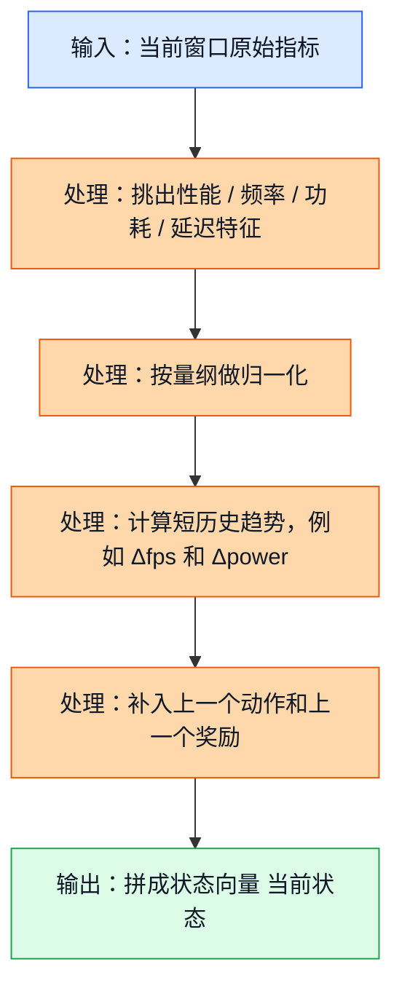
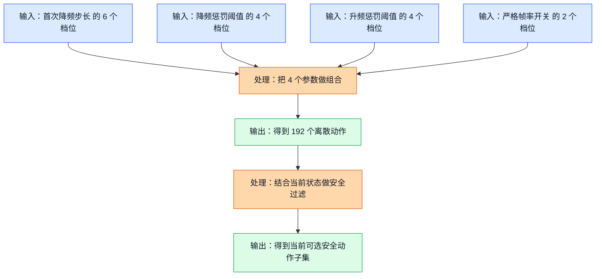
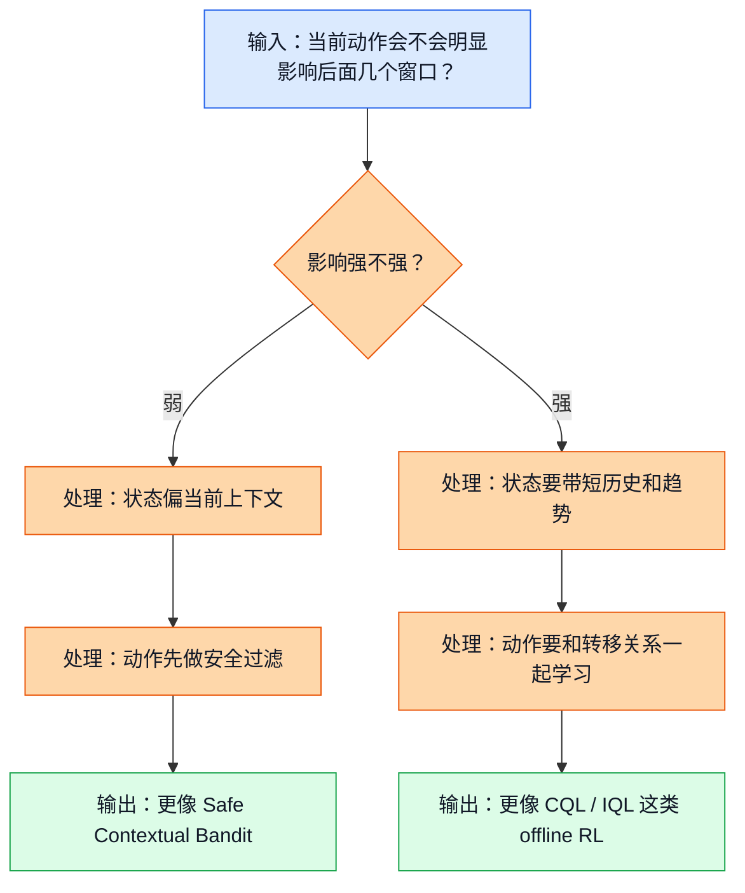

<!-- markdownlint-disable MD013 MD041 -->
# 19. 状态空间和动作空间设计（State-Action Space Design）

## 前置阅读

- 建议先读 `02_RL_Core_Concepts.md`，先把状态、动作、奖励这些最基本的词装进脑子里。
- 建议先读 `05_Contextual_Bandits.md`，这样你更容易理解“什么时候看当前上下文就够了”。
- 建议先读 `14_Offline_RL_Fundamentals.md` 和 `15_CQL.md`，这样你更容易看懂为什么三份源分析文档会对算法优先级给出不同结论。
- 如果你还没读过上面几篇，也可以直接读本文；本文会把必要概念重新讲清楚。

这篇文档只做一件事：把“模型到底该看什么”和“控制器到底能选什么”讲透。

很多人一开始会把注意力全放在算法名字上，比如保守 Q 学习（Conservative Q-Learning，CQL）、隐式 Q 学习（Implicit Q-Learning，IQL）、上下文老虎机（Contextual Bandit）。但三份源分析文档真正分歧最大的地方，其实不是“谁更高级”，而是下面这两个问题：

1. **状态空间（State Space）到底该不该带短历史？**
2. **动作空间（Action Space）到底是 192 个动作全开，还是先收缩成安全子集？**

这两个问题一旦回答不同，后面的算法排序就会变。

本文会一直围绕项目里的真实量级来讲：

- 目标帧率（Frames Per Second，FPS）是 $59 \sim 60$
- GPU 频率大致在 $282 \sim 710$ MHz
- GPU 利用率在 $0 \sim 100\%$
- 功耗大致在 $0 \sim 8000$ mW
- 动作空间大小是 $6 \times 4 \times 4 \times 2 = 192$

## 1. 为什么状态空间和动作空间是整个问题的地基

先把一句最重要的话说透：

> 强化学习算法不是在真空里工作的。你喂给它什么状态，它就只能按那个视角理解系统；你允许它选什么动作，它就只能在那个范围里做决定。

在 GPU DCVS（Dynamic Clock and Voltage Scaling）这个项目里，这句话尤其重要。因为这里不是“随便调一调参数”的小问题，而是一个强约束控制问题：

- FPS 不能明显掉下去
- 功耗不能一直高烧
- 动作不能来回抖动
- 当前动作还可能影响后面几个窗口

所以，状态空间和动作空间的设计，实际上决定了控制器能不能回答下面这些关键问题：

- 它能不能分清“现在只是瞬时抖一下”还是“已经开始往坏方向滑了”？
- 它能不能知道“刚才上一个动作是什么”，从而避免来回震荡？
- 它能不能只在安全动作里挑，而不是 192 个动作乱试？

如果这几件事没设计好，后面换再高级的算法都只是“在错误的问题定义上努力”。

## 2. 状态空间（State Space）怎么设计

### 2.1 直觉类比

你可以把状态空间想成调参工程师面前的一块仪表盘。

如果这块仪表盘上只显示一个数字，比如“当前 FPS = 59.1”，那工程师其实很难判断接下来该怎么调。因为他还不知道：

- GPU 现在忙不忙
- 频率是不是已经很高了
- 功耗是不是已经冲上去了
- 延迟是不是开始恶化
- 上一个窗口刚刚做过什么动作

所以，一个好状态不是“塞越多越好”，而是“该知道的上下文都在，而且量纲尽量清楚”。

### 2.2 正式定义

正式一点说，状态空间就是控制器每次决策时能看到的输入向量。

结合三份源分析文档，一个适合本项目的状态，不应该只看“当前一帧”，而应该至少包含 4 组信息：

$$
s_t = \left[x_t^{\text{instant}},\ x_t^{\text{trend}},\ x_t^{\text{history}},\ x_t^{\text{guardrail}}\right]
$$

这里：

- $x_t^{\text{instant}}$ 是当前窗口的即时指标，比如 `fps`、`gpu_freq`、`gpu_usage`、`gpu_power`
- $x_t^{\text{trend}}$ 是最近几个窗口的变化趋势，比如 $\Delta fps$、$\Delta power$
- $x_t^{\text{history}}$ 是短历史信息，比如上一个动作、上一个奖励
- $x_t^{\text{guardrail}}$ 是和安全护栏（Guardrail）强相关的量，比如 `lateness_ms`、`fence_avg_latency_ms`、`thermal headroom`

一个教学版的简化状态可以写成：

$$
\begin{aligned}
s_t = [&\tilde{f}^{gpu}_t,\ \tilde{u}_t,\ \tilde{p}_t,\ fps_t,\ g_t,\ lateness_t,\ fence_t, \\
      &\Delta fps_t,\ \Delta power_t,\ \widetilde{fsd}_{t-1},\ \widetilde{pd}_{t-1},\ \widetilde{pu}_{t-1},\ sf_{t-1},\ r_{t-1}]
\end{aligned}
$$

其中：

$$
\tilde{x} = \frac{x - x_{\min}}{x_{\max} - x_{\min}}
$$

$$
\tilde{f}^{gpu}_t = \frac{\mathrm{gpu\_freq}_t - 282}{710 - 282}
$$

$$
\tilde{u}_t = \frac{\mathrm{gpu\_usage}_t}{100}
$$

$$
\tilde{p}_t = \frac{power_t}{8000}
$$

$$
g_t = 60 - fps_t
$$

$$
\Delta fps_t = fps_t - fps_{t-1}
$$

$$
\Delta power_t = power_t - power_{t-1}
$$

这组式子背后的意思很朴素：

- 先把不同量纲的连续特征尽量缩放到差不多的范围
- 再把“当前值”和“变化趋势”放到一起
- 最后补上“刚才做过什么”

源分析文档里提到的候选状态特征，合起来大概是一个 $15 \sim 20$ 维的连续向量，再外加少量短历史信息。下面这张表可以帮助你快速建立直觉：

| 特征组 | 典型字段 | 作用 |
| --- | --- | --- |
| 当前性能 | `fps`、`1% low`、`actual_dur_ms` | 判断体验有没有开始掉 |
| 当前 GPU 状态 | `gpu_freq_hz`、`gpu_usage_pct`、`gpu_headroom_ms` | 判断是不是“忙但顶不住” |
| 当前功耗状态 | `gpu_power_mw`、`delta_total_uj` | 判断是不是“保住体验但太费电” |
| 当前卡顿信号 | `lateness_ms`、`fence_avg_latency_ms` | 判断掉帧风险是否在升高 |
| CPU / 热状态 | `cpu freq`、`cpu usage`、`temperature` | 判断瓶颈是不是根本不在 GPU |
| 短历史 | `prev_action`、`prev_reward`、最近 2~3 窗口趋势 | 判断动作惯性和滞后效应 |

> 补充知识：归一化（Normalization）到底在干什么？
>
> 你可以把归一化理解成“先把不同单位的尺子换成同一种刻度”。GPU 频率是几百 MHz，功耗是几千 mW，利用率是 $0 \sim 100$。如果直接把这些原始值混在一起，模型很容易被大数字牵着走。
>
> 归一化不是在“改变事实”，而是在“统一量纲”。这样一来，模型更容易把多个特征放在一起比较。

> 补充知识：为什么不要把 `action_id = 72` 直接当成一个普通数字塞进状态？
>
> 因为 `72` 和 `73` 虽然只差 `1`，但它们对应的 DCVS 参数组合不一定“只差一点点”。如果把动作编号当成有大小顺序的连续值，模型很容易学出假的邻近关系。
>
> 更稳妥的做法，是把上一个动作拆回 4 个参数档位，再分别编码；这样模型看到的是“上一步的真实调参方向”，而不是一个没有物理意义的编号。

### 2.3 公式链路和状态构造流程

这张图展示了什么：原始逐窗口遥测指标，怎样一步一步变成“模型真正看到的状态向量”。

图里的关键路径是 `A -> B -> C -> D -> E -> F`。

重点不是“特征越多越高级”，而是：

- 别漏掉和安全约束强相关的指标
- 别只看当前值，不看趋势
- 别忘了动作本身也会带来惯性

这也是三份源分析文档会分歧的根源之一：

- 如果你相信“当前窗口已经足够代表眼前局面”，那状态就会偏短、偏上下文，算法更像 contextual bandit
- 如果你相信“当前动作会影响后面几个窗口”，那状态就必须带短历史，算法更像马尔可夫决策过程（Markov Decision Process，MDP）上的离线强化学习（Offline Reinforcement Learning）

### 2.4 DCVS 实际数值计算示例

现在我们手工构造一个简化状态。

假设当前窗口 $t$ 的观测是：

- `fps_t = 58.9`
- `gpu_freq_t = 640` MHz
- `gpu_usage_t = 95%`
- `power_t = 5600` mW
- `lateness_t = 1.4` ms
- `fence_t = 2.5` ms

再假设上一个窗口 $t-1$ 的观测是：

- `fps_{t-1} = 59.8`
- `gpu_freq_{t-1} = 587` MHz
- `power_{t-1} = 5100` mW
- 上一个动作是 `(first_step_down, penalty_down, penalty_up, strict_frame) = (10, 90, 95, 1)`

我们一步一步来算。

#### 第 1 步：算当前窗口的归一化 GPU 频率

$$
\tilde{f}^{gpu}_t = \frac{640 - 282}{710 - 282}
$$

先算分母：

$$
710 - 282 = 428
$$

再算分子：

$$
640 - 282 = 358
$$

所以：

$$
\tilde{f}^{gpu}_t = \frac{358}{428} \approx 0.8364
$$

#### 第 2 步：算当前窗口的归一化 GPU 利用率

$$
\tilde{u}_t = \frac{95}{100} = 0.95
$$

#### 第 3 步：算当前窗口的归一化功耗

$$
\tilde{p}_t = \frac{5600}{8000} = 0.7
$$

#### 第 4 步：算 FPS 缺口

$$
g_t = 60 - 58.9 = 1.1
$$

这个 $1.1$ 的意思是：当前窗口离目标上边界还差 $1.1$ FPS。

#### 第 5 步：算短历史趋势

先算 FPS 变化量：

$$
\Delta fps_t = 58.9 - 59.8 = -0.9
$$

再算功耗变化量：

$$
\Delta power_t = 5600 - 5100 = 500
$$

这两个数字连起来看很关键：FPS 在跌，功耗却在升，这通常不是一个很舒服的信号。

#### 第 6 步：把上一个动作拆成档位索引

为了避免把 `action_id` 当成假连续值，我们把上一个动作拆开。

`first_step_down = 10` 在集合 $\{3,5,10,15,20,25\}$ 里排第 `3` 个，按从 `0` 开始计索引，它的索引是 `2`，归一化后：

$$
\widetilde{fsd}_{t-1} = \frac{2}{5} = 0.4
$$

`penalty_down = 90` 在集合 $\{85,90,95,98\}$ 里索引是 `1`，所以：

$$
\widetilde{pd}_{t-1} = \frac{1}{3} \approx 0.3333
$$

`penalty_up = 95` 在集合 $\{85,90,95,98\}$ 里索引是 `2`，所以：

$$
\widetilde{pu}_{t-1} = \frac{2}{3} \approx 0.6667
$$

而：

$$
sf_{t-1} = 1
$$

#### 第 7 步：算上一个窗口奖励

为了让状态里带一点“刚才这步动作效果好不好”的信息，我们把上一个奖励也算出来。

源分析文档建议统一的奖励是：

$$
reward = fps\_component + freq\_component + power\_component
$$

因为上一个窗口的 $fps_{t-1} = 59.8 \ge 59$，所以：

$$
fps\_component = 20
$$

频率项：

$$
freq\_component = \frac{900 - 587}{80} = \frac{313}{80} = 3.9125
$$

功耗项：

$$
power\_component = \frac{6000 - 5100}{400} = \frac{900}{400} = 2.25
$$

总奖励：

$$
r_{t-1} = 20 + 3.9125 + 2.25 = 26.1625
$$

#### 第 8 步：拼成一个教学版简化状态

于是，一个简化状态向量可以写成：

$$
\begin{aligned}
s_t = [&0.8364,\ 0.95,\ 0.7,\ 58.9,\ 1.1,\ 1.4,\ 2.5,\\
      &-0.9,\ 500,\ 0.4,\ 0.3333,\ 0.6667,\ 1,\ 26.1625]
\end{aligned}
$$

你可以把它读成：

- 当前 GPU 频率偏高
- GPU 很忙
- 功耗也不低
- FPS 正在往下掉
- 上一步动作是一个相对偏激进的组合
- 上一步奖励还不错，但现在趋势开始恶化

这就比单独看一个 `fps = 58.9` 有信息得多。

## 3. 动作空间（Action Space）怎么设计

### 3.1 直觉类比

动作空间可以理解成控制器的“可操作菜单”。

如果状态空间回答的是“我现在看到了什么”，那动作空间回答的就是“我现在到底能改什么”。

在这个项目里，动作不是一个模糊的“调大一点”或“调小一点”，而是 4 个 DCVS 旋钮的组合：

- `first_step_down`
- `penalty_down`
- `penalty_up`
- `strict_frame`

所以这更像是在点菜，不是从一条连续滑杆上随便拖，而是从一套预先定义好的菜单里选一份组合套餐。

### 3.2 正式定义

根据源分析文档，4 个参数的候选集合分别是：

$$
\mathcal{F} = \{3,5,10,15,20,25\}
$$

$$
\mathcal{D} = \{85,90,95,98\}
$$

$$
\mathcal{U} = \{85,90,95,98\}
$$

$$
\mathcal{S} = \{0,1\}
$$

于是，完整动作空间就是：

$$
\mathcal{A} = \mathcal{F} \times \mathcal{D} \times \mathcal{U} \times \mathcal{S}
$$

动作总数为：

$$
|\mathcal{A}| = 6 \times 4 \times 4 \times 2 = 192
$$

这 192 个动作，就是当前项目最核心的离散控制集合。

运行时如果要更安全，通常不会把全部 192 个动作同时开放，而是先做一个安全动作子集（Safe Action Subset）：

$$
\mathcal{A}_{\text{safe}}(s_t) = \{a \in \mathcal{A} \mid a \text{ 通过当前状态下的安全过滤}\}
$$

这里的“安全过滤”一般会看：

- FPS 风险是不是已经过线
- 温度或热余量是不是太紧
- 和上一个动作相比，步长是不是太大
- 动作是不是违反停留时间（Dwell Time）

> 补充知识：笛卡尔积（Cartesian Product）不用怕
>
> 笛卡尔积听起来像很吓人的数学词，其实它就是“所有组合都列一遍”。比如上衣有 3 件、裤子有 2 条、鞋子有 4 双，那总搭配数就是 $3 \times 2 \times 4 = 24$。
>
> 这里也是一样。`first_step_down` 有 6 档，`penalty_down` 有 4 档，`penalty_up` 有 4 档，`strict_frame` 有 2 档，所以总动作数就是 $6 \times 4 \times 4 \times 2 = 192$。

### 3.3 动作构造和安全裁剪流程

这张图展示了什么：4 个参数轴怎样组合成 192 个离散动作，以及为什么运行时通常还要再做一次安全裁剪。

图里的关键点是：**训练时的动作空间**和**运行时的可选动作集合**不一定完全一样。

- 对离线训练来说，192 个离散动作是一个很自然的全集
- 对运行时上线来说，更实际的做法往往是“先过滤，再选择”

这也是三份源分析文档能同时成立的原因之一：

- 一份更看重“离线训练器怎么学”，所以强调 192 个离散动作非常适合 CQL
- 一份更看重“运行时怎么安全上线”，所以强调安全动作子集

### 3.4 DCVS 实际数值计算示例

先做最基础的一步：把动作总数手算出来。

#### 第 1 步：先选 `first_step_down`

它有 6 个档位：

$$
6
$$

#### 第 2 步：再选 `penalty_down`

它有 4 个档位：

$$
6 \times 4 = 24
$$

#### 第 3 步：再选 `penalty_up`

它也有 4 个档位：

$$
24 \times 4 = 96
$$

#### 第 4 步：最后选 `strict_frame`

它有 2 个档位：

$$
96 \times 2 = 192
$$

所以：

$$
|\mathcal{A}| = 192
$$

这就是完整动作空间。

#### 第 5 步：看当前状态下怎样裁成安全子集

假设当前窗口观测到：

- `fps = 58.9`
- `gpu_usage = 95%`
- `power = 5600` mW
- `lateness = 1.4` ms

这说明体验已经接近红线，所以我们决定只开放比较保守的一部分动作：

- `first_step_down` 只允许 $\{3,5,10\}$，共 `3` 档
- `penalty_down` 只允许 $\{90,95,98\}$，共 `3` 档
- `penalty_up` 只允许 $\{90,95,98\}$，共 `3` 档
- `strict_frame` 必须是 `1`，共 `1` 档

那么当前安全动作数就是：

$$
|\mathcal{A}_{\text{safe}}(s_t)| = 3 \times 3 \times 3 \times 1 = 27
$$

从 192 个动作缩到 27 个动作，一共减少了：

$$
192 - 27 = 165
$$

安全子集只占原空间的比例是：

$$
\frac{27}{192} = 0.140625 = 14.0625\%
$$

也就是说，运行时控制器面对的搜索空间，一下子缩到了原来的大约七分之一。

这个裁剪非常重要，因为当前日志覆盖率只有：

$$
\frac{30}{192} = 0.15625 = 15.625\%
$$

如果你完全不做动作裁剪，学习器和运行时都得面对大量没有充分证据支撑的动作；这正是 CQL 会变保守、IQL 会更偏向数据内动作、bandit 会更倾向 safe subset 的根本原因。

## 4. 为什么三份源分析文档会给出不同建议

### 4.1 直觉类比

想象你现在要做两种不同的决策：

- 一种是“看着今天的天气，决定现在出门带不带伞”
- 另一种是“规划明天整天的出行安排”

前者更像只看当前上下文的选择，后者更像要考虑“现在的决定会不会影响后面整天”。

GPU DCVS 也是一样。

- 如果你觉得“当前动作主要影响眼前这个窗口”，那问题更像上下文老虎机
- 如果你觉得“当前动作会通过热积累、governor 惯性、动作滞留影响后面多个窗口”，那问题更像 MDP

### 4.2 正式定义

如果按上下文老虎机来建模，核心目标更接近：

$$
a_t^{*} = \arg\max_{a \in \mathcal{A}_{\text{safe}}(c_t)} \mathbb{E}[r_t \mid c_t, a]
$$

这里的 $c_t$ 是当前上下文，重点是“现在选哪个动作，眼前回报最好”。

如果按 MDP 来建模，核心目标更接近：

$$
\pi^{*} = \arg\max_{\pi} \mathbb{E}\left[\sum_{k=0}^{\infty}\gamma^k r_{t+k}\right]
$$

这里的重点变成了“我现在的动作，会不会改变后面很多步的累计回报”。

你可以把它们的差别压成一句话：

- **bandit** 更关心当前一步
- **MDP / offline RL** 更关心长期累计效果

> 补充知识：$\arg\max$、期望（Expectation）和折扣因子（Discount Factor）是什么意思？
>
> $\arg\max$ 可以直接理解成“把分数最高的那个选出来”。如果 3 个动作的预测分分别是 `10`、`8`、`12`，那 $\arg\max$ 选的就是分数为 `12` 的那个动作。
>
> 期望就是“平均意义上的结果”。折扣因子 $\gamma$ 取值通常在 $0$ 到 $1$ 之间，它表示“未来收益也重要，但离得越远，分量稍微打点折”。如果 $\gamma = 0.9$，那下一步奖励会按 `0.9` 折算，再下一步按 `0.9^2` 折算。

### 4.3 问题建模如何反过来决定状态和动作设计

这张图展示了什么：同一个 DCVS 系统，只是因为你对“动作是否影响未来”这件事的判断不同，就会走向两套不同的状态设计和动作设计。

图里的关键路径是：

- 如果时间依赖弱，就让状态更像“当前上下文快照”，动作先过安全过滤，再做当前一步选择
- 如果时间依赖强，就必须把短历史和趋势放进状态里，让模型学习“现在这一手会不会害到后面几步”

三份源分析文档正好分别站在这两端和中间：

| 来源 | 默认假设 | 对状态设计的偏好 | 对动作设计的偏好 |
| --- | --- | --- | --- |
| `RL_DCVS_Runtime_Adaptive_Independent_Decision_...md` | 当前更像“看上下文选当前动作” | 当前窗口 + 最近 2~3 窗口趋势 + `prev_action` | 先做安全动作子集，再让 bandit 选 |
| `RL_Algorithm_Selection_for_GPU_DCVS_Tuning_20260401.md` | 时间依赖非平凡，长期影响不能忽略 | $15 \sim 20$ 维连续状态 + 短历史 | 直接把 192 个离散动作作为 RL 动作空间 |
| `RL_DCVS_AI_Integrated_Decision_2026-04-01.md` | 离线训练和运行时安全都要兼顾 | 聚合状态窗口后交给离线策略 | 先让 CQL 给前 K 个候选动作（top-k candidates），再做运行时安全过滤 |

### 4.4 DCVS 实际数值计算示例

下面我们用一个两步奖励例子，把“为什么同样的动作空间，会因为问题建模不同而得出不同结论”算清楚。

假设当前状态下有两个候选动作：

- 动作 A：比较保守
- 动作 B：比较激进，当前窗口更省电

我们用源文档推荐的奖励公式：

$$
reward = fps\_component + freq\_component + power\_component
$$

#### 情况 A：保守动作

当前窗口结果：

- `fps = 59.4`
- `gpu_freq = 610` MHz
- `power = 5200` mW

先算当前即时奖励：

因为 $59.4 \ge 59$，所以：

$$
fps\_component = 20
$$

频率项：

$$
\frac{900 - 610}{80} = \frac{290}{80} = 3.625
$$

功耗项：

$$
\frac{6000 - 5200}{400} = \frac{800}{400} = 2
$$

所以当前奖励是：

$$
r_t^{(A)} = 20 + 3.625 + 2 = 25.625
$$

再假设下一个窗口结果是：

- `fps = 59.2`
- `gpu_freq = 600` MHz
- `power = 5100` mW

则下一步奖励为：

$$
r_{t+1}^{(A)} = 20 + \frac{900 - 600}{80} + \frac{6000 - 5100}{400}
$$

先算中间结果：

$$
\frac{900 - 600}{80} = \frac{300}{80} = 3.75
$$

$$
\frac{6000 - 5100}{400} = \frac{900}{400} = 2.25
$$

所以：

$$
r_{t+1}^{(A)} = 20 + 3.75 + 2.25 = 26
$$

如果 $\gamma = 0.9$，那两步累计回报是：

$$
G^{(A)} = 25.625 + 0.9 \times 26
$$

$$
0.9 \times 26 = 23.4
$$

$$
G^{(A)} = 25.625 + 23.4 = 49.025
$$

#### 情况 B：激进动作

当前窗口结果：

- `fps = 59.0`
- `gpu_freq = 465` MHz
- `power = 3300` mW

当前奖励为：

$$
r_t^{(B)} = 20 + \frac{900 - 465}{80} + \frac{6000 - 3300}{400}
$$

先算中间结果：

$$
\frac{435}{80} = 5.4375
$$

$$
\frac{2700}{400} = 6.75
$$

所以：

$$
r_t^{(B)} = 20 + 5.4375 + 6.75 = 32.1875
$$

看上去，当前一步它明显更香。

但假设这个激进动作导致下一个窗口开始掉帧，结果变成：

- `fps = 56.8`
- `gpu_freq = 430` MHz
- `power = 3000` mW

这时：

$$
fps\_component = -10 \times (57 - 56.8) = -10 \times 0.2 = -2
$$

$$
freq\_component = \frac{900 - 430}{80} = \frac{470}{80} = 5.875
$$

$$
power\_component = \frac{6000 - 3000}{400} = \frac{3000}{400} = 7.5
$$

所以下一步奖励是：

$$
r_{t+1}^{(B)} = -2 + 5.875 + 7.5 = 11.375
$$

于是两步累计回报为：

$$
G^{(B)} = 32.1875 + 0.9 \times 11.375
$$

$$
0.9 \times 11.375 = 10.2375
$$

$$
G^{(B)} = 32.1875 + 10.2375 = 42.425
$$

#### 第 3 步：比较 bandit 和 MDP 会怎么选

如果你只看当前一步即时奖励：

$$
32.1875 > 25.625
$$

那 bandit 会更倾向选动作 B。

但如果你看两步累计回报：

$$
49.025 > 42.425
$$

那 MDP / offline RL 会更倾向选动作 A。

这就是三份源分析文档会出现不同算法排序的真正原因：

- 不是谁算错了
- 而是它们对“动作会不会伤到未来几个窗口”的判断不同

## 5. 放回项目里，应该怎么落地设计

如果把三份源文档和当前数据现状合起来看，一个比较务实的结论是：

| 场景 | 状态设计建议 | 动作设计建议 | 更贴合的方法 |
| --- | --- | --- | --- |
| 首发运行时控制器 | 当前窗口 + 最近 2~3 窗口趋势 + `prev_action` + `prev_reward` | 192 个离散动作先裁成安全动作子集 | 安全上下文老虎机（Safe Contextual Bandit） |
| 离线预训练策略 | $15 \sim 20$ 维连续状态 + 短历史 + guardrail 特征 | 保留 192 个离散动作，必要时再加 top-k 安全过滤 | CQL |
| 数据覆盖极差时的保守方案 | 丰富状态，但策略尽量贴近日志支持集 | 不鼓励追逐日志里几乎没出现的动作 | IQL |
| 未来连续化升级 | 增加更稳定的热 / 场景 /残差（Residual）控制状态 | 把动作从离散组合改成连续 residual 调整 | 双延迟深度确定性策略梯度（Twin Delayed Deep Deterministic Policy Gradient，TD3） / 软演员评论家（Soft Actor-Critic，SAC） / 上下文贝叶斯优化（Contextual Bayesian Optimization，Contextual BO） |

这里最重要的不是记表，而是记住下面 4 句话：

- 状态设计先回答“要不要把短历史带进来”
- 动作设计先回答“192 个动作是不是要全开”
- bandit、CQL、IQL 的分歧，本质上都可以追溯到这两个设计选择
- 数据覆盖率只有 $30/192$ 时，动作空间设计会直接决定方法是“大胆”还是“保守”

如果只让我给一句工程建议，那就是：

> **先把状态做厚一点，把动作做稳一点，再谈算法做不做大。**

翻成更具体的话，就是：

- 状态别只看当前 FPS，至少把频率、功耗、延迟、短历史动作也带进去
- 动作别一上来全开 192 个，先用 guardrail 裁出安全子集
- 离线训练时接受“先保守，再扩展”的策略，不要幻想一开始就把 192 个动作全学透

## 关键收获

- 状态空间不是“随便拼一堆特征”，而是控制器看世界的方式。只看当前窗口，问题更像 bandit；把短历史和趋势带进来，问题更像 MDP。
- 对本项目来说，一个实用状态至少应包含当前性能、GPU 状态、功耗信号、卡顿信号，以及上一个动作和上一个奖励。
- 动作空间不是一个抽象编号，而是 4 个 DCVS 参数轴的组合：$6 \times 4 \times 4 \times 2 = 192$ 个离散动作。
- 在运行时，完整动作空间往往还要裁成安全子集。本文的例子里，192 个动作可以先缩到 27 个保守动作，只保留原空间的 $14.0625\%$。
- 当前数据覆盖率只有 $30/192 = 15.625\%$，这意味着动作空间设计会直接影响方法选择：CQL 会更保守，IQL 会更贴近日志支持集，安全上下文老虎机会更依赖动作过滤。
- 三份源分析文档的分歧，本质上不是算法谁对谁错，而是它们对“当前动作是否显著影响后续多个窗口”这件事的判断不同。
- 真正稳妥的工程顺序，不是先争论 CQL 还是 bandit，而是先把状态设计和动作设计做对。只有地基稳了，算法比较才有意义。
