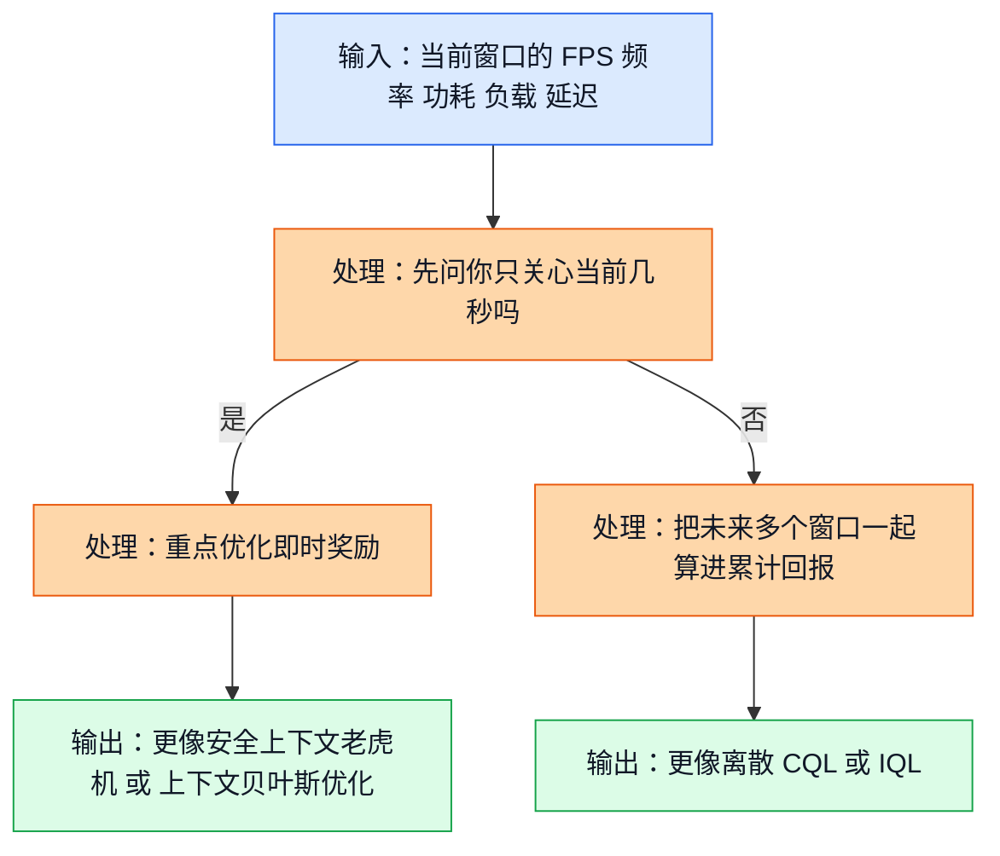
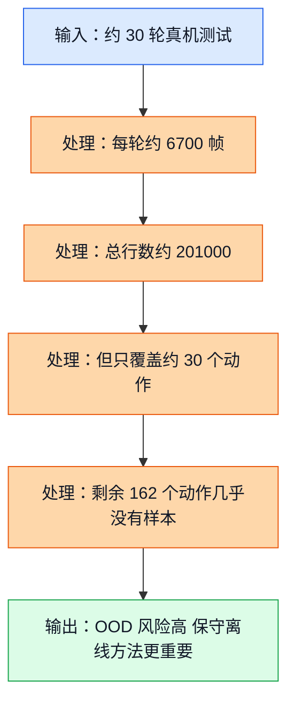
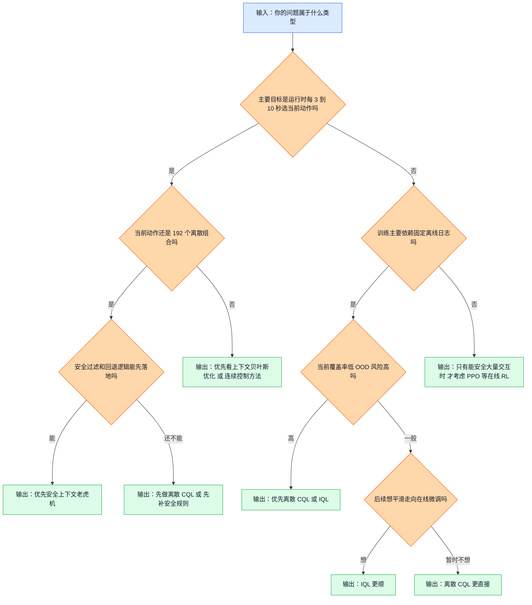

<!-- markdownlint-disable MD041 MD013 -->
## 前置阅读

- 建议先读 [05_Contextual_Bandits.md](/E:/Ecode/RL-Doc/.ralphy-worktrees/agent-16-1775096295315-b0ueb0/learn/05_Contextual_Bandits.md) 和 [06_Safe_Contextual_Bandit.md](/E:/Ecode/RL-Doc/.ralphy-worktrees/agent-16-1775096295315-b0ueb0/learn/06_Safe_Contextual_Bandit.md)，先搞清楚为什么“当前窗口决策”会把 bandit 这条线推到前面。
- 建议先读 [14_Offline_RL_Fundamentals.md](/E:/Ecode/RL-Doc/.ralphy-worktrees/agent-16-1775096295315-b0ueb0/learn/14_Offline_RL_Fundamentals.md) 和 [15_CQL.md](/E:/Ecode/RL-Doc/.ralphy-worktrees/agent-16-1775096295315-b0ueb0/learn/15_CQL.md)，先搞清楚为什么“固定离线日志 + 分布外（Out-of-Distribution, OOD）风险”会把 CQL / IQL 这条线推到前面。
- 如果你还没读前文，也可以直接看本文。本文会把做算法选择时最关键的判断标准重新讲清楚。

# 20 算法对比：GPU DCVS 调参到底该先上哪类算法

这篇文档不打算把每个算法都再讲一遍，而是只解决一个更实际的问题：

> 面对 GPU DCVS 这个项目，为什么有的分析把离散保守 Q 学习（Discrete Conservative Q-Learning, CQL）排第一，有的分析却把安全上下文老虎机（Safe Contextual Bandit）排第一？

结论先放前面：

- 如果你今天最在意的是“先靠固定离线日志学一个稳妥起点，再谨慎上线”，那离散 CQL 和隐式 Q 学习（Implicit Q-Learning, IQL）更占优。
- 如果你今天最在意的是“运行时每隔几秒就重新看一次上下文，然后快速、安全地改一次 DCVS 参数”，那安全上下文老虎机更占优。
- 如果你已经准备把动作从现在的 `192` 个离散组合，逐步扩展成更平滑的连续残差控制，那上下文贝叶斯优化（Contextual Bayesian Optimization）和连续控制算法的优先级会明显上升。

真正决定排序的，不是“谁名字更高级”，而是你到底把问题看成哪一类。

## 1. 先别急着选算法，先问你到底在解哪道题

### 1.1 直觉类比

你可以把这个问题想成两个完全不同的工作岗位。

- 第一种岗位像“值班工程师”：他每隔 `3` 到 `10` 秒抬头看一次监控屏，然后立刻决定这几秒钟该用哪个动作。这个岗位最关心的是“眼前这一手怎么选最划算”。
- 第二种岗位像“长期调度员”：他不只看这一手，还会担心“现在省下来的这点功耗，会不会在后面几轮换来热积累、掉帧、甚至 governor 进入更差状态”。这个岗位关心的是“整段时间累计下来谁更值”。

这两种岗位，对应的就是两类建模：

- 更像当前窗口即时决策的问题，通常会把你推向安全上下文老虎机、上下文贝叶斯优化。
- 更像中等时间依赖的马尔可夫决策过程（Markov Decision Process, MDP），通常会把你推向 CQL、IQL，或者更完整的强化学习（Reinforcement Learning）。

### 1.2 正式定义

如果你把问题建成“当前上下文下选当前动作”，那目标更接近：

$$
a_t^* = \arg\max_{a \in \mathcal{A}} \mathbb{E}[r_t \mid x_t, a]
$$

这里：

- $x_t$ 是当前上下文，比如 `gpu_usage`、`gpu_freq`、`power`、`fps`、`lateness_ms`、最近 1 到 3 个窗口的趋势。
- $\mathcal{A}$ 是动作集合。当前项目里就是 `192 = 6 \times 4 \times 4 \times 2` 个离散动作。
- $r_t$ 是当前窗口的即时奖励。

如果你把问题建成“动作会影响后面很多窗口”，那目标更接近：

$$
\pi^* = \arg\max_{\pi} \mathbb{E}\left[\sum_{k=0}^{T}\gamma^k r_{t+k}\right]
$$

这里的重点变成了累计回报（Return），也就是不只看当前这一手，还要把后面几步一起算进去。

> 补充知识：期望（Expectation）和折扣因子（Discount Factor）
>
> 你可以把“期望”先理解成“同样的情况重复很多次以后，平均大概会拿多少分”。比如一个动作有时候拿 `30` 分，有时候拿 `20` 分，长期平均大约 `25` 分，那这个 `25` 就是它的期望回报。
>
> 折扣因子 $\gamma$ 用来表达“未来有多重要”。如果 $\gamma = 0.9$，说明未来仍然重要，但会稍微打一点折。它不是在说未来没用，而是在说“越远的未来，权重可以稍微小一点”。

### 1.3 公式逻辑 + Mermaid 图

这张图展示了什么：同一个 GPU DCVS 问题，只要你把“目标函数”换一下，推荐算法就会跟着变。

图里的关键路径很简单：不是算法先决定建模，而是建模先决定算法。你如果主要盯着“当前窗口最优”，bandit 和 BO 自然会上升；你如果明确承认“当前动作会明显影响后面几轮”，CQL 和 IQL 自然会上升。

### 1.4 DCVS 实际数值计算示例

下面用一个完整的三窗口例子，直接把“为什么 bandit 和 RL 可能给出不同答案”算出来。

先统一奖励函数：

$$
reward = fps\_component + freq\_component + power\_component
$$

其中：

$$
fps\_component =
\begin{cases}
-10 \times (57 - fps), & fps < 57 \\
-2 \times (59 - fps), & 57 \le fps < 59 \\
20, & fps \ge 59
\end{cases}
$$

$$
freq\_component = \frac{900 - \mathrm{gpu\_freq\_mhz}}{80}
$$

$$
power\_component = \frac{6000 - \mathrm{power\_mw}}{400}
$$

假设当前系统都在同一个初始状态附近，候选有两种策略：

- 稳健动作：第一窗口省得不算最狠，但后面几轮更稳。
- 激进动作：第一窗口看起来更香，但后面几轮会开始掉帧。

三个窗口的观测结果设成下面这样：

| 策略 | 窗口 | FPS | GPU 频率 (MHz) | 功耗 (mW) |
| --- | --- | ---: | ---: | ---: |
| 稳健动作 | 1 | 59.5 | 420 | 3800 |
| 稳健动作 | 2 | 59.3 | 430 | 3900 |
| 稳健动作 | 3 | 59.1 | 435 | 3950 |
| 激进动作 | 1 | 59.0 | 360 | 3200 |
| 激进动作 | 2 | 57.8 | 330 | 3100 |
| 激进动作 | 3 | 56.7 | 320 | 3000 |

先算稳健动作。

**窗口 1**

1. 因为 $59.5 \ge 59$，所以

$$
fps\_component = 20
$$

2. 频率项：

$$
freq\_component = \frac{900 - 420}{80} = \frac{480}{80} = 6
$$

3. 功耗项：

$$
power\_component = \frac{6000 - 3800}{400} = \frac{2200}{400} = 5.5
$$

4. 总奖励：

$$
r_1^{safe} = 20 + 6 + 5.5 = 31.5
$$

**窗口 2**

$$
fps\_component = 20
$$

$$
freq\_component = \frac{900 - 430}{80} = \frac{470}{80} = 5.875
$$

$$
power\_component = \frac{6000 - 3900}{400} = \frac{2100}{400} = 5.25
$$

$$
r_2^{safe} = 20 + 5.875 + 5.25 = 31.125
$$

**窗口 3**

$$
fps\_component = 20
$$

$$
freq\_component = \frac{900 - 435}{80} = \frac{465}{80} = 5.8125
$$

$$
power\_component = \frac{6000 - 3950}{400} = \frac{2050}{400} = 5.125
$$

$$
r_3^{safe} = 20 + 5.8125 + 5.125 = 30.9375
$$

再算激进动作。

**窗口 1**

$$
fps\_component = 20
$$

$$
freq\_component = \frac{900 - 360}{80} = \frac{540}{80} = 6.75
$$

$$
power\_component = \frac{6000 - 3200}{400} = \frac{2800}{400} = 7
$$

$$
r_1^{aggr} = 20 + 6.75 + 7 = 33.75
$$

**窗口 2**

1. 因为 $57 \le 57.8 < 59$，进入轻惩罚区：

$$
fps\_component = -2 \times (59 - 57.8) = -2 \times 1.2 = -2.4
$$

2. 频率项：

$$
freq\_component = \frac{900 - 330}{80} = \frac{570}{80} = 7.125
$$

3. 功耗项：

$$
power\_component = \frac{6000 - 3100}{400} = \frac{2900}{400} = 7.25
$$

4. 总奖励：

$$
r_2^{aggr} = -2.4 + 7.125 + 7.25 = 11.975
$$

**窗口 3**

1. 因为 $56.7 < 57$，进入重惩罚区：

$$
fps\_component = -10 \times (57 - 56.7) = -10 \times 0.3 = -3
$$

2. 频率项：

$$
freq\_component = \frac{900 - 320}{80} = \frac{580}{80} = 7.25
$$

3. 功耗项：

$$
power\_component = \frac{6000 - 3000}{400} = \frac{3000}{400} = 7.5
$$

4. 总奖励：

$$
r_3^{aggr} = -3 + 7.25 + 7.5 = 11.75
$$

如果你只看当前窗口，bandit 会更偏向激进动作，因为：

$$
33.75 > 31.5
$$

但如果你把三个窗口一起看，取 $\gamma = 0.9$，累计回报分别是：

$$
G^{safe} = 31.5 + 0.9 \times 31.125 + 0.9^2 \times 30.9375
$$

先算中间结果：

$$
0.9 \times 31.125 = 28.0125
$$

$$
0.9^2 = 0.81
$$

$$
0.81 \times 30.9375 = 25.059375
$$

所以：

$$
G^{safe} = 31.5 + 28.0125 + 25.059375 = 84.571875
$$

激进动作的累计回报是：

$$
G^{aggr} = 33.75 + 0.9 \times 11.975 + 0.81 \times 11.75
$$

先算中间结果：

$$
0.9 \times 11.975 = 10.7775
$$

$$
0.81 \times 11.75 = 9.5175
$$

所以：

$$
G^{aggr} = 33.75 + 10.7775 + 9.5175 = 54.045
$$

这就是本项目里最关键的分叉点：

- 如果你认定“当前窗口最重要”，那激进动作看起来更香。
- 如果你认定“后面几个窗口也必须一起看”，那稳健动作明显更值。

## 2. 同样一份日志，对不同算法的价值完全不一样

### 2.1 直觉类比

想象你拿到一大箱点餐小票。

- 小票总数很多，看上去像“数据很大”。
- 但如果这些小票反复只来自 `30` 道菜，菜单上剩下 `162` 道菜一张都没出现过，那你虽然“票很多”，却并不等于“菜单学全了”。

GPU DCVS 当前的数据就有点像这样：

- 行数不算少；
- 但动作覆盖很窄；
- 很多动作压根没在日志里出现过。

这会直接改变算法选择。

### 2.2 正式定义

根据源分析文档，当前数据大致是：

- 已采集轮数约 `30` 轮；
- 每轮约 `6700` 帧；
- 动作空间总大小是 `192`；
- 当前只覆盖了大约 `30` 个动作。

先估算总行数：

$$
N_{\text{rows}} \approx 30 \times 6700 = 201000
$$

再算动作覆盖率：

$$
\text{coverage} = \frac{30}{192} = 0.15625 = 15.625\%
$$

未覆盖动作数是：

$$
192 - 30 = 162
$$

未覆盖比例是：

$$
\frac{162}{192} = 0.84375 = 84.375\%
$$

这说明一个很容易被忽略的事实：

> 你手里是“约 20 万行日志”，但不是“覆盖 192 个动作的 20 万行日志”。

### 2.3 公式逻辑 + Mermaid 图

这张图展示了什么：为什么“日志总行数很多”不等于“动作覆盖足够”，以及这件事为什么会把 CQL / IQL 推到前面。

图里的关键路径是 `总行数多 -> 覆盖动作少 -> OOD 风险高`。也就是说，当前最稀缺的不是“帧行数”，而是“跨动作、跨状态的有效覆盖”。

### 2.4 DCVS 实际数值计算示例

我们继续把这个问题手算到底。

第一步，总行数：

$$
N_{\text{rows}} = 30 \times 6700 = 201000
$$

第二步，当前覆盖动作数：

$$
N_{\text{covered}} = 30
$$

第三步，动作覆盖率：

$$
\text{coverage} = \frac{30}{192} = 0.15625
$$

换成百分比：

$$
0.15625 \times 100\% = 15.625\%
$$

第四步，未覆盖动作数：

$$
N_{\text{uncovered}} = 192 - 30 = 162
$$

第五步，未覆盖比例：

$$
\frac{162}{192} = 0.84375 = 84.375\%
$$

第六步，如果只看“已覆盖动作”，平均每个已覆盖动作大约有多少行？

$$
\frac{201000}{30} = 6700
$$

这说明什么？说明你对已经覆盖到的那 `30` 个动作，也许有不少样本。

第七步，如果你被“20 万行很多”这个数字骗了，误以为 `192` 个动作都差不多学到了，那么你会下意识去算：

$$
\frac{201000}{192} \approx 1046.875
$$

这个平均值很迷惑，因为它默认 `192` 个动作都被均匀覆盖了。但真实情况是：

- 大约 `30` 个动作有样本；
- `162` 个动作可能直接是 `0` 样本。

这也是为什么：

- 普通 DQN 更容易对没见过的动作过分乐观；
- CQL 会主动把“证据不足的高分动作”压下来；
- IQL 更倾向于只沿数据里真实出现过的好动作学习；
- 安全上下文老虎机更适合把在线探索限制在一个已经验证过的安全动作子集里。

## 3. 一张总表先看结论

下面这张表故意写得很“决策导向”。你不需要把它背下来，但你需要知道自己正在牺牲什么、换来什么。

| 算法 | 问题适配度 | 安全性 | 离线数据利用率 | 在线适应性 | 实现复杂度 | 部署延迟 | 数据量需求 | 当前判断 |
| --- | --- | --- | --- | --- | --- | --- | --- | --- |
| 安全上下文老虎机（Safe Contextual Bandit） | 很高 | 高 | 中 | 很高 | 中 | 很低 | 中 | 当前最像“运行时每几秒做一次安全决策”的首发方案 |
| 上下文贝叶斯优化（Contextual Bayesian Optimization） | 中 | 高 | 中 | 高 | 中到高 | 中 | 中 | 如果以后走连续残差控制，它会明显升值 |
| 离散保守 Q 学习（Discrete Conservative Q-Learning, CQL） | 很高 | 很高 | 很高 | 中 | 中 | 很低 | 中 | 当前离散动作 + 固定离线日志 + 强安全约束时最稳 |
| 隐式 Q 学习（Implicit Q-Learning, IQL） | 高 | 很高 | 很高 | 高 | 中到高 | 很低 | 中 | 当你要从离线平滑过渡到在线微调时非常有吸引力 |
| TD3 + 行为克隆（Twin Delayed DDPG + Behavior Cloning, TD3+BC） | 低 | 中 | 中 | 中 | 中 | 很低 | 中到高 | 只有动作真的连续化以后，它才会重新变得顺眼 |
| 决策变换器（Decision Transformer） | 低 | 中 | 中 | 低 | 高 | 高 | 很高 | 更像远期大数据方案，不像当前首发方案 |
| 表格 Q 学习 / 深度 Q 网络（Tabular Q-Learning / Deep Q-Network, DQN） | 低到中 | 低到中 | 低到中 | 中 | 低到中 | 很低 | 中到高 | 适合做 baseline，不适合直接当最终方案 |
| 近端策略优化（Proximal Policy Optimization, PPO） | 低 | 低 | 很低 | 中 | 中到高 | 中 | 很高 | 需要大量安全在线交互，当前手机真机场景不划算 |

读这张表时，有 4 个点最值得记住：

- `问题适配度` 问的是“它是不是天然贴合你手头这个 DCVS 问题”，不是问“论文里它强不强”。
- `安全性` 默认你至少会配最基本的安全护栏（guardrail）、回退逻辑和动作跳变约束。裸跑任何在线探索方法，安全性都要再降一级。
- `离线数据利用率` 问的是“它能不能把现在手头的固定日志真正吃进去”，不是问“理论上能不能训练”。
- `部署延迟` 问的是运行时推理成本，不是训练耗时。

## 4. 三份源文档为什么排名不完全一样

### 4.1 先看 Top-3 对比表

| 来源文档 | Top-1 | Top-2 | Top-3 | 它最看重什么 |
| --- | --- | --- | --- | --- |
| `RL_Algorithm_Selection_for_GPU_DCVS_Tuning_20260401.md` | 离散 CQL | IQL | TD3+BC | 离散动作适配、离线可训练性、安全性、分布外风险 |
| `RL_DCVS_AI_Integrated_Decision_2026-04-01.md` | 离散 CQL + 安全过滤 | 离散 IQL + 安全过滤 | 离线 value policy + 在线 bandit 适配层 | 先把离线主策略做稳，再加轻量在线适配 |
| `RL_DCVS_Runtime_Adaptive_Independent_Decision_GPT-5.4_2026-04-01_135421.md` | 安全短历史上下文老虎机 | 上下文贝叶斯优化 | IQL / CQL warm start 的离线到在线（offline-to-online）路线 | 运行时动态决策、轻量部署、在线安全适应 |

这个表最重要的作用，不是告诉你“谁对谁错”，而是告诉你：这三份文档本来就在回答三个侧重点不同的问题。

### 4.2 它们真正分歧的，是 3 条假设轴

#### 假设轴 1：短期上下文决策 vs 中等时间依赖 MDP

- 如果你认为 DCVS 主要是“当前窗口看仪表盘，当前窗口选动作”，那安全上下文老虎机会自然排前。
- 如果你认为热积累、governor 惯性、场景切换会持续影响后面多个窗口，那 CQL / IQL 会自然排前。

这不是抽象哲学，而是你刚才在数值例子里亲手算出来的：

$$
33.75 > 31.5
$$

但：

$$
84.571875 > 54.045
$$

也就是说，当前窗口最优和累计回报最优，本来就可能不是一个动作。

#### 假设轴 2：离线优先 vs 在线优先

- 如果你最担心“真机不能乱试”，那就会更重视离线优先，这时 CQL / IQL 更自然。
- 如果你最担心“上线后场景会漂移，必须在线快速适应”，那就会更重视安全上下文老虎机或上下文贝叶斯优化。

一句话说，就是：

- 离线优先的人，怕的是“分布外动作乱吹高”。
- 在线优先的人，怕的是“离线学得再稳，一上线就跟不上场景变化”。

#### 假设轴 3：当前离散动作空间 vs 未来连续控制

当前动作空间是：

$$
|\mathcal{A}| = 6 \times 4 \times 4 \times 2 = 192
$$

这会天然抬高离散 CQL、IQL、安全上下文老虎机的优先级。

但如果未来动作变成“连续残差微调”，比如不再只在固定档位里选，而是允许更平滑地微调降频幅度或阈值，那排序就会开始变：

- TD3+BC 的地位会上升；
- 上下文贝叶斯优化会更有吸引力；
- 只适配离散动作枚举的方法，相对优势会下降。

## 5. 算法选择决策树

这张图展示了什么：如果你现在就要做决策，可以从“你的问题到底是什么形状”一路问下去，最后自然走到更合适的算法。

图里的关键路径有 3 条：

- 如果你今天最像“运行时安全短窗口决策”，先往安全上下文老虎机走。
- 如果你今天最像“固定离线日志 + 高 OOD 风险”，先往离散 CQL / IQL 走。
- 如果你已经准备把动作空间做连续化，别再硬套纯离散思路，开始看上下文贝叶斯优化或连续控制。

## 6. 真正落地时，应该怎么分阶段

### 6.1 第一代方案：现在就能做

如果你现在就要拍板，最现实的选择其实只有两个：

#### 路线 A：离散 CQL

更适合下面这种情况：

- 你主要依赖固定离线日志训练；
- 你很在意 OOD 动作风险；
- 你希望先拿到一个保守、可部署、推理很快的离线主策略；
- 你现在的动作仍然明确是 `192` 个离散动作。

#### 路线 B：安全上下文老虎机

更适合下面这种情况：

- 你要做的是运行时主控制器；
- 你能把决策周期控制在 `3` 到 `10` 秒；
- 你可以先做好安全动作子集、回退逻辑、最小驻留时间、动作跳变约束；
- 你希望模型上线后就具备轻量在线适应能力。

### 6.2 第二代方案：数据继续积累后

第二代更值得看的，是：

> IQL + 在线微调（online fine-tuning）

原因很实际：

- IQL 对当前这种低覆盖日志更稳；
- 它更适合从离线阶段平滑走向在线阶段；
- 当你逐步收集到更多多动作轨迹，而不是继续停留在“单动作轮内固定”的采集形态时，它的优势会更明显。

### 6.3 远期方案：大量数据或动作连续化后

远期更值得看的有两条路：

- 决策变换器：前提是你真的积累到了大量、长轨迹、跨场景数据。
- 连续动作 + 上下文贝叶斯优化：前提是动作空间不再只是固定 `192` 档，而是开始做连续残差调节。

### 6.4 那其他方法怎么定位

- TD3+BC：不是“永远不行”，而是“现在动作还没连续化，所以不划算”。
- 表格 Q-learning / DQN：非常适合做基线（baseline）、回归检查、可解释起点，但不适合被误当成最终答案。
- PPO：真正的问题不是它论文不强，而是手机真机上安全在线探索太贵。

## 关键收获

- 三份源文档排名不一致，不是互相矛盾，而是它们默认的问题建模不同。
- 最关键的三条分歧轴是：短期上下文决策 vs 中等时间依赖 MDP、离线优先 vs 在线优先、当前离散动作 vs 未来连续控制。
- 当前项目最现实的首发候选，依然是两条线：离散 CQL，或者安全上下文老虎机。
- IQL 很像下一阶段的核心候选，因为它对低覆盖日志更稳，也更容易平滑走向在线微调。
- TD3+BC、上下文贝叶斯优化、决策变换器都不是“没价值”，而是它们更依赖未来的数据形态和动作空间形态。
- 只看“约 20 万行日志”会误判问题难度；真正关键的是动作覆盖率只有 `30/192 = 15.625%`，未覆盖比例高达 `84.375%`。
- 如果你今天就要拍板：离线优先选离散 CQL，运行时优先选安全上下文老虎机；如果以后连续控制和大数据条件成熟，再把排序重新洗一遍。
