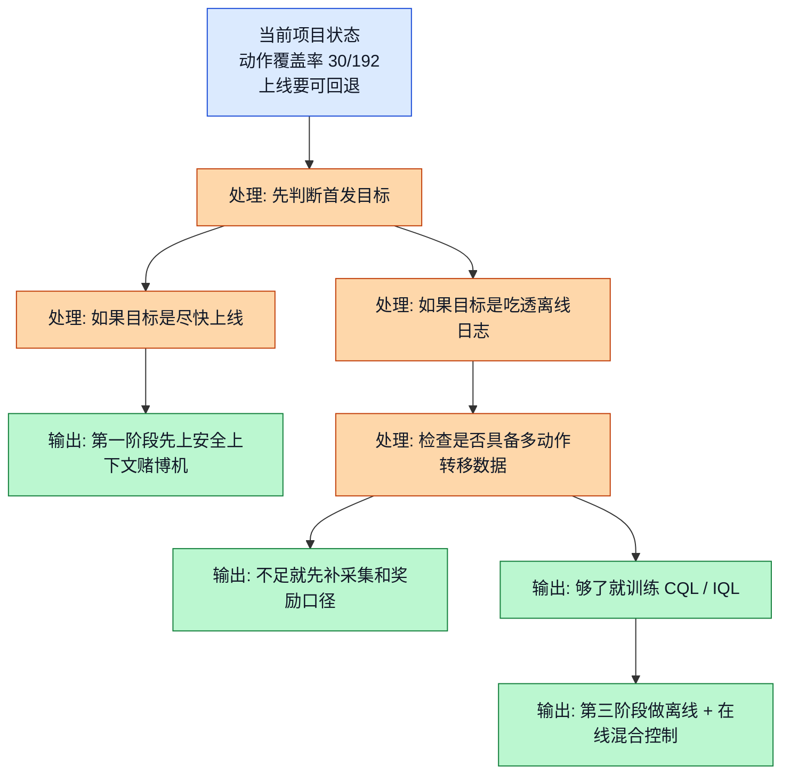
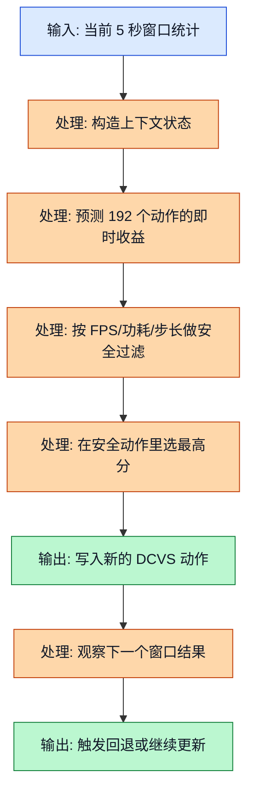
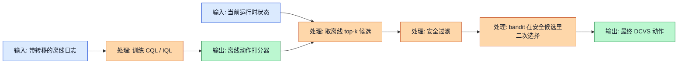

<!-- markdownlint-disable MD041 MD013 -->
## 前置阅读

- 建议先读 `05_Contextual_Bandits.md`，先知道“看当前上下文，做当前决策”到底是什么意思。
- 建议先读 `06_Safe_Contextual_Bandit.md`，先把安全过滤、回退、最小驻留时间这些运行时概念装进脑子里。
- 建议先读 `14_Offline_RL_Fundamentals.md` 和 `15_CQL.md`，这样你更容易看懂为什么 CQL / IQL 更像第二阶段增强，而不是第一天就硬上。
- 如果你还没读过上面几篇，也可以直接看本文；这篇会把路线图里最关键的分歧重新讲明白。

# 21_Implementation_Roadmap：GPU DCVS 强化学习方案到底该怎么分阶段落地

这篇文档不打算再讲一遍“哪个算法更高级”。它只回答一个更实际的问题：**在 GPU DCVS（Dynamic Clock and Voltage Scaling）这个项目里，先做什么，后做什么，什么条件满足了才能进入下一阶段。**

三份源分析文档看起来像在“打架”：

- 一份把离散 CQL（Conservative Q-Learning）排第 1。
- 一份主张 `CQL + 安全过滤 + 可选 bandit 适配器`。
- 还有一份认为首发更适合安全上下文赌博机（Safe Contextual Bandit），离线 RL（Offline Reinforcement Learning）更像二阶段热启动（Warm Start）。

其实它们并不是互相推翻，而是在回答**不同阶段**的问题：

- 如果你问“长期最值得建设的离线策略骨架是什么”，CQL / IQL 很有竞争力。
- 如果你问“下一个版本怎么尽快做出一个可控、可回退、可上线的方案”，安全上下文赌博机更务实。
- 如果你问“最终生产版怎么兼顾离线经验和在线漂移”，那答案通常是混合方案，而不是单一算法。

为了后面算例不飘，我们先把这条项目里的真实量级钉死：

- GPU 频率大致在 `282 ~ 710 MHz`
- `gpu_usage` 是 `0% ~ 100%`
- 功耗大致按 `0 ~ 8000 mW` 这个区间理解
- 目标帧率是稳定在 `59 ~ 60 FPS`
- 动作空间是 `6 × 4 × 4 × 2 = 192` 个离散动作

## 1. 先把三份源文档的分歧翻译成人话

| 来源文档 | 表面结论 | 它默认在回答什么问题 | 放进路线图后的意思 |
| --- | --- | --- | --- |
| `RL_Algorithm_Selection_for_GPU_DCVS_Tuning_20260401.md` | CQL 排第 1，IQL 排第 2 | 如果已经有离线日志，而且要在 `192` 个离散动作里选一个安全策略，谁最适合做离线主模型 | 适合作为第二阶段离线训练主线 |
| `RL_DCVS_AI_Integrated_Decision_2026-04-01.md` | 主策略是 `CQL + 安全过滤`，可选 bandit 适配器 | 如果要做生产级组合方案，离线值函数和运行时安全壳怎么拼起来 | 适合作为第三阶段混合控制蓝图 |
| `RL_DCVS_Runtime_Adaptive_Independent_Decision_GPT-5.4_2026-04-01_135421.md` | 首发先上上下文赌博机，离线 RL 做 warm start | 如果当前最重要的是尽快上线、推理简单、在线适应快，应该优先什么 | 适合作为第一阶段运行时控制器 |

所以这份路线图的核心观点很简单：

1. **首发版本先解决“可上线、可回退、可控”。**
1. **二阶段再解决“把离线日志里的经验吃干榨净”。**
1. **三阶段再解决“离线经验和在线漂移同时兼顾”。**

## 2. 实施路线图（Implementation Roadmap）到底是什么

### 2.1 直觉类比

你可以把实施路线图想成盖楼。

- 安全上下文赌博机像一层和二层，先保证房子能住人，门锁能关，电路不会短路。
- CQL / IQL 像三层和四层，开始把结构做得更完整，让房子更稳、更省电、更聪明。
- 混合控制器像最后的精装修，把“离线学到的经验”和“在线看到的新情况”接起来。

如果你一上来就想把三层四层一起浇筑，但地基还没打稳，最容易发生的事情不是“更先进”，而是“更难调、更难验、更难回退”。

### 2.2 正式定义

在这类系统里，实施路线图可以写成一组“阶段四元组”：

$$
\text{Roadmap} =
\left\{
(\text{阶段}_k,\ \text{主控制器}_k,\ \text{进入条件}_k,\ \text{退出条件}_k)
\right\}_{k=0}^{K}
$$

这句话翻成人话就是：每个阶段都要同时说清楚四件事。

- 现在处在第几阶段。
- 这一阶段谁来主导决策。
- 什么条件满足了，才能进入这个阶段。
- 做到什么程度，才算可以进下一阶段。

在本项目里，阶段选择最直接受下面四个量影响：

$$
\text{阶段选择} = f(\text{数据覆盖率},\ \text{安全约束强度},\ \text{上线时效},\ \text{时序依赖强度})
$$

这里不需要把 $f(\cdot)$ 想得很神秘。它本质上就是一个工程判断器：**数据还很稀、上线又很急时，先选更容易控风险的方案；当转移数据和安全壳都稳定了，再上更完整的离线 RL。**

> **补充知识：覆盖率（Coverage）到底是什么**
>
> 覆盖率就是“动作空间里，有多少动作真的被日志看见过”。这个项目一共有 `192` 个离散动作。如果你只见过 `30` 个动作，那覆盖率就是 $\frac{30}{192}$，也就是大约 `15.6%`。
>
> 覆盖率越低，离线模型越容易对“没怎么见过的动作”瞎乐观。CQL 会更保守，IQL 会更依赖行为数据，但不管哪种方法，覆盖率太差都会限制上限。

### 2.3 公式逻辑 + Mermaid 图

这张图展示的是：路线图不是先拍脑袋选算法，而是先看项目现在卡在哪一层，再决定主控制器。

图里的关键路径是：

- **短期上线目标**把我们推向“安全上下文赌博机优先”。
- **离线模型建设目标**把我们推向“先补数据，再训练 CQL / IQL”。
- 两条路最后并不是二选一，而是会在第三阶段汇合成混合控制器。

### 2.4 DCVS 实际数值计算示例

现在我们用项目里已经公开的量级，来算“为什么当前更像第一阶段，而不是直接跳第二阶段”。

已知：

- 总动作数是 `192`
- 当前日志只覆盖了 `30` 个动作
- 第二阶段的最低目标，可以先定成覆盖 `64` 个动作
- 每次 benchmark 按 `30` 秒算
- 每 `5` 秒切一次动作，那么一轮 benchmark 可以产生

$$
N_{\text{window per run}} = \frac{30}{5} = 6
$$

个决策窗口。

先算当前覆盖率：

$$
\text{coverage}_{\text{current}} = \frac{30}{192} = 0.15625 = 15.625\%
$$

再算第二阶段最低目标覆盖率：

$$
\text{coverage}_{\text{target}} = \frac{64}{192} = 0.3333 = 33.33\%
$$

也就是说，至少还差：

$$
64 - 30 = 34
$$

个新动作。

假设我们希望每个新增动作至少先收集 `20` 个窗口样本，那么还需要的新增窗口数是：

$$
N_{\text{extra windows}} = 34 \times 20 = 680
$$

因为每轮 benchmark 只有 `6` 个窗口，所以至少需要：

$$
N_{\text{extra runs}} = \left\lceil \frac{680}{6} \right\rceil
= \left\lceil 113.33 \right\rceil
= 114
$$

轮额外测试。

> **补充知识：上取整（Ceiling）是什么意思**
>
> $\lceil x \rceil$ 的意思是“向上取到最接近的整数”。比如 $\lceil 113.33 \rceil = 114$。因为你不可能只跑 `0.33` 轮测试，所以只要不够整轮，就必须补满下一轮。

如果每轮 benchmark 的总成本粗略按 `40` 秒算，其中：

- 真机运行 `30` 秒
- 场景切换和记录保存 `10` 秒

那么新增采集时间大约是：

$$
T_{\text{extra}} = 114 \times 40 = 4560 \text{ 秒}
$$

换算成分钟：

$$
\frac{4560}{60} = 76 \text{ 分钟}
$$

这组数说明了一个很关键的工程事实：**当前不是完全不能做离线 RL，而是先补数据这件事本身就该成为路线图里的独立阶段。**

## 3. 第一阶段主控制器：为什么先上安全上下文赌博机（Safe Contextual Bandit）

### 3.1 直觉类比

想象你是值班工程师，每隔几秒看一次仪表盘：

- FPS 是不是还在 `59 \sim 60`
- GPU 频率是不是已经压得够低
- 功耗有没有逼近危险区

这时候你最想做的事，不是规划未来 `30` 步，而是先回答一个更现实的问题：**“这一个窗口，我该从安全动作里选哪一个？”**

这就是上下文赌博机最贴脸的地方。它擅长的是“看当前上下文，选当前动作”，而不是硬要把整个问题一开始就建成很重的长时序 MDP（Markov Decision Process）。

> **补充知识：上下文赌博机和 MDP 差在哪**
>
> 上下文赌博机更像“看眼前的仪表盘做眼前决策”，奖励重点放在当前窗口。MDP 则更强调“这一步会不会改变后面很多步的状态”，所以它会更在意长期累计回报。
>
> DCVS 场景并不是纯粹的无记忆问题，因为动作会影响热积累、频率轨迹和 governor 的滞后行为。但从首发上线角度看，这种影响还没有强到必须第一天就用完整在线 RL 才能工作。

### 3.2 正式定义

第一阶段的推荐做法不是“所有 `192` 个动作都随便选”，而是：

1. 先根据安全规则得到安全动作集合。
1. 再在安全动作集合里挑当前窗口最优动作。

写成公式就是：

$$
a_t
=
\arg\max_{a \in \mathcal{A}_{\text{safe}}(s_t)}
\hat{r}(s_t, a)
$$

其中：

- $s_t$ 是当前窗口状态，比如 FPS、`gpu_usage`、GPU 频率、功耗、上一动作等。
- $\mathcal{A}_{\text{safe}}(s_t)$ 是通过 guardrail 过滤后的安全动作集合。
- $\hat{r}(s_t, a)$ 是模型对“这个动作在当前窗口会带来多大即时收益”的预测。

一个很实用的安全集合写法是：

$$
\mathcal{A}_{\text{safe}}(s_t)
=
\left\{
a \in \mathcal{A}
\mid
\widehat{\text{FPS}}(s_t,a) \ge 59,\
\widehat{\text{Power}}(s_t,a) \le 8000,\
\Delta a \text{ 不超过步长限制}
\right\}
$$

这就把“模型想怎么选”和“系统允许怎么选”分开了。工程上非常重要。

### 3.3 公式逻辑 + Mermaid 图

这张图展示的是：第一阶段运行时控制器的决策链路应该怎么走。

图中的关键点不是“模型打分”本身，而是中间那层**安全过滤**。没有这层，首发版本会很难控风险；有了这层，就算模型还不够聪明，也能先把最危险的动作挡在门外。

### 3.4 DCVS 实际数值计算示例

假设当前 `5` 秒窗口的状态是：

- `fps = 59.4`
- `gpu_usage = 84%`
- `gpu_freq = 525 MHz`
- `power = 4700 mW`
- 上一动作是一个中档频率动作

模型给出 4 个候选动作的预测结果：

| 候选动作 | 预测 FPS | 预测 GPU 频率 (MHz) | 预测功耗 (mW) |
| --- | --- | --- | --- |
| `action_72` | `59.6` | `525` | `4800` |
| `action_88` | `59.1` | `465` | `4300` |
| `action_120` | `58.2` | `430` | `3900` |
| `action_150` | `56.8` | `350` | `3300` |

我们沿用前面课程里的奖励设计：

$$
\text{reward}
=
\mathrm{fps\_component}
+
\mathrm{freq\_component}
+
\mathrm{power\_component}
$$

其中

$$
\mathrm{fps\_component} =
\begin{cases}
-10(57 - \text{fps}), & \text{fps} < 57 \\
-2(59 - \text{fps}), & 57 \le \text{fps} < 59 \\
20, & \text{fps} \ge 59
\end{cases}
$$

$$
\mathrm{freq\_component} = \frac{900 - \mathrm{gpu\_freq\_mhz}}{80}
$$

$$
\mathrm{power\_component} = \frac{6000 - \mathrm{power\_mw}}{400}
$$

现在一步一步算。

先算 `action_72`：

1. 因为预测 FPS 是 `59.6`，所以

$$
\mathrm{fps\_component}_{72} = 20
$$

2. 频率项：

$$
\mathrm{freq\_component}_{72}
=
\frac{900 - 525}{80}
=
\frac{375}{80}
=
4.6875
$$

3. 功耗项：

$$
\mathrm{power\_component}_{72}
=
\frac{6000 - 4800}{400}
=
\frac{1200}{400}
=
3
$$

4. 总奖励：

$$
\text{reward}_{72}
=
20 + 4.6875 + 3
=
27.6875
$$

再算 `action_88`：

1. 因为预测 FPS 是 `59.1`，所以

$$
\mathrm{fps\_component}_{88} = 20
$$

2. 频率项：

$$
\mathrm{freq\_component}_{88}
=
\frac{900 - 465}{80}
=
\frac{435}{80}
=
5.4375
$$

3. 功耗项：

$$
\mathrm{power\_component}_{88}
=
\frac{6000 - 4300}{400}
=
\frac{1700}{400}
=
4.25
$$

4. 总奖励：

$$
\text{reward}_{88}
=
20 + 5.4375 + 4.25
=
29.6875
$$

再看 `action_120`。虽然它更省电，但预测 FPS 只有 `58.2`，已经低于安全线 `59`，所以它会被安全过滤器直接挡掉。

最后看 `action_150`。它的预测 FPS 是 `56.8`，比 `57` 还低，这种动作在首发版本里应当直接进入“禁止集合”，不参与排序。

因此：

$$
\mathcal{A}_{\text{safe}}(s_t) = \{action_{72}, action_{88}\}
$$

在安全集合里，`action_88` 的奖励更高，所以最终动作是：

$$
a_t = action_{88}
$$

这就是为什么第一阶段先上安全上下文赌博机很合理：**它不要求你先把长期转移学到很完整，只要求你先把“这一拍别做蠢事”做好。**

## 4. 第二阶段增强：什么时候把 CQL / IQL 接进来

### 4.1 直觉类比

第一阶段像一个经验丰富的值班工程师，能看着仪表盘稳稳做选择。

第二阶段的 CQL / IQL，更像一个把历史工单全翻过一遍的资深分析师。他不一定每秒都在线拍板，但他能告诉你：

- 哪些动作在类似场景里长期看更靠谱
- 哪些动作虽然日志里很少见，但模型可能在瞎乐观
- 当前 online 控制器的候选动作，哪些应该优先进入 shortlist

所以第二阶段不是推翻第一阶段，而是给第一阶段一个更聪明的“离线大脑”。

### 4.2 正式定义

第二阶段的前提，是你已经能稳定构造带转移的离线数据集：

$$
\mathcal{D}
=
\{(s_t, a_t, r_t, s_{t+1}, d_t)\}_{t=1}^{N}
$$

这时可以训练离线值函数 $Q_{\text{offline}}(s,a)$，再把它当成运行时的候选动作生成器。一个非常实用的混合写法是：

$$
\mathcal{A}_{\text{top-k}}(s_t)
=
\text{TopK}_{a}\left(Q_{\text{offline}}(s_t, a),\ k\right)
$$

然后把它和安全过滤、在线 bandit 组合起来：

$$
a_t
=
\arg\max_{a \in \mathcal{A}_{\text{top-k}}(s_t)\cap\mathcal{A}_{\text{safe}}(s_t)}
\hat{r}_{\text{bandit}}(s_t, a)
$$

这里：

- CQL 更适合在离散动作且安全优先时做保守打分。
- IQL 更适合数据覆盖偏差大、又想保留 offline-to-online 过渡空间时做备选。

这正好把三份源文档的建议串起来了：

- 首发主控制器优先 bandit。
- 第二阶段离线训练优先 CQL，并同时对照 IQL。
- 第三阶段把离线 top-k 和在线适配器拼起来。

### 4.3 公式逻辑 + Mermaid 图

这张图展示的是：离线 RL 进入路线图以后，不应该直接替换掉运行时控制器，而应该先作为“候选动作生成器”接入。

图里的关键路径是：

- 离线 RL 负责“缩小候选动作空间”。
- 安全过滤负责“把危险动作挡掉”。
- 在线 bandit 负责“在当前真实场景里做最后一拍决策”。

这比“离线模型一把梭接管全部控制权”更符合手机真机调参的工程节奏。

### 4.4 DCVS 实际数值计算示例

假设第二阶段已经训出了一个离线 CQL 模型。在某个运行时状态下，它给 `192` 个动作中的 4 个动作打出了较高分数：

| 动作 | 离线 Q 分数 |
| --- | --- |
| `action_88` | `8.6` |
| `action_72` | `8.1` |
| `action_120` | `7.9` |
| `action_150` | `7.5` |

如果我们设 `k = 3`，那么离线 top-k 集合是：

$$
\mathcal{A}_{\text{top-3}}(s_t) = \{action_{88}, action_{72}, action_{120}\}
$$

注意，`action_150` 虽然也不低，但因为只排第 4，所以先被截掉。

接着运行时安全过滤器检查这 3 个动作：

- `action_88` 预测 FPS `59.1`，保留
- `action_72` 预测 FPS `59.6`，保留
- `action_120` 预测 FPS `58.2`，低于 `59`，移除

所以过滤后的集合变成：

$$
\mathcal{A}_{\text{top-3}}(s_t)\cap\mathcal{A}_{\text{safe}}(s_t)
=
\{action_{88}, action_{72}\}
$$

最后，在线 bandit 再看当前窗口的即时收益预测：

- $\hat{r}_{\text{bandit}}(s_t, action_{88}) = 29.6875$
- $\hat{r}_{\text{bandit}}(s_t, action_{72}) = 27.6875$

所以最终动作仍然是：

$$
a_t = action_{88}
$$

这一套算下来，你会看到混合方案真正解决的问题：**离线模型负责“别瞎搜”，在线模型负责“别太死板”，安全壳负责“别出事故”。**

## 5. 建议的分阶段执行表

| 阶段 | 主目标 | 主控制器 | 关键工作 | 进入下一阶段的门槛 |
| --- | --- | --- | --- | --- |
| `P0` | 把问题定义收敛 | 现有 baseline + 人工分析 | 统一奖励口径；把 `30` 秒日志切成 `5` 秒窗口；在单轮 benchmark 内切动作，构造转移 | 能稳定生成 $(s_t,a_t,r_t,s_{t+1},d_t)$ |
| `P1` | 先做可上线版本 | 安全上下文赌博机 | 每 `3~10` 秒决策一次；加入 FPS guardrail、功耗 guardrail、步长限制、dwell time、rollback | 对当前 baseline 做保守 A/B，不出现明显 FPS 回退 |
| `P2` | 把离线经验用起来 | CQL 主训，IQL 对照 | 扩大覆盖率，优先向 `64/192` 以上推进；训练 CQL / IQL；做离线评估和少量真机验证 | 离线候选能稳定给出靠谱 top-k，且不会明显拉低安全性 |
| `P3` | 做成生产级组合方案 | `离线 top-k + 安全过滤 + bandit 适配器` | 把离线模型接成候选生成器；bandit 处理在线漂移；自动回退 | 长时间运行下，性能、功耗、抖动都优于首发版 |

还有两个很重要的“不要急着做”：

- **不要把纯在线 DQN / PPO 当首发主控制器。** 这类方法在线探索成本高，手机真机试错太贵。
- **不要一开始就把连续动作方法当主线。** 当前动作空间就是 `192` 个离散动作，先把离散问题做透，更符合项目现实。

## 关键收获

- 三份源文档不是互相冲突，而是在回答不同阶段的问题：首发怎么上、二阶段怎么补、最终怎么融合。
- 当前项目最合理的路线图是：**先补带转移的数据和奖励口径，再上安全上下文赌博机首发版，然后训练 CQL / IQL，最后做混合控制器。**
- 当前已知覆盖率只有 $\frac{30}{192} = 15.625\%$，这说明“补采集”本身就是一个必须单列的阶段，不能假装它不存在。
- 第一阶段最重要的不是“最先进”，而是“可上线、可回退、可控风险”。
- 第二阶段的 CQL / IQL 更适合做离线经验提纯和 warm start，不一定要第一天就接管全部运行时决策。
- 最终生产方向更像一个组合拳：**离线模型缩小候选，安全壳挡住危险，bandit 处理在线漂移。**
